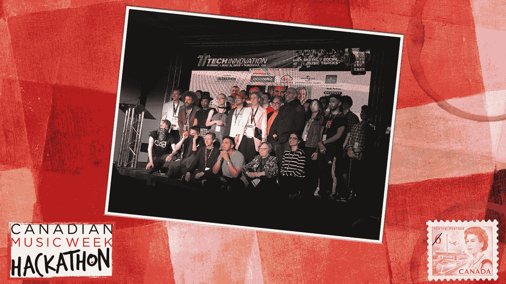

# 加拿大音乐周推出了他们的第一次黑客马拉松！

> 原文：<https://medium.com/hackernoon/canadian-music-week-introduces-their-very-first-hackathon-646db54fff6a>

Congratulations to all participants of Canadian Music Week’s very first Hackathon!

短短 24 小时能创新什么？事实上，很多。上周二，我非常高兴地报道了加拿大音乐协会的第一次黑客马拉松！这项活动从周二下午持续到周三晚上，充满了压力、兴奋和乐趣。

该活动吸引了来自各种背景的参与者，如程序员、编码员、音乐艺术家，以及没有技术经验但只想接受新挑战的人。

当我前往 Brainsights 多伦多办公室参加活动时，主持人 Travis Laurendine 和许多参与黑客马拉松的团队向我打招呼。

在环球音乐集团、穆祖卡、Cloudinary 和其他主持人的几句话之后，参与者组成了团队，开始就各自的项目集思广益。

我有机会与独一无二的塞特交谈，他是一位才华横溢的多伦多音乐家，用强有力的旋律撼动了摇滚乐的流派。塞特心中有自己的想法:将增强现实融入她的现场演出，创造独特的音乐会观众体验。

然而，赛特并不是唯一一个有创新想法的人。团队[好孩子](http://goodkidofficial.com)创建了一个名字生成器应用程序，用户可以输入艺术家的名字，软件会显示出艺术家最想演奏的流派。

参与者继续通宵创作，并准备第二天向一群评委展示他们的想法。评委名单包括:**杰伊·罗森茨威格**(罗森茨威格&公司的首席执行官)**乔迪·科维兹**(# movethe dial 的创始人&首席执行官)**肖恩·威尔逊**(Muzooka 的首席执行官)**格雷格·尼斯贝特**(MEDIAZOIC 的创始人&首席执行官)**大卫·杜弗兰(**Panache Ventures 的合伙人)**罗杰·查布拉(**

经过 24 小时不间断的工作，团队前往喜来登酒店，加拿大音乐周展示正在那里举行。每个团队都带来了一个创造性的想法，但是，只有一个大奖得主。

活动赞助商为参与黑客马拉松的团队提供了各种价格，但大奖得主是 Team SATE 及其以 AR 为中心的应用程序，为音乐会观众创造了难忘的体验。该团队有机会在比利时即将到来的黑客马拉松中继续发挥他们的热情，开发新的想法。

祝贺所有参加今年黑客马拉松的人！如果你想看 CMW 黑客马拉松的精彩部分，你可以点击这里查看[星球日报的最新一集](https://www.discovery.ca/Shows/Daily-Planet/Video?vid=1247501)！