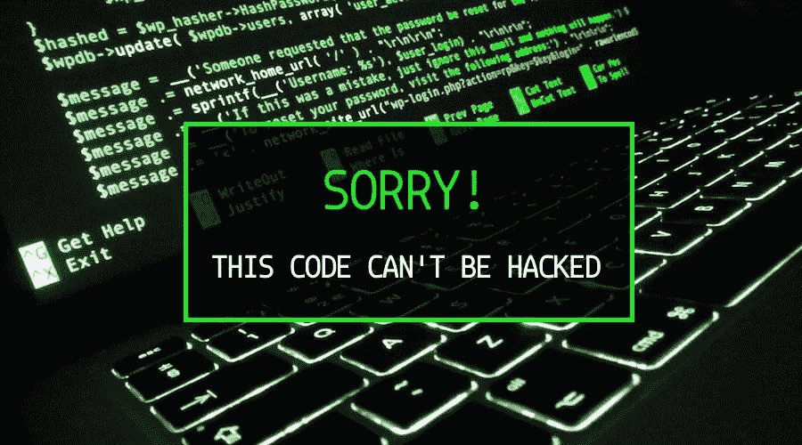

# 你不可能一路爬到顶端

> 原文：<https://medium.com/hackernoon/cant-hack-your-way-to-the-top-da16fb630e6f>

## 做好工程与做好狗屎

我所说的*好的工程*是指遵循好的工程实践并编写可维护的代码。它包括但不限于进行测试驱动的开发、编写测试、使用 CI 和 CD、实现设计模式、虔诚地进行代码评审。

通过*完成任务*，我的意思是做任何**需要的小事情**来实现这个特性。只需将 jira 标签标记为完成，而不需要做上面提到的任何事情。这将不可避免地导致错误。

工作中的一些事件促使我在 reddit 上发帖:[写高质量可维护代码 v/s 搞定狗屎？我觉得自己永远陷入了这个困境，我想知道业内其他人(尤其是资深人士)的感受。令我惊讶的是，这个帖子得到了很多关注，浏览所有的评论真的很棒。大多数人同意最上面的评论:](https://www.reddit.com/r/cscareerquestions/comments/8vvf98/managersctos_writing_high_quality_maintainable/)

> 我有一个从 0%到 100%的“科技债务标度”。
> 
> 如果我把它调到 0%,这意味着团队应该完全进入黑客模式。去他妈的测试，去他妈的好的编码标准，把它做好。
> 
> 如果我把它提高到 100%，这意味着团队只致力于代码质量(重构)和工具(例如测试/ CI 基础设施)。
> 
> 最终，在正常的一天，我们把它留在 30%

许多其他人给出了他们自己的版本。但是后来我发现:

> 在“漂亮的代码”和“写得快”之间有一个错误的二分法。
> 
> 编写漂亮的代码并不比编写混乱的代码花费更多的时间。需要花费很长时间的是学习如何编写可维护的代码。

多么惊人的发现！"花很长时间的是学习如何编写可维护的代码."

我花了一些时间，以及工作中和 reddit 上的一些争论，才同意这一点。但一旦我这么做了，我就完全同意了。我决定不再搞砸东西，而是真正做好工程。这促使我写了另一个帖子:[学会写可维护的代码，而不是去做狗屎](https://www.reddit.com/r/cscareerquestions/comments/8xoxc5/learn_to_write_maintainable_code_instead_of/)。令我完全惊讶的是，这篇文章得到了更多的关注。似乎很多开发者都同意我的观点。

我不想陷入*的思维定式，在速度和良好的工程之间有一个权衡。*没有取舍。相反，我想要的心态是*我花时间把事情做好——那是因为我还有很多东西要学。这是一个更好的地方。*

然而，做好工程说起来容易做起来难。当和你一起工作的人看不到它的重要性时，它会变得更加困难。你不仅要花费额外的时间和精力去学习如何去做，你还要向经理解释为什么这个特性会花去你一周的时间，而不是其他开发人员一天的时间。

但是我已经决定了。我将坚持自己的观点，不屈服。即使我的工作岌岌可危。无论如何，我不想在一个不理解优秀工程重要性的地方工作。

糟糕的工程只能给人一种速度的感觉。花 1 天时间构建一个功能，再花一周时间调试和修复 bug。一群人和整个公司都落入了这个陷阱。我不想助长这种文化。

我写软件不是为了钱，我是出于对工程的热爱。当我解决问题的时候，我的多巴胺会激增。这不是每天都会发生的。当我学到新东西的时候就会这样。事情发生在我第一次做 TDD 的时候。它发生在我理解依赖注入的时候。

我**得**做好工程。这要归功于软件工程界——它为我提供了堆栈溢出和互联网搜索的答案，它为我的 MacBook、android 和 iOS 提供了 linux 内核，它通过开发比特币和以太坊来反击政府和联邦银行的暴政。一个自由开放的社区，作为其中的一员，我深感谦卑和自豪。