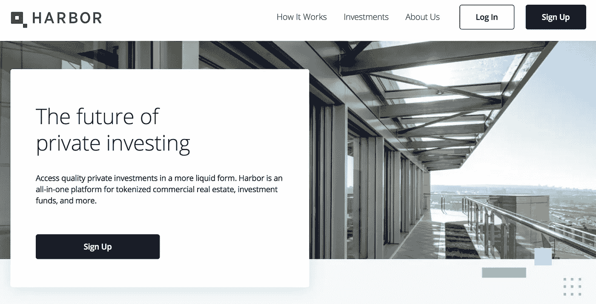
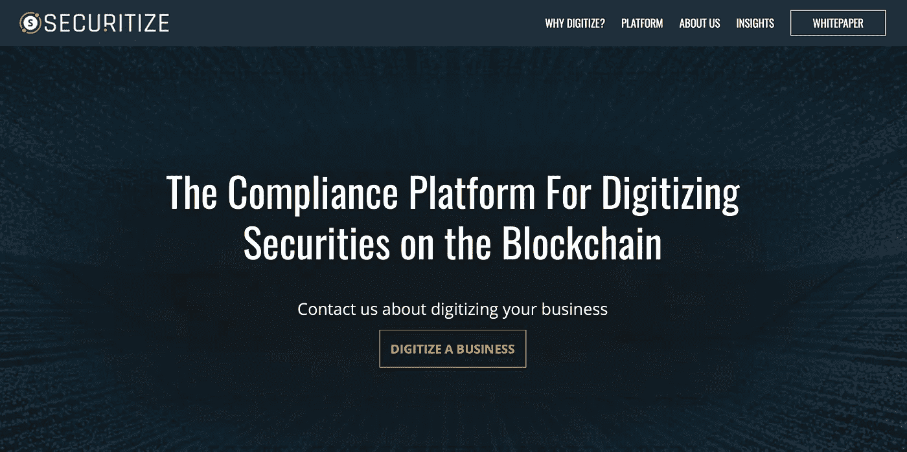
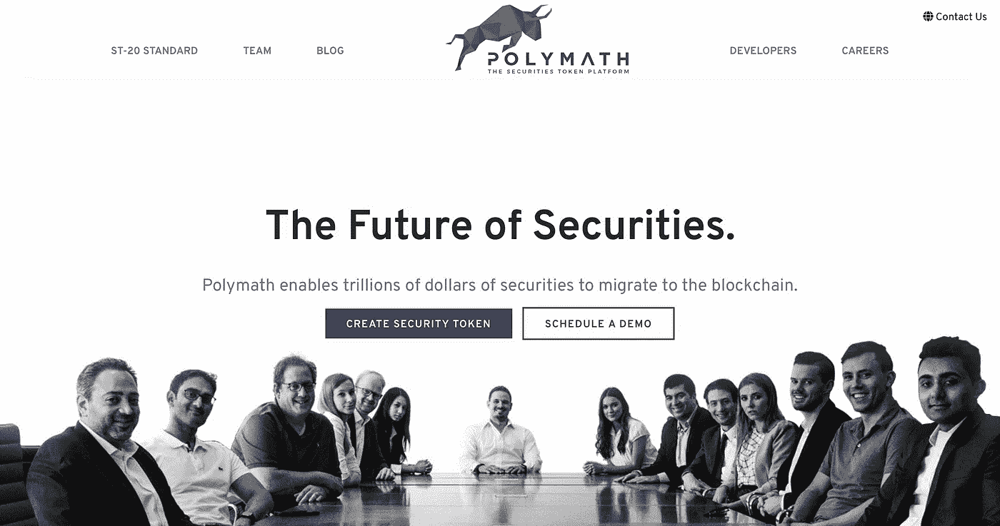
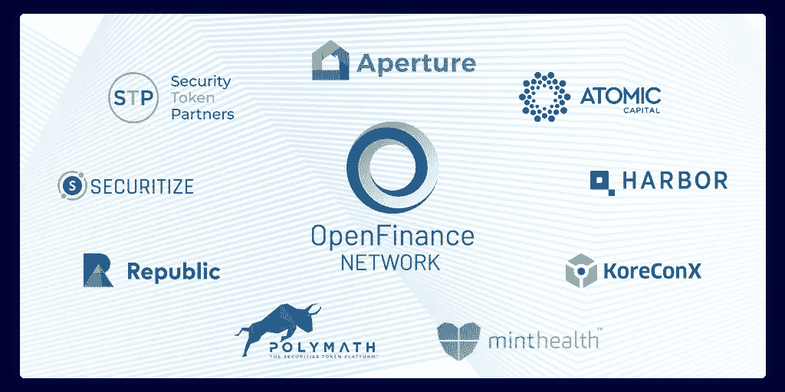

# 资本形成——区块链的杀手级应用？

> 原文：<https://medium.com/hackernoon/capital-formation-the-killer-app-for-blockchain-2f83aaaf4932>

## 民主党尚未兑现金融民主化的真正承诺。

Liquidity. (Photo by [Aleks Dahlberg](https://unsplash.com/@aleksdahlberg), on [Unsplash](https://unsplash.com))

你可能认为 ico 来了又走了。我真心希望你是对的。

2018 年 11 月，美国证券交易委员会(SEC)执法部门报告称，它正在对数十起欺诈性 ico 采取行动，并且它已经[下令对 2018 财年期间的欺诈性加密发行支付总额为 39.4 亿美元的罚款](https://www.sec.gov/files/enforcement-annual-report-2018.pdf)。与此同时，[证券交易委员会宣布与加密市场 EtherDelta](https://www.sec.gov/news/press-release/2018-258) 达成和解，罚款并与该公司合作。根据和解协议，EtherDelta 承认，它本应在美国证券交易委员会注册为另类交易系统(“ATS”)，或以其他方式在豁免的情况下运营，因为它为证券交易提供了一个市场。

“EtherDelta 拥有在线国家证券交易所的用户界面和底层功能，需要在 SEC 注册或获得豁免资格，”SEC 执法部门的联合主管 Stephanie Avakian 说。

可以说，在 2017 年底和 2018 年初，ico 交易了数万亿美元，EtherDelta 市场(以及其他市场参与者)的潜在本能非常简单合理——***民主化的风险金融*** 。

这种“大众化风险金融”是什么？

民主化的风险金融形成了下一波“令牌化资本发行”的基础，与几乎完全破灭的 ICO 热潮截然不同。区块链创业公司有一个全新的生态系统，它承诺任何私营公司都有能力通过简化的监管合规性筹集资金，普通公民也有能力投资和发展私营公司令牌化股份中的替代资产类别。

Democratized Venture Finance could still change everything. (photo — [Randy Colas](https://unsplash.com/@randycolasbe) on [Unsplash](https://unsplash.com)).

尽管目前密码市场崩溃，SEC 执法部门对所有“令牌化”事物的监管力度加大，但区块链仍然是美国梦的希望和救赎。这一次，在这种新的证券化代币发行(“STO”)平台的帮助下，承诺是“合规的代币化证券发行”，以及一个由熟悉的参与者组成的周边生态系统，包括托管代理、托管人、经纪人/交易商、转让代理、替代交易系统、基金管理人和注册融资门户。

# **R-Token(和其他“STO 平台”)**

“[资本形成是区块链](/harborhq/harbor-raises-28m-to-reengineer-private-securities-for-blockchains-bbc120bfabd3)的杀手级应用，”方正基金(Founder's Fund)合伙人拿破仑·塔(Napolean Ta)表示，该基金投资了 Harbor(一轮 2800 万美元的融资，于 2018 年 4 月宣布)，同时投资的还有[安德森·霍洛维茨](https://a16z.com)、 [Craft Ventures](https://craftventures.com) 、[潘迪拉资本](https://www.panteracapital.com)和[一系列其他硅谷顶级风险基金](/harborhq/harbor-raises-28m-to-reengineer-private-securities-for-blockchains-bbc120bfabd3)。

Harbor 承诺通过其[监管令牌(R-Token)标准](https://harbor.com/rtokenwhitepaper.pdf)来“再造私人证券和其他现实世界的资产，如房地产、投资基金和艺术品”，这是一种“以太坊区块链上的许可 ERC-20 令牌，用于检查链上监管服务的交易批准”[R-Token 白皮书，摘要，第 4 行]。截至 2018 年 12 月，有传言称 Harbor 首先专注于创建一种形式的令牌化房地产投资工具(REIT)，或许是为了房地产支持的发行在监管上相对简单？Josh Stein(Harbor 的 CEO)和 Craft Capital 的 David Sacks 在他们的文章“[介绍私有 ICO (PICO)](/harborhq/introducing-the-private-ico-pico-3e8b782924c1) ”中对 R Token 做了如下描述:

> “Harbor 设计了 R-Token 标准，将传统证券进行令牌化，并将资产更广泛地证券化。它的设计从根本上体现了各种各样的证券规则，包括法规 D、法规 S、第 4(a)(7)节、规则 144 以及 KYC/反洗钱和投资者资格鉴定中的许多特定规则。”

[Securitize](http://securitize.io) also provides a ‘Compliant STO’ Platform

还有其他几家公司也承诺在以太坊平台(和其他令牌平台)上为资本形成和其他监管合规要求中的私营公司“令牌化”证券(和其他真实世界的资产)，包括像 [PolyMath](https://polymath.network) ( [以太坊 ERC-1400](/cindx/erc-1400-the-new-token-standard-a5a49779554e) 协议)、[证券化](https://www.securitize.io)、[liqui fi](http://liquifi.com)([Stellar token](https://www.stellar.org/lumens/))、[Kore conx](https://www.koreconx.io)([Hyperledger](https://www.hyperledger.org)token)这样的公司

这一承诺是，私营公司将在资本形成过程中拥有一个新的区块链支持的合规机制和途径，普通公民将能够投资于他们的梦想，甚至可能通过真正民主化的金融体系提升他们的生活。

# [**问题:*流动性***](http://people.stern.nyu.edu/adamodar/pdfiles/country/illiquidity.pdf) ***。***

私人公司股东通常通过“豁免”交易直接从公司获得股份。优步、Airbnb、脸书、LinkedIn、Calm、Robinhood 等公司向许多创始人、风投、早期员工和其他人出售和授予私人股份。早期的“内部人士”通常在最终出售这些初始头寸时赚了数百万。然而，在这些豁免交易中获得的股份( [**受限证券**](https://www.sec.gov/reportspubs/investor-publications/investorpubsrule144htm.html) ”)不得转售，除非符合《证券法》的登记要求，或依据可用的豁免。

许多创始人、早期投资者、风险资本家、员工和其他购买受限证券的人可能会被无限期锁定投资，除非发行公司本身创造了流动性事件或机会。受限制证券还经常受到公司自身对转售的限制，包括传奇、优先购买权、州法律遵守情况等机制，以及可以控制何时、多少或向谁转售股票的其他限制。

Liquidity. (Photo [Erda Estremera](https://unsplash.com/@erdaest) on [Unsplash](https://unsplash.com))

[R-Token](https://harbor.com/rtokenwhitepaper.pdf) (以及其他“[证券化 Token 产品](https://blog.polymath.network/what-is-a-security-token-offering-sto-4e5a92bf6bca)”或“s to”)试图解决的根本问题是由此产生的 [***流动性不足***](http://people.stern.nyu.edu/adamodar/pdfiles/country/illiquidity.pdf) ，或纯粹由监管复杂性导致的[流动性不足](http://people.stern.nyu.edu/adamodar/pdfiles/country/illiquidity.pdf)。人们的假设是，早期公司的私人股份市场已经存在，但监管迷宫限制了民主进入这一市场。如果你了解风险，即使你没有亿万富翁的个人流动性，你会愿意购买优步、邦布尔、伯德或 Tinder 等早期无脑公司的股票吗？

# **二级市场**

受限证券的持有人很少有途径获得 ***流动性*** 用于他们的投资，除非他们投资的公司最终首次公开募股(IPO)或出售。目前，没有真正不受约束的受限制证券二级市场(存在几个对该一般规则的混合“豁免”，包括 NPM 和 SharesPost)。

将有价证券上市的另一种交易系统[的前景很有吸引力，供应商受到追捧，名单很短。极少数正在开发的 STO 平台声称其目标是注册经纪人/交易商，也不是注册 ATS 或转让代理。这一领域的监管很棘手(甚至是“迷宫式的”)，SEC 最近在加密令牌领域、市场领域以及针对流动性提供者的行动都值得考虑，我们将在下面进行讨论。](https://www.sec.gov/foia/docs/atslist.htm)

首先，尽管，一些背景。

# 就业法案

《就业法案》(JOBS Act)是奥巴马时代的一个遗物，迄今为止，它避开了特朗普政府的愤怒和破坏本能，为民主化的金融世界带来了新的希望。

[jump start our Business Startups Act](https://www.sec.gov/spotlight/jobs-act.shtml)(《**就业法案**》)大幅提高了根据《证券法》和《证券交易法》注册之前的股东人数门槛，根据该法案，许多拥有大量股东的大型科技公司仍然是私有的。根据《就业法》,公司在受该法触发的上市公司的报告和其他义务约束之前，最多可有 2，000 名股东。

《就业法案》扩大了初创企业从[合格投资者](https://www.investor.gov/additional-resources/news-alerts/alerts-bulletins/investor-bulletin-accredited-investors)处筹集资金的能力，并放宽了公司在早期资本形成活动中可能受到的沟通限制。此外，《就业法案》还带来了两项免除完整证券报告要求的“众筹”豁免规定，[法规 A/A+](https://www.seedinvest.com/blog/jobs-act/raising-capital-reg-a-mini-ipo) 和“ [CF](https://www.sec.gov/info/smallbus/secg/rccomplianceguide-051316.htm) ”(众筹)，为非授权投资者的创业公司提供了一种新的众筹，利用了 SeedInvest 和 Republic 等注册“平台”的新概念。

由于就业法案，即使你不是合格的投资者，你今天也可以通过受监管的平台进行投资，如 SeedInvest 和 Republic，投资的公司有:Farm-in-a-box、Roomi、MindMate 等。根据一个考虑到你实际收入的公式，你的投资金额是有限的。作为一个未经认可的投资者，你仍然被限制参与更好的交易，在更好的平台上，以及真正赚钱的交易。

# [**second market**](https://en.wikipedia.org/wiki/NASDAQ_Private_Market)**(现为******)和**[**shares post**](https://sharespost.com)**

**两个独立的二级市场平台 [SecondMarket](https://en.wikipedia.org/wiki/NASDAQ_Private_Market) 和 [SharesPost](https://sharespost.com) 大约在 2009 年出现，作为实现私人公司转售受限证券的工具，值得一提。这两个平台都为私人公司受限证券交易提供了一个持续运营的结构化电子市场。这两个平台都在合法的交易环境下促进交易。这两个平台最好被描述为“混合”结构，与私营公司本身密切合作，促进受限制证券的私人持有人和通过资格预审的投资者的流动性。**

## ****second market****

**SecondMarket 出现于 2009 年，主要是为脸书的员工股东提供一个平台，在脸书最终 IPO 之前出售他们的部分股份。SecondMarket 旨在满足早期投资者、员工和风险资本家的流动性需求，并提供一种相对高效的买卖私人公司股票的方式。SecondMarket 最初作为经纪交易商运营，最终作为替代交易系统(“ **ATS** ”)，根据《交易法》中的 ATS 条例，其运作类似于证券交易所。SecondMarket 是私人公司股票的做市商，后来扩展为一般“另类投资”的二级市场。**

**SecondMarket 只为受限证券持有人和通过资格预审的合格投资者之间的交易提供便利，其继任者[纳斯达克私人市场](https://www.nasdaqprivatemarket.com)(**)(目前也是如此。****

## *******分享帖子*******

****2009 年，SharesPost 也进入了二级市场。这是一个在线公告板，买家和卖家可以发布对大型知名私人公司股票的竞价。 [SharesPost](https://sharespost.com) 还限制通过资格预审的合格投资者参与，这一限制一直持续到今天。 [SharesPost](https://sharespost.com) 已经扩展到创建一个特殊目的载体—[SharesPost 100 基金](https://sharespost.com/sharespost-100-fund/) —一个根据 1940 年投资公司法注册的封闭式管理投资公司，它直接投资于由 shares post 100 组成的私营公司。 [SharesPost 100 基金](https://sharespost.com/sharespost-100-fund/)向更广泛的投资者开放投资，最低投资额很小，没有资格认证要求。****

## ******合格投资者限制******

****SharesPost 和 SecondMarket (以及它的继任者 [NPM](https://www.nasdaqprivatemarket.com) )都限制通过资格预审的合格投资者参与他们的平台。这是基于几个因素，包括买方和卖方缺乏关于私人公司发行人的信息，以及对合格投资者有能力评估投资决策的优点和风险的期望。****

****还有一个“惯例”(虽然不是规则)，通常被称为第 4(a)(1-1/2)节，它本质上是《证券法》第 4(a)(1)节和第 4(a)(2)节的交叉，是一种私募发行豁免，通过这种豁免，受限制证券的个人持有人可以在交易中转售它们，如果它们是由*发行人*发行的，将有资格作为豁免私募发行。该公约已被编入《证券法》第 4(a)(7)节，该节规定，如果证券仅出售给合格投资者，则限制和控制证券的销售可免于登记。这就是 SharesPost 和 SecondMarket (NPM)限制合格投资者参与其平台的原因之一。****

## ****[**安全港——规则 144**](https://www.sec.gov/reportspubs/investor-publications/investorpubsrule144htm.html)****

****根据[规则第 144 条](https://www.sec.gov/reportspubs/investor-publications/investorpubsrule144htm.html)出售证券的人员将不会被视为其他适用豁免的法定承销商(即参与股份分销)，包括第 4(a)(1)节中的普通豁免，该节规定了除发行人、承销商或交易商之外的其他人的交易豁免。****

****[规则 144](https://www.sec.gov/reportspubs/investor-publications/investorpubsrule144htm.html) 区分“关联公司”(即控制公司的公司)和非关联公司。根据《证券法》，持有限售股至少一年的非关联公司可以不受进一步限制地自由转售这些股份。对于持有期权的非附属公司，一年的持有期从期权被行使和行使价格被支付的日期开始，而不是从期权被授予的日期开始。****

********

****Swimming in a Safe Harbor. (Photo: T[odd Quackenbush](https://unsplash.com/@toddquackenbush) on [Unsplash](https://unsplash.com/))****

****根据[规则 144](https://www.sec.gov/reportspubs/investor-publications/investorpubsrule144htm.html) 的规定，对于关联公司和非关联公司，在证券出售完成之前，必须有足够的关于公司的公开信息。根据美国证券交易委员会的说法，“对于不报告的公司，这意味着某些公司信息，包括关于其业务性质、其官员和董事的身份、**及其财务报表**的信息，是公开的。”[着重号后加]****

****规则 144 为受限制证券的持有者向公众转售其证券提供了安全港，并“解除”了证券的限制。这意味着，虽然规则 144 不是转售受限证券的唯一方法，但遵守该规则的规定意味着交易符合联邦证券法和法规。****

****值得注意的是，规则 144 仅适用于试图转售受限证券的持有人，不适用于[证券](https://hackernoon.com/tagged/security)的发行公司。****

********

****Polymath provides ‘Compliant STO’ built on Ethereum ERC-1400****

****规则 144 允许转售受限证券，只要满足几个条件。必须满足的条件取决于出售证券的持有人是否是发行公司的“关联公司”，其定义为控制发行公司、受发行公司控制或与发行公司共同控制的个人或实体(关联公司通常是执行官、董事或控股股东)。****

****对于关联公司，规则 144 对受限证券的销售有额外的要求，包括“交易量公式”限制，将 3 个月内可出售的股份数量限制为已发行股份的 1 %,以及进一步的报告要求。\****

****尚不清楚在第三篇/第 4(a)(6)节股权众筹发行中获得的证券是否可以根据规则 144 转售。第 4(a)(6)节没有将收购的证券指定为规则 144 定义的受限证券，而是通过一年的持有期明确限制它们，除非转售(1)给发行人，(2)给合格投资者，(3)作为注册发行的一部分，或(4)给购买者的家庭成员，或与购买者的死亡或离婚或其他类似情况有关。美国证券交易委员会的股权众筹规则也没有明确提到第 144 条。****

****同样需要注意的是，规则 144 仅适用于证券持有人购买证券而不是为了分销或转售证券的情况，即证券持有人出于投资目的为自己的账户购买证券。虽然发行人通常会让购买者签署声明，说明购买者只是为了自己的利益而购买，而不是为了分销，但如果从发行人处购买其证券的证券持有人公开声明或明确表示他/她打算在法律允许的情况下尽快转售，该持有人可能会失去规则 144 的好处。****

****Harbor 和其他 STO 平台仍然看好一个“符合监管规定的 STO”可以解决流动性问题，从而使风险融资民主化(以下是 Harbor 首席执行官乔希·斯坦和 Craft Capital 的大卫·萨克斯的“[介绍私人 ICO (PICO)](/harborhq/introducing-the-private-ico-pico-3e8b782924c1) ”):****

> ****证券交易委员会有三个部分的使命:(1)保护投资者，(2)维护公平、有序和有效的市场，(3)促进资本形成。符合 Reg D 标准的 PICO 服务于所有三种利益，提供了一种通用、可靠和高效的融资方式，随着投资者风险的降低和知名度的提高，流动性会慢慢增加。”****

# ******现实挑战:分享“传说”移除&州法律遵守情况******

****如果受限证券持有人符合第 144 条[中的条件，他们可以根据《证券法》中适用的豁免向公众出售受限证券，在首次豁免出售(和持有期)后，这些股票可以自由交易。](https://www.sec.gov/reportspubs/investor-publications/investorpubsrule144htm.html)****

****但是，受限制证券的持有人仍然被限制转让这些证券，直到他们从股票证书中删除图例。只有转让代理人可以删除图例，如果没有发行人律师出具的可以删除限制性图例的意见函，转让代理人不会删除图例。州法律，而不是联邦法律，管辖围绕删除传奇的任何争议。****

****为了开始图例删除过程，投资者联系发行证券的公司或转让代理，询问有关图例删除的程序。移除图例可能是一个复杂的过程，需要受限证券持有人与专门从事证券法的律师合作。****

****私营公司通常希望保持对其股权和证券交易各个方面的控制。删除图例的要求迫使二级市场参与者通知发行公司，并得到其对销售的默许。公司控制也对二级市场平台和参与者产生负面影响。如果不遵守特定公司股份的优先购买权，交易就无法完成。这个过程对于 SharesPost 和 SecondMarket (NPM)来说是不可扩展的，他们相应地改变了他们的商业模式。****

****SharesPost 和 SecondMarket (NPM)现在都向私营公司提供广泛的服务，这些服务主要侧重于公司控制的流动性事件，而不是作为买卖股票的平台促进二级市场交易。在纳斯达克私人市场的情况下，受限制证券的持有人可以进行交易，但只有发行公司批准的合格投资者才能参与。SharesPost 继续允许在公司首次公开募股或出售前需要流动性的股东张贴其股票以供出售，这在很大程度上是基于与私营公司建立的关系以及对特定投资者偏好和这些公司的权利以及转让流程的适应。SharesPost 维护了一个通过资格预审的合格投资者社区来实现这一目标。****

## ******州法律纪念日******

****个人私人公司股东依据证券法豁免进行的要约和出售也需要依据股票出售所在州证券法的注册和资格豁免。各州都存在某种形式的二级交易豁免，尽管不一定如此定义，也不统一。与二级市场交易相关的国家证券违规行为的后果将由私营公司、二级交易中证券的个人卖家以及促进销售的平台运营商承担。缺乏统一性，以及违规的后果(包括取消销售，以及州行政人员的行政强制行动)，是对流动性创造造成问题的实际挑战，并导致 NPM 和 SharesPost 按照他们现有的方式对自己进行建模(更像是一种混合“流动性”模型，结构类似于交易所，并与发行公司有密切联系)。****

****围绕加密货币以及应该如何监管它们，各州的法律也在不断变化。值得注意的是，今年 1 月底，Square Inc .为其 Cash 应用的用户推出了一项服务，允许用户使用比特币进行交易(由于监管不确定性，纽约、佐治亚、夏威夷或怀俄明州的用户除外)。一个月后，免费股票交易平台 Robinhood 为一组选定的客户发布了“Robinhood Crypto”，这项服务目前允许他们购买和出售比特币和以太坊(由于各州监管不确定性，仅在加利福尼亚州、科罗拉多州、马萨诸塞州、蒙大拿州、密苏里州和密西西比州可用)。****

# ******注册成为 ATS？******

****SecondMarket(现在的 NPM)和 SharesPost 都是从注册经纪交易商开始的，后来注册为 ATS 交易所。在[最近的一次裁决中，SEC](https://www.sec.gov/news/public-statement/enforcement-tm-statement-potentially-unlawful-online-platforms-trading) 提供了几条与 Harbor 和其他 STO 平台提供商面临的问题密切相关的关于此类注册的报价:****

*****"根据联邦证券法的定义，交易证券并作为"交易所"运营的平台必须注册为国家证券交易所，或在注册豁免下运营，如美国证券交易委员会 ATS 条例下 ATS 的豁免。"*****

*****"寻求作为 ATS 运营的实体也要遵守监管要求，包括作为经纪交易商在 SEC 注册，并成为 SRO 的成员。"*****

*****"一些在线交易平台可能不符合联邦证券法对交易所的定义，但直接或间接提供与作为证券的数字资产相关的交易或其他服务。例如，一些平台提供数字钱包服务(以持有或存储数字资产)或以作为证券的数字资产进行交易。平台提供的这些和其他服务可能会引发联邦证券法下的其他注册要求，包括经纪交易商、转让代理或清算机构注册等。”*****

****迄今为止，还没有一个“STO 平台”将自己定位为另类交易系统。对“市场”问题的回应似乎是:我们与市场提供商合作，s to 平台只是一个技术提供商，证券的实际转让将在现有的交易平台(ATS)上进行。进入[开放金融网](https://openfinance.io)，以及其他重点市场和交易所(目前这里想到的名字包括 [tZERO](https://www.tzero.com) 、 [SLICE](https://slice.market) 、 [SharesPost](https://sharespost.com) 、 [Airswap](https://www.airswap.io) 等)。****

****开放金融网络(OFN)是另类资产行业的交易和结算平台。该平台作为发行人、投资者和行业利益相关者之间的渠道，提供简化的流动性和资产转移效率。OFN 似乎在利用 Sageworks Capital，LLC 的“经纪人/交易商”地位，sage works Capital，LLC 是一家附属实体，是一家注册经纪人-交易商，也是 FINRA & SIPC 的成员。关于 OpenFinance 网络的更多信息可以在[这篇博文](/@jhernanx/the-openfinance-network-ofn-and-why-it-matters-134a2990308a)和[这篇博文](/openfinance/the-one-stop-shop-how-alternative-asset-clearing-settlements-will-work-on-the-openfinance-68ba90ace150)中找到。我们期待着听到更多关于 OpenFinance Network 的实质性产品，以及其他“市场”提供者对符合 sto 要求的真正“流动性”的承诺。****

********

****[OpenFinance Network](https://openfinance.io) invites Accredited and Non-Accredited investors to join its network.****

# ******承诺——规则 144 及以后******

****R-Token 和其他新兴的“STO 平台”(如 [Koreconx](https://www.koreconx.io) 、 [Polymath](https://polymath.network) 、[证券化](https://www.securitize.io)、 [Liquifi](http://liquifi.com) 甚至 [SeedInvest](https://www.seedinvest.com) ，最近被高盛支持的 [Circle](https://www.circle.com/en/) 收购)的承诺是，为任何处于初始资本形成阶段的私营公司提供一条通往自由二级市场的道路。****

****R-Token 试图解决流动性问题，使用基于以太坊的区块链(ERC-20)和一个称为“监管服务”的协议，并描述如下:“监管服务可以配置为符合相关的证券法规，了解您的客户政策，反洗钱(AML)要求，税法等。”其他“STO 平台”正在选择各种其他底层令牌平台；例如， [Koreconx](https://www.koreconx.io) 将其平台与 [Hyperledger](https://www.hyperledger.org) 、 [Polymath](https://polymath.network) 与[以太坊 ERC-1400 平台](/cindx/erc-1400-the-new-token-standard-a5a49779554e)，以及 [Liquifi](http://liquifi.com) 与[恒星令牌](https://www.stellar.org/lumens/)。****

****R-Token 白皮书承诺完全遵守所有证券法规。许多观察人士急切地等待着房地产之外的第一个 R-token 化证券产品。STO 平台的承诺是使资本形成生态系统民主化，并使公司能够简化从发行到完全流动性的监管合规流程。出于类比的目的，SEC 最近的两项行政决定值得参考，这两项决定来自二级市场的“第二波”，即 [Equidate](https://equidateinc.com) 和 [EquityZen](https://equityzen.com/lp/investor/) 。****

## ******同月******

****[Equidate](https://equidateinc.com) 创造了一种有点类似于[幻影股票](https://en.wikipedia.org/wiki/Phantom_stock)的金融工具，本质上是股东和 [Equidate](https://equidateinc.com) 关联公司之间签订的 10 年期“远期合同”，代表投资者在未来交付股票，以换取即时流动性，代表投资者通过 Equidate 支付的收益，按照合同条款规定的金额进入股东的账户。股东保留了他或她的记录所有权、相关投票权以及在公司资本结构中的地位。该公司不需要处理现有股东的权利、约束或挑战，当它改变其资本结构，或通常所说的“资本表”时，可能会面临这些挑战。****

****当公司进行首次公开募股，或有另一项交易导致股票变得可自由交易时，股票的交付将由股东通过 [Equidate](https://equidateinc.com) 促成，所有权将转移。“衍生”股权模式旨在为私人公司股东提供流动性，这些股东将根据合同涵盖的私人公司股份的价值获得现金。[等代](https://equidateinc.com)衍生车型没有存活下来。****

****2016 年 12 月， [Equidate](https://equidateinc.com) 同意解决 SEC 对其违反联邦证券法的指控，即未能注册“基于证券的互换”，这是《证券法》明确定义的证券。Equidate 同意 SEC 的命令，但没有承认或否认这些发现，并同意支付 8 万美元的民事罚款。由于 SEC 的调查，Equidate 已于 2015 年 12 月停止提供和销售基于证券的掉期。如今， [Equidate](https://equidateinc.com) 运营着一个传统的 ATS 平台，为合格投资者提供私人公司上市前的股权，并允许这些公司保持对其资本表和投票权的控制。****

## ******公平原则******

****EquityZen 平台也涉及衍生产品结构，但其中一个特殊目的载体(基金)是关键组成部分。该基金将在公司批准的情况下购买私人公司股票，并遵守公司持有的任何优先购买权。这些股票将由基金持有。投资者是该基金(以有限责任公司的形式组建)的成员，EquityZen 是该基金的管理成员。基金拥有的资产(及其成员间接拥有的资产)是基金通过实际股份转让从私人公司股东手中购买的股份，基金通过这种转让获得所有权。该基金的成员权益将只向通过资格预审的合格投资者提供和出售。****

****在这种情况下，基于证券的互换是一种金融合同，承诺在发生流动性事件时支付受限制的私人公司股票的经济价值，即在发生一个或多个特定流动性事件时转移参考股票的经济成果。多德-弗兰克法案的监管结构要求，除其他事项外，基于证券的掉期交易不得出售给没有根据 1933 年《证券法》提交的有效登记声明的“合格合同参与者”，并且这些掉期交易必须在受监管的交易所进行。 [EquityZen](https://equityzen.com) 对其市场进行了重组，与 Equidate 一样，EquityZen 本质上是一个匹配引擎，用于在发行人批准的交易中向合格投资者直接销售私人公司股票。****

# ******并行管辖权******

****令牌化证券转让(以及加密货币掉期)同时受到多个联邦和州机构的监管管辖。法院和监管机构已经承认加密货币是一种商品，因此受 CFTC 监管，但这种管辖权是不完整的，其他机构也声称拥有管辖权，包括 SEC、FINRA、DOJ、国税局、财政部和国家机构。****

****2018 年 3 月 6 日，美国纽约东区地方法院的法官杰克·B·温斯坦(Jack B Weinstein)裁定，虚拟货币是《商品交易法》(CEA)下的商品，因此受商品期货交易委员会(CFTC)的监管。在讨论 CFTC 对虚拟货币的管辖权时，温斯坦法官指出:****

****CFTC 和其他机构声称在某些情况下对虚拟货币拥有并行监管权，但承认他们的管辖权是不完整的。****

> *****见* App。CFTC 主席，国会证词(“[C]目前的法律没有为任何美国联邦监管机构提供对在美国或海外运营的现货虚拟货币平台[不涉及欺诈]的监管监督权力。”)****

****通过允许公众购买未注册证券(通常承诺使用各种加密货币)，许多 STO 平台可能会被贴上“交易所”(商品和/或证券)的标签，从而吸引多个机构和其他当局的共同监管，包括 CFTC(作为“商品”)、证交会(作为“证券”)。并行管辖权还可能使其受到财政部(反洗钱)、州法规和私人交易所自律举措以及上述各项的监管监督。****

# ******然后呢？******

****民主化风险金融的前景令人振奋；当我们观察这群新的 STO 平台提供商时，我们仍然很感兴趣，同时也有些谨慎，因为他们将自己的技术投入到资本形成的复杂监管世界中。监管机构加强对令牌化产品和产品平台提供商的审查可能会起到明智的作用，因为这些公司正在为黄金时间准备其令牌化安全平台和产品。****

****欢迎对这一问题和其他问题的所有评论和意见！****

********

****[Thompson Bukher](http://thomplegal.com) is a Boutique Securities Firm in NYC.****

****如果您有兴趣通过上述任何 STO 平台发行任何合规的令牌化证券，我们非常乐意提供帮助！请联系我们在[汤普森布克 LLP。](http://www.thomplegal.com)****

****[【1】](#_ftnref1)2015 年 10 月，巴里·希尔伯特将 SecondMarket 出售给纳斯达克，交易金额未披露，如今它作为纳斯达克私人市场([npm.com](http://www.npm.com))运营。比特币投资信托基金(BiT)最初以 SecondMarket 的名义成立，在公开市场上筹集了 6000 万美元，与 Genesis Global Trading 一起成为 Silbert 的下一个风险投资项目的一部分，后者在数字货币集团(Digital Currency Group)下运营(最初也是以 SecondMarket 的名义成立)。****