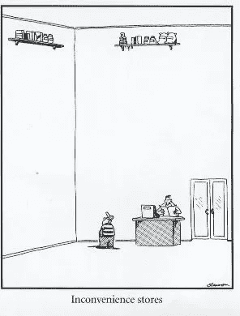

# 捕获加密值:令牌化策略指南…第 1/3 部分

> 原文：<https://medium.com/hackernoon/capturing-crypto-value-a-guide-to-tokenisation-strategies-f17c72df4e5e>

# 介绍

通过提供新服务和增强现有服务，加密系统有潜力创造大量价值。然而，不清楚令牌本身实际上能够捕获多少这个值。这一系列文章将研究符号化策略，它们在获取价值方面有多有效，以及它们在扮演预期角色方面有多出色。

确定了价值较低的[代币](https://hackernoon.com/tagged/token)的特征后，我们就能够识别和建议价值较高的代币的特征。我将把那些表现出更高价值特征的称为“真正的实用代币”和“股权式安全代币”,我将在下一篇文章中详细讨论这两种代币。但是现在，让我们先来看看哪里出了问题…“实用程序”令牌。

# 第 1 部分:( dis)实用程序令牌

虽然 cryptoland 似乎非常热衷于将硬币归类为“效用代币”，以防止额外的监管和披露，但在一些“代币组学”的帮助下，退一步研究这种所谓“效用”的潜在金融价值是值得的。

在接下来的内容中，我们将看一看一个通用的加密“实用程序”令牌，并了解它是如何赋予很少的实用程序，并因此获取很少的价值的。我们还将着眼于改善这种效用硬币的令牌组学的常见方法，并发现这些方法中的许多可能被证明是徒劳的。

但是不要绝望加密霍德尔！这并不意味着所有的实用令牌都是没有价值的，这只是意味着当前过多的类似这个例子的令牌实际上可能根本不是“实用令牌”。

If The Far Side did ‘utility’ tokens?

# 符号化策略

企业家 Alice 想开一家商店，他有两种融资选择。传统上，她可以出售项目的未来现金流(股权或债务)来筹集开店和购买库存所需的资金。一旦开始运营，Alice 可能会将她在年底获得的利润以股息的形式重新分配给股东。

如果项目成功，爱丽丝和股票投资者都会受益。如果这些股票是加密格式，伴随着对假设和持有人权利的调整，我们可以称之为“股权式安全令牌”。在我的下一篇文章中会有更多的相关内容，敬请关注。

从这种传统的融资方法发展而来，人们对 crypto 感到兴奋的原因之一是它为 Alice 提供了一种不同的商店融资方式——通过销售所谓的“效用”令牌，姑且称之为 ShopCoin (SCN)。因为商店只接受 SCN 付款(为了提高顾客忠诚度，Alice 说),如果顾客想去商店，他们需要提前购买这些代币。

如果代币对于早期支持者以“公平价值”的折扣出售，这些代币对于住在附近的想要访问商店的顾客可能看起来有吸引力，并且如果已知 Alice 计划以后在全国各地开设更多只接受相同(有限)SCN 付款的商店，则更是如此。

此外，可能还有住在很远的地方的人，他们永远不会光顾商店，但想购买这些代币来推测他们未来的需求。实际上，爱丽丝已经提前出售了她未来的收入，并获得了折扣，今天就可以提前收到现金。客户/投机者以低于他们认为的价值获得了稀缺资产。显然，爱丽丝和早期顾客都会受益。

**听起来很熟悉吧？加上一些技术上的附加功能，今天你就有了一个通用加密项目“实用”令牌的销售卖点**。我们现在将看到这个提议的令牌函数的各种潜在问题，以及为什么它实际上提供的效用(和价值)很小。

# 问题

1.  非法定定价

商店里的商品实际上并没有用 SCN 标价。尽管销售标签以 SCN 报价，但由于商店中的商品是以美元生产/采购和支付的，Alice 向顾客收取的价格将取决于当时 SCN-美元的汇率。如果 SCN-USD 突然减半，Alice 将要求双倍的 SCN 来支付他们的 USD 成本。SCN 并不要求一个预先确定的值，它只是取决于 SCN-USD 汇率是多少。令牌在这里不提供实用程序。

2.汇率波动

SCN-USD 的汇率不稳定。Alice 实际上并不需要 SCN，因为她的成本都是以美元计算的。客户不想必须使用 SCN 代币，而宁愿只使用他/她口袋里的美元。由于 SCN-USD 汇率波动较大，Alice 和客户都不会在交易后自愿保留额外的 SCN 代币(假设他们只是购物，对投机或投资 SCN 没有兴趣)。

令牌在这里并不提供效用，只是在交易过程中增加了一个额外的步骤。

这些看似微不足道的不便，但它们对代币的价值有着严重的影响。都是 1。第二。结合起来揭示了一个问题，称为令牌速度。

3.令牌速度

这个[理论](https://en.wikipedia.org/wiki/Equation_of_exchange)最初的预期用途是研究一个经济体的货币供应(即信贷增长)与其名义 GDP 的关系，试图预测货币政策将如何影响通胀。尽管如此，这个概念在 cryptoland 中很好地帮助我们思考一个用于支付的令牌，即它被用作“交换媒介”。

如果单个代币在购买过程中从客户流向爱丽丝，当爱丽丝出售代币以获得美元(支付她的成本)时，代币流回下一个等待的客户。我们可以看到这个令牌是如何在一天中不断重复使用的。这个概念，即代币在系统中循环的速度或次数，是 crypto-land 对“货币流通速度”概念的解释。

在 Alice 商店的这个例子中，如果 SCN 代币可以被快速地购买/出售并且没有交易成本，那么购物者将不会费心预先购买任何 SCN。相反，他们会等到找到他们想买的物品，然后迅速将美元换成 SCN 并购买该物品。Alice 将收到这份 SCN，并迅速将其换回美元。在极端情况下，交易几乎是即时和无摩擦的，客户一天中的所有购买都可以在 SCN 中进行，没有人实际持有单个令牌超过片刻。结果呢？没有人持有 SCN 令牌，所以它几乎一文不值。不是完全没有价值，因为那时它不能执行转移价值的功能，但足够接近。

**需要澄清的是，造成这个问题的并不是交易速度太快或者美元兑换成 SCN 的成本太低。快速的速度和低廉的成本使得这种行为*成为可能*，但问题的根源在于用户(不同于投机者)缺乏实际持有 SCN 代币的意愿(由于物品以美元定价以及 SCN 的波动性)。**

已经有[尝试](/blockchannel/on-value-velocity-and-monetary-theory-a-new-approach-to-cryptoasset-valuations-32c9b22e3b6f)到[估算](/@sall/valuing-cryptoassets-from-the-ground-up-441ad5a9ff03)并模拟一个加密令牌的货币流通速度。在这里，作者使用了关于交易时间和可寻址市场规模的现实假设，并通过一些微观经济对最佳钱包规模和交易频率的估计进行了增强。**然而，结果是显而易见且可预测的——在交易速度和交易成本与适合大规模采用的技术水平一致的任何情况下，如果令牌本身没有价值，那么根据定义，它就毫无价值，不管它促进的交易的数量或价值如何**。在这种情况下，技术仍在运行，支付仍在进行。

**在这些场景中，令牌不提供任何效用。充其量只是对代币未来价值/购买力的推测。**也许这有助于我们回答实用性/安全性的争论。或许答案更简单:这些代币可能只是货币吗？无论哪种方式，这显然都是用户采用的障碍，即使不考虑必须跨多个 Dapps 使用和管理多个令牌的明显不便。

那么，我们可以提出什么解决方案来解决上述问题呢？

# 无用令牌的解决方案？

Velocity solutions, anyone?

1.  可直接兑换服务的代币？

如果 1 个代币在将来某个时间授予 1 个单位的服务或商品，那么这个代币将直接提供效用。如果一个游乐场以 1 个代币换 1 次游乐设施，这个代币将是有价值的，并将以人们认为这个游乐设施值多少钱的价格进行交易。如果游乐场后来提高了乘坐的兴奋度，代币的价值会增加，因为它仍然可以兑换 1 次乘坐。换句话说，即使现在乘坐的感觉突然好了一倍，我仍然可以用我以前买的同一个令牌来使用它。虽然看起来很简单，但在整个经济(或整个供应链)使用单一代币之前，以固定代币数量为商品/服务定价是很困难的。然而，有一些方法可以解决这个问题( [EOS.io](https://eos.io/) )，它们将在我的下一篇文章中探讨，敬请期待。

2.避免代币波动？

[Stablecoins](https://cryptoslate.com/category/cryptos/stablecoin/) 在这方面做一个尝试。虽然这是一个有趣的角度，对加密生态系统有益，但由于其渴望的稳定性，它们不是一个有回报的投资。Basis.io 是一个例外，它提供了投资“基础股票”的能力，尽管这取决于货币政策算法的成功。

3.降低“令牌速度”？

3.a .付款期限

在 Alice 商店的例子中，我们假设 SCN 代币可以被频繁且容易地购买。如果 SCN 代币只能在一天开始时购买，那么当天的所有客户都需要预先购买足够的代币来支付他们计划的购买。顾客和计划购买的商品越多，一天开始时需要的代币就越多。如果获取代币的时间窗口延长，例如，您只能在每周开始时购买代币，那么将会预购更多的代币(霍德勒会很兴奋！).对代币购买窗口的这种人为限制最终是在代币协议内创建“速度汇”的各种尝试的目标，通过仅允许代币在特定时间被购买/交易，或者通过要求买方/卖方在服务期间锁定他们的资金，而不是更熟悉的“交付后付款”方法。然而，这有两个含义，都恶化了用户体验。

首先，长支付期意味着加密令牌美元价格波动的风险增加。如果供应商收到的美元只有他们开始交易时预期的一半，这就是一个糟糕的 UX。

第二，如果付款周期自然很快，Dapp 将很容易通过强加人为的长时间限制而被竞争对手分流或淘汰。几个基于“工作”的加密项目( [gems](https://gems.org/) ， [ethear](https://ethearnal.com/#daico) nal)要求在服务提供期间在智能合约中加入令牌。现实世界中提供服务的惯例是预付一部分费用(可能是零预付)，其余的在完成后支付。如果交易可以在 5 秒内发生，而不是强加的 5 天期限，或者如果交易可以在没有伴随的令牌股份的情况下发生，那么不久之后，竞争的加密项目就会提供没有这些功能的解决方案，从而提供更好的 UX。也许需要很长的付款期和全额预付款，这是因为提供服务或商品的准备时间自然很长，加上缺乏对买方和卖方的信任。在这里，加密解决方案可能会有所帮助。但是不管怎样，如果时间周期很长，该特征将仅增加代币的价值。

这些问题都表明，改变支付期限不会以可持续的方式有利于代币的价值。

3.b .打桩

将未使用的代币“下注”的趋势(有时会得到被动收入的回报)是[降低代币流通速度的另一个](/newtown-partners/velocity-of-tokens-26b313303b77)[尝试](https://www.tokens24.com/exclusive/essential-strategies-managing-velocity)。要了解为什么这是无益的，考虑平台令牌的加权平均速度。

让我们想象一个系统，其中有 100 个代币，每个代币当前值 1 美元，因此总货币供应量值为 100 美元。这个平台上有一定数量的经济活动——每天产生 100 美元的交易费。这意味着，我们可以将每个令牌视为每天使用一次(即速度为 1)，以便 100 个令牌将 100 美元的价值从服务的买方转移到卖方。实际上，可能只有一个用户产生所有的 tx 费用，其中买方的令牌每天在该买方和服务卖方之间移动 100 次(假设可能进行快速交易等)，而其余的 99 个令牌被保留。这 1 个活动令牌的结果“速度”是 100，而其余令牌的速度是 0。系统中记号的加权平均速度是(1*100 + 99*0)/100 = 1，尽管 99%的记号具有最低的可能速度。使用 MV=PQ，我们又回到了 100 美元的面值(M = PQ/V = $100)，尽管有赌注系统。

Staking systems: good luck!

使用代币锁定系统，鼓励您承诺锁定您的代币一段时间(这些代币的速度= 0)，而其他用户/代币继续进行相同数量的活动(这些代币的速度现在更高)。对整个系统的令牌值没有净结果。**通过引入赌注，唯一的影响是减少流通中代币的*流动性*** (在某一时间点可购买或出售的代币数量)。低流动性是一把双刃剑——当买家到来时，他们会推高价格，远远超过代币市场的流动性。但同样，当代币卖家到来时，他们会把价格压得很低。结果是增加了(已经很高的)象征性价格波动，对 UX 产生了负面影响，如上所述。

**现在应该清楚的是，如果代币仅用于支付，无论我们如何试图“控制其速度”，代币都无法获得大部分经济价值，无论加密系统可能带来的利益(财务或其他)。**

# 这给我们留下了什么？

这并不是说所有的支付令牌都将归零。支撑它们的是一种逻辑循环:如果它们被认为有价值，那么它们就有价值。如果 1 个代币被认为能够交付价值 1 美元(或更多！)的购买力，那么没有什么可以阻止它这样做。这就是“价值储存”资产开始存在的方式，根据类似的逻辑，这也是现实世界的菲亚特系统保持价值的方式。如果足够多的人有足够的信誉和足够多的钱，相信同样的愿景，那么这可以自我传播和持续下去。也就是说，直到论点发生变化(即监管)，价值不再被储存(即价格下降)，或者一些更新更闪亮的资产出现(*插入最新 ICO*)，人们从这个失败的价值储存中退出的最初涓涓细流变成了踩踏事件。然后，恐惧的死亡变成了自我实现的预言。

这就是 Pfeffer 在他非常清晰的[论证](https://s3.eu-west-2.amazonaws.com/john-pfeffer/An+Investor%27s+Take+on+Cryptoassets+v6.pdf)中提出的观点——价值存储是加密的主要“用例”。虽然我并不完全反对这种观点， ***我相信如果设计正确的话，代币可以获得额外形式的经济价值*** 。

# 结论

在本文中，我们已经看到了设计糟糕的实用程序令牌如何提供最小的实用程序，并且可能无法获取太多的价值。人们试图用一些方法来解决一些假设的问题。然而，由于核心问题是缺乏赋予代币本身的真正价值(除了投机或作为价值储存手段的分类之外)，这些提出的方法没有提供可持续的解决方案。

在我的下一篇文章中，我将继续讨论两个重要的令牌设计以及它们所能带来的价值。这些代币是**‘真正的公用代币’**和**‘股权式证券代币’**。

…请在此处找到第 2/3 部分

//关注我@CryptoBonsai 了解更多加密见解