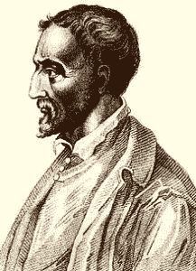
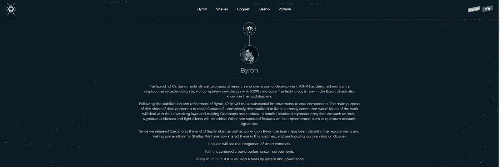
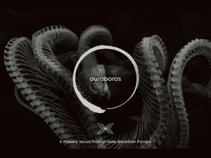
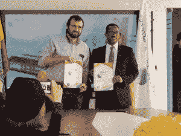

# cardano(ADA)——智能合约平台的基本分析

> 原文：<https://medium.com/hackernoon/cardano-ada-fundamental-analysis-of-a-smart-contract-platform-169aca29387b>

“There has been a desire to preserve a single notion of consensus around facts and events recorded in a single ledger, regardless of whether it makes sense.” — Cardano Team

Gerolamo Cardano

比特币是区块链 1.0，因为它是第一个分布式账本。以太坊是区块链 2.0，因为它是第一个让[开发者创建去中心化应用](https://lunardigitalassets.com/insights/2018/analysis-smart-contract-platforms-part-1/)的平台。自从比特币和以太坊协议推出以来，出现了一些问题。两个悬而未决的问题包括比特币交易的可扩展性，以及以太坊网络中作为标准编码语言的可靠性带来的缺陷。以有影响力的意大利文艺复兴学者吉罗拉莫·卡尔达诺命名， **Cardano(或 ADA)** 是 IOHK(输入输出香港)目前正在开发的区块链协议。Cardano 旨在解决这些问题(以及许多其他问题)，并创建一个平台来执行智能合同，并更有效地开发和运行去中心化应用程序(除了启动侧链、多方计算和元数据之外)。)

该协议本身于 2017 年 9 月 29 日推出，经过了由世界领先的科学家、密码学家和研究人员组成的强大学术团体两年的严格研究和开发。*卡尔达诺的同行评审开发流程与其他区块链大相径庭。*

该协议仍处于“Byron”引导阶段。第二阶段名为“谢莉”，计划于 2018 年中期发射。

与其他具有类似目标的区块链协议一样，截至 5 月 16 日， **Cardano 在 CoinMarketCap ( **上排名第 7**，市值 64.6 亿美元**)， **NEO 排名第 11**(市值**【39.9 亿美元】)**， **EOS 排名第 5**，市值****105.8 亿美元** *。***

# **卡尔达诺背后的哲学是什么？**

**卡尔达诺的座右铭是“**过程胜过人**”批准一个特性包含在协议中的典型过程是由一大群人按照严格的指导方针和过程来处理的。如前所述，同行评审是 Cardano 网络的一个基本特征。**

**例如，假设开发人员有一个在协议中实现费用的想法。针对这一特定特性撰写了一篇论文，多位密码专家、开发人员和科学家对其进行审查，以找出编程语言逻辑中的漏洞，确保其具有健壮的结构。专家在评论专家。许多人认为这种哲学是开发尖端技术的有效方法。**

## **政府的一项雄心勃勃的事业**

**在萌芽阶段，加密货币的前景相当不受世界各国政府的监管。另一个与众不同之处是 Cardano 的雄心勃勃的目标，即遵守来自世界各地的法规。由于没有太多与区块链相关的先例或过去的立法，愿意通过正式的政府法规是一项艰巨的任务。卡尔达诺(和尼奥一样)希望认真参与现实世界的监管。一个论点是，为了有效地与遗留系统(如政府和银行)互动，区块链世界和遗留世界之间需要有相当程度的集成和某种通信系统，以便为社会提供价值。**

## **卡尔达诺的技术**

****

**Haskell**

**Haskell 是 Cardano 的标准编程语言。区块链社区的一些人称赞这种语言逻辑简洁。Haskell 不太可能产生错误，它还改变了一些程序员的思维和工作方式。通过迫使程序员在逻辑上更加简洁，特性可以被重用。然后，使用形式化的方法来检查它们的协议。基本上，有严格的可执行数学模型来确定潜在的网络故障。这确保了预测网络内计算水平的更大确定性。**

**正式方法/验证的使用产生高保证软件或高保证代码。可靠性至关重要的行业(**如军事防御、核反应堆和医疗机械)，**使用高保证软件。像美国宇航局这样的机构，投资 25 亿美元经营其火星探测器，十年后仍然很强大，这是因为高保证软件。在加密货币的背景下，[它将防止类似“道”的事情再次发生。](https://www.coindesk.com/understanding-dao-hack-journalists/)**

## **Ouroboros:一个可证明安全的赌注证明区块链协议**

****

**大毒蛇的利害关系证明协议是卡尔达诺区块链的支柱。 *Ouroboros:一个可证明安全的利害关系证明区块链协议*，是一个同行评审的白皮书，考虑到工作证明算法的长期能源浪费。**

**根据《Ibtimes》的报道，大毒蛇确保了选举老虎机的随机性，只要他们在卡尔达诺网络中有股份(> 0 ADA)。大毒蛇使用多方计算来实现随机性，在一次独立的硬币投掷后，结果在选举人之间共享。随机性的重要性使得它不会有单点故障——如果时隙前导是预先确定的，它将使协议容易受到黑客的攻击。**

# **卡尔达诺的三个主要目标**

## **1.互用性**

****目前有超过 2000 种加密货币可供兑换。**没有中介，比特币与以太的交易无法进行。还没有。卡尔达诺的目标是制造一个可以和其他区块链人交流的区块链。此外，每笔交易都可以附加元数据，但是否公开这些数据应该由用户决定。**

> **“卡尔达诺并不想成为加密货币的哥伦布。它试图成为将哥伦布带到陆地的海洋”——CryptoBasic**

**卡尔达诺还认为不会有一个令牌来统治所有人。以太坊、比特币、Swift 和 ACH 协议(机构银行网络使用)、Ripple 都有自己的语言。问题是，如果有一种规范的方式与所有这些不同的系统沟通，价值就是碎片化的。拥王者将是在系统间传递价值的小型登机和离机枢纽。霍金森表示，截至目前，交易所是令牌之间互操作性的唯一媒介，但它们是非常脆弱的工具，受到严厉的监管政策的制约。**

**[侧链](https://www.forbes.com/sites/shermanlee/2018/02/07/explaining-side-chains-the-next-breakthrough-in-blockchain/)自 2012 年就已经出现，但其基本概念是有某种方式将信息从一个链组织到另一个链，这样当交易设定时，压缩形式的信息可以表明它是否是合法的交易。虽然侧链确实解决了区块链能够以一种特殊的方式相互理解的问题，但区块链世界能够与传统金融机构进行交流的问题仍然存在。**

**Hoskinson 指出了三个主要问题(在互操作性中),即元数据、属性和遵从性。元数据是事务的上下文，在加密空间中没有很好地提供。然而，传统金融中的元数据非常有价值。元数据极其个人化和私密化，在区块链上很难找到自己的位置。区块链上的一切都是不可改变的，公开非常敏感的信息并不是所有用户都想要的。属性是关于每个事务中涉及的参与者的身份(元数据的一个方面，但可能是最重要的一个)。合规是区块链空间中有待确定的一个方面，将随着时间的推移而展开。**

## **2.可量测性**

**事务承载数据—数据越多，需要的带宽就越大。如果它面向数百万甚至数十亿的用户，可能需要数百万甚至数十亿字节的数据。大毒蛇是解决这个问题的共识机制。它将世界分成了几个时代。它会查看代币的分布情况，并随机选择号码源，选出位置领导者。老虎机领导者实际上做的和比特币矿工做的一样。一个很大的区别是，它们不需要比特币矿工所需的大规模计算能力。因此，它更具成本效益。**

**槽头可以开采和维护其他链上的其他区块。卡尔达诺将时间划分为纪元(分成时间段)。网络为每个时隙选举时隙领导者。槽头验证事务，并将它们放入块中。如果槽领导人未能出现执行，他失去了权利，产生一个区块。然后他需要等待再次入选网络。这是高度可伸缩的，因为可以同时运行多个 epochs。区块链存储在一个 P2P 网络中，每个节点接收一份分类账(和新的交易)。如果每秒有数千个事务，节点将需要大量带宽来持续下载所有事务。Cardano 想把网络分成子网。它使用 RINA(递归互联网络架构)来解决这个问题。RINA 用政策和巧妙的工程原理构建网络。目标是授予用户 TC/IP 协议所享有的可伸缩性、隐私、透明性保证。当 Cardano 在与 TCP/IP 协议通信时，每秒从数百到数千到数万次交易时，这是一种将被设置到位的机制。**

## **2b。数据规模**

**区块链永远储存东西(希望如此)。但是 Cardano 背后的团队认识到，并不是所有的节点都必须在任何时候拥有所有区块链的完整副本，以保持协议的完整性。TPS 越多，需要的数据就越多。从长远来看，区块链及其数据块大小可能会从兆字节增长到千兆字节。在安全模型依赖每个节点来维护区块链的复制系统中，硬件设备不可行。**

**订阅(或分区，用户没有区块链的完整副本，拥有区块链的一大块。有一种观点认为，如果可能的话，所有的块都可以放在一起。类似于 Bittorent，通过分区，可以以更高效的成本访问更多的资源。**

**解决数据扩展的另一个解决方案是压缩/侧链。侧链的概念是创建一个区块链的压缩表示，并创建跨不同区块链的互操作性和转换事务。Cardano 协议将包含高水平的保证，涉及所有将通过网络进行的交易。**

## **3.可持续发展**

**有一个问题是，一个特定的区块链协议背后的开发团队的资金可能会耗尽。卡尔达诺财政部是解决这个问题的一个办法。财政部将收到所有交易中的一小部分。这是一种智能合同，可以向开发商释放资金。开发者可以向网络提交想法，得到社区的认可。财政部通过集体投票，可以决定哪个开发商获得资金。金库是对网络进行持续改进的途径。共识算法会产生一笔交易费用，这笔费用由一个特定的等式决定: *a + b*c***

****a** 是常数= .155381 ADA， **b** 也是常数= .000043946， **c** =事务的大小，以字节为单位**

# **卡尔达诺公司结构**

**卡尔达诺区块链公司的总体结构由三个实体组成。[卡尔达诺基金会](https://cardanofoundation.org/)总部位于瑞士，是一家非营利实体，负责监督卡尔达诺区块链公司的合规性、社区管理和合作伙伴关系。[输入输出香港](https://iohk.io/) (IOHK)是卡尔达诺区块链背后的研究、开发和工程实体(由霍金森创立)。 [Emurgo](https://emurgo.io/) 是卡尔达诺区块链背后的盈利性风险投资公司，旨在建立基于卡尔达诺区块链之上的实用和商业初创公司。**

## **团队**

****

**Charles Hoskinson**

****查尔斯·霍金森——创始人兼首席执行官****

**根据 IOHK 的网站，Hoskinson 曾在公共和私营部门担任多个职位。他可能是以太坊的创始人之一(与 Vitalik Buterin 一起)，也是以太坊的前首席执行官。2015 年，他与卡尔达诺基金会合作，成立了 IOHK，作为一个合同团队，开发卡尔达诺协议，直到 2020 年。他召集了一个由来自世界各地的杰出学者和博士、科学家、商业、技术专家和软件工程师组成的团队，开发一种植根于区块链社会固有的哲学基础的真正科学的方法。**

****杰里米·伍德——联合创始人兼首席战略官****

**杰里米·伍德也曾在 2013 年与以太坊合作，管理运营。离开以太坊后，杰里米在 2015 年与查尔斯·霍斯金森(Charles Hoskinson)一起开始输入输出(Input Output)之前担任顾问。**

# **到目前为止，Cardano 的一些示例用例是什么？**

****

**日本所有，但韩国采用的移动支付平台 Metaps Plus 最近宣布与 Cardano 合作。据 cryptoninjas.net 称，[meta PS Plus 每年验证约 1000 万笔移动到线下的交易。采用将在 2018 年第三季度左右进行，并将在超过 **33，000 家线下商店和促销活动中使用；**这一采用标志着加密货币与主流服务提供商的整合。](https://www.cryptoninjas.net/2018/05/09/cardano-ada-token-gets-listed-on-korean-payment-platform-metaps-plus/)**

****

**查尔斯·霍金森在与埃塞俄比亚科技部签署谅解备忘录后说。由 TheNextWeb[/caption]提供**

**据 CCN 消息，Hoskinson 最近(代表 Cardano)与埃塞俄比亚科技部签署了一份农业技术发展谅解备忘录。埃塞俄比亚在历史上被认为是咖啡的发源地(可追溯到 10 世纪)；Cardano 和埃塞俄比亚科学部的合作将帮助咖啡种植者证明他们的咖啡豆的来源和纯度。此外，还将开展一项研究，评估在整个供应链中跟踪咖啡对其生长、收获、烘焙和批发生命周期的影响。该项目还旨在减少欺诈并使土地登记更加透明(类似于肯尼亚通过分布式分类账技术验证土地登记的努力)。**

# **ICO 和 Tokenomics**

**该协议在 2015 年 9 月至 2017 年 1 月期间通过代币众筹销售产生了约 6200 万美元的收入，其中包含大量 KYC 要求。它主要面向日本人进行营销，报告显示，大约 95%的 ICO 参与者都是日本后裔[(根据 CryptoCandor)](https://www.youtube.com/watch?v=62MCv_4p-EY) 。**

****卡尔达诺**:流通供应量为 250 亿代币，最高供应量为 450 亿。截至美国东部时间 5 月 16 日 2:42，Cardano 在 CoinMarketCap 的交易价格为 0.25 美元。**

****免责声明:** *我们与卡尔达诺团队没有任何关系。这也不意味着是财务建议。接下来的内容只是反映了我们对这个项目的理解，以及我们对其前景的个人看法。这里有* [*卡达诺项目*](https://www.cardano.org/en/home/) *的链接，以及项目背后的* [*基本原理*](https://whycardano.com/) *。***

**如果你喜欢这个内容，请在这里订阅我们的邮件列表。您将获得 Lunar Labs 的早期测试版，这是一套优化您的加密货币交易体验的工具，以及直接发送到您电子邮件的最新加密新闻和市场更新。您也可以点击[此处](http://bit.ly/2GUSqRl)访问我们的网站，了解更多我们的工作！**

***原载于 2018 年 5 月 16 日*[*lunardigitalassets.com*](https://lunardigitalassets.com/insights/project-analysis/2018/cardano-fundamental-analysis-and-overview/)*。***