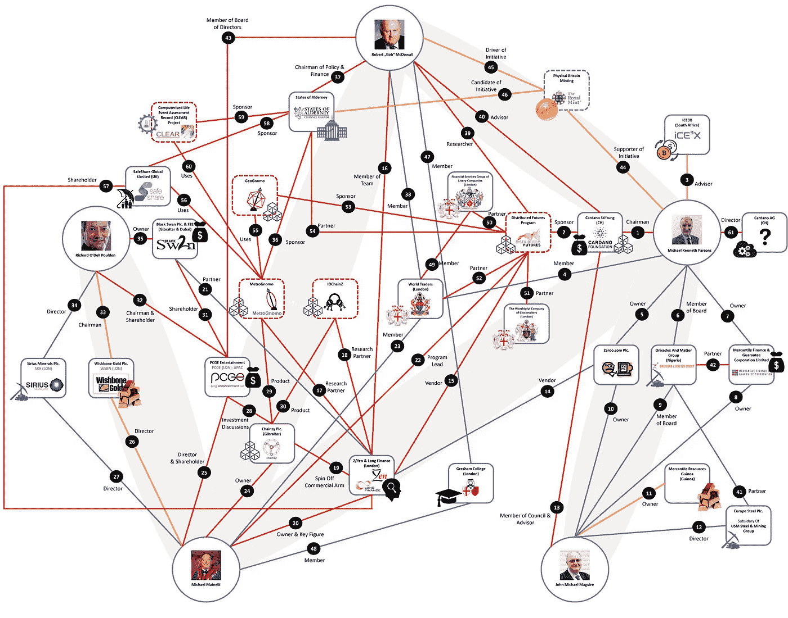

# 卡尔达诺基金会主席在社区倡议下辞职

> 原文：<https://medium.com/hackernoon/cardano-foundation-chairman-resigns-following-community-effort-50453efd3d3c>

> 这篇文章是 Hackernoon 上一篇题为“【Cardano 怎么了？(10 月 22 日)。虽然上一篇文章描述了 Cardano Foundation 主席名誉扫地的原因以及社区倡议的内容，但本文总结了主席于 11 月 13 日辞职后的后续发展。

# 之前发生了什么？

要全面掌握情况，最好只看[上一篇](https://hackernoon.com/whats-going-on-with-cardano-3f2996841b21) (14 分钟看完)。为了完整起见，我们将做一个简短的回顾。

卡尔达诺的目标是在未来拥有一个链上液体民主。直到达到那个点(2020？)，卡尔达诺由三个实体联合而成。发展社区和推动采用是卡尔达诺基金会的两个主要职责。输入输出香港(IOHK)和 Emurgo 负责 Cardano 生态系统的技术开发和业务采用。

九月中旬，IOHK 首席执行官 Charles Hoskinson [表达了对基金会政策和资金选择的担忧。在 Cardano 论坛的一个私人休息室里，社区成员](https://twitter.com/IOHK_Charles/status/1041562593536618496)[发起了一个帖子](https://forum.cardano.org/t/i-am-concerned-over-friction-between-the-cardano-foundation-and-iohk/15995)(仅对[3 级](https://forum.cardano.org/t/trust-levels-and-lounge-of-the-cardano-forum/16855)账户可见)，表达了这些以及许多关于基金会主席迈克尔·帕森斯(Michael Parsons)职能的其他担忧。9 月 18 日，卡尔达诺基金会安排了一次与社区成员的视频聊天，但实际关注的问题[从未得到解决](https://forum.cardano.org/t/i-am-concerned-over-friction-between-the-cardano-foundation-and-iohk/15995/72)。

10 月 12 日星期五，一个由九名自称为卡尔达诺守护者的社区成员组成的团体发布了一封[公开信](https://www.guardiansofcardano.com/open-letter/)并发起了[请愿](https://www.change.org/p/cardano-community-lets-liberate-the-cardano-foundation-suspected-to-be-hijacked-paralyzed-by-its-chairman)向帕森斯施压，要么改善现状，要么辞职。表达的一些关切包括裙带关系、不明智的供资选择以及总体缺乏透明度和沟通。同时，IOHK 和 Emurgo 还发布了一封公开信和 Charles Hoskinson 的视频声明，以表达他们对社区倡议的支持。IOHK 和 Emurgo 还宣布，他们将雇用人员来承担基金会未实现的责任，以确保卡尔达诺的未来。

# 之后发生了什么？

卡尔达诺基金会从未公开回应公开信或 IOHK、Emurgo 和社区表达的任何关切。超过 6000 人在[请愿书](https://www.change.org/p/cardano-community-lets-liberate-the-cardano-foundation-suspected-to-be-hijacked-paralyzed-by-its-chairman)上签名，而 Twitter 和其他公共渠道上的辩论仍在继续，由[# MichaelParsonsResignation](https://twitter.com/hashtag/MichaelParsonsResignation?src=hash)和 [#freecardano](https://twitter.com/search?q=%23freecardano&src=typd) 等标签以及各种模因和恶搞账户活动推动。监护人的推特账号[在 10 月下旬被短暂限制](https://twitter.com/HendrikxAndy/status/1054045468836143104)，但[随后再次继续向帕森斯](https://twitter.com/search?l=&q=from%3ACardanoOf%20to%3ABitcoinByte&src=typd)施压。

10 月 30 日，卡尔达诺守护者协会在其网站上发布了给迈克尔·帕森斯的第二封公开信。公开信附有一张图表，将帕森斯与多个个人和职业努力联系起来，这可能代表利益冲突。

Michael Parsons’ network [according to the Guardians of Cardano](https://twitter.com/CardanoOf/status/1061749889649033217)

在相应的时间线中，每个连接都由公共资源证实。在撰写本文时，这些信息在《卫报》的网站上是保密的(受密码保护)。然而，下面的视频简要总结了一些发现，并显示了时间线。

Community member Philippe [vlogs about the Guardians’ second open letter](https://www.youtube.com/watch?v=ZKGCjIlFCrw) (7:42 min)

其中一个主要发现是帕森斯与 [Z/Yen 商业智库](https://en.wikipedia.org/wiki/Z/Yen)和 [Long 金融研究项目](https://www.longfinance.net/)有多方面的联系(如迈克尔·迈因内利和罗伯特·麦克多沃尔)，这些项目由卡尔达诺基金会[资助，对分布式期货](https://cardanofoundation.org/en/distributed-futures/)进行研究。然而，研究结果似乎与 Cardano 的实际生态系统几乎没有联系，甚至可以被解释为支持竞争技术。这一点，加上帕森斯似乎完全没有参与卡尔达诺，透明度和沟通，以及公开信后的显着沉默，进一步助长了卡尔达诺社区的犬儒主义。

11 月 8 日，卡尔达诺的监护人呼吁社区的其他人参加 11 月 14 日在伦敦举行的 [Long Finance 秋季会议](https://www.longfinance.net/events/forthcoming-events/long-finance-autumn-conference-2018-smart-ledgers-and-risk/)，并通过分布式未来研究向 Michael Mainelli 说明卡尔达诺的现状以及他与 Parsons 的关系。

The call for action by the Guardians of Cardano [on November 8th](https://twitter.com/CardanoOf/status/1060607183287734272)

11 月 13 日 Long Finance 秋季会议的前一天——卡尔达诺基金会发布了一份声明，宣布迈克尔·帕森斯辞去基金会理事会主席一职，立即生效。随着寻找董事会成员工作的开始，仅存的董事会成员帕斯卡尔·施密德(Pascal Schmid)将暂时接任董事长一职。

The Guardians of Cardano respond to Parsons’ resignation [on Twitter](https://twitter.com/CardanoOf/status/1062415822868635648)

# 接下来会发生什么？

在帕森斯辞职的消息传出后不久，IOHK 首席执行官查尔斯·霍金森(Charles Hoskinson)发表了以下视频声明，解释了目前的情况。

Charles Hoskinson: “[The Babylonian Captivity of Cardano has Ended](https://www.youtube.com/watch?v=AEP84LIBBuU)” (11:06 min)

在他的视频中，Hoskinsons 感谢卡尔达诺社区和卡尔达诺的守护者们努力让基金会对他们的行为负责。他解释说，帕森斯的辞职是自愿的，没有遣散费，这意味着 Cardano 能够在逆境中保持其作为一个生态系统的完整性和原则。与之前对 Pascal Schmid 的积极评价一致，Hoskinson 表示，他对 Schmid 的领导能力和管理 Cardano 基金会度过当前过渡阶段的能力充满信心。

虽然 Hoskinson 在任命 Cardano 基金会董事会成员方面没有正式的角色，但他希望该基金会能够重塑自己，变得更加民主，拥有至少 7 名董事会成员，一名得到社区支持的有技能的杰出执行董事，在促进和资助社区管理举措方面变得更加多样化，并拥有日本代表，这是最初 ICO 的许多投资者的家园。

虽然 Hoskinson 和 Cardano 社区都对最终结果感到满意，但几乎所有表达的关切和问题都没有得到答复。由于这些担忧大多针对特定人群，与卡尔达诺的未来不再相关，卡尔达诺的守护者们决定将在[分享的信息保密。据称，一名瑞士社区成员向瑞士当局提交了信息。也许这将使](https://www.guardiansofcardano.com/open-letter-2/) [IOHK 和 Emugo 的请求](https://iohk.io/blog/an-open-letter-to-the-cardano-community-from-iohk-and-emurgo/?__hstc=64163184.da5032b0f014deffd266388843fded5d.1537645132336.1540117702819.1540120563900.29&__hssc=64163184.1.1540120563900&__hsfp=2609304355)更有可能接受瑞士当局的透明审计。

至关重要的是，由即将任命的新执行董事和理事会成员领导的 Cardano 基金会必须重新获得机构群体的信任。如果它能在这一点上取得成功，卡尔达诺生态系统实际上可能会比过去两年的任何时候都更好，在过去两年中，卡尔达诺基金会在很大程度上是无效的。除了基金会本身潜在的增加的有效性，最近的事件转变真正地把卡尔达诺社区聚集在一起，这证明了在需要时是警惕的、有弹性的和直言不讳的。具有讽刺意味的是，这些实际上是卡尔达诺基金会在准备卡尔达诺未来的链上液体民主和分权治理过程中应该促进的社区特征。在设想的系统中，不同数量的直言不讳的社区领导人需要站出来，以填补投票系统中的“专家”角色，并接受委托投票。

[根据 Hoskinson](https://www.youtube.com/watch?v=AEP84LIBBuU) 的说法，2019 年第一季度可能成为 Cardano 历史上最重要的时期之一，因为一些最突出的[路线图项目](https://cardanoroadmap.com/)(例如，去中心化、智能合同)预计将被发布。因此，在接下来的几个月里，与 Cardano 相关的对话很可能会再次逐渐转向这些根本性的发展——这让 Cardano 社区既欣慰又兴奋。

> 喜欢这个故事吗？你可以在[媒体](/@undersearcher)和[推特](https://twitter.com/undersearcher)上关注我。
> 
> **免责声明**:本文仅用于信息和教育目的，不应视为投资建议。