# CargoX (CXO):区块链改变交通场景

> 原文：<https://medium.com/hackernoon/cargox-cxo-blockchain-transforming-the-transportation-scene-1f2ea850bb55>

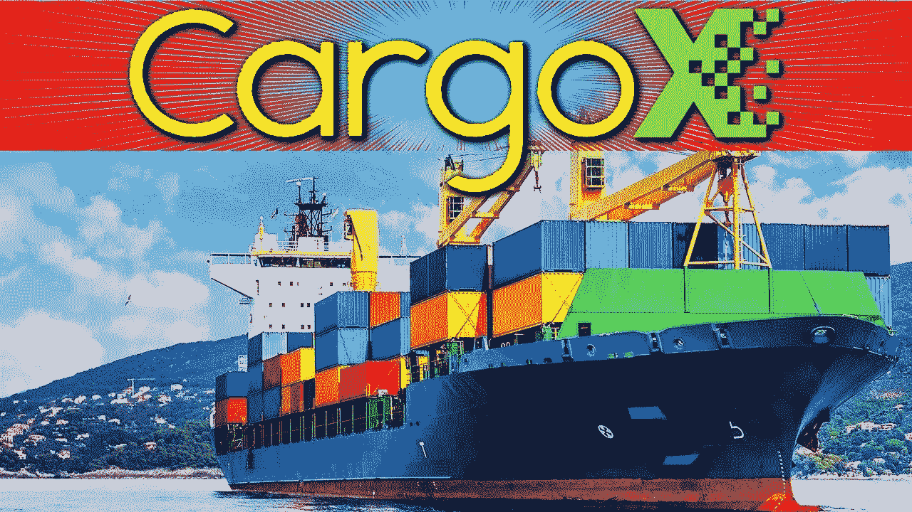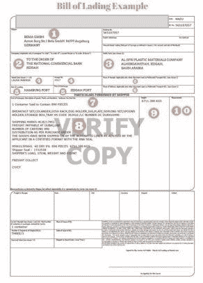

这是一种被称为提单的文件。提单是货物运输的收据。因此，当货物从一个港口转移到另一个港口时，就需要确认和签署提单，将货物的责任转移给下一个人。

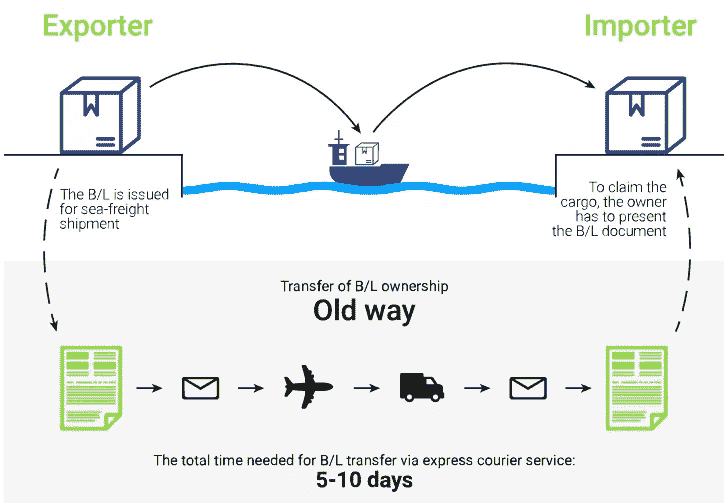

提单并不与实际货物一起运输。举个例子，货物可以通过海运从一个港口到另一个港口，但是提单作为一种文件将通过飞机和快递发送到下一个港口。这是为了确保如果货物在海上丢失，提单不会丢失，并且可以作为丢失货物价值的证据。

在今天这个时代，你会想象这应该是一个电子过程，但它不是，它仍然是旧的学校文件和蜗牛邮件，使其缓慢，昂贵和不可靠。

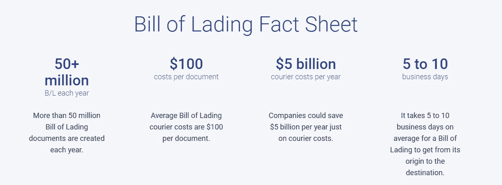

目前，将提单从一个港口发送到另一个港口的平均成本约为 100 澳元。每年产生超过 5000 万份提单，使得该行业每年的快递成本超过 50 亿美元。平均时间长度为 5-10 天，取决于港口的距离。

更昂贵的是，如果由于不可预见的情况，货物在提单之前到达港口。然后，货物不得不被扣留在港口，费用非常高。

CargoX 的目标是通过使用区块链技术保护提单文件来改变全球航运业。它们将为进口商和出口商提供一种以数字方式安全交换这些文件的方式，并且在中立的环境中没有欺诈的可能性——速度极快，比现在便宜得多。它们的成本只有当前成本的 10%，实际上快 1000 倍，作为一项区块链技术，它们将是世界上最安全、最不可篡改的提单公开分类账。没有其他解决方案能和他们的相比。现在，他们是全世界唯一一个解决这个问题的区块链项目。这是改变游戏规则的技术。

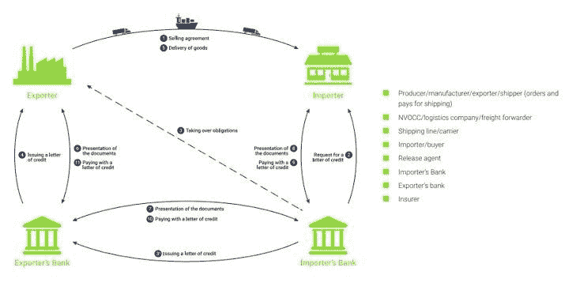

可以想象，海运运输路线涉及多方。有生产商、物流公司、承运商、进口商、发行代理等等。传统上，在货物到达港口之前，提单的硬拷贝必须在所有这些代理之间运输。你现在可以理解为什么有时提单在货物到达港口之后。

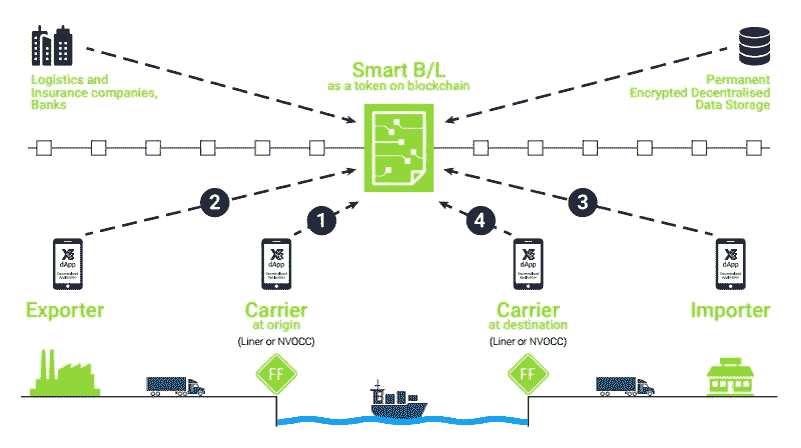

CargoX 推出了一个新系统，称为智能提单。这是一份提单的电子副本，由智能合同(又名区块链技术)创建和管理。该集团的合法所有人可以在 20 秒内创建一份智能提单，并立即供各方查看和访问。因为它是区块链和分散的，信息不能被更改或黑客攻击，这意味着它是完全防欺诈和安全的。

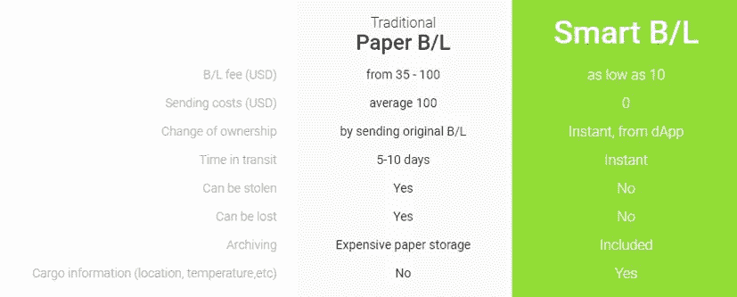

这是一个比较纸质提单和智能提单的简单表格。创建一份提单的成本可以低至纸质提单的 10%。没有发送成本或丢失/损坏的风险，而纸张的平均成本为 100 美元，并有相关风险。与需要 5-10 天才能到达港口的纸质提单相比，智能提单没有过渡时间。并且不需要纸张存储。此外，智能提货单可以与其他供应链解决方案(如传感器)相结合，以提供有关运输条件的最新信息，如位置、集装箱温度等，这是纸质提货单所无法提供的。因此，航运公司没有理由不使用智能提单。

这个项目可能会与 VeChain 或 WaltonChain 等其他项目结合，形成合作伙伴关系，甚至开发自己的硬件传感器。无论哪种方式，这个项目都有很大的发展空间。

如果你在区块链呆过一段时间，你会发现有很多供应链项目正在兴起，从零售行业如 VeChain 和 Waltonchain，到食品行业如 Wabi、Te-Food、Ambrosus 等..现在航运业也是如此。这是因为在这些领域，你不需要超高的传输速度，你需要的是一种技术，以非常低廉的价格提供一个非常开放和安全的账本，这正是区块链所提供的。因此，展望未来，我认为区块链现在将改变整个供应链行业和所有这些项目，具有先发优势，可能是非常好的投资。绝对值得了解。

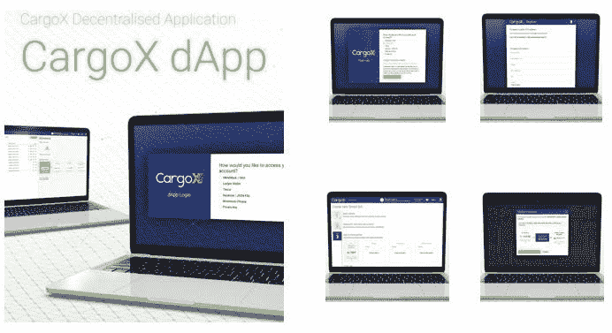

CargoX 有他们自己的 Dapp，这是一个程序，具有非常干净和易于使用的界面，公司可以安装和使用。他们的网站上还有一个非常清晰的指南，一步一步地教授如何使用这款应用程序。

此外，CargoX 技术可以作为 API 而不是 app 安装。API 是应用程序的应用程序。例如，你手机上的优步应用程序会有几个不同的功能，如 GPS、支付网关等..这些不同的功能是 API，而优步应用程序是一个应用程序。CargoX 将提供两个应用程序选项，但对于不想使用另一个应用程序的公司，他们可以简单地将该技术作为 API 集成到他们现有的商业软件中，例如，他们正在使用的当前程序上的简单下拉菜单。

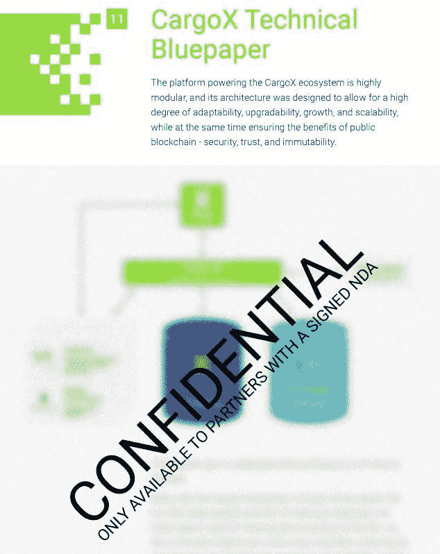

在这一点上，技术蓝皮书的某些方面仍然是保密的。可能是因为专利或者其他原因。因此，我们不能过多地钻研技术。

但是他们的技术对区块链来说非常直观，所以我认为这是可以实现的。事实上，他们的智能提单(该项目的核心技术)已经开发出来，目前正在与几家公司进行试点测试。主要产品预计将于 2018 年第三季度发布，所以很快。

# 代币使用

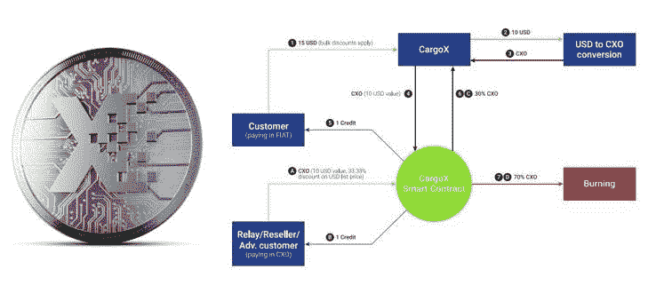

整个系统运行在 CXO 令牌上，以确保令牌的使用和需求。但不是折磨他们的客户需要建立和交换帐户，学习如何购买加密货币等..他们开发了一个透明的流程，用于在客户通过 SEPA/ SWIFT 银行转账支付发票时，补足 CXO 信用余额。每个 CargoX 智能提货单的成本正好是 10 美元，这将被转换为 CXO 代币。CargoX 还将有一个财政部钱包，作为菲亚特-CXO 转换的缓冲。

将价格与美元挂钩并拥有缓冲是进一步促进大规模采用的重要功能，因为它消除了企业对加密货币波动性的风险和担忧。

还记得我们先前指出的，在一次运输中涉及到多方吗？只有创建智能提单的最初所有者支付 10 美元。其他各方都可以免费使用这项技术。所以对大多数人来说，这是在免费使用一项伟大的技术。在你担心与区块链的其他项目相比，令牌没有得到充分利用之前，先考虑一下成本。与纸质提单的 35-100 美元交易费用相比，10 美元听起来很少，但除了比特币和以太坊，其他区块链项目的交易费用很低。比如恒星流明，6 万笔交易收费 1 美分。因此，在区块链，一笔交易 10 美元可以被视为非常高。不会影响项目的使用，因为这个费用还是市场上最便宜的，但是会保证需求。

除了创建智能账单之外，代币的其他用途还包括其他服务，例如，如果存在争议，则进行仲裁，支付合作伙伴提供的其他服务，在选定的网络物流门户网站上支付海运费，使用代币支付可享受高达 30%的折扣。

如果代币的使用还不够，代币经济学中还有一件事是代币投资者会喜欢的，那就是代币燃烧。CargoX 有着疯狂的代币烧钱速度。在 10 美元用于购买智能提单并转换为加密货币后，其中的 70%，即价值 7 美元的令牌将被烧毁并永久删除。这是一个非常高的燃烧率，将大大影响通货膨胀。这意味着，即使是所有其他因素，投资者越早进入项目越好，因为随着每一次燃烧，代币的价格将越来越永久地膨胀，70%又是一个非常大的数字。

CargoX 将每年设定 CXO 代币燃烧百分比，因此不会总是 70%，但第一年将是 70%。

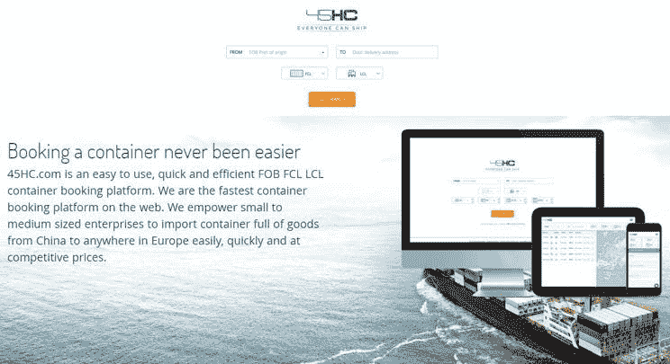

CargoX 背后的母公司是斯洛文尼亚集装箱预订平台 45HC。他们专门帮助中小型企业以有竞争力的价格将货物从中国运往欧洲，他们是目前网络上最快的集装箱预订平台。

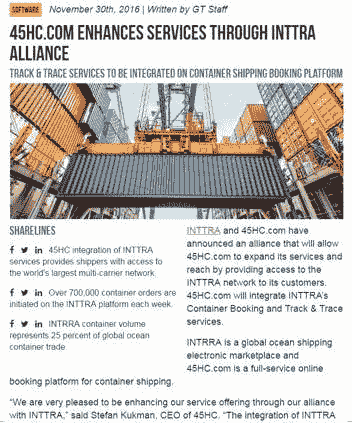

45HC 还与 INTTRA 结盟，INTTRA 是海洋运输业最大的中立电子交易平台和信息提供商。他们每周发出超过 700，000 份集装箱订单，约占全球海运集装箱贸易的 25%。因此，虽然 45HC 可能不是世界上最大的航运公司马士基，但他们肯定是该领域的重要参与者。

作为一个项目，CargoX 不像马士基或英特拉那样是一家物流公司。他们具体到简化提单，这是每个运输物流公司面临的问题。指每一家物流公司，如马士基、英特拉、45HC 等..可以使用他们的技术。他们的目标是成为运输行业的另一家公司，他们的目标是成为该领域每家公司都可以使用的改变游戏规则的技术。

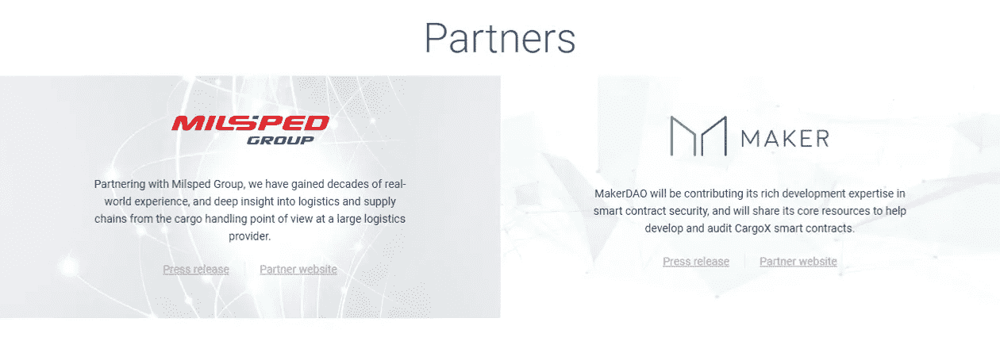

虽然他们还没有发布他们的工作产品，但是他们目前已经有两个合作伙伴，Milsped 是一家领先的运输公司，MakerDao 是以太坊开发者社区中一个受人尊敬的团队。

合作伙伴是将使用其服务的企业。他们目前提供早期合作伙伴优势，如 1000 份免费提单、定制功能和优先级的可能性等

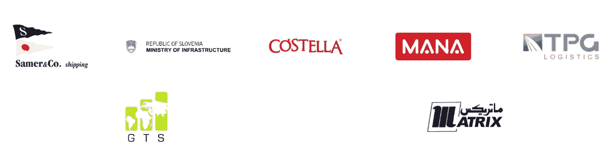

该项目也有支持者，他们正在考虑与他们签约。对于他们来说，CargoX 为他们提供免费咨询，并让他们了解区块链技术的实际测试和工作情况。如果支持者决定开始使用 CargoX 智能提单，他们也将获得优先登机权。

他们已经有了相当多的支持者，包括一些重要的名字，如 Samera 和 Co，Solvenia 共和国(基础设施部)——潜在的政府合作伙伴！、马纳和 TPG。

许多较大的公司可能需要工作证词，然后才能跳到一项新技术上，所以我怀疑，一旦 CargoX 在第三季度推出其实时产品，并开始获得更多的合作伙伴，斯洛文尼亚政府和大公司可能会跳出来，那时该项目将真正获得大量的牵引力。

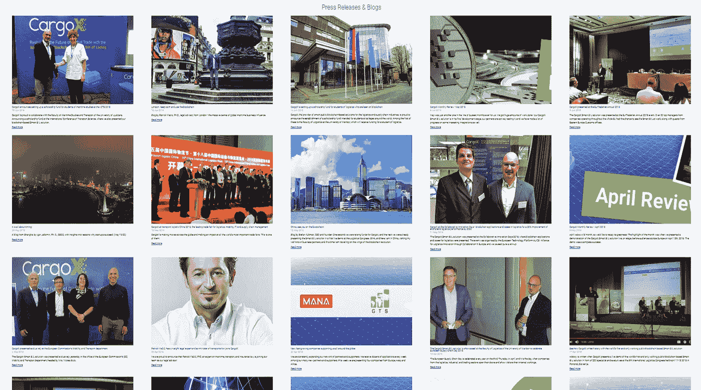

如果你去他们的网站，看看他们的博客，这个团队在建立合作关系和推广他们的产品方面非常积极。他们最近在 2018 年欧洲贸易网、中国运输物流、2018 年合作创新日(由 ALICE(欧洲合作物流创新联盟)等组织)上展示了这些产品。我想在这里指出的是，他们所有的营销都是针对现实世界的物流研讨会和活动。没有一个是在像 concensus 这样的区块链活动上。这就是为什么这个项目是如此未知的加密投资者在这一点上。

但我相信很快有一天，一旦他们有了一个工作产品，并吸引了大的合作伙伴，如斯洛文尼亚政府，这一切都将改变，密码世界将被这个隐藏的宝石吹走。到那时，它很可能会迅速急剧上升。这是一个基本面非常好，但目前被严重低估的项目。

# 组

这是项目背后的团队。这是一个很好的团队，拥有丰富的经验和成功，在业务和技术方面都很平衡。

他们的首席执行官和创始人是斯蒂芬·库克曼，他也是 45HC 的首席执行官。他曾与最大的物流供应商之一 Kuehne-Nagel 合作，在产品推广和市场研究方面有很强的背景。

他们的首席运营官是 Igor Jakomin，他在运输、物流和航运业有 20 多年的经验。他曾担任斯洛文尼亚共和国交通部国务秘书，曾在多所大学担任有运输和物流博士学位的经验丰富的讲师和助理教授，还曾担任萨梅尔全球物流公司的董事总经理，以及科佩尔港和 BTC 码头的监事会成员。

你可以在自己的时间里浏览剩下的简历，但这是一个激发信心的重量级团队。

# 路标

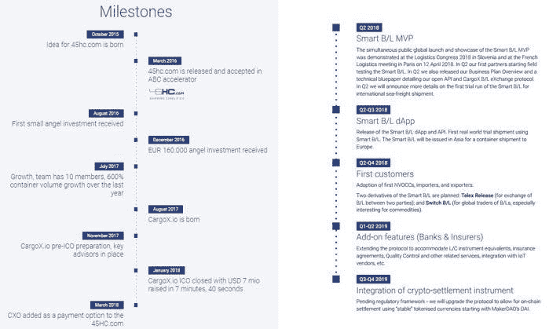

他们有两个版本的路线图。左边的第一个是他们网站上的，实际上已经过时了，3 个月前就结束了。他们需要更新它。

他们的技术论文中有一个更长的路线图，将持续到 2019 年第四季度末。在发布智能提货单 MVP(最小可行产品)并等待 Dapp 和首批客户推出之后，我们正处于该路线图的开端。

他们希望明年包括的其他长期功能包括扩展协议以适应保险、质量控制、与物联网(IOT)供应商的集成(主要像我们之前谈论的集装箱中的传感器)等。所以这个项目还有很大的发展空间。

# 结论

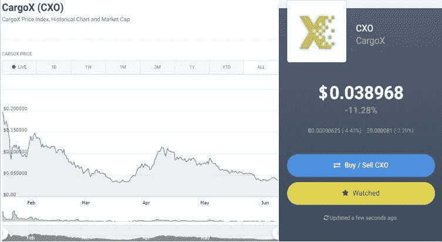

最后，我想以象征性的价格来结束这篇文章，因为我觉得它处于一个非常不寻常的位置。如果你从图表中看到，自 1 月下旬推出以来，代币价格遭受了真正的打击。

在它进入交易所后的最高点，它达到了 0.23 美元，目前它位于 0.038 美元。下降了 85%。这不是因为这个项目，这是因为普遍的市场崩溃。加密市场的特点是比特币的统治地位。比特币是目前市场上最大的硬币。当市场好的时候，人们更愿意冒险，他们会投资像 CargoX 这样的替代货币。但当市场不好，人们希望安全时，他们会像 CargoX 一样从 altcoins 中取出钱，放回比特币中。因此，在过去几个月的熊市中，我们看到比特币的主导地位普遍上升，所有替代币都受到影响，替代币越小，影响越大，因为人们对它们的信心会越来越少。

CargoX 甚至处于 ICO 阶段，它的上限很低，只有 700 万美元(正常的 ICO 是 3000-4000 万美元)。因此，即使在推出时，它也在 marketcap，这通常会使它成为一个很好的投资机会，但它最终却因此受到了无意的惩罚，并随着投资者转向比特币而被进一步推低。至少我认为是这样的。

现在，我认为我们正处于一个有趣的位置，市场可能接近它的最低点(我希望如此)，但该项目已经有了一个最低限度的工作产品，并即将推出他们的生活产品。他们在试点测试中有合作伙伴，并且很快会有真正的客户/合作伙伴，包括大企业和表示对该项目感兴趣的斯洛文尼亚政府。一旦产品在下一季度寿终正寝，代币燃烧将会开始，通货膨胀将会。他们现在也非常关注运输合作伙伴关系，还没有开始向加密社区营销，但我认为在未来 6 个月内会有所改变。最后，随着每次市场崩盘，当市场回升时，投资者会变得更加明智，越来越多的投资者开始寻找基本面良好的项目，而不是他们一直在做的 FOMO，你可以从最近的会议和论坛中看到这一点。加密投资者不再问“月亮什么时候出现”或“兰博什么时候出现”，他们开始问技术、象征性经济等问题..即使在 1 年之内，你也可以看到投资人的整体成熟度和教育程度明显上升。对于一个着眼于基本面良好的项目的投资者来说，CargoX 可能会遇到很多潜力。这是一个值得关注的项目。

以上是我对 CargoX 的一些想法。这些都不是专业建议，都是我个人的看法和想法。总是自己做研究，自己做决定。

请在下面的评论中告诉我们您对 CargoX 的看法，您的评论也将有助于其他人形成对这个项目的看法。

如果你觉得这篇文章有帮助，就鼓掌吧，这样其他人也能发现它。无论你在哪里，祝你的周末有个好的开始，我会很快再见到你的！