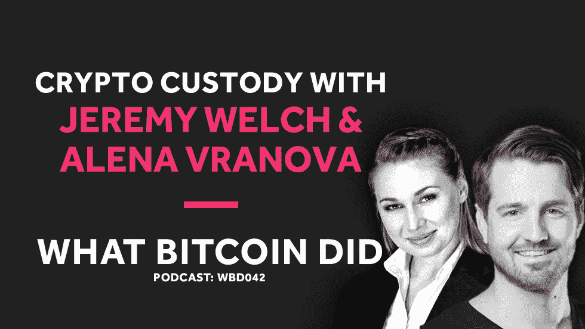

# Casa 的杰里米·韦尔奇和阿莱娜·弗拉诺瓦在秘密拘留

> 原文：<https://medium.com/hackernoon/casas-jeremy-welch-and-alena-vranova-on-crypto-custody-aa458c4094fe>

## 音频采访转录— WBD042

***注:*** *以下是我采访来自 Casa 的 Jeremy Welch & Alenda Vranova 的笔录。我从翻译中使用 Rev.com，他们删除了嗯，错误和半句。我已经检查了转录，但如果您发现任何错误，请随时发送* [*邮件给我*](http://hello@whatbitcoindid.com) *。可以* [*在这里*](https://www.whatbitcoindid.com/podcast/casas-jeremy-welch-and-alena-vranova-on-crypto-custody) *听原声录音。*

*你可以在这里订阅播客* [*听所有剧集*](https://www.whatbitcoindid.com/podcast/) *。*

在这一集里，我和来自 Casa 的 Jeremy Welch 和 Alena Vranova 谈论了关于加密拘留的问题。我们讨论了 Casa 密钥管理解决方案的工作原理、他们组建的全明星团队以及设计人们喜爱的产品。

联系比特币做了什么:
听:[**iTunes**](https://itunes.apple.com/gb/podcast/what-bitcoin-did-podcast-bitcoin-crypto-trading-strategy/id1317356120?mt=2)|[**Spotify**](https://open.spotify.com/show/0mWUJuONiilW5JSBBFZ0s7?si=5qcbjpjYSRyKpi8wycEZUw)|[**Stitcher**](https://www.stitcher.com/podcast/what-bitcoin-did)|[**SoundCloud**|](https://soundcloud.com/what-bitcoin-did)[**YouTube**](https://www.youtube.com/whatbitcoindid)|[**TuneIn**](https://tunein.com/radio/What-Bitcoin-Did-p1079869/)关注: [**网站**](https://www.whatbitcoindid.com/)

# **采访记录**

**面试日期:2018 年 10 月 27 日星期六**

> **“比特币确实形成了主导地位，它具有最大的散列力，就设计、去中心化或政府或企业行为者控制它的能力而言，它是一种货币，它是最强大的，因此一切都取决于比特币的生存。”**
> 
> **—杰里米·韦尔奇**

**[**彼得·麦科马克**](https://twitter.com/PeterMcCormack) **:** 你好，杰里米。嗨，阿丽娜。你们俩好吗？**

**[**杰里米韦尔奇**](https://twitter.com/jeremyrwelch) **:** 做得不错。**

**[**阿列娜·弗拉诺娃**](https://twitter.com/AlenaSatoshi) **:** 早上好(笑)。**

**[**彼得·麦科马克**](https://twitter.com/PeterMcCormack) **:** 下午好。所以，我要从一个有点尴尬的承认开始。我从来没有真正想过卡萨的名字是什么，上周我在看电影，一位女士带了一位绅士进屋，她说，“欢迎来到我的卡萨。”我当时就想，哦！钥匙。卡萨是城堡的钥匙，对吗？**

**[**杰里米韦尔奇**](https://twitter.com/jeremyrwelch) **:** 耶，耶(笑)。**

******:**(笑)****

****[**杰里米韦尔奇**](https://twitter.com/jeremyrwelch) **:** 好了。回家。****

****[**阿莲娜·弗拉诺娃**](https://twitter.com/AlenaSatoshi) **:** 那是城堡，你放着你珍贵的东西。你珍视的一切都在你的家里。这是你的，这是你赖以建立的基础。所以这就是卡萨，是啊(笑)。****

****[**杰瑞米韦尔奇**](https://twitter.com/jeremyrwelch) **:** 它也有一些绕意，计算的历史。Home 一直是你的 home 文件夹或者 home 键。它总是围绕着个人计算。****

****[**彼得·麦科马克**](https://twitter.com/PeterMcCormack) **:** 好的。****

****[**杰里米韦尔奇**](https://twitter.com/jeremyrwelch) **:** 所以那也是故意的。****

****[**彼得·麦科马克**](https://twitter.com/PeterMcCormack) **:** 还有，阿莱纳、杰里米和我都喜欢同样形式的硬核重金属。****

****[**韦尔奇**](https://twitter.com/jeremyrwelch) **:** (笑)****

****[**彼得·麦科马克**](https://twitter.com/PeterMcCormack) **:** 我不知道你，有没有类似的兴趣。****

********:**啊，好吧，我 15、16 岁的时候经常听很多朋克和朋克摇滚，甚至把头发剪成野生的(笑)并染成绿色，所以(笑)，是的，我想，我们可以，我们可以分享这个。我们可以对着一些音乐来个头撞(笑)。******

****[**杰里米韦尔奇**](https://twitter.com/jeremyrwelch) **:** 好听(笑)。****

****[**彼得·麦科马克**](https://twitter.com/PeterMcCormack) **:** 对。总之，听着，谢谢你们俩的到来。这是非常好的时机。显然，上周我邀请了詹姆森来谈论隐私和安全问题。我对 Casa 很感兴趣。到目前为止，你的声誉似乎不错。****

****彼得·麦科马克 **:** 我通常不做起源故事，因为它们通常已经做过了，但实际上，我不太了解你们的背景。所以，我会从你开始，阿丽娜，因为我最近才第一次意识到你。显然，我对比特币世界还很陌生。我不知道你在特雷索的背景。所以，如果你能给我简单介绍一下你的背景，然后杰里米，如果你能做同样的事情。****

********:**确定。******

****[**阿列娜·弗拉诺娃**](https://twitter.com/AlenaSatoshi) **:** 好的。我是一名商业开发人员。我喜欢把公司从零带到盈利，这也是我在比特币之前的十年里，在传统金融，保险和风险管理的超级无聊的环境中所做的事情。****

********:**然后，我在 2010 年发现了比特币，当时我正在写一篇关于国际货币体系以及为什么它不起作用(笑)，以及为什么它注定要失败的论文。我一直在寻找替代品，在那里我发现了比特币，然后在 2013 年，我与马雷克和帕沃尔共同创立了 SatoshiLabs，目的是创造第一个硬件钱包 Trezor。******

****[**阿莲娜·弗拉诺娃**](https://twitter.com/AlenaSatoshi) **:** 而且你知道后来的故事。2017 年，去年，我基本上离开了首席执行官的职位，今年，我与杰里米联手，建立了卡萨(笑)，城堡(笑)。****

****[**杰里米韦尔奇**](https://twitter.com/jeremyrwelch) **:** (笑)是啊。就是这样，太神奇了。这是一个非常，非常快，非常短的窗口，我们都在一起工作，我们中的许多人，甚至詹姆森。我认为，出于这种共同的使命和共同的意义，以及我们对这个世界应该走向的看法，我们已经非常、非常迅速地联系起来，所以，我们非常幸运。****

********:**妙极了。杰瑞米，小屋的想法是从哪里来的？******

****[**杰里米·韦尔奇**](https://twitter.com/jeremyrwelch) **:** 所以，已经过了，已经过了一段时间了。我的背景是，我在美国东南部长大。我去杜克大学学习政治哲学，然后退学，很早就加入了一家初创公司，实际上是在广告领域。我们卖掉了它，我们很快发展了这家公司，并把它卖给了谷歌，我在谷歌工作了一段时间。****

****[**杰里米·韦尔奇**](https://twitter.com/jeremyrwelch) **:** 在这个过程中，我学到了很多基于广告的互联网的运作方式。看到这一切，看到有多少数据被跟踪，一切都令人不安。我的意思是，以我的背景和兴趣，这并不是什么值得一看的东西。****

****就这样，我离开了，回到杜克大学完成了我的学业，大约在那个时候，我对资本主义的本质这个问题特别感兴趣，当时我又在学习政治哲学。然后，我发现了比特币。这是 2013 年，2014 年的某个时候，大约在那之前。****

****[**杰里米韦尔奇**](https://twitter.com/jeremyrwelch) **:** 于是，我当时做了几个与比特币相关的独立研究。我们开了一个小小的比特币会议。那是我真正深入其中的时候，对它有了更好的理解。****

****[**Jeremy Welch**](https://twitter.com/jeremyrwelch)**:**这是很多偶然的事情，Matt Corallo 当时是核心开发者之一，在北卡罗来纳大学，所以我们一起做了一个活动。但在那之后，我有点退缩了。我离开了那个世界，在那个世界里我不是很公开，试图做一两个其他的创业公司，其中一个在去年，我们实际上在做一个家庭共享领域的应用程序，有早期的用户，有早期的牵引力，但很快意识到去年，我遇到了，我遇到了那个叫 Blockstack 的项目的人。****

********:**他们正在建立一个分散的 DNS。没有多少人知道这一点，但它是为数不多的几个已经生产和工作多年的项目之一。我的意思是你在谈论两到三年的分散式 DNS 系统的工作。******

****彼得·麦科马克:实际上，我已经把它安装在我的电脑上了。****

****[**杰里米韦尔奇**](https://twitter.com/jeremyrwelch) **:** 耶(笑)？是啊。很好。因此，结果是，我们开始将我们的应用程序转变为基于 Blockstack 的应用程序，并了解更加分散的架构。我们远离 ICOs，我们从未考虑为此做任何事情，但在尝试构建 Blockstack 的过程中，我们很快就看到了堆栈的未来。****

****[**Jeremy Welch**](https://twitter.com/jeremyrwelch)**:**我自己的团队非常清楚，应用程序堆栈、这种新的应用程序堆栈、这种编写应用程序的新方法中缺少一些重要部分。最大的挑战之一是密钥管理。没有密钥管理，没有改进的密钥管理，您将什么也做不了，这个世界的承诺架构将无法工作，这个世界的好处将无法实现，并且…****

****[**Jeremy Welch**](https://twitter.com/jeremyrwelch)**:**因此，我们知道必须对其进行改进和解决，以构建更好的应用。我们还意识到，每个家庭中的节点设备是世界的发展方向，因此，通过这次经历，我们制定了一个产品计划，并开发了一条途径来构建一种完整的堆栈、应用体验并解决其中的一些问题，然后我们遇到了 Alena，并在我们开始谈论这些想法和映射该堆栈的过程中遇到了 Jameson。****

****[**杰里米·韦尔奇**](https://twitter.com/jeremyrwelch) **:** 这是一次语速很快的谈话。就像，“是的，这个，好吧，这就是它的工作原理。”“是啊，这就是它的工作原理。”"好吧，好吧，那么这意味着这个和这个，这是它应该去的地方."“哦，是的，这意味着那是，那是它应该去的地方。”这就像是一个非常非常快的过程，我们都在同一页上，都在不同的地方，我们走到一起，构建 Casa，使人们更容易构建两个应用程序，构建关键管理层，构建这种完整的堆栈体验。****

****[**彼得·麦科马克**](https://twitter.com/PeterMcCormack) **:** 而且，显然你已经拿出了闪电节点。我已经买了我的…****

****[**杰里米韦尔奇**](https://twitter.com/jeremyrwelch) **:** 牛逼。****

****彼得·麦科马克 **:** …我很想得到它。虽然我很可能，我知道我会怎么做。出于某种原因，我最终会把它送人，就像是为了升职。****

****杰瑞米·韦尔奇 **:** 好吧，那我们只好再送你一个了，如果你这样做的话。****

****彼得·麦科马克 **:** 那太好了。但是，那有点出乎意料。我没想到会这样。那是从哪里来的？这个想法是什么？****

****[**Alena Vranova**](https://twitter.com/AlenaSatoshi)**:**Jeremy 刚刚概述的故事的一部分也与硬件钱包和 Trezor 有关，因为当我们推出硬件钱包时，我们为个人解决了比特币的许多问题，例如如何保护自己免受数字风险、盗版和黑客以及第三方风险的影响。那么，在没有任何在线服务的帮助下，你怎么能保留你的比特币呢？例如交换。****

********:**但是我们也引入了新的范式，给人们带来了新的问题，那就是如何让我的恢复种子安全。好吗？那是一张 24 个字的小纸，突然之间，我想，我把它放在哪里？我应该分吗？如果我的房子被烧毁了怎么办？如果我，如果有人拍照呢？诸如此类的东西。这是一部分。******

****[**阿莱娜·弗拉诺娃**](https://twitter.com/AlenaSatoshi) **:** 第二部分是，这些人一直在请求特雷佐支持。所以这是一个大问题。我看到的另一个大问题，詹姆森也记录了这一点，就是身体攻击的增加。所以，勒索，绑架，甚至杀人，都是为了密码。****

****[因此，这基本上是迈向主权个人之旅的第一步，实现这一点，启用并使用简单的多设备、多位置、多签名设置。](https://twitter.com/AlenaSatoshi)****

********:**好的。这就是开始。现在，你需要什么才能成为完全自主的比特币创造者？你需要传递你自己的交易。好吧。这就是节点发挥作用的地方。目前，我们专注于我们的优质客户或每年支付 10，000 美元的客户。******

****[**Alena Vranova**](https://twitter.com/AlenaSatoshi)**:**但他们不只是为 multisig 应用付费。他们付钱给一个，比方说，我称之为白手套，安全门房。好吗？这是我们不提供的东西，是的，软件解决方案，但它也是一种服务。一周 7 天，一天 24 小时，专门有人打电话给你，以防你惊慌失措，丢失了你的一个分类账或你的 Trezors，你有一个人可以打电话，你有很多其他的额外津贴，我说过我们的客户节点是有意义的。****

****[是超级用户(笑)，友好。实际上，Casa 节点包含一个比特币全节点和闪电网络节点，具有自动驾驶功能。整个体验实际上就是界面，因为没有命令行。只需点击几下，你就完成了。所以，这又是我妈妈可能会用到的东西。](https://twitter.com/AlenaSatoshi)****

********:**我们决定为更广泛的市场开放它，看看，至少喜欢，只是看看兴趣，兴趣实际上是压倒性的。看起来人们真的想运行他们的节点，但是他们不知道如何运行。******

********:**我想经营自己的节点。我做到这一点的唯一方法是在我的手机上运行 ABC 核心。为什么？因为这是一个应用程序(笑)我只是点击，我点击了按钮，对不对？所以，我们做了它，它是一个完整的包，最终目标是一个独立的个体。******

****[**彼得·麦科马克**](https://twitter.com/PeterMcCormack) **:** 所以，是的，这非常有用，因为我确实尝试过，我是最不专业的人。我的背景是创造性的，我总是试图理解技术方面的东西。我试图建立一个完整的节点，但我有点迷路了，但当我看到你的产品时，我就像，太好了，是的，我想要那个。****

****Peter McCormack**:**我注意到一件事，你可能对此也有强烈的看法，Jeremy，你们似乎非常关注设计，而这个行业并不总是非常关注设计。硬件的设计，但我最近在浏览你们的网站时也注意到了，你们有检查你们 OPSEC 的程序，它设计得非常漂亮，似乎你们把设计放在了工作的最前沿。****

****[**杰里米韦尔奇**](https://twitter.com/jeremyrwelch) **:** 是的。绝对的。****

****[**彼得·麦科马克**](https://twitter.com/PeterMcCormack) **:** 是因为你的广告背景吗？****

****[**杰里米韦尔奇**](https://twitter.com/jeremyrwelch) **:** 没有(笑。我几乎可以说，很多广告行业更多的是关于一些影响活动的有效性。再说一次，我学的是哲学，我对控制论感兴趣，我确实有设计头脑。阿丽娜也是。我们很幸运，我们团队中的许多人有很强的鉴赏力和头脑，当他们看到一些东西时，他们肯定理解它，他们知道哪里需要更多的设计或更多的设计思维和设计原则。****

****杰里米·韦尔奇(Jeremy Welch)**:**但这一切都归功于斯科特·胡夫。他是我们的设计主管。他是世界上最好的设计师之一。我们很幸运。我认识他已经有十多年了，让他加入我们的团队是一条很长很长的路。他加入了，在此之前他是 Tinder 团队的一员，他围绕超级喜欢重新设计了整个应用程序，他并不经常公开讨论这一点，但这已经成为他们最大的功能之一和最大的收入来源。****

****[**杰瑞米·韦尔奇**](https://twitter.com/jeremyrwelch) **:** 他为一系列公司和创业公司做设计，作为其中的一部分，他写了一本书，叫做《设计人们喜爱的产品》，这是一本威利的书。这是一本畅销书。非凡的书。但是，仅仅是这句话，“设计人们喜欢的产品”，我认为，抓住了他的观点，它不仅仅是解决一个问题，它不仅仅是一个最低限度的可行产品，它必须是一种体验，它必须是人们喜欢的东西，他们对它有情感，他们与之联系。对吗？****

****[**杰里米·韦尔奇**](https://twitter.com/jeremyrwelch) **:** 他对加密领域完全是个新手。所以，我认为这是有利的，让一个有新鲜眼光的人进来，看看关键管理，看看种子短语，看看，管理 multisig，看看我们到底如何，我们到底如何(笑)让人们变得简单，这是一个真正的挑战，但他做了一个令人难以置信的工作，学习非常快，调整事情。****

****[**Jeremy Welch**](https://twitter.com/jeremyrwelch)**:**我们还没有分享太多关于 Casa node 的体验，但是我们已经，你会看到。这是一种体验。拆箱，就像，设置过程，整个事情，它是美丽的。这是一个很好的体验，但也非常有用。而且，这是一些事情，因为，当这些都在一起时，就有了拥有自己的节点的强大安全理由。我们也看到了运行自己的节点的强大的设计经验的原因。****

****[**杰瑞米·韦尔奇**](https://twitter.com/jeremyrwelch) **:** 实际上，我们创建的第一个节点是在去年，就在我们实际进行密钥管理之前，运行一个节点或创建一个节点是我们真正理解密钥管理问题深度的动力或来源，因为我们意识到，要运行和构建一个良好的移动体验，这是一个去中心化的应用程序，或者是一个在本地运行的应用程序，或者像比特币那样运行，你必须运行某种本地节点。你不想一直连接到外部服务器。****

****[**杰瑞米·韦尔奇**](https://twitter.com/jeremyrwelch) **:** 事实上，几个不同的应用程序，如果它们运行在你的手机上或你的桌面上，它们实际上在你的电脑或手机的后台运行服务器。这是不可扩展的。那是行不通的。这意味着，如果你使用以这种方式设计的多种类型的应用程序，它们都将运行服务器。这会让你的电脑超负荷，会变得一团糟。****

****[**Jeremy Welch**](https://twitter.com/jeremyrwelch)**:**但是我们很快想到，好吧，如果我们在考虑应用程序，我们在考虑运行这些不同的服务器，我们在运行比特币，我们在运行 Lightning，我们在运行 Blockstack，我们在运行我们试图运行的任何其他服务器，那么我们为什么不将它们集中在一台设备上呢？****

****[**Jeremy Welch**](https://twitter.com/jeremyrwelch)**:**如果我们有一个设备，我们把它放在那里只是为了比特币，那么我们可以在那个设备上放更多。我们可以考虑将应用程序连接到其中的其他方法。然后如果你在你的家庭网络上，如果你看一下，有趣的是，一天中有多少时间你是在家里还是在办公室？****

********:**对于大多数人来说，他们一天的大部分时间都是在一个网络上度过的。人们会想，哦，哦，天哪，如果我在旅行，我该如何连接到我的家庭节点呢？这实际上比大多数人意识到的问题要小得多。******

****[**杰里米·韦尔奇**](https://twitter.com/jeremyrwelch) **:** 所以，我们想要创造的是这种理想的体验，设计这种理想的体验，以及构建更好的应用程序的途径，当你在这些占主导地位的家庭网络上时，你可以有这些体验，然后，但是其中的安全漏洞，对，这是一个邪恶的女仆攻击。****

****[**杰瑞米韦尔奇**](https://twitter.com/jeremyrwelch) **:** 当你不在的时候，邪恶的女仆袭击，有人可以走进来，只要抢了装置就走出来。因此，路径或解决方案是有更好的密钥管理和加密设备的能力，这种能力，所以你使用的密钥，你使用 Casa 应用程序管理的密钥，将使你能够加密你的设备上运行的数据，这些数据通过云备份，有很多。****

****[**Jeremy Welch**](https://twitter.com/jeremyrwelch)**:**所以，其中的一些东西，这个，这个最早的版本，这个，这个有闪电和比特币的 Casa 节点，我们已经实现了很多。我们还会添加更多内容，但随着时间的推移，这真的会是一次升级的体验。****

****[**彼得·麦科马克**](https://twitter.com/PeterMcCormack) **:** 你真的住在密钥管理解决方案吗？你有客户积极使用它吗？****

****[**杰里米韦尔奇**](https://twitter.com/jeremyrwelch) **:** 是的。许多高端客户，五分之三，也就是说，大部分是比特币，我们确实有以太坊支持，但这是一个轻微的以太坊支持。我们也开始了其他一些货币的工作。****

****[**彼得·麦科马克**](https://twitter.com/PeterMcCormack) **:** 所以，以太坊目前是单键支持的，对吧？****

****[**杰里米韦尔奇**](https://twitter.com/jeremyrwelch) **:** 正确。****

****[**彼得·麦科马克**](https://twitter.com/PeterMcCormack) **:** 因为，我见过你，你对以太坊社区发出了某种吸引力。****

****[**韦尔奇**](https://twitter.com/jeremyrwelch) **:** 没错。所以，以太坊上的 multisig 是不安全的。它没有内置到核心协议或核心 EDM 中。它实际上是一个智能合同。这是有问题的。这是一个非常核心的功能，我们向社区发出了呼吁，试图从安全的角度解释，同样，客户来找我们的原因主要是安全。****

****[**Jeremy Welch**](https://twitter.com/jeremyrwelch)**:**因此，当客户向我们询问 multisig、节点时，我们的建议是围绕安全性。我们称之为，我们称之为 Casa 财富安全服务或主权财富安全。因此，当我们寻找其他解决方案时，我们不是一个交易界面。我们是一个长期的 hodl，安全接口和安全服务，所以当我们看着以太坊和我们，我们看着其他硬币，我们的评估不仅基于，嘿，我们的客户是否要求这样做，而且还基于，详细的安全模型是什么，围绕这个协议的边界是什么，这里的攻击媒介是什么，我们的客户在哪里有潜在的风险，如果我们需要，或者鼓励工程师们这样做，我们如何以更好的方式构建它。****

****[**杰里米韦尔奇**](https://twitter.com/jeremyrwelch) **:** 这只是我们很快发现差距的一个领域。我们看到了奇偶校验攻击，但这并不是真正的攻击。实际上，早期工程师中的某个孩子(笑)正在四处测试，他正在测试奇偶校验 multisig 钱包中的许多命令，他碰巧为一份合同发送了一种 kill 命令，该合同最终获得了超过 1 亿美元的保护。****

****杰里米·韦尔奇 **:** 所以，这完全是一场混乱。不是黑客干的。这是某个内部的人，但是以太坊社区决定，在之前，在 DAO 中，他们做了一个硬分叉。对于这种特殊情况，他们决定不使用 fork。那笔钱仍然被冻结着。那笔钱是拿不到的。平价的，名声已经毁了。****

****杰里米·韦尔奇 **:** 而这一切都来自这些多重合同中的一份。就像 multisig 合同逻辑是完全合理的，但它是一个缺陷，谁可以访问它，这是一个问题，但它只是证明了或它提出了一个事实，即对于以太坊社区来说，他们可能不会，他们可能不会保释你出来，即使你的智能合同工作，如果有一个 bug 或其他一些问题，他们可能没有动力做出任何改变。****

****[**杰里米韦尔奇**](https://twitter.com/jeremyrwelch) **:** 我们认为这是有问题的，对吗？因为它可能是由社区中的其他人引入的导致它的错误。肯定是有问题的。因此，我们决定暂时只支持单键，然后尝试与社区中的一些人合作，推动对 multisig 的更好支持。****

****[**Peter McCormack**](https://twitter.com/PeterMcCormack)**:**你向以太坊社区发出呼吁后，他们有什么反应吗？****

********:**耶。我们已经和几个人谈过了，也和几个不同的、多份合同的主要创建者谈过了，现在有一个运动要验证其中一份合同，并推动它成为一种选定的合同。******

****[**杰里米韦尔奇**](https://twitter.com/jeremyrwelch) **:** 再说吧。他们的社区通常支持任何一件事情的多种实现，尽管对于某些应用和某些协议的某些部分来说，这很好。对于多重签名和密钥管理，这是行不通的，而且会导致不安全。所以，我们是支持的，我们会尽力提供帮助，但这需要一个过程。****

********:**不，我们不是。只是，只是以太坊。所以，我们从比特币开始。我们都是比特币爱好者，当我们第一次走过球场和产品时，我们交谈的大多数早期客户都是比特币。******

****[**Jeremy Welch**](https://twitter.com/jeremyrwelch)**:**随后，我们发现，在我们拥有的大量等待名单中，大多数人都有比特币，所以大约 85，90%是比特币。大约 70 %, 65 %, 70 %,来点以太坊吧。持有量不是很大，但肯定有一些。****

****[**杰里米·韦尔奇**](https://twitter.com/jeremyrwelch) **:** 我们处理事情的方式是，我认为商业模式非常重要，我们围绕这种商业模式进行调整，所以你每年支付固定费用，我们将提供服务，如果你作为客户支付特定货币或你有一种货币，我们将努力支持这种货币，因为你是付费客户，你不支付我们，我们就不赚钱很简单，你想保护什么东西，你付钱给我们，让我们帮你提供建议和支持来保护它，并为你提供软件来保护它。****

****[**彼得·麦科马克**](https://twitter.com/PeterMcCormack) **:** 对。因此，我已经看了你将来可能支持的硬币，ERC-20，ERC-721，莱特币，ZCash，Monero，等等，这很酷，但是，因此，你对代币和硬币的意见采取完全公正的立场，你只是支持客户的需求吗？****

****[**韦尔奇**](https://twitter.com/jeremyrwelch) **:** 不完全公正。我们有一个原则，我们在团队中有一系列原则，其中之一就是我们所说的比特币优先。这不是纯粹的比特币最大化主义(笑)，但它可能很接近，但(笑)它更像是我们所说的比特币，我认为这是健康的前景。****

****[**杰里米韦尔奇**](https://twitter.com/jeremyrwelch) **:** 对我们来说很明显，如果比特币消失了，或者比特币出现了问题，那么其他一切都将消失。其他一切都会受到攻击。这，这将是一个烂摊子。因此，比特币确实形成了主导地位。它有最大的散列能力。就货币的设计和去中心化，以及政府、企业或外界任何人控制货币的能力而言，它是最强大的。****

****[**杰里米韦尔奇**](https://twitter.com/jeremyrwelch) **:** 而且，从那个位置上来说，一切都依赖于比特币生存。因此，我们首先围绕比特币定位，能够引领我们前进的方向和我们设计的方向，我们将支持其他货币，我们将支持其他系统，我们将支持其他应用程序，我们将在比特币的基础上构建应用程序，但这里的想法是，比特币是这个关键，我们必须优先考虑这一点。****

****[**彼得·麦科马克**](https://twitter.com/PeterMcCormack) **:** 你与那里的其他代币或其他硬币有什么原则？例如，比特币基地有其特定的结构和规则集，它们基于这些结构和规则集来决定是否列出令牌。你对团队、代币、发行有什么评价来帮助你做决定吗？****

****[**杰里米韦尔奇**](https://twitter.com/jeremyrwelch) **:** 我们不会考虑太多，再说一次，这只是涉及到客户。我的意思是，围绕付费客户的好处是，如果客户付费并愿意付费，那么我们很乐意添加它。****

****[**杰里米·韦尔奇**](https://twitter.com/jeremyrwelch) **:** 现在，首要关注的只是安全问题。我们能为你提供足够的保护吗？这会给你的生活带来更多的安全感，还是带来更多的安全风险？因此，我们确实会考虑协议和货币的安全性，我们会仔细考虑，有时会提供建议，有时只是实施，但在这种情况下，或者在许多情况下，我们通常会提供一些建议。****

****[**Peter McCormack**](https://twitter.com/PeterMcCormack)**:**几年前，我曾经有过一个网站开发业务，那是一个非常简单的网站，这些客户网站，如果我们没有做一个网站直播或改变直播，我会在周五晚上感到恐慌，这可能是某种错误或某种问题，我会在周末接到电话。你已经实现了一个密钥管理解决方案，它将保护数百万美元的密码。杰里米，是什么让你夜不能寐？****

****[**杰里米·韦尔奇**](https://twitter.com/jeremyrwelch) **:** 我认为这就是我们客户的安全问题。我认为，从工程的角度来看，我们有非常强大的流程，我们有非常强大的测试，我们对后端和应用程序进行了广泛的测试。****

****[**杰里米韦尔奇**](https://twitter.com/jeremyrwelch) **:** 很多人没有意识到这一点，但即使在应用中，我们也有效地将自己排除在等式之外。因此，我们重新验证，我们在应用程序和服务器上重新获取您的地址，我们相互验证这些地址。我们从工程和安全角度出发，反对整个系统，同时也考虑体验设计，对吗？****

****[**杰里米·韦尔奇**](https://twitter.com/jeremyrwelch) **:** 因此，我认为让我夜不能寐的更多的不是眼前的事情，是的，我们在这里设计了许多眼前的东西，而是我们正在建设的更全面的画面。而且，仍然有许多大的设计问题需要解决。****

****[**Jeremy Welch**](https://twitter.com/jeremyrwelch)**:**要让任何人都可以运行自己的节点，还有很多工作要做，我们已经取得了巨大的进步，团队也做了非凡的工作，我们拥有这个领域中最好的团队，在各个方面都是如此。从工程和运营，客户服务和设计，这是不真实的。团队不真实。****

****[**杰里米·韦尔奇**](https://twitter.com/jeremyrwelch) **:** 让我夜不能寐的是我们有这个使命，我们的客户非常热情，需要服务。我们今天的产品正在解决这一需求，并且做得很好，安全架构很重要，设计和安全架构意味着我们在不利方面有一定的保护，但我认为让我晚上睡不着觉的更大的事情是接下来会发生什么。****

********:**安全是一个移动的目标。它并不总是，就像你不能只是设置，设置，然后忘记它。因此，我想了很多，并与团队合作了很多，接下来会发生什么，安全清单是扩大我们的区域、扩大我们的影响和帮助每个人的例子之一，但建立解决方案将随着时间的推移继续帮助人们保护安全，这是一个旅程。这需要时间，来真正改善和帮助人们。******

****[**彼得·麦科马克**](https://twitter.com/PeterMcCormack) **:** 那么，我们来谈一谈产品吧。从我的播客来看，我总是倾向于为不理解事物的人从事物简单的一面着手。所以，我从来没有和 multisig 钱包互动过。****

****[**杰里米韦尔奇**](https://twitter.com/jeremyrwelch) **:** 耶。****

****[**彼得·麦科马克**](https://twitter.com/PeterMcCormack) **:** 没事吧？一次都没做过。我不知道它是如何工作的。我无法想象使用 multisig 钱包的过程。那么，你能告诉我 multisig 是如何工作的吗？如果我使用 Casa，我将如何与 multisig 钱包进行交互？****

****[**阿莱娜·弗拉诺娃**](https://twitter.com/AlenaSatoshi) **:** 想象一个 multisig，很简单。就像，当你有一个银行账户，你需要更多的签名来转移资金，同样的事情也会发生在 multisig。所以，你有一个你需要的定义好的签名集，你需要使用这些签名来转移资金。****

****[它基本上是帮助你从糟糕的情况中恢复过来。](https://twitter.com/AlenaSatoshi)****

********:**所以基本上，为了转移资金，你在手机上发起交易，这是一个关键，然后你去，例如，你的律师，因为他有你的一个硬件钱包，你去你的办公室，因为还有你的另一个硬件钱包。******

****[**Alena Vranova**](https://twitter.com/AlenaSatoshi)**:**这里的想法是以这样一种方式分发密钥，即使物理攻击者非常昂贵地试图勒索你，好吗？因此，如果有人用枪指着你的头，说，“阿丽娜，把你的比特币给我，”我说，“是的，我很乐意，但我需要见我的律师，我需要见我的办公室，”那么假设攻击者会相当沮丧，这样做。****

****[**Alena Vranova**](https://twitter.com/AlenaSatoshi)**:**现在，硬件钱包在哪里取决于每个客户。我们不会给出任何精确的建议，因为我不认为这是一个好的安全措施，实际上是在哪里放置这些硬件钱包的一些规定，但这基本上是它如何工作的原则。****

****[**彼得·麦科马克**](https://twitter.com/PeterMcCormack) **:** 对。那么，那里还存在潜在的安全漏洞吗？所以，如果我有一个手机和一个硬件钱包，这基本上是一个场景，我可以经常把我的两个钥匙放在一起？****

****[**杰瑞米韦尔奇**](https://twitter.com/jeremyrwelch) **:** 对，没关系。所以，原则是你永远不要在一个地方放两把以上的钥匙。签署和执行一个交易总共需要三个密钥，因此您永远不希望在一个位置有两个以上的密钥。****

****[**Jeremy Welch**](https://twitter.com/jeremyrwelch)**:**但是如果客户在一个地方放三个，那么是的，他们有风险，所以我们强烈建议不要这样做。我们提供基本的指导方针，家庭保险箱，办公室保险箱，使用银行保险箱。客户的每个设置都是独一无二的，他们已经与其他家庭成员或同事或他们生活中的任何人交谈过，multisig 的另一个有趣之处是，您实际上可以让更多人参与进来。****

********:**允许配偶或兄弟或其他家庭成员或律师拥有部分或全部种子短语，那么他们就有可能控制那些资金。******

****[**杰里米韦尔奇**](https://twitter.com/jeremyrwelch) **:** 这并不总是一个信任的问题，他们可能会接受这一点。这实际上使他们面临同样被攻击的安全风险。所以，把钥匙分散在多个地方，有时是另一个人，有时是另一家银行，但设置总是独一无二的。****

****[**Jeremy Welch**](https://twitter.com/jeremyrwelch)**:**我们确实强调我们客户的主权和责任，我们围绕这一点进行设计，但我们也考虑终身关系，并提供支持，如果他们，有时是我们的客户，在加入基金之前经历了大量测试，这意味着有时他们实际上改变了位置。他们从一组位置开始，进行测试，然后换到另一组位置。****

****[**杰里米·韦尔奇**](https://twitter.com/jeremyrwelch) **:** 但最终，还是要回到你的问题上来，它是如何为你工作的，multisig，你在手机上有一个应用程序，手机可以很容易地使用 key shield 查看五个键。其中一个键出现故障，或者你有一段时间没有使用它，或者你有一段时间没有测试它，那么它会被标记出来，你需要去检查那个键，定期维护是 multisig 经常进行的一部分，大约一年一次，以确保一切正常。****

****[**Jeremy Welch**](https://twitter.com/jeremyrwelch)**:**所以，我们这样做了，但是你可以使用应用程序来聚合和签署多个签名，这是完全异步的。你可以在某一天签署一个签名，然后去办公室或另一个城市，在那里你有另一把钥匙，然后在两天后签署，我们希望你构建那个交易，然后最终广播它。****

********:**耶。我只想补充一点，Casa 的关键特性之一是我们完全取消了恢复种子，这意味着您有五个密钥、四个或三个硬件钱包，但您没有要保护的恢复种子，这是一个非常棒的设置。******

****[**Alena Vranova**](https://twitter.com/AlenaSatoshi)**:**所以，我们一直在思考如何让它真的(笑)更安全而不是更不安全，这就是我们的操作方式。因此，我们的客户不会存储恢复种子，以防他们丢失一个硬件钱包。我们只是简单地帮助他们，或者基本上他们可以通过 app 自己完成密钥轮换。****

****[**彼得·麦科马克**](https://twitter.com/PeterMcCormack) **:** 好的。我明白。所以在爱尔兰曾经有过这样的情况，爱尔兰银行被抢劫了，因为一家人在房子里被扣为人质。有人和这家人呆在一起，有人把银行经理带到银行让他们进去。****

****[**Peter McCormack**](https://twitter.com/PeterMcCormack)**:**所以，我想家里有两把钥匙，一把手机和一个硬件钱包，一把在办公室，我想在完全灾难的情况下，仍然存在一把枪对着脑袋的情况，“好吧，我们去办公室拿第三把钥匙。”****

****[**杰里米韦尔奇**](https://twitter.com/jeremyrwelch) **:** 没错。但是需要考虑的是，大多数攻击者并没有计划在多个地点进行攻击。所以，你已经排除了某种类型的攻击者。****

****[**杰里米韦尔奇**](https://twitter.com/jeremyrwelch) **:** 还有其他一些地方，你可以向某人发出信号，你可以发出求救信号。关键是延长时间，延长必须穿越的空间，随着时间的推移，我的意思是，这确实增加了即使他们拿走资金，那个人也会被抓住的可能性。****

****[**彼得·麦科马克**](https://twitter.com/PeterMcCormack) **:** 耶。我，所以我估计最大的风险是更多的用户正确遵循指南，执行正确的 OPSEC，不偷懒。****

****[**杰里米韦尔奇**](https://twitter.com/jeremyrwelch) **:** 是的。****

****彼得·麦考马克 **:** …在他们开始做事之前，不要把四把钥匙都放在家里一两个星期。我想这取决于使用者。****

****[**杰里米韦尔奇**](https://twitter.com/jeremyrwelch) **:** 对，对，对。这是强大服务的重要组成部分，也是我们提供安全服务的一贯重点。从某种意义上来说，只要只有你一个人在家，而且你没有真的去想它，就很容易懈怠，但是有那个人或团队定期…****

****[**Jeremy Welch**](https://twitter.com/jeremyrwelch)**:**有一点需要指出的是，我们已经做了很多工作，该产品实际上是自助式的。所以，轮流钥匙，我的意思是，你可以做任何事情，我们，你甚至有能力，如果公司明天消失了，你就可以完全使用你的资金。****

****杰里米·韦尔奇 **:** 这一点非常非常重要。即使有人切断了我们的联系，政府切断了我们的联系，或者是一个企业行为者，或者仅仅是一次 DDoS 攻击，都没有关系。你仍然可以控制你的资金，你仍然可以做任何事情，但重要的是，它很难搬起石头砸自己的脚，或者给自己制造问题，因为它的设计非常好。****

****[**杰瑞米·韦尔奇**](https://twitter.com/jeremyrwelch) **:** 所以，这是我们主要要缓解的两个攻击媒介，这些物理攻击者以及正义、愚蠢和自己犯错的问题。我们正在积极设计以防止这种情况发生。****

****[**Peter McCormack**](https://twitter.com/PeterMcCormack)**:**好的，如果公司发生了一些事情，他们想继续使用这项服务，或者他们必须将资金转移到一些新的东西上？****

****[**杰里米韦尔奇**](https://twitter.com/jeremyrwelch) **:** 所以这是一个时机的问题。现在，他们会改变一些东西，他们仍然能够使用软件，但他们会改变。我们的建议和我们的安全程序说，他们会把东西转移到另一个钱包或一些其他控制手段。****

****[**Jeremy Welch**](https://twitter.com/jeremyrwelch)**:**因此，即使在我们停业的情况下，他们仍然可以使用完整的服务，然后当他们重新连接到更广泛的网络或 Casa 时，如果他们的互联网中断或他们在地区范围内，有各种情况都没有关系。****

****[**Jeremy Welch**](https://twitter.com/jeremyrwelch)**:**我们甚至测试过，我们的一名工程师实际测试过一个 Casa 节点。几周前，它得到了很多转发，有趣的是，实际上，我想是在我们宣布节点的前一周，但是，我们的一名工程师实际上甚至测试了直接连接到卫星连接。因此，我们一直在测试各种方法，目标是逐渐将越来越多的这种方法转移到您自己的控制中。****

****[**彼得·麦考马克**](https://twitter.com/PeterMcCormack) **:** 是否存在这样的风险或可能性:有人可能会对你所做的事情进行去中心化的改造，从而消除你所需要的东西，还是需要一个像你一样的第三方来提供第五把钥匙？****

****[**Alena Vranova**](https://twitter.com/AlenaSatoshi)**:**是的，软件解决方案只是我们提供的所有产品中的一小部分，理解这一点很重要。我最近在看安德烈亚斯·安东诺普洛斯的一个演讲，他说了一件重要的事情，看看比特币的创造者有什么选择。****

********:**你可以完全靠自己，所以，有你的硬件钱包和保护你的东西，这就像是，一个比特币创造者的春梦，对，对，对，对，对，要完全独立，或者你可以放弃你的一切给一家比特币基地公司。好吗？所以，你可以做非此即彼。******

********:**我们正在跨越这种完全安全但也完全自主的体验。我们没有拿着你的密码，我们握着你的手，如果你想要的话。这是在太空中很难复制的东西。******

********:**你当然可以建立一个服务公司，一个礼宾服务，是的，你可以，你可以这样做，但我们有一个非常独特的团队组成，我们有(笑)共同的理念，以及软件的方法，但是，就像整个包一样，我相信在这个领域复制是非常困难的，但当然不是不可能的，而且，竞争是好的(笑)。******

****[**杰里米韦尔奇**](https://twitter.com/jeremyrwelch) **:** 所以，我们评价一下。对于我们实际发运的所有产品，我们实际发运的每件产品，我认为很多人可能还没有完全处理好，对于我们发运的每件产品，我们已经尝试了 10、15 种其他变化。我们什么都看过了。****

****[**杰瑞米·韦尔奇**](https://twitter.com/jeremyrwelch) **:** 我的意思是我们评估了密钥分裂，我们评估了完整的 multisig，我们评估了三分之二的 multisig，我们评估了六分之四的 multisig，我们评估了十分之八的 multisig。我们评估了所有这些不同的方案，只有当你真正进入产品设计过程时，我们才会想到我们所做的，斯科特自己在用户界面方面经历了每一个屏幕的四五次不同的迭代，然后才决定哪种组合最有意义。****

****[**杰里米韦尔奇**](https://twitter.com/jeremyrwelch) **:** 所以，有很多工作要做。还有一些其他途径，但我们已经达到的是这种罕见的评估几乎所有东西和节省人们时间的结合。我们的目标不是建立一个需要你经常来 Casa 的解决方案。我们的目标是人们付钱给我们是因为我们已经评估了外面的一切。****

****[**Jeremy Welch**](https://twitter.com/jeremyrwelch)**:**我们将继续在 Casa 中融入新技术。没有，将有更多的权力下放，我们将吸收到 Casa，我们将利用这一点，对不对？但是我们将首先评估它，我们将从每个角度评估它。****

********:**而且，大多数人没有时间。他们过着生活。他们有家庭，有工作，对一些人来说，测试这些安全功能很有趣，这很好，我们鼓励这样做。我们鼓励人们尽可能地独立，但这真的很难。这需要很多时间，也需要很多知识，而大多数人就是没有这些时间或知识，所以我们代表我们的客户这样做，因为我们测试了所有可能的东西，然后带给他们最好的东西。******

****[**杰里米韦尔奇**](https://twitter.com/jeremyrwelch) **:** 然后继续。这一进程将继续下去。我们还将在今年年底发布其他产品，就凝聚力体验和这种边缘安全体验而言，它不是关于任何一种技术，而是关于所有东西都非常紧密地协同工作，这也是非常非常难以实现的。****

****[**彼得·麦科马克**](https://twitter.com/PeterMcCormack) **:** 我没有足够的比特币来证明自己有资格成为 Casa 的客户，也许有一天，但我试图想象使用它，它的一个缺点是，这是故意设计的，你很难转移资金，对吗？很自然，作为一种保护方式。****

****[**彼得·麦科马克**](https://twitter.com/PeterMcCormack) **:** 所以，如果我突然想，如果我突然需要一些比特币，我必须创建交易，我必须去各个地方。就像你说的，你可能会在两天后的工作中做这件事。因此，我描绘了这样一个场景，我几乎认为我需要三个级别的账户，就像 Casa multisig 是我的金库，然后几乎需要一个储蓄账户，可能在月初，我会放入我可能需要一个月的金额，然后像一个现金账户。你认为人们会有不同的水平吗？你会用你的产品来支持吗？****

****[**杰里米·韦尔奇**](https://twitter.com/jeremyrwelch) **:** 我认为非常清楚的情况就是这样，所以我们从最难的事情开始。对吗？我们从最重要也是最难的事情开始，那就是 multisig。那就是长期冷藏，但是我们增加了单键支持，我们推出了 Casa node。****

****[这不会是你所有的钱，但会是一部分。一部分在热钱包里，一部分在节点上。](https://twitter.com/jeremyrwelch)****

****[**杰里米·韦尔奇**](https://twitter.com/jeremyrwelch) **:** 我们的目标是什么，我们正在建设什么，除此之外还有其他价位，我们将很快宣布一些东西，更多的东西，但如果你已经购买了 Casa node，你基本上已经成为 Casa 的客户了。我们不认为你买的是一次性设备，对吗？就像将会有更多的节点出现，你基本上已经进入了 Casa 体验，只是在另一个价位。****

****[**杰瑞米韦尔奇**](https://twitter.com/jeremyrwelch) **:** 于是，更多的来了。我们从这个高端市场开始，我们从五个中的三个开始，因为特别是为了解决最困难的问题之一，但是通过开发这种专业知识和我们为之构建的所有软件和界面，我们现在可以利用构建到热门钱包和构建到这些其他领域来管理您的基金的全面体验。****

****[**彼得·麦科马克**](https://twitter.com/PeterMcCormack) **:** 我有一种感觉，你在暗示一个三分之二的时代即将到来，而我可能能够负担得起。****

****[**杰里米韦尔奇**](https://twitter.com/jeremyrwelch) **:** 走着瞧。****

****[**阿莱娜·弗拉诺娃**](https://twitter.com/AlenaSatoshi) **:** 不要放弃太多(笑)。你知道，让我保持清醒的一件事是，如果我们可以触及这一点，那么实际上保留他们资金的人数，第三方服务，以及要求托管服务的人数，这是令人震惊的，因为我们在比特币中，比特币是一种点对点的私人资金，好吗？它不应该放在别人的金库里。****

****[**阿莱娜·弗拉诺瓦**](https://twitter.com/AlenaSatoshi) **:** 所以，我很高兴有比特币基地这样的服务。它们令人惊叹，因为它们使人们能够轻松访问比特币，轻松投入比特币，所以比特币基地上有 2500 万客户的消息令人惊叹。但是，你也需要明白，比特币基地拥有 2500 万人的 KYC 数据，所以，有一天，我希望不是，但可能会有一个事件，这些数据泄露，而你，突然你有 2500 万个目标。****

********:**所以，这让我保持清醒，我认为我们应该努力工作，现在就保护最隐秘的财富，但也要保护，像帮助人们理解。这就是我们从安全检查表开始的原因，让人们只需回答简单的问题，就能了解他们的安全健康状况。******

****[**阿莱娜·弗拉诺娃**](https://twitter.com/AlenaSatoshi) **:** 问题之一你如何存储你的密钥，你使用第三方服务吗？您使用第二因素认证吗？你使用密码管理器吗？诸如此类的东西。所以，试着，比如，教育人们，是的，如果你想做快速交易，这是一个很好的服务，是的，如果你想使用比特币进行小额消费，那么你使用一个热钱包，如果你想保护你的财富，这就是你要做的。****

****[**彼得·麦科马克**](https://twitter.com/PeterMcCormack) **:** 有哪些灾难场景？假设我的房子被烧了，我会丢两把钥匙。很好，因为我还有两个。我可以给你们打电话，你们已经有了。那很好。这是一个愚蠢的场景，我已经失去了三个，对不对？****

****[**杰里米·韦尔奇**](https://twitter.com/jeremyrwelch) **:** 再一次，这个系统是这样设计的，一旦你失去一个，它，一个，就像我们有各种各样的警铃，如果你把一个标记为关闭，我们就有各种各样的警铃，我们会收到通知，我们会打电话给你，试图帮助和找到你，我们还会保持和保留。****

****[**杰瑞米韦尔奇**](https://twitter.com/jeremyrwelch) **:** 我们持有一些，我们授权转售给特雷佐和莱杰，我们持有一些设备。我们为我们的客户保留多达三个设备，因此如果他们在世界任何地方可能丢失一个设备，我们将在一夜之间为他们提供一个。他们也可以在任何地方买到现成的，但是我们，我们至少让他们永远不会没有设备。****

****[**杰里米韦尔奇**](https://twitter.com/jeremyrwelch) **:** 所以，灾难场景是，我的意思是如果你，如果你真的深入那些或情况到哪里，你已经放置了一个密钥的每个区域在某种程度上被破坏了，但现实是在那种(笑)情况下，你有更大的问题。****

****[**杰瑞米·韦尔奇**](https://twitter.com/jeremyrwelch) **:** 所以，在一个场景中，你在纽约有一把钥匙，在旧金山有一把钥匙，在德克萨斯有一把钥匙，这三把钥匙都被销毁了，不知何故，对吗？这是一个大问题，我们的一些客户，他们在 Casa 有一些长期的资金，他们在 Xapo 有一些资金，在核掩体中。****

****Jeremy Welch **:** 而且，Xapo 有趣的一面是，你无法获得这些资金。你不能轻易接近，如果发生核战争，那么，你可能需要几十年才能最终到达那里，这取决于形势。所以，有这些权衡。****

****[**Jeremy Welch**](https://twitter.com/jeremyrwelch)**:**我们能为您提供的是完全控制。你可以在任何时候访问，所以我认为，在这些极端情况下，生活开始如此迅速地变化，我们在系统中设计的重要事情是，即使你的密钥分散，收集、签名和恢复的体验也非常快。所以，你的恢复能力非常快，你的签名能力，假设你能到达那些地点，也很快。****

****[**杰里米·韦尔奇**](https://twitter.com/jeremyrwelch) **:** 因此，在一个真实的灾难场景中，你会将资金从五分之三中转移出来，因为主要的安全问题很可能是你在移动。如果发生重大灾难，你不会想留在这个城市。你想出去旅行，或者，在路上。所以，我们确实考虑过这些情况。****

****[**杰里米·韦尔奇**](https://twitter.com/jeremyrwelch) **:** 我们还有另一款即将推出的产品，它也缓解了另一个非常(笑)非常极端的情况。所以，还有更多。接下来还会有更多，我认为，这将是一个渐进的过程，我们会考虑每一个案例，然后尽我们所能减轻风险。****

****[**杰瑞米·韦尔奇**](https://twitter.com/jeremyrwelch) **:** 但灾难场景总是会发生，即使在这种情况下，我们也能提供的一件事是，有人全天候陪着你，尝试解决这些场景，并尝试恢复或尝试设备掉进水里之类的情况，对吗？就像我们会尽全力帮助你康复一样。所以即使这样，也比大多数人的水平要高。****

****[**彼得·麦科马克**](https://twitter.com/PeterMcCormack) **:** 我来问一个我技术上不懂的问题。假设我丢失了我的硬件钱包，那么我就丢失了我的一把钥匙。您需要其他密钥来生成新密钥吗？是这样的吗？****

****[**杰里米韦尔奇**](https://twitter.com/jeremyrwelch) **:** 没有。****

****[**彼得·麦科马克**](https://twitter.com/PeterMcCormack) **:** 那么，新的密钥是如何生成的呢？假设我丢了一个。你怎么能不生成一个新的然后我有三个呢？****

****[**Jeremy Welch**](https://twitter.com/jeremyrwelch)**:**不，丢失三个的问题是，为了访问原始资金，资金集合，所以在 multisig 设置中，您有五个密钥，总共五个密钥，您必须签署其中的三个，才能从与这五个密钥相关的地址中获取资金。因此，在总共丢失了三个密钥的情况下，即使您生成了一个包含五个密钥的新密钥集并对其进行了同步，您也无法将资金从旧密钥集转移到新密钥集中。****

****[**彼得·麦科马克**](https://twitter.com/PeterMcCormack) **:** 对。因此，如果您丢失了一个密钥，并且创建了一个新的密钥，您实际上是在创建一个新的密钥集。****

****[**杰瑞米韦尔奇**](https://twitter.com/jeremyrwelch) **:** 对，没错。没错。我们将这一过程自动化。因此，我们简化并自动化了这一过程，这就是全高清、高清钱包，对吗？因此，所有的多个地址都与每个新的密钥集相关联，我们允许您通过 UTXOs 在非常仔细、特定的交易中进行选择，将旧的 UTXO 集绑定到新的 UTXO 集，这是非常定制的，但就其工作方式而言，非常快速和自动化，这通常需要工程师在命令行上花费非常非常长的时间，并且拥有大量信息并非常了解他们的 UTXOs，而大多数人都不知道。****

****[**Peter McCormack**](https://twitter.com/PeterMcCormack)**:**假设我在家，我有两把钥匙，我在办公室丢了一把，你创建一个新的钥匙集。家里的那两个原件还能用吗，还是也要重新设置？****

****[**杰里米韦尔奇**](https://twitter.com/jeremyrwelch) **:** 不，他们工作，他们工作。****

********:**他们工作了。******

****[**杰里米韦尔奇**](https://twitter.com/jeremyrwelch) **:** 耶。这很重要，这个设计的微妙之处在于你可以调整那个键，所有其他的键仍然工作，你只需要同步新的键-****

****[**彼得·麦科马克**](https://twitter.com/PeterMcCormack) **:** 嗯嗯(肯定)。****

****[**Jeremy Welch**](https://twitter.com/jeremyrwelch)**:**…然后你有了一个全新的密钥集，我们帮助你从旧的密钥集转换到新的密钥集。它非常快。这一切都可能在三四分钟内发生。****

****[**彼得·麦科马克**](https://twitter.com/PeterMcCormack) **:** 说我把钥匙丢了。我如何获得新的密钥集？比如说我有了新设备。****

****[**杰里米韦尔奇**](https://twitter.com/jeremyrwelch) **:** Yep。****

****[**彼得·麦科马克**](https://twitter.com/PeterMcCormack) **:** 我给你们打电话。我拿到了我的新设备。****

****[**杰里米韦尔奇**](https://twitter.com/jeremyrwelch) **:** Yep。你只需点击应用程序，点击密钥，将其标记为泄露，再次点击密钥，标记为替换密钥。****

****[**彼得·麦科马克**](https://twitter.com/PeterMcCormack) **:** 好的。****

****[**杰里米·韦尔奇**](https://twitter.com/jeremyrwelch) **:** 你把钥匙插在电脑上，然后把它与我们的系统同步。然后，我们为您生成所有新地址，为您设置密钥。我们得到了所有这些。这是从我们的服务器上派生出来的，也是直接从您的应用程序上派生出来的，然后在两者之间进行验证。****

****彼得·麦科马克 **:** 所有的一切都马上开始工作？****

****[**杰里米韦尔奇**](https://twitter.com/jeremyrwelch) **:** 嗯嗯(肯定)。****

****[**彼得·麦科马克**](https://twitter.com/PeterMcCormack) **:** 所以，不好意思再推这个了。****

****[**杰瑞米韦尔奇**](https://twitter.com/jeremyrwelch) **:** 不，这很棒。****

****[**彼得·麦科马克**](https://twitter.com/PeterMcCormack) **:** 只是因为我在努力让自己的头脑清醒过来。比如说，勒索先生带着枪和钱包来到我家。是什么阻止了他用枪指着我的头，让我打电话给你说，“我的一把钥匙丢了。我正在恢复，”然后用那里的硬件设备创建一个新的密钥集，然后突然他有了三个？****

****[**杰瑞米·韦尔奇**](https://twitter.com/jeremyrwelch) **:** 是的，他可以创造，但他仍然会要求你用一堆旧钥匙签名，为新钥匙投入资金。而且，即使在那个里面，那个新的键，那个新的单个键，仍然和你所有的旧键联系在一起。所以，如果他每次都不找你，他就不能用那笔钱做任何事情。****

****[**Peter McCormack**](https://twitter.com/PeterMcCormack)**:**不，我的意思是他来了，来了，我有两把钥匙，他让我退掉一把，他创建了一把新的，用这三把，他强迫我把我的资金转移到另一个钱包。****

****[**Jeremy Welch**](https://twitter.com/jeremyrwelch)**:**嗯，如果只是用你的旧钥匙套，他是不行的吧？但是，但是你所描述的是他基本上把他的一把钥匙旋转进了系统？****

****[**彼得·麦科马克**](https://twitter.com/PeterMcCormack) **:** 耶。****

****杰里米·韦尔奇 **:** 那是你描述的吗？****

****[**彼得·麦科马克**](https://twitter.com/PeterMcCormack) **:** 那是一回事，耶。****

****[**杰里米·韦尔奇**](https://twitter.com/jeremyrwelch) **:** 是的，但是在那种情况下，他不能只从那把钥匙进入资金。****

****[**彼得·麦科马克**](https://twitter.com/PeterMcCormack) **:** 没有，但是他拿枪指着我的头和我坐在一起，做了一笔交易，我签了两笔，他签了第三笔，资金就没了。****

****[**杰里米韦尔奇**](https://twitter.com/jeremyrwelch) **:** 好的。所以，即使要把资金放到那个密钥集上，你还是得去多个地方。如果你转动他的钥匙。****

****[**彼得·麦科马克**](https://twitter.com/PeterMcCormack) **:** 嗯嗯(肯定)。****

********:**...是的，如果你试图这样做，甚至把资金放入新的密钥集，你仍然必须去多个地点。******

****[**彼得·麦科马克**](https://twitter.com/PeterMcCormack) **:** 为什么会这样？****

****[**杰里米韦尔奇**](https://twitter.com/jeremyrwelch) **:** 如此，也就没什么不同了。因为，所以你必须用旧的密钥集签名才能进入新的密钥集。****

****[**彼得·麦科马克**](https://twitter.com/PeterMcCormack) **:** 抱歉。我，我，所以我在这里迷路了，因为…****

****[**杰里米·韦尔奇**](https://twitter.com/jeremyrwelch) **:** 所以，这样想，好吗？这样想吧，你回家了，对吧？****

****[**彼得·麦科马克**](https://twitter.com/PeterMcCormack) **:** 嗯嗯(肯定)。****

****杰里米·韦尔奇 **:** 你有打开所有门的钥匙。如果有袭击，如果发生了什么事，如果你丢了钥匙，如果发生了什么事，你只需要换锁。对吗？在你家。****

****[**彼得·麦科马克**](https://twitter.com/PeterMcCormack) **:** 嗯嗯(肯定)。****

****[**杰里米韦尔奇**](https://twitter.com/jeremyrwelch) **:** 任何时候有攻击，你就换锁。任何时候你换锁的时候，锁匠都得出来。这是一个漫长的过程。对吗？同样，在 multisig 方面，我们已经简化了密钥集管理、密钥生成甚至签名方面的一切。****

****[**杰里米·韦尔奇**](https://twitter.com/jeremyrwelch) **:** 我们还没有做的是，我们已经确保仍然使用必须前往多个地点和使用多种设备的签名流程。所以，即使你可以在几分钟内重新生成一个新的密钥集，对吧，你仍然，要完全完成你的新设置，你必须去你的另一个位置，得到另一个密钥。所以那个攻击者不会得到任何东西。****

****彼得·麦科马克 **:** 哦，对了，那你怎么知道我去了那个新的地方？****

****[**阿莱娜·弗拉诺娃**](https://twitter.com/AlenaSatoshi) **:** 嗯，为了移动资金，你需要签三个密钥。就这么简单。你将不能移动任何东西，除非你做三个签名，一个在你的手机上，两个硬件钱包。因此，理想情况下，这些硬件钱包不在你的手机上，但如果其中一个在，那么你就要去另一个地方找第三把钥匙。****

****[**彼得·麦科马克**](https://twitter.com/PeterMcCormack) **:** 我还是...抱歉，我不是故意让你讨厌的。我知道我必须这样但是。****

****杰里米·韦尔奇:不不不！没事的，没事的。****

****[**Peter McCormack**](https://twitter.com/PeterMcCormack)**:**我想象着我家里有一个手机钱包和一个硬件钱包，一个在我爸爸那里，一个在我办公室。那是我的四个。****

****[**杰里米韦尔奇**](https://twitter.com/jeremyrwelch) **:** 耶。****

****[**Peter McCormack**](https://twitter.com/PeterMcCormack)**:**一名袭击者来了，用枪指着我的头，我进入应用程序，说我丢了家里的钱包。****

****[**杰瑞米韦尔奇**](https://twitter.com/jeremyrwelch) **:** 是的。****

****[**彼得·麦科马克**](https://twitter.com/PeterMcCormack) **:** 他带来了新的。****

********:**是啊，一个攻击者不肯，想换掉你的钥匙。攻击者会要求你把比特币转到他的地址，好吗？那将是一个场景。所以，你会说，“好吧，我愿意，但是我们需要去见我的律师，我们需要去我的办公室。”******

****[**Peter McCormack**](https://twitter.com/PeterMcCormack)**:**这是攻击者的场景，比如，你已经说服攻击者你必须去别的地方。****

****[**杰里米韦尔奇**](https://twitter.com/jeremyrwelch) **:** 好吧，那么，你无论如何都要去别的地方。在每一种情况下，如果您要进行交易，即使是恢复到新的密钥集，您也必须去多个位置。这有意义吗？****

****彼得·麦科马克 **:** 但是如果我身上有三把钥匙，为什么我还要这么做呢？****

****[**阿莱娜·弗拉诺娃**](https://twitter.com/AlenaSatoshi) **:** 嗯，应该不会。多设备、多位置。这是标准做法。****

****杰里米·韦尔奇我想我知道他在哪里掉线了。你刚才说的是，如果你有三把钥匙。****

****[**彼得·麦科马克**](https://twitter.com/PeterMcCormack) **:** Mm。****

****[**杰瑞米·韦尔奇**](https://twitter.com/jeremyrwelch) **:** 我想你假设的是，你有三把钥匙，你有电话上的钥匙****

****[**彼得·麦科马克**](https://twitter.com/PeterMcCormack) **:** 嗯嗯(肯定)。****

****[**韦尔奇**](https://twitter.com/jeremyrwelch) **:** ...你家里有钥匙-****

****[**彼得·麦科马克**](https://twitter.com/PeterMcCormack) **:** 嗯嗯(肯定)。****

****[**韦尔奇**](https://twitter.com/jeremyrwelch) **:** ...对吗？然后你假设攻击者有钥匙，对吗？****

****[**彼得·麦科马克**](https://twitter.com/PeterMcCormack) **:** 对，袭击者的——****

********:**是的。******

****[**彼得·麦科马克**](https://twitter.com/PeterMcCormack) **:** 攻击者调换了他们的钥匙，他和你坐在一起，所以他们有三把钥匙。****

****[**杰瑞米韦尔奇**](https://twitter.com/jeremyrwelch) **:** 是啊，但是他不能，他不能切换那个键。所以，这里有一个断开点，好吗？所以，当攻击者在家时，家里有三把钥匙，还有新钥匙，好吗？但是那个装置，那个配有他新钥匙的钥匙组没有任何资金。上面什么也没有。****

****[**彼得·麦科马克**](https://twitter.com/PeterMcCormack) **:** 对。****

****[**杰瑞米韦尔奇**](https://twitter.com/jeremyrwelch) **:** 还好吗？你所有的钱，你所有的钱都还在旧钥匙上。****

****[**彼得·麦科马克**](https://twitter.com/PeterMcCormack) **:** 对，所以我得去别的地方。****

****[**杰里米韦尔奇**](https://twitter.com/jeremyrwelch) **:** 一点不错。所以，没关系。他可以随便换一把钥匙，但他们什么也得不到。唯一会发生的事情是，如果他们把你带到其他地方去拿你的旧钥匙。****

****[**杰瑞米·韦尔奇**](https://twitter.com/jeremyrwelch) **:** 所以说真的，虽然家里有三把钥匙，但实际上是两把钥匙与你的资金有关，而一把钥匙目前与你的资金无关。所以，你还是得去拿另一把，你得去拿另一把第三把钥匙，在另一个地方，在另一个地方进行转移。****

****[**彼得·麦科马克**](https://twitter.com/PeterMcCormack) **:** 对。****

****[**Jeremy Welch**](https://twitter.com/jeremyrwelch)**:**但这是一个无关紧要的案例，因为同样没有攻击者会这么做。从逻辑上讲，这毫无意义，因为(笑)，即使攻击者轮换一个密钥，他们每次想要交易时都必须来找你，因为他们不能用一个密钥签名。他们总共有三个。****

****彼得·麦科马克 **:** 哦，不，不，我要，我要一次全部买下。****

****[**杰里米韦尔奇**](https://twitter.com/jeremyrwelch) **:** 耶。****

****[**彼得·麦科马克**](https://twitter.com/PeterMcCormack) **:** ...然后就消失了。****

****[**杰里米韦尔奇**](https://twitter.com/jeremyrwelch) **:** 耶。****

****[**彼得·麦科马克**](https://twitter.com/PeterMcCormack) **:** (笑)****

****[**杰里米韦尔奇**](https://twitter.com/jeremyrwelch) **:** 耶。****

****[**彼得·麦科马克**](https://twitter.com/PeterMcCormack) **:** 不过，这很好，因为，我坐在家里，我在想，我要找到打破这个的方法。我真的要找到一种方法来打破这个-****

****[**杰里米韦尔奇**](https://twitter.com/jeremyrwelch) **:** 耶。****

****[**彼得·麦科马克**](https://twitter.com/PeterMcCormack) **:** ...去思考，去感受，去感受真正的聪明，你知道吗？这就是我花了大部分时间准备和思考的不同场景，但实际上我只能归结为，愚蠢-****

****[**杰里米韦尔奇**](https://twitter.com/jeremyrwelch) **:** Yep。****

****[**彼得·麦科马克**](https://twitter.com/PeterMcCormack) **:** ...或者一些老练的攻击者，他们也必须知道你有 Casa 和你的计划，而且必须-****

********:**耶。******

****[**彼得·麦科马克**](https://twitter.com/PeterMcCormack) **:** ...为一些场景多位置做准备。实际上，这真的令人印象深刻。****

****[大多数袭击者，大多数小偷，他们有非常非常紧的窗户和非常非常紧的位置。他们没有同时寻找多个地点。](https://twitter.com/jeremyrwelch)****

****[**杰里米·韦尔奇**](https://twitter.com/jeremyrwelch) **:** 然后这就变成了一个问题，好吧，即使他们设计了(笑)多地点攻击，他们实际上得到了多少，他们将不得不花费多少来实现它？如果他们因此不得不花费 50 万或 100 万美元，他们不得不雇用整个团队来实现这一目标，对，他们只得到 200 万美元，然后就有其他人出卖别人的风险，就会出现各种各样的复杂情况。****

****[**Jeremy Welch**](https://twitter.com/jeremyrwelch)**:**所以，你最终只是创造了这样一个场景，在这个场景中，攻击者的成本越来越高，风险越来越高，因此，这阻止了这些攻击的发生。****

****[**彼得·麦科马克**](https://twitter.com/PeterMcCormack) **:** 我想从你的角度来看，你真的不想掌握太多客户数据或了解太多客户信息，因为这也是一个攻击媒介。****

****[**Jeremy Welch**](https://twitter.com/jeremyrwelch)**:**这本身就是一个攻击媒介，是的。因此，我们实际上已经超越了限制我们的客户数据。我们在应用程序中不使用任何跟踪功能。我们不使用，很多(笑)，很多公司使用这些像跟踪系统，只是为了了解他们的客户在应用程序中使用什么，我们已经删除了这些。对吗？****

****[**Jeremy Welch**](https://twitter.com/jeremyrwelch)**:**我们在应用程序的设计中没有用到这些。我们正在采取许多其他人没有采取的措施来限制任何类型的客户信息，我们有特定的客户沟通渠道，我们可以通过这些渠道发送建议，但仅此而已。所以，客户，我们甚至，我们甚至为内部攻击者设计，对吗？****

****[**彼得·麦科马克**](https://twitter.com/PeterMcCormack) **:** 嗯。****

****[**杰瑞米韦尔奇**](https://twitter.com/jeremyrwelch) **:** 就像我们，我们为之设计，卡萨应该永远无法妥协你。****

****[**彼得·麦科马克**](https://twitter.com/PeterMcCormack) **:** 是的，因为我在想，是否有任何风险，就像流氓开发人员编写某种定时炸弹，从根本上影响你的客户？****

****[**杰里米·韦尔奇**](https://twitter.com/jeremyrwelch) **:** 这是所有系统中非常真实的一件事，这是人们没有考虑的一件事，所以我们，我们甚至在设计上反对它，减轻它，这就是我指出的。甚至，这限制了客户信息，这在应用程序和服务器端都重新派生了地址。就像我们做了很多别人没有做的事情，以确保那是不可能的。****

****彼得·麦考马克 **:** 现在，看，我们已经做了 1 小时 15 分钟了。阿丽娜，我，我不会问你很多关于，B 基金会的问题，因为我知道你已经回答了很多。我只想说，最近怎么样？****

****阿列娜·弗拉诺瓦:(笑)很好。我们正在建立一切，一切都准备就绪，然后我们可以在明年年初开始全面运作。这是计划。现在我们正在跟进，11 月将是最后一步，你知道(笑)。****

****Alena Vranova:我们在这个领域，我们正在实施捐赠机制，这是贾科莫的责任，所以，我们正在前进。我希望我们能很快开始做一些真正的项目。****

****[**彼得·麦科马克**](https://twitter.com/PeterMcCormack) **:** 杰里米，你和卡萨会有什么收获？我们应该注意什么？显然，还有很多要来，但是，你能告诉我们什么？****

****[**韦尔奇**](https://twitter.com/jeremyrwelch) **:** 好了，节点，先关了。我们是运输节点。所以，我们刚刚在本周做了一些组装和最终测试，我想这些会在周一发出，是第一批大货。所以，那就是感动。太令人兴奋了。****

****[**杰瑞米韦尔奇**](https://twitter.com/jeremyrwelch) **:** 但是之后会有更多的更新到那些节点。我们确实有一种提供软件更新的方式，所以会有更多的功能和更多的补充。关键管理端会有更多。****

****杰里米·韦尔奇(Jeremy Welch)**:**又有一种新的秘密项目即将问世，我们再次把它看作是一种包。你在某一定价层购买，你会得到一包东西。所以，还有更多。还有更多的来了。我们对今年感到兴奋，对 2019 年也感到兴奋。去 Keys.casa 看看那里的安全清单和其他产品，但这将是有趣的一年。****

****[**彼得·麦科马克**](https://twitter.com/PeterMcCormack) **:** 真的很酷。我觉得你在 crypto 做的事情真的提升了，就像你说的，你组建的团队，对设计的关注。印象非常深刻。****

****[**杰瑞米韦尔奇**](https://twitter.com/jeremyrwelch) **:** 嗯，有点自己组装吧？当我们达成最大化个人主权和安全的核心任务时，我们都在调查和观察市场上的其他解决方案。如果你看一下 iPhone，我的意思是在 iPhone 出现之前有数百种手机型号，对于苹果团队来说，如果有人横向移动或飞跃，会发生什么，这似乎是显而易见的。比如为什么人们不这么做？为什么大家都没有 app？为什么人们没有这些其他成分？****

****[**杰里米韦尔奇**](https://twitter.com/jeremyrwelch) **:** 而且，一旦它出现，它需要一点时间来建立势头，但随后突然每个人也改变了游戏，并朝着那个方向改变。所以，想想核心设计体验，比特币的游戏规则是什么，去中心化的应用程序是什么，我们正在围绕这一点建立最好的体验，使人们能够保护他们的资金和数据，沿着这条道路还会有更多的东西出现。****

****[因此，这是一个非常自然的团队增长，我们比我们公开领导的要大得多，我们对下一年感到兴奋，并发布更多的产品，帮助人们管理他们的密钥和数据，管理他们的比特币等等。](https://twitter.com/jeremyrwelch)****

********:**妙极了。人们怎样才能和你保持联系，你想和谁联系？******

****[**杰里米韦尔奇**](https://twitter.com/jeremyrwelch) **:** 你可以去 keys.casa .查看一下安全检查表。在 Twitter 上，我们是@casahodl，是的，任何人有关于安全的问题，任何人有关于密钥管理的问题，如果你在管理大量资金，少量资金，我们很乐意帮助任何人。DMs 是开放的。您也可以直接发送电子邮件 help@team.casa。****

****[**彼得·麦科马克**](https://twitter.com/PeterMcCormack) **:** 妙极了。还有你，阿丽娜，人们怎样才能保持联系，你想收到谁的来信？****

****[**阿莱娜·弗拉诺娃**](https://twitter.com/AlenaSatoshi) **:** 哦，理想上，Twitter，或者 Telegram，@alenasatoshi，或者只是 message Casa，如果你，如果你想成为客户(笑)。是啊。****

****[**彼得·麦科马克**](https://twitter.com/PeterMcCormack) **:** 妙极了。感谢你们两位的到来。****

********:**谢谢你邀请我们，彼得。******

****[**杰里米韦尔奇**](https://twitter.com/jeremyrwelch) **:** 优秀。谢谢你，彼得。****