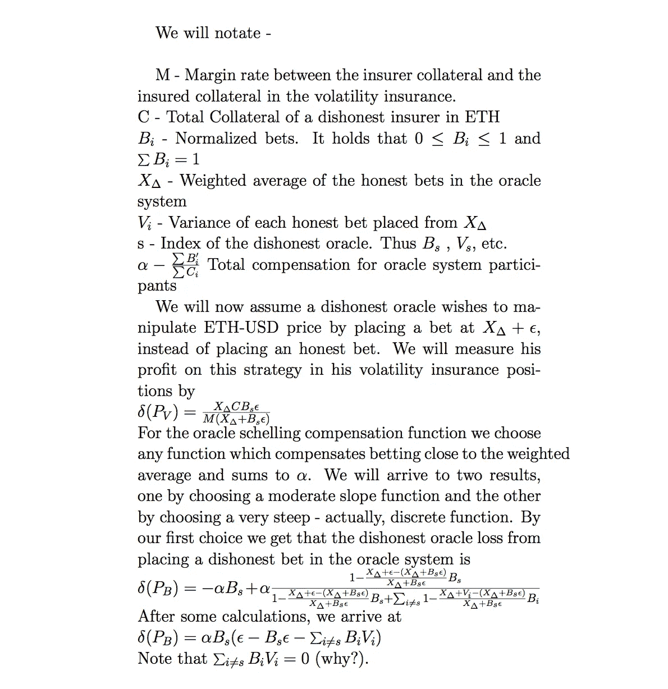
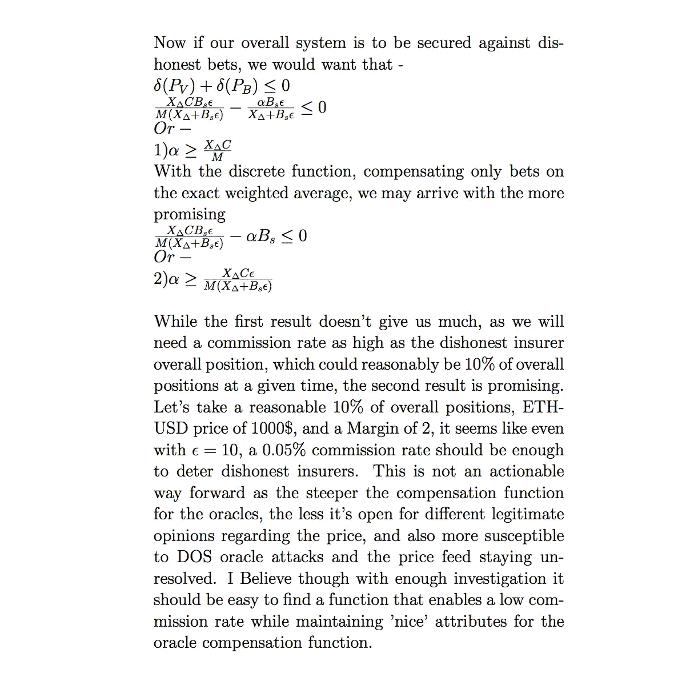

# 案例研究——分散式 oracle 系统下的波动保险

> 原文：<https://medium.com/hackernoon/case-study-volatility-insurance-with-a-decentralized-oracle-system-cb9a1ecf79ed>

## TL；dr——这本书是为对分散式 oracles 感兴趣的技术读者准备的。我将使用一种金融工具，我称之为[波动保险](/@yotamyachmoorgafni/volatility-insurance-and-the-makerdao-platform-aaf9e8502b7a)，并展示如何将它与一个分散的 oracle 系统集成在一起，使其免受操纵。我认为，应该以这种精品手工制作的方式，将去中心化的神谕集成到智能合约和金融工具中，包括特别选择的距离函数和参数，而不是通过诸如[auger](/@AugurProject/the-augu…)、 [TruthCoin](http://www.truthcoin.info/papers/truthcoin-whitepaper.pdf) 等系统提供的全方位方法。

为了总结我们的逻辑，我们向波动性保险工具添加了一个分散的 oracle 组件。分散的 oracle 负责 ETH/USD 价格馈送。每个 ETH 持有者可以对当前 ETH/USD 价格进行匿名下注。然后，通过下注总额对它们进行加权平均。这作为价格馈送，没有任何进一步的检查或限制。然后，下注者根据他们的赌注与加权平均值的接近程度得到补偿，就像我们在谢林硬币系统中所希望的那样。分散式 oracle 系统的补偿来自波动性保险头寸的佣金。

当一个不诚实的先知试图操纵价格时，他将从他的波动性保险头寸中获得补偿，因为价格会被扭曲。我们已经分析了一个 oracle 作为保险人开立许多头寸的案例。另一方面，他失去了甲骨文系统的补偿，因为他偏离了诚实记者的平均水平。当甲骨文系统中损失的补偿大于在波动性保险头寸中获得的补偿时，甲骨文就没有不诚实行为的动机。

我们提出的是一个性质，如果系统满足，它应该是安全的，不会受到先知不诚实的赌注。请注意，不同的杠杆水平将需要对分散式 oracle 系统进行不同的约束。我们主要控制的是α，我们可以通过提高佣金率来增加它。我们还选择了 oracle 补偿功能。

我在这个快速数学分析中的目标是说明一些事情:

*   将金融工具与分散的 oracle 系统集成并不是一项现成的任务。我做了这些计算，因为我还没有在网上看到任何这样做的地方。我再次访问的所有稳定硬币只是模糊地谈论未来的集成，所有分散的 oracle 系统都是不可思议地针对任何具体的金融工具而构建的，这让我感到不安。我很难相信你能在这个问题上制定一个“一刀切”的制度。
*   即使在这个小例子中，佣金率也会随着 oracle compensation 函数、不同的ε阈值、针对不诚实保险公司能力的不同安全边际以及不同的波动性保险杠杆而变化。使用不同的金融工具，等式看起来会完全不同——那么相同的分散式 oracle 系统如何为它工作呢？
*   我不相信信誉系统。尽管从博弈论的角度来看，重复游戏的参与者比单轮游戏的参与者表现得好得多，但我认为加密货币的去中心化和匿名化特性阻碍了在不过度集中的情况下有效建立声誉系统。我希望发表 TruthCoin 对这一点的分析。
*   我也不会相信任何基于集中式数据馈送的智能合同。依赖于集中数据馈送的完全分散的设计是没有意义的。