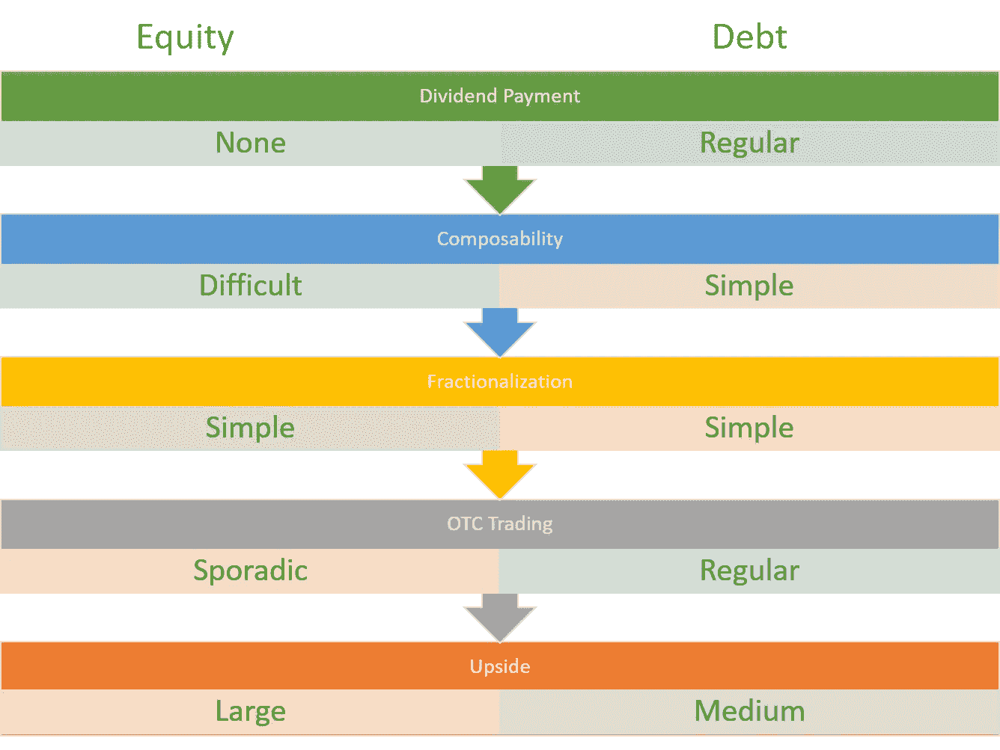
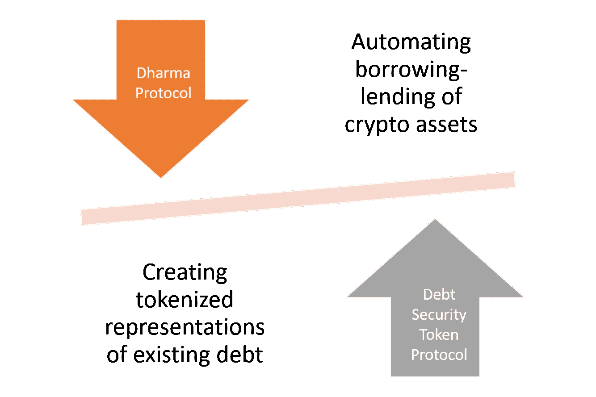
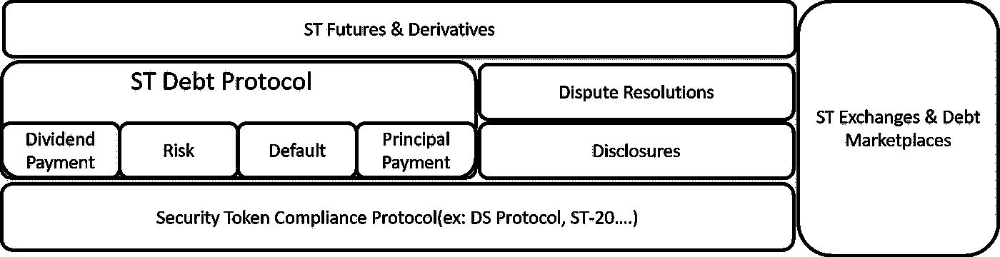

# 区块链上的现金流第一部分:令牌化债务和安全令牌

> 原文：<https://medium.com/hackernoon/cashflow-on-the-blockchain-part-i-tokenized-debt-and-security-tokens-18054dbf7dc>

经常有人问我，安全令牌的哪些方面更令人兴奋，我总是用一句话来回答:*“我们目前没有在做的方面”😊*。除了讽刺之外，这句话清楚地反映了我对安全令牌的看法。我倾向于把安全令牌看作是创造新一代证券的使能器，这在外链世界是不可能的。从这个角度来看，我更倾向于想象新形式的加密证券，而不是创造现有证券的数字包装。尽管我这个实用主义者认识到，我们距离拥有一个能够让我们重新想象数字证券的基础设施还有几年的时间，但有一些直接的用例可以催化这一运动。从这些用例中，我相信令牌化的债务或现金流为释放安全令牌的潜力提供了独特的可能性。

当前一代的安全令牌集中于创建基础工具中权益的令牌化表示。虽然技术上很简单，但在一个缺乏流动性和其他资产类别的二级市场基础设施的市场中，令牌化股权仍是一种非常受限的工具。金融市场的历史告诉我们，流动性和采用是由短期活动和交易而不是长期投资建立的。在这种情况下，我们需要易于理解、普通投资者易于采用的安全令牌，并提供明确的短期收益，从而为生态系统注入动力。作为一种资产类别，债务证券有许多好处，可以将证券代币的世界扩大到主流投资者。

# 令牌化债务的独特优势

如果我们认为绝大多数资产类别都有债务成分，那么基于债务的证券令牌的用例就变得很清楚了。房地产资产可以表示为债务和股权的组合，大多数公司的结构也是如此。从这个角度来看，寻求世界的象征化在很大程度上是债务的象征化😊。在安全令牌的上下文中，令牌化债务带来了一些难以忽视的实际好处。

1) **普遍性:**债务是一个和贸易本身一样古老的普遍性概念。大多数国家经营债务的可比表示，这为令牌化债务工具提供了全球足迹。

2) **市场规模:**债务市场规模巨大。仅在公开市场，债券和债务证券就占 100 万亿美元，日交易量为 1000 亿美元。这些数字轻而易举地超过了全球股市的估值。如果我们加上私人债务工具，如汽车贷款、学生贷款、信用卡债务和许多其他债务，你可能会对其潜力有所了解。

3) **短期收益:**令牌化债务定期支付股息。从这个角度来看，投资者更容易冒险投资安全代币，因为他们知道即使他不从事任何交易，他/她也会收到季度付款。

4) **可组合性:**债务很容易组合。将一系列令牌化的房地产租赁放入一个代表债务抵押债券(CDO)的加密证券相对简单。这些工具的链上表示也有助于为其基础结构、令牌持有者、预测业绩、风险和其他元素带来更多透明度，这些在这种形式的衍生品中是出了名的模糊。

5) **细分:**正如债务工具可以被组合成更复杂的债务代币，它们也可以被细分成更简单的表示。细分可以让新的投资者群体立即获得象征性债务工具。

6) **场外交易:**世界上大多数债务工具都是在场外(OTC)交易的。基于债务的安全令牌可以通过提供简化的数字交易足迹来补充这种模式。

7) **期货:**对于大多数加密资产来说，期货和衍生品仍然是一个难以捉摸的目标，但令牌化债务可能是一个完美的工具。债务是一种相对微不足道的资产，可以作为一种期货工具进行建模，并且相对容易理解。从这个意义上说，令牌化债务期货可能是帮助释放证券令牌生态系统流动性的另一种工具。

为了客观地看待问题，下面的矩阵在安全令牌的背景下比较了债务和权益工具。

# 令牌化债务的基石

既然我们已经了解了基于债务的安全令牌的好处，我们可以开始考虑如何实现这种新形式的加密证券。不幸的是，这是事情变得复杂的地方，因为没有债务证券的本地协议。像 [Dharma](https://dharma.io/) 这样的协议为基于债务的安全令牌提供了灵感，但它们必须经过认真的修改才能用于安全令牌用例。Dharma 和债务安全令牌协议之间的区别在于，前者专注于自动化密码资产的借贷，而后者专注于创建现有债务工具的令牌化表示，并自动化现有债务合同中的条款。

如果佛法不是解决之道，那是什么？债务安全令牌协议可能不只是一个协议，而是几个协议的组合，这些协议抽象了令牌化债务的不同动态。在较高层次上，安全令牌中的令牌化债务的体系结构可以如下图所示:

这些组件各自的作用是什么？这将是本文第二部分的主题。