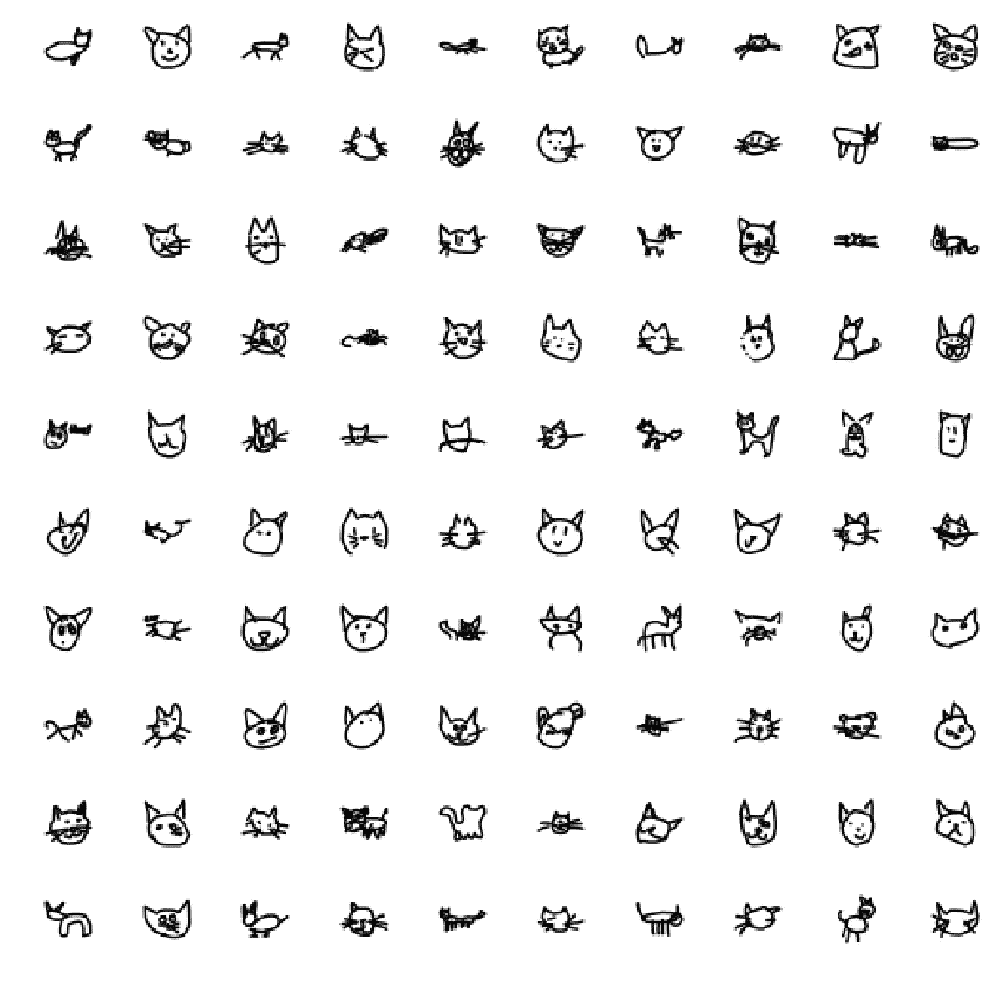

# CatGAN:使用 GANs 生成猫脸

> 原文：<https://medium.com/hackernoon/catgan-cat-face-generation-using-gans-f44663586d6b>

## GANs 的详细回顾以及如何跟他们浪费时间…

我最近一直在研究**生成对抗网络** (GANs)，我知道我必须想出一个有趣的方法来使用它。就在那时，我注意到了所有关于[T3 的议论:快，快！](https://quickdraw.withgoogle.com/data)Google Brain 团队发布的数据集，用于开源的修修补补和鬼混。我知道，我很慢…

I converted the cats.npy file into training and testing sets. Here are a few instances from the training set. This is how people around the globe perceive cat faces to look like. It’s interesting to see various representations of cat faces from different perspectives!