# 从《猫到疯狂的被子》:运用风格转移产生对立的例子

> 原文：<https://medium.com/hackernoon/cats-to-crazy-quilts-using-style-transfer-to-generate-adversarial-examples-b88eef073d04>

# **前奏:**

让我们先简单介绍一下对抗性输入的世界。这些是进入[机器学习](https://hackernoon.com/tagged/machine-learning)分类器的输入，这些输入已经被精明地扰乱，以至于这些变化对于肉眼来说几乎是该死的不可见的，但是可以欺骗机器学习分类器来预测任意的错误类别(无针对性的)或者特定的错误类别(有针对性的)。

当我想到这个领域时，脑海中浮现出两个典型的形象。第一张是经典的*熊猫变成线虫*的图片，来自[这里](https://arxiv.org/pdf/1412.6572.pdf)。

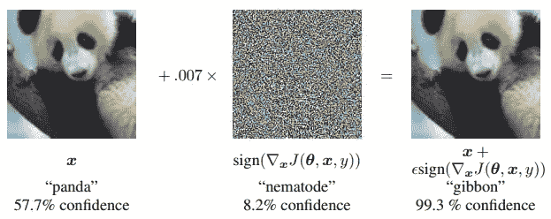

The now iconic example of a panda’s image getting perturbed into a gibbon (Source: [https://arxiv.org/pdf/1412.6572.pdf](https://arxiv.org/pdf/1412.6572.pdf) )

第二个，是下面的这个，提供了这些对抗性输入实际存在的几何视角。

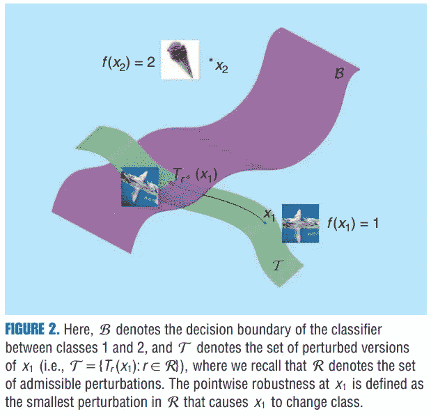

An image that provides a geometrical perspective on the adversarial inputs (Source: [https://infoscience.epfl.ch/record/229872/files/spm_preprint.pdf](https://infoscience.epfl.ch/record/229872/files/spm_preprint.pdf) )

在我[工作的地方](https://unify.id/labs/)，在非计算机视觉环境中利用对立的例子进行数据集扩充(以提高健壮性和可推广性)是我们管道的关键部分。在这方面，我们已经传播了一些浅显的尝试，例如基于深度学习的步态生物识别对对抗性扰动的脆弱性灰箱对抗性攻击的**[*以及对李亚普诺夫指数和对抗性扰动的迁移学习*](https://unify.id/wp-content/uploads/2018/03/greybox_attack.pdf) *和* [*。*](https://unify.id/wp-content/uploads/2018/03/lyap_e.pdf)**

**最近，在尝试使用 ***插值风格转换*** 来生成相互对立的图像对的想法时，我偶然发现了围绕机器学习的一个更基本的问题的模糊性:什么构成了真正的标签，以及提供商业现成(OTS)[API](https://hackernoon.com/tagged/apis)的机器学习公司如何定义它？**

# **TLDR:**

**1:我们描述了一个实验，该实验需要在特定的流行商业现成(OTS) API 的上下文中使用风格转移图像来针对错误分类(我使用 *Watson 视觉识别- V3 API，版本 2016–05–20*API 获得此处显示的所有结果。)**

**2:风格转移图像实现了 97:5 %的对抗攻击成功率(195/200)。**

**3:目标是*不宣布一个新的黑盒攻击方法*或痛斥所使用的商业 API，而是仅仅强调围绕什么构成真正的标签或真正的标记的模糊性。这是简单观察的一个原因，即当使用内插风格转移作为产生相互对立对的方法时，对立扰动的“*原始图像*不一定是自然出现的图像，而是风格转移图像本身。**

**4:提出使用插值风格转移作为生成可用于模型正则化的相互对立的对的配方的想法，以及生成*挑战*类图像作为输入到训练管道中的暹罗网的想法，如*嵌入在三重损失成本函数上训练的深网*。**

**5:在此提出使用插值权重作为*新语义ε*的想法:**

**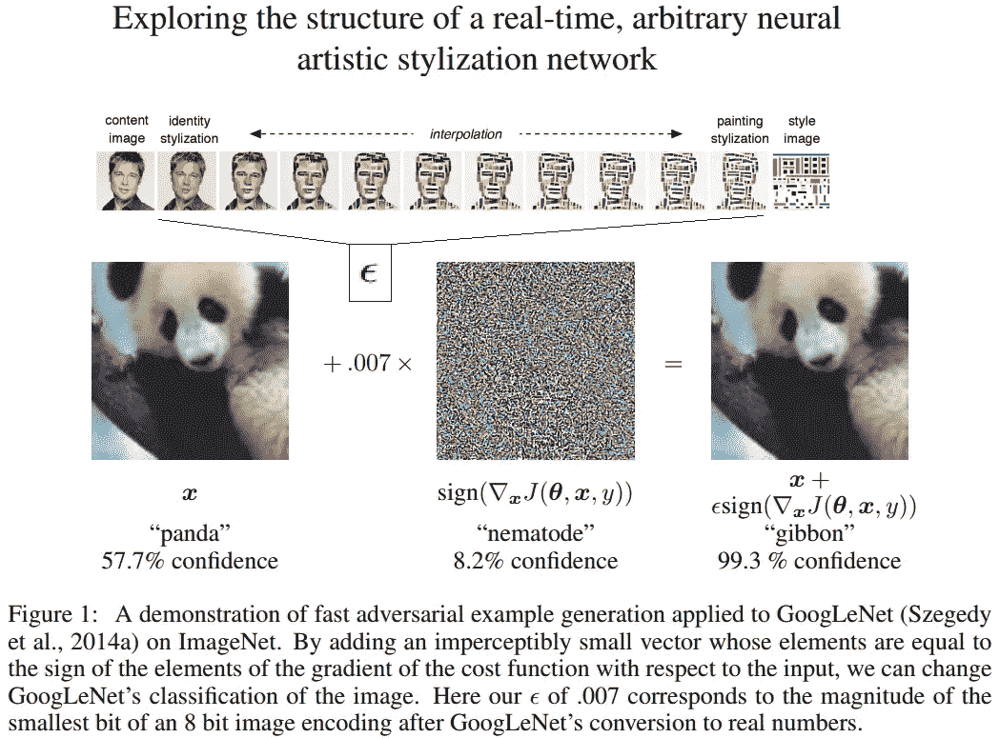**

**Time for a new **semantic epsilon**?**

# ****深潜:****

**有了这个前奏，深潜开始了。**

**让我们首先关注下图:**

**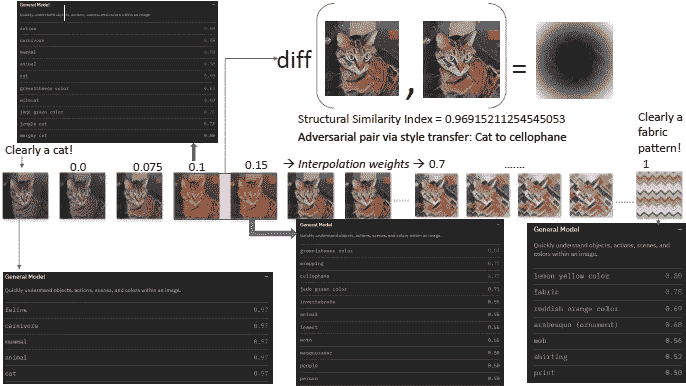**

**Cat2Fabric: The journey of a cat’s image into a pattern**

**我们看到的是使用*任意图像风格化*【2】[*洋红色*](https://github.com/tensorflow/magenta/tree/master/magenta/models/arbitrary_image_stylization) 项目，对于从 0 到 1(从左到右)单调递增的不同插值权重，将猫的图像的*旅程*转换为“图案-风格-图像”。如所看到的，使用原始图像(插值权重( *w=0* )或具有低插值权重的风格转移图像(直到插值权重 *w=0.1* )作为输入，商业 OTS 分类 API 已经如预期的那样*正确地*将图像分类为具有高置信度分数(0.97 到 0.99)的 ***类别*** 。当我们将插值权重略微增加到 *w=0.15* 时，我们会看到推断的标签布局发生了巨大的变化。最容易被猜到的种类发生了戏剧性的变化，从*猫科、猫科和食肉动物*到*玻璃纸、蛾类和无脊椎动物*。
虽然两幅图像对于肉眼来说实际上是不可区分的，并且在结构相似性距离方面仅仅相距 *0.03* (这是*1-结构相似性指数* [4】)(在无穷范数距离方面相距 *0.125* )，但是由黑盒分类器分配给两幅图像的标签被证明是非常不同的。
因此，我们将这一对称为构成关于黑盒分类器和所用距离度量的*相互对立对*。分类器可能已经学习的基于局部纹理的特征，可能已经诱使它做出错误的分类，而图像仍然看起来像猫的图像。现在出现了一个自然的疑问，艺术风格转移的**合成生成的**图像(具有 *w=0.1)* *是否首先值得*被归类为*猫*。这类似于另一个相关的问题，当输入是一个真实世界的小雕像而不是一个有生命的存在时，什么是标准的期望类，这使我们看到了下图。**

**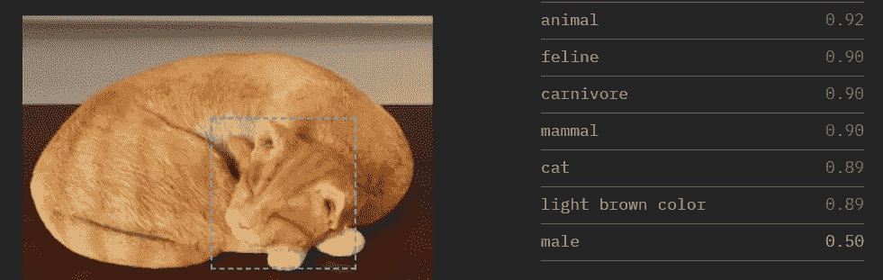**

**Is this a ‘Cat’ or a ‘Cat-figurine’?**

**这里，我们看到了输入图像(该图像来源于[这里是](https://www.wayfair.com/keyword.php?keyword=outdoor+cat+sculptures))。我们发现这个特定的购物门户是这种小雕像艺术例子的特别好的来源。
字面上是艺术猫雕像，其导致被归类为具有高置信度得分( *0.89* )的*猫*的高置信度分类。**

**实验程序的细节:
询问上面讨论的猫的例子是否是特殊选择的确实是合理的。为了减轻这些担忧，我们做了以下实验。
实验背后的主要质疑点如下:
*用全局低插值权重进行风格转移的图像确实会导致误分类吗？*为此，我们从 [*Kaggle 狗和猫*](https://www.kaggle.com/c/dogs-vs-cats) 数据集中提取了 200 张随机选择的猫图像。我们将它们的大小都调整为 299 x 299，并使用从 DTD 数据集[1]中提取的相同样式图像对它们中的每一个进行了样式转换，使用的样式转换算法详见[2]。下图通过一个具体的例子展示了这一点。**

**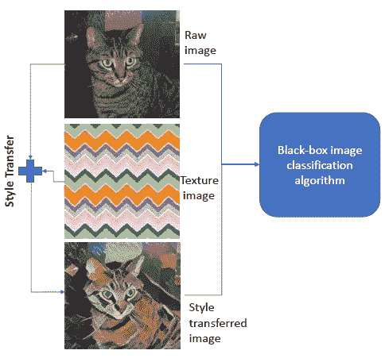**

**The concept**

**为了确保图像看起来仍然“像猫”，插值权重被设置为低*值*0.125。
您可以在下面的 gif 动画中筛选所有原始图像和风格转换后的图像。**

**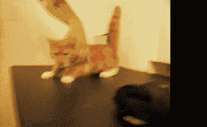**

**Gif of true images and their style transferred counterparts**

**现在，使用 *Watson 视觉识别- V3 API，版本 2016–05–20*API 对原始图像和风格转换图像进行分类。
设置输出类名语言的 *Accept-Language 头字符串*被设置为 *en* 。
*所有者查询数组*被设置为默认选项( *IBM* )。
将*分类标识*设置为*默认*不需要训练，并且*将从数千个通用标签*中返回类。代表类必须返回的最低分数的*阈值查询*参数被设置为 *0.5* 。
结果将在下一节介绍。
**结果:****

**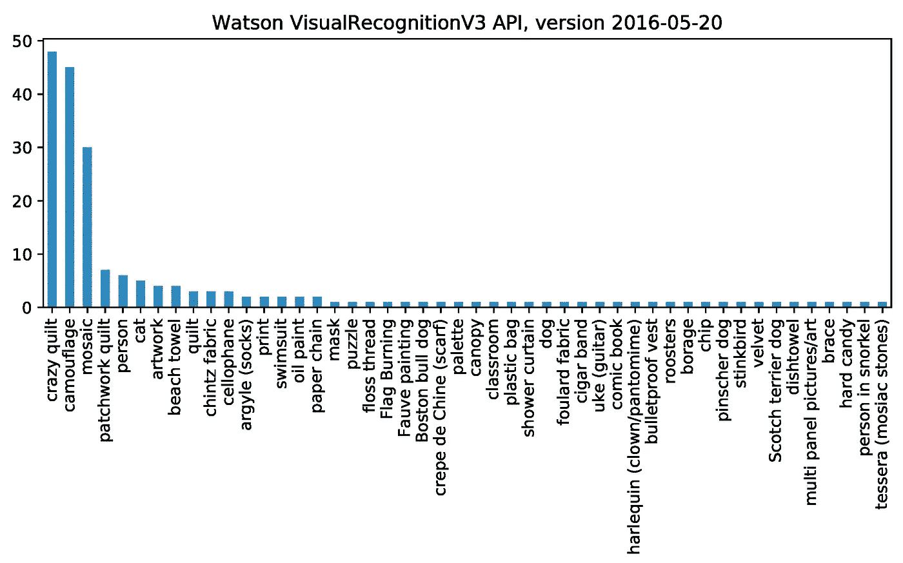**

**Histogram of the top inferred labels**

**在上图中，我们看到了 API 返回的最有可能的类的数量。如所见，包含超过 50%测试图像的前 4 个类别是*疯狂拼布、迷彩、马赛克和拼接*。**

**在下图中，我们看到了与 200 次分类试验相关的分数以及分数直方图。**

**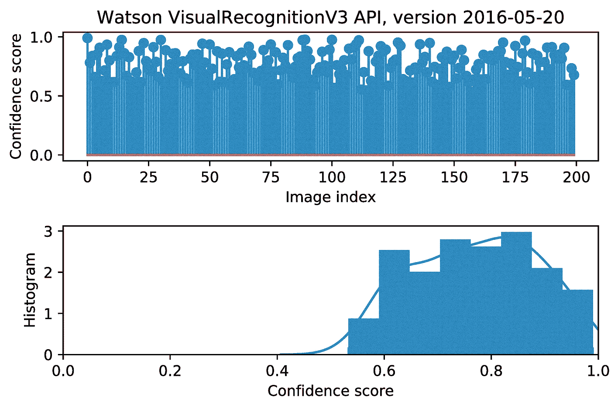**

**Scores and histogram of scores returned by the Watson classifier for the 200 test images**

**正如所看到的，我们有大量的案例，其中错误分类与高置信度得分相关联。在下图中，我们看到了 API 正确分类的 5 张图片。**

**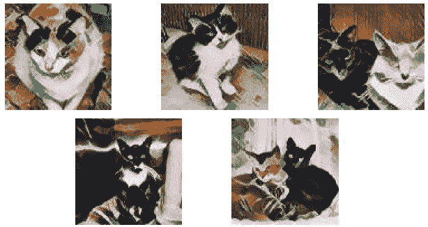**

**The lucky 5: Correctly classified as ‘Cat’ by Watson**

**现在，在这个图中，我们看到随机选择的 6 个被错误分类的风格转移图像的例子。**

**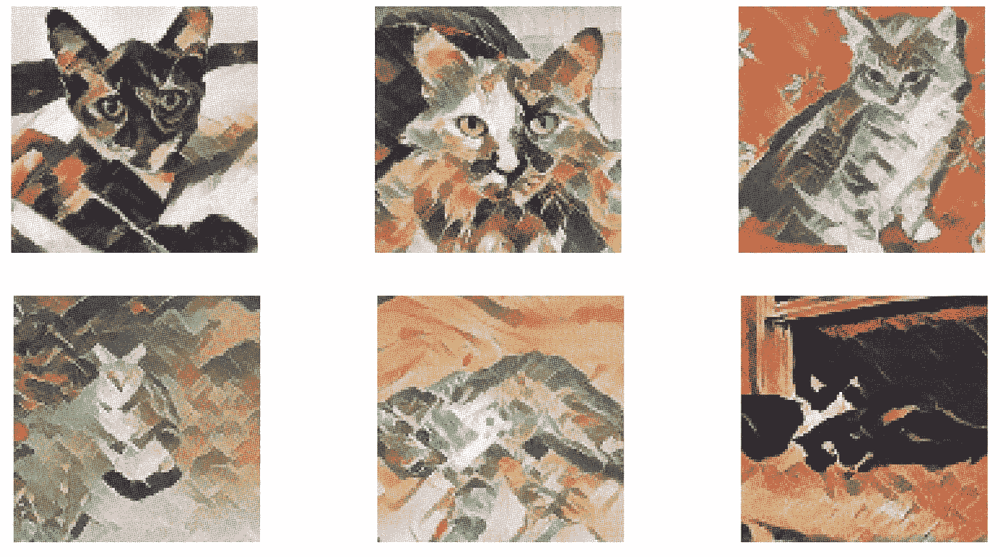**

**6 random not-so luckies**

****结论和未来工作**
由于自由层用户使用 API 的限制，我们无法将实验扩展到更大的数据集，这是我们的近期目标。除此之外，我们想探讨的另一个问题是风格形象的选择。我们选择纹理数据集的图像有两个原因。第一个是预先训练的风格转移模型是容易得到的。第二个原因是基于一种直觉，即纹理实际上是图像的正确方面，以至于*干扰*从而导致错误分类。
正如序言中所述，我们的目的不是宣布一种新的黑盒攻击或痛斥商业 API。**

**除了展示将样式转换视为对立示例生成技术的潜力之外，我们还希望提请注意，在这种 API 的情况下，什么构成图像类别或“标签”以及什么导致图像错误分类的定义存在固有的模糊性。
我们使用的 API[将](https://www.ibm.com/watson/services/visual-recognition/index.html\overview)技术描述为: ***沃森视觉识别的类别特定模型使您能够分析场景、物体、人脸、颜色、食物和其他内容的图像*** 。关于特定的 [API 文档](https://www.ibm.com/watson/developercloud/visual-recognition/api/v3/curl.html?curl\get-classify)，据说在与预训练模型(代替定制训练的分类器)一起使用时，API *从数千个通用标签中返回类。***

# ****链接:****

**(该作品将在[CV-COPS workshop](http://vision.soic.indiana.edu/bright-and-dark-workshop-2018/)@ CVPR-2018 上展示)**

**github:[https://github.com/vinayprabhu/Art_Attack](https://github.com/vinayprabhu/Art_Attack)**

**海报:**

**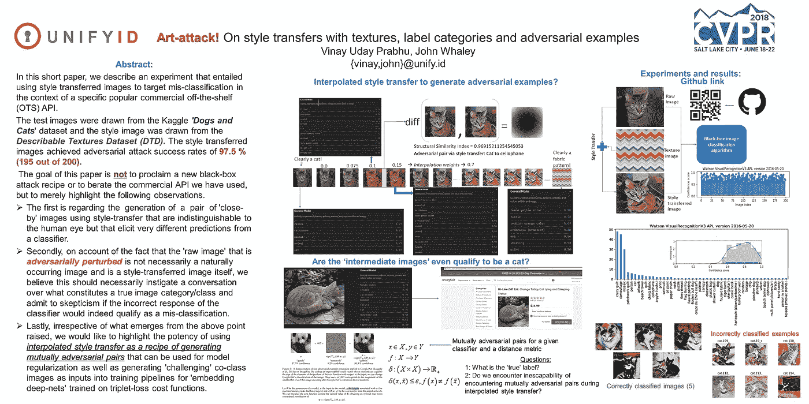**

**Poster for the paper**

****参考文献****

**[1] M. Cimpoi、S. Maji、I. Kokkinos、S. Mohamed 和 A. Vedaldi。描述野外的纹理。计算机视觉和模式识别(CVPR)，2014 年 IEEE 会议，第 3606–3613 页。IEEE，2014 年。**

**[2] G. Ghiasi、H. Lee、M. Kudlur、V. Dumoulin 和 J. Shlens。探索实时任意神经艺术风格化网络的结构。arXiv 预印本 arXiv:1705.06830，2017。**

**[3]s-m .穆萨维-德兹富利、a .法齐、o .法齐和 p .弗罗萨德。普遍的对抗性干扰。[https://arxiv.org/abs/1610.08401](https://arxiv.org/abs/1610.08401)**

**[4] Z.Wang、A. C. Bovik、H. R. Sheikh 和 E. P. Simoncelli。图像质量评估:从误差可见性到结构相似性。IEEE 图像处理汇刊，13(4):600–612，2004。**