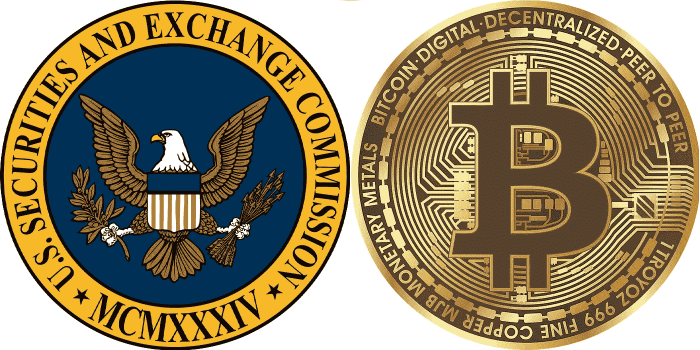
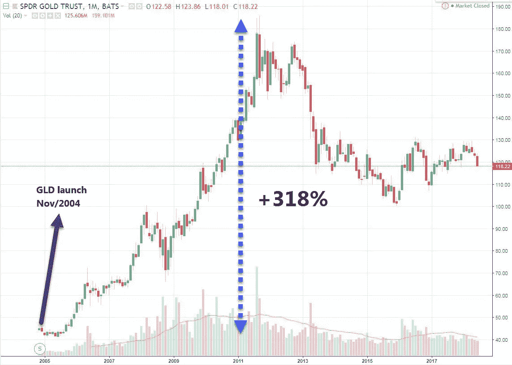
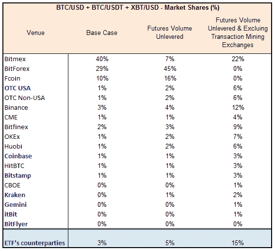
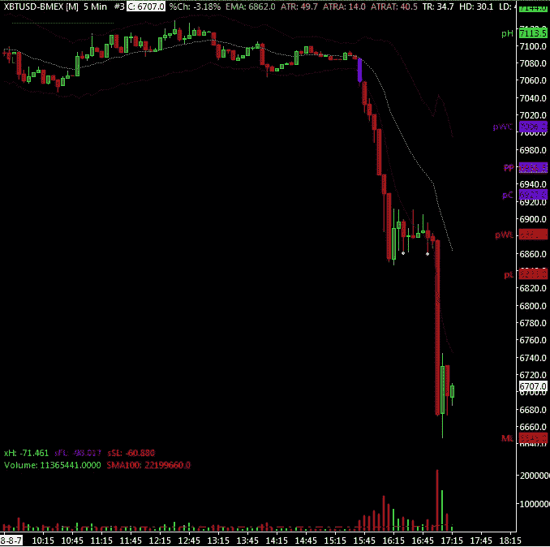
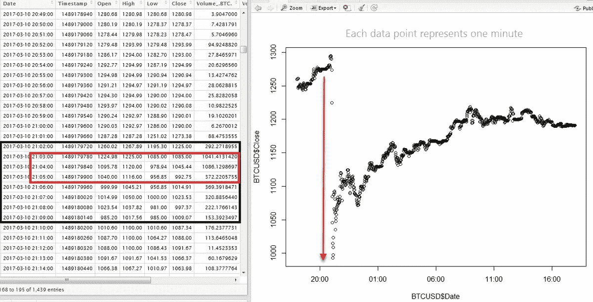
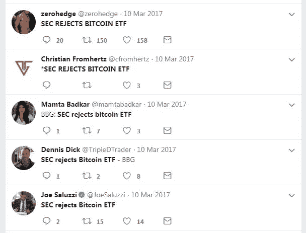
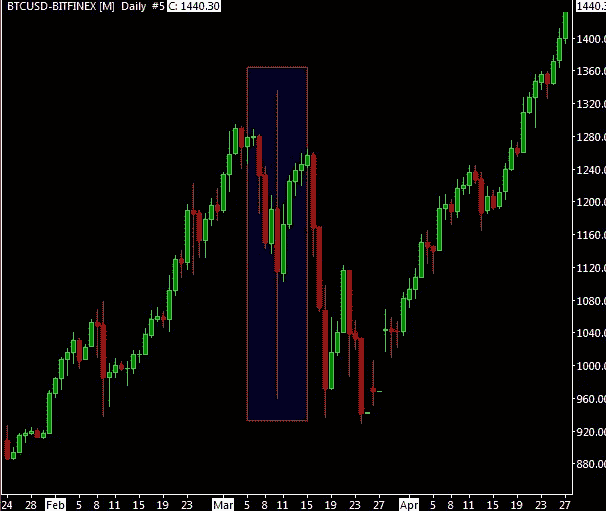

# 比特币交易所交易基金:打破 CBOE 交易所交易基金的提议

> 原文：<https://medium.com/hackernoon/cboebitcoinetf-53992ec38a70>

一只比特币交易所交易基金(ETF)将极大地推高比特币的价格。这将进一步使比特币合法化，并允许目前被排除在外的几家资产管理公司参与这一资产类别。

# 摘要

[CBOE](https://en.wikipedia.org/wiki/Chicago_Board_Options_Exchange) 比特币 ETF 提案大大优于之前的 ETF 提案，并解决了 SEC 在拒绝之前的 ETF 申请时表达的大多数担忧。然而**证券交易委员会的主要担忧仍然存在:潜在的比特币市场没有明显的抗操纵能力，而且大部分不受监管。ETF 需要制定规则来防止操纵行为。为此，交易所必须与重要的基础商品市场达成共享协议，而且这些市场必须受到监管。**

然而，美国证交会的一名委员已经表示支持比特币交易所交易基金。我的评估是，美国证券交易委员会有可能判定 CBOE 交易所交易基金的提议确实符合要求——即使它不符合要求。这应该是一个漫长的过程。我不认为 SEC 会在最后期限**之前做出最终决定，也就是 2019 年 2 月 27 日****。**

# **目录**

**这篇文章是对 CBOE 比特币交易所交易基金提案的深入分析。它的结构如下:**

*   **为什么 ETF 是游戏规则的改变者。**
*   **估计比特币交易所交易基金的价格影响。**
*   **沉住气。**
*   **“CBOE 比特币交易所交易基金”。**
*   **SEC 对比特币交易所交易基金的担忧。**
*   **CBOE 提案的优点和缺点(包括容量分析)。**
*   **与 [CME](https://en.wikipedia.org/wiki/CME_Group) & CBOE 比特币期货的对比。**
*   **证券交易委员会内部的异议。**
*   **选择证券交易委员会宣布的时间。**
*   **交易证券交易委员会的公告。**
*   **结论。**

# **为什么 ETF 是游戏规则的改变者**

****ETF 是交易所交易基金，其份额跟踪一项** [**基础资产**](https://www.investopedia.com/terms/u/underlying-asset.asp) (例如黄金等大宗商品)或基础资产篮子(例如标准普尔 500 指数成份股)的价格。出于无数的原因，ETF 是受欢迎的投资工具。商品支持的交易所交易基金的一个关键优势是让投资者不用担心基础资产(比特币在这里代表一种商品)的托管，因为交易所交易基金会负责托管。**

**回到比特币，尤其是机构投资者，他们一般对购买比特币不感兴趣，正是因为相关的 [**托管问题**](https://news.bitcoin.com/crypto-custody-poses-barrier-institutional-investment/) 。**

**作为实物比特币的替代品，投资者可以购买比特币 [**期货**](https://www.investopedia.com/terms/f/futures.asp) ，这是一种基于比特币的金融衍生品，无需托管。然而，每次期货合约到期时，期货都需要展期，这很麻烦，成本很高，而且会导致应税事件。此外，企业养老金计划等较小的资产管理公司被[命令](https://www.thebalance.com/what-is-an-investment-mandate-357214)禁止直接购买期货——所有期货，包括比特币期货。**

**因此，比特币交易所交易基金将为许多机构市场参与者创造一种新的可投资资产类别。游戏规则改变者！这种游戏规则的改变首先需要得到美国证券交易委员会(SEC)的批准。**

# **估计比特币交易所交易基金的价格影响**

**比特币 ETF 能对价格产生多大影响？我将用黄金的例子来估算比特币的价格。**

**黄金市场总规模估计为 188，268 吨([世界黄金协会，Dec/2017](https://www.gold.org/research/gold-investor/gold-investor-december-2017/key-gold-market-statistics) )。黄金市场由五个部分组成:珠宝、官方部门(即中央银行)、金条和金币、交易所交易基金和类似产品，以及其他伪造和未说明的产品。出于简化的目的，人们可以认为黄金 ETF、金条和金币是两个严格的投机类别。鉴于黄金 ETF 市场规模(2158 吨，或按当前黄金价格计算 750 亿美元)占金条和金币市场规模(38444 吨)的 5.6%，人们可以推断比特币 ETF 的创建可能会吸引 67 亿美元流入比特币市场(即占[比特币当前 1200 亿美元市值的 5.6%)。](https://coinmarketcap.com/currencies/bitcoin/)**

**接下来的问题是，这种涌入会对比特币的价格产生多大影响。这种关系不是一对一的。 [*Cheesman*](/@jonathanicheesman) 和 [*Burniske*](/@cburniske) *，*在他们的作品*"*[Cryptoassets:Flow&Reflexivity](/@cburniske/cryptoassets-flow-amplification-reflexivity-7e306815dd8c)"中，将这种关系称为**菲亚特乘数，**并估计乘数在 2x-25x 范围内。**

> **[反身性](https://www.investopedia.com/terms/r/reflexivity.asp)通常被认为是一种内部反馈循环，投资者的感知变成了自我强化的现实。因此，资产价格可以完全由其他投资者的信号或投资过程的内生变量决定，而不是由更能代表资产基本面的外生变量决定。**

**换句话说，由于投资者的反馈循环和相关的价格动力，67 亿美元的流入将对价格产生相当大的影响。通过应用 13.5 倍的乘数(该范围的中间值)，5.6%的菲亚特流入将导致 **76%的价格上涨**。**

**另一种方法是观察 2004 年 11 月 18 日美国第一只黄金支持的交易所交易基金**成立后的黄金价格，**[**【GLD**](http://www.etf.com/GLD#overview)。此后不久，金价飙升，在大约七年的时间里上涨了 318%。然而，重要的是要记住，当时有一个强有力的货币政策推动金价上涨。**

****

**(关于黄金交易所交易基金如何改变黄金市场的更多信息，请参考[这篇优秀的文章](https://www.marketwatch.com/story/how-gold-etfs-have-transformed-market-in-10-years-2013-03-29)——与比特币进行类比应该很简单。)**

# **✋，沉住气**

**除了看涨因素，**几家资产管理公司被禁止购买或交易比特币**，因为比特币的相对波动性很高，许多人认为比特币是一个[庞氏骗局](https://en.wikipedia.org/wiki/Ponzi_scheme)。ETF 不会解决这些问题，至少短期内不会。然而，从长远来看，它将逐步解决这两个问题——通过提高比特币的流动性，从而降低其波动性，并在机构圈子中得到更广泛的接受。**

**应该注意的是，一些美国机构投资者可能已经通过以期货为基础的**交易所交易票据** ( [ETN](https://www.investopedia.com/terms/e/etn.asp) )提供了比特币的多头或空头敞口，就像巴克莱银行以期货为基础的 [VIX 敞口](http://www.optionstradingiq.com/vxx-and-vxz-explained/)一样。然而，这并没有发生。为什么？我的观点是*感知需求/利润不足以获得授权。有关 etn 的详细信息，请参见此处的[此处的](https://media2.mofo.com/documents/faqs-exchange-traded-notes.pdf)和[此处的](https://media2.mofo.com/documents/141120masterclassexchangetradednotes.pdf)，以及[此 SEC 链接](https://www.sec.gov/oiea/investor-alerts-bulletins/ib_etn.html)涵盖了 ETF 和 etn 之间的区别。***

# **“CBOE 比特币交易所交易基金”**

**所谓**“CBOE 比特币 ETF”是 CBOE 交易所提出的物理支持的比特币 ETF**(物理支持=当投资者购买股票时，基金购买代币)。自 6 月下旬以来，它风靡一时，促使价格从年内低点上涨了 40%(尽管上周价格回撤了 60%)。这需要证券交易委员会的批准。美国证券交易委员会长期以来一直拒绝比特币交易所交易基金的提议，其中“[文克莱沃斯](https://en.wikipedia.org/wiki/Winklevoss_twins)比特币交易所交易基金”是最著名的一个。**

**许多人认为 SEC 将批准“CBOE 比特币交易所交易基金”，因为 CBOE 是一家非常严肃的机构。尽管这是真的，但这一结论是基于一个错误的前提，因为实际上并不存在“CBOE 比特币交易所交易基金”。**

**准确地说，CBOE BZX 交易所向美国证券交易委员会提出了将瓦内克 SolidX 比特币信托公司发行的 SolidX 比特币股票上市的建议——就像 2016/7 年是蝙蝠 BZX 交易所提议将文克莱沃斯比特币信托公司的股票上市一样。为了比较苹果和苹果，**我们应该谈论的是**[**【CBOE】BZX 提议**](https://www.sec.gov/rules/sro/cboebzx/2018/34-83520.pdf) **对** [**蝙蝠 BZX 提议**](https://www.gpo.gov/fdsys/pkg/FR-2016-07-14/pdf/2016-16604.pdf) **，或者是瓦内克 ETF 对文克莱沃斯 ETF** 。**

**此外，2017 年 3 月， **CBOE 收购了 Bats** 。因此，可以推测，CBOE 提议背后的人与文克莱沃斯 ETF 背后的人大致相同。应该清楚的是，CBOE 的提议并不是因为 CBOE 的名字而更有声望。最后，上市交易所还是老样子:美国股票的 BZX 交易所。**

**从现在起，我将把“CBOE 比特币交易所交易基金”称为“CBOE 提案”。**

## **CBOE 提案——所涉缔约方**

*   **基金:SolidX 比特币股份。**
*   **备案人/交易所:CBOE BZX 交易所。**
*   **信托/基金发行人/BTC 托管人: **VanEck SolidX 比特币信托。****
*   **信托的发起人/管理人:SolidX Management。**
*   **信托的管理人和现金保管人:BNY 梅隆。**
*   **营销代理:福赛德基金服务。**
*   **营销:Van Eck 证券公司**

## **ETF 力学**

*   **该信托向 [**授权参与者**](https://www.investopedia.com/terms/a/authorizedparticipant.asp) 发行一篮子 ETF 份额，由授权参与者下单购买。每个篮子由 5 股组成。**
*   **授权参与者是注册经纪交易商和 FINRA 成员，和/或存管信托公司(DTC——履行中央证券存管职能的信托公司)的参与者。**
*   **授权参与者向信托的现金托管人交付现金付款。**
*   **授权参与者在 CBOE 交易所出售股票。**
*   **信托从**比特币交易对手** (OTC 和交易所，都有)购买比特币。**
*   **(相反的过程适用于销售和赎回)**
*   ****MVBTCO 指数**代表从已经签订协议提供此类信息的组成比特币 OTC 平台得出的比特币价格。该指数用于计算信托的资产净值。**

## **信托公司的比特币交易对手**

**该信托公司打算在场外市场交易比特币。赞助商预计，在场外市场交易比在比特币交易所交易更具成本效益。因此，**信托公司希望进行大部分场外交易**，主要是在组成 MVBTCO 指数的场外交易平台上。这些都是总部设在美国的实体。**

**该信托还可以与以下加密货币交易所进行交易:Bitstamp(斯洛文尼亚)、GDAX/比特币基地(加州)、Gemini(纽约)、itBit(纽约)、bitFlyer(纽约)和北海巨妖(加州)。**

**所有交易对手都遵守州和/或美国[反洗钱& KYC](https://hackernoon.com/kyc-aml-and-cryptocurrencies-4e4cf929c151) 监管要求。**

**CBOE 提案指出，比特币交易对手 ***包括*** 实体，这些实体作为注册的经纪自营商和经纪自营商的关联公司受到 SEC 和 FINRA 的监管。截至目前，FINRA 的唯一成员似乎是场外交易实体 Genesis Global Trading。比特币基地很快将成为 SEC 和 FINRA 注册的经纪交易商，尽管它还不是一个。**

# **SEC 对比特币交易所交易基金的担忧**

**2017 年，美国证券交易委员会拒绝了两只比特币交易所交易基金，而在 2018 年初，多家公司撤回了交易所交易基金备案，原因是美国证券交易委员会质疑拟议的交易所交易基金是否符合各种规则。2017 年被拒的两只 ETF 之一是著名的文克莱沃斯 ETF；其拒绝被上诉，最近证券交易委员会再次拒绝了它。**

## **文克莱沃斯交易所交易基金拒绝**

****

**Bitcoin pioneers Winklevoss Twins — Caricature — Copyright by [DonkeyHotey](https://www.flickr.com/photos/donkeyhotey/).**

****美国证券交易委员会拒绝了文克莱沃斯交易所交易基金，理由是该提议不符合《交易法》第 6(b)(5)** 条，该条款要求国家证券交易所制定规则，以防止欺诈和操纵行为，并保护投资者。**

**美国证券交易委员会认为，为了与第 6(b)(5)条保持一致，**鉴于比特币市场无法抵御操纵，上市交易所必须与一个重要的比特币市场达成监督共享协议，而这个市场必须受到监管**。**

> **委员会同意，如果 BZX 证明了比特币和比特币市场对欺诈和操纵具有内在的抵抗力，那么就不需要与重要的受监管市场达成全面的监督共享协议，因为此类协议的功能是发现和阻止欺诈和操纵。但是，由于这个拟议中的商品托管 ETP 的基础商品市场**并不明显抵制操纵，BZX 作为 ETP 上市交易所，必须与**至少一个重要的、受监管的比特币市场**达成监督共享协议，或者共同拥有市场间监督小组成员资格。****

**(ETP 是一种交易所交易产品；就本文而言，术语 ETP 可与 ETF 互换)**

**最后，美国证券交易委员会表示，任何监控共享协议都是与比特币相关的市场达成的，这些市场要么不重要，要么不受监管，要么两者兼而有之。**

> **由于发现 BZX 没有证明比特币和比特币市场天生具有抗操纵能力，欧盟委员会将该提议纳入了其历史上用于分析大宗商品信托 etp 的分析，特别关注是否存在与重要、受监管市场的全面监督共享协议。因为没有足够的监督共享协议，而且目前的任何监督共享协议都是与比特币相关的市场达成的，这些市场要么不重要，要么不受监管，要么两者兼而有之，所以委员会得出结论，该提案不符合《交易法》第 6(b)(5)条。**

**下面这句话，出自 2017 年 3 月的[初次拒绝，值得注意:](https://www.sec.gov/rules/sro/batsbzx/2017/34-80206.pdf)**

> **委员会认为,**比特币的重要市场是不受监管的**,因此，该交易所没有签订，目前也无法签订监督共享协议，这种协议有助于解决对股票市场中潜在欺诈或操纵行为和做法的担忧。**

## **与黄金 ETF 的比较**

**BZX 在其提案中称，尽管现货黄金市场在很大程度上不受监管，但美国证券交易委员会还是批准了 streetTRACKS Gold Shares ETP 公司。然而，对于黄金指令，SEC 认定“*黄金市场独特的流动性和深度，以及与 NYMEX/COMEX(黄金期货市场)和 NYSE 的谅解备忘录，为 ETP 上市交易所监控股票交易中的欺诈和操纵行为奠定了基础”*。另一方面，比特币市场目前流动性相当差，因此波动很大。**

## **SEC 希望解决的其他问题**

**2018 年 1 月，SEC 就基金创新和加密货币相关持股发送了一封[员工信，确定了它希望 ETF 提案满意解决的问题。](https://www.sec.gov/divisions/investment/noaction/2018/cryptocurrency-011818.htm)**

*   ****估值**:ETF 必须在每个营业日对其资产进行估值，以得出资产净值(“NAV”)。鉴于加密货币的波动性、分散性和基础市场缺乏监管，这一目标能实现吗？**
*   ****流动性**:ETF 必须保持足够的流动性资产，以提供每日赎回。基金将采取什么步骤来确保他们有足够的流动资产来满足赎回？**
*   ****托管**:基金必须对持股进行托管。基金如何满足托管要求？基金如何验证私钥的存在性、排他性所有权和软件功能？网络安全威胁会在多大程度上影响资产的安全保护？**
*   **套利:一只交易所交易基金的市场价格必须不会严重偏离其资产净值。鉴于加密货币市场的分散性、波动性和交易量，ETF 将如何合规？期货市场基于波动性的交易暂停会如何影响套利？加密货币交易所的关闭会对其产生怎样的影响？**
*   ****操纵**:与证券市场相比，加密货币市场对投资者的保护要少得多，欺诈操纵的机会更大&。ETF 是否适合包括散户在内的广大投资者？投资者有足够的信息来理解风险吗？**

## **SEC 关注的摘要**

**主要问题:**

*   **保护投资者，尤其是散户投资者。**
*   **操纵基础市场。**
*   **不受监管的基础市场。**

**次要问题:**

*   **每日估值/资产净值。**
*   **赎回的流动性可用性。**
*   **监护权。**
*   **有效套利。**
*   **波动性和碎片化对前述问题的影响。**

# **CBOE 提案的优缺点**

**CBOE 的提议远远优于之前的 ETF 提议——它更加详细，解决了 SEC 就比特币 ETF 表达的大多数问题。**

## **解决的问题**

*   ****保护散户投资者**:由于 ETF 的**每股价格相当于 25 个比特币**，对于较小的散户投资者来说，其成本将高得令人望而却步——请注意，这降低了 ETF 的看涨影响，因为它降低了其可设定的市场规模。**
*   ****保险**:该 ETF 将拥有 2500 万美元的主要保险和 1 亿美元的超额保险，并有能力根据信托持有的比特币价值增加保险，目标是保持一对一的保险比例。另一方面，文克莱沃斯 ETF 没有保险“*，因为保险公司缺乏对数字资产的了解和经验*。**

## **部分解决的问题**

*   ****估值**:信托的资产净值将使用 MVBTCO 指数计算，该指数依赖于几个场外市场参与者的价格。这应该被视为一种优越的方法(不太容易被操纵)，而不是像文克莱沃斯交易所交易基金计划的那样，仅仅依靠双子星交易所的价格。**
*   ****监管**:虽然 CBOE 提案中没有直接提到，但如今的监管解决方案比 2017 年更好。**

## **未解决的问题:操纵**

**CBOE 的提案试图通过“*比特币不是特别容易受到操纵*”和“*通常不可能为了操纵*而传播关于比特币的虚假或误导性信息”等句子，让 SEC 相信操纵不是问题。**

**这与事实相去甚远。例如， [**洗盘交易**](https://en.wikipedia.org/wiki/Wash_trade) ，一种市场操纵的形式，在这种形式中，市场参与者同时出售和购买一种资产，以在市场上制造误导性活动，据信这种交易在各种加密交易所中非常猖獗，正如*在他的《[追逐假卷:一场加密瘟疫](/@sylvainartplayribes/chasing-fake-volume-a-crypto-plague-ea1a3c1e0b5e)》一文中详细介绍的那样。***

***再者，**关于比特币的虚假或误导性信息经常被传播。此类事件确实会影响市场**，去年 1 月关于韩国法规的负面误导性消息以及关于贝莱德计划进入加密市场的正面误导性消息就是如此。***

## ***未得到解决的问题:不受监管的基础市场***

***ETF 选择的交易对手在 FinCEN(金融犯罪执法网络)注册为货币服务企业(MSB ),并符合反洗钱和 KYC 监管要求。然而，**在反洗钱& KYC 之外，交易对手大多不受监管**(注意， [BitLicense](http://www.ecliiventures.com/5-requirements-of-new-yorks-bitlicense/) 是由纽约州金融服务局(NYSDFS)颁发的，是一种主要围绕反洗钱的营业执照)。***

***这是 SEC 在文克莱沃斯 ETF 拒绝中对 BitLicense 的说法:***

> ***尽管 BZX 声称它已经与 Gemini 交易所达成了一项全面的监督共享协议……Gemini 交易所由纽约证券交易所监管，但记录并未证明 Gemini 交易所是一个“受监管的市场”,与国家证券交易所或与迄今批准的商品信托 ETPs 的基础资产相关的期货交易所相当。***

***这是有意义的。例如， [SEC 可以近乎实时地访问](https://fcw.com/articles/2014/03/28/sec-midas-big-data.aspx)美国国家交易所的交易数据，这些交易所在 SEC 注册。同样，美国期货交易所向 CFTC 提供大量的交易数据和客户数据(见[本](https://www.cftc.gov/sites/default/files/idc/groups/public/@aboutcftc/documents/file/tacpresentation032912_cme.pdf)和[本](https://www.cftc.gov/sites/default/files/idc/groups/public/@newsroom/documents/file/tac103012_reference.pdf))。***

***与此同时， **CFTC 不得不** [**传唤**](https://www.ethnews.com/cftc-subpoenas-cryptocurrency-exchanges-in-bitcoin-futures-investigation) **加密交易所交易数据**，因交易所拒绝提供此类数据协助调查市场操纵行为。拒绝提供所需信息的交易所有比特币基地、Bitstamp、itBit 和北海巨妖，它们的价格被用于 [CME CF 比特币参考汇率](https://www.cmegroup.com/education/bitcoin/bitcoin-reference-rate-methodology.html)，该汇率又被用于 CME 比特币期货到期。CBOE 提案中提到的合作伙伴也是这些交易所。***

***对比 CBOE 提议的 ETF 和“常规”ETF 。在后者中，经授权的参与者交付标的(股票、黄金等。)交给托管人，而不是现金。此外，信托公司严格从授权的参与者那里购买基础资产，这些参与者又一次大多是在 T2 注册的经纪交易商，如 JP 摩根德意志银行——这些公司受到严密监控，他们的电话线路和聊天记录都被实时监控。***

***最后，考虑一下，即使比特币和以太坊不被视为证券，SEC 也将大多数代币视为证券，因此大多数加密交易都不符合 SEC 的规定。 **SEC 明确表示，交易证券的交易所，包括作为证券的加密货币** [**必须在 SEC 注册为国家证券交易所**](https://www.sec.gov/news/public-statement/enforcement-tm-statement-potentially-unlawful-online-platforms-trading) 。ETF 将北海巨妖视为其潜在交易对手——北海巨妖交易替代硬币，其中许多将被 SEC 归类为证券，因此不符合 SEC 的规定。***

## ***比特币交易量分析:受监管与不受监管***

***即使日本和韩国的加密市场现在受到监管，**大多数比特币交易都是在不受监管的场所进行的**。考虑到最大的加密交易所完全不受监管，甚至不进行开户和取款的 KYC。***

*****特别是 Bitmex 在比特币/美元交易量中占有 40%的市场份额**(56 亿美元)。Bitmex 是一个完全不受监管的香港比特币衍生品平台，其交易引擎很容易在动荡的市场中出现故障，这往往导致大多数交易者(并非所有交易者)无法执行和管理风险。它最近一次出现在 2018 年 8 月 4 日，持续了 1.5 小时；在此期间，比特币的价格下跌了 3.7%。***

*****本节采用的成交量统计和分析有** [**这里有**](https://docs.google.com/spreadsheets/d/1TOvPs4-3xIj7sPzETJMQu4vaHmnL-UtID8v9jnI9PUw/edit?usp=sharing) 。该分析仅适用于比特币/美元交易量(不包括其他硬币和货币)。交易量计算包括 OTC 美元场外交易量、Coinmarketcap 的 OTC 美元交易量、Coinmarketcap 的 BTC/USDT 交易量，包括来自[交易挖掘交易所](/zkcapital/how-asian-exchanges-and-investors-are-making-huge-profits-through-trade-driven-mining-92745c4b5693)的交易量、Bitmex 的 XBT/美元交易量和 CME & CBOE 比特币期货交易量，所有数据均来自 2018 年 8 月 7 日。***

***根据这些来源，比特币的日市场规模估计为 140 亿美元。它没有计入[比特币 CFD](https://cryptoren.com/wiki/contract-difference-bitcoin-cfd-meaning/) 的交易量。我从 CBOE 提案中的以下陈述推导出美元/BTC 场外交易量:***

> ***赞助商估计，全球美元场外比特币交易量**平均约占全球以美元计价的比特币交易所以美元交易的比特币交易量**的百分之五十**。*****

*****请注意“以美元计价的比特币交易所”**如何排除了以 USDT 计价的交易所**。注意，OTC 量也不是公开的，只能通过调查来估计，或者在这种情况下使用主办方的估计，可能基于调查。*****

*****为了**计算全球场外交易量**，我首先使用 Coinmarketcap 的 OTC 美元现货交易所的交易量，不包括交易挖掘交易所，得出每天总计 7 . 25 亿美元。因此，场外交易量将达到每天 3.62 亿美元。但就目前的目的而言，我们需要的是与 ETF 的场外交易对手相对应的份额，这些交易对手位于美国，而非全球。鉴于大约 60%的美元在美国之外(历史上相对稳定的统计数据)，我假设 50%的场外 OTC 美元交易量发生在美国，另外 50%发生在国外。*****

*****根据研究公司 **Tabb Group** 的数据，场外比特币市场的实际规模为[每天 120 亿美元](https://bitcoinexchangeguide.com/reports-show-over-the-counter-otc-bitcoin-trading-volumes-dwarf-public-exchanges/)。这一数字将包括所有货币，而不仅仅是 BTC/美元，远远大于从 CBOE 提供的信息中得出的数字。如果属实，这可能会加强 CBOE 的提案，但不清楚如何使用这一信息，因为它不是 CBOE 提案的一部分，其来源是非公开的研究项目。此外，SEC 关心的是受监管的场外交易市场的规模，而不仅仅是任何场外交易市场。因此，我将坚持从 CBOE 提案本身得出的 3 . 62 亿美元的估计数。*****

*******必须在这些计算中考虑到 Bitmex**,因为 bit MEX 是比特币流动性的最大来源，价格主要由它决定。此外，SEC 认为与基础资产相关的现货和衍生品市场都是相关市场，与任何重要监管市场的监督共享协议就足够了，无论该市场是现货市场还是衍生品市场。*****

*****基于美国的 OTC 美元场外交易量估计为每天 1.81 亿美元(=362/2)，占 1%的市场份额，而 ETF 的加密货币交易所交易对手的交易量为每天 2.7 亿美元，占 2%的市场份额。因此，ETF 交易对手的总交易量将占美元比特币交易总量的 3%。*****

*****如果通过杠杆作用下调衍生品(期货)交易量(例如，将 Bitmex 的交易量减少 8.5 倍——全部细节和假设可在[计算电子表格](https://docs.google.com/spreadsheets/d/1TOvPs4-3xIj7sPzETJMQu4vaHmnL-UtID8v9jnI9PUw/edit?usp=sharing)中获得)，ETF 交易对手的总交易量将增加到总美元比特币交易量的 5%。最后，如果**通过衍生品杠杆进行调整，并剔除涉嫌交易挖掘的交易所**、**，那么 ETF 的交易对手市场份额增加到 15%** 。*****

*****即便如此，**对于 SEC 来说，15%是否符合“重要市场”的标准？**请注意，对于 SEC 而言,“重要市场”代表一个市场，在该市场上，试图操纵 ETP 的人也必须在该市场上交易才能成功操纵 ETP。*****

**********

## *****摘要*****

*****根据美国证券交易委员会:*****

*   *****当市场对操纵没有明显的抵抗力时…*****
*   *****上市交易所必须与受监管市场签订监管共享协议，以交易标的商品…*****
*   *****这些市场必须具有相当大的规模，即操纵企图要想成功，操纵者也必须在这些市场进行交易…*****
*   *****由于监控共享协议，美国证券交易委员会得以发现这种操纵行为。*****

*****比特币市场仍无法证明对操纵的抵抗力。鉴于 CBOE 确实与受监管的市场签订了监控共享协议，这就变成了一个问题，即 SEC 是否认为这些市场规模巨大。就规模而言，SEC 有底线吗？*****

*****我认为这些市场的规模并不大。此外，除了遵守反洗钱和 KYC 要求之外，这些市场大多不受监管(因此可以拒绝数据共享)。最后，比特币的重要市场仍然不受监管。*****

*****因此，尽管 CBOE 交易所交易基金的提议远远优于以前的提议，但这可能还不够。*****

# *****与芝加哥商业交易所和 CBOE 比特币期货的比较*****

*****去年，两份比特币期货合约在芝加哥商业交易所和 CBOE 上市，这两家交易所都在 CFTC 注册。芝加哥商品交易所和 CBOE 都自我证明该合约符合《商品交易法》(CEA)。自我认证满足了 CFTC 的门槛要求，并得到了 CFTC 的认可。CFTC 规则禁止交易所上市容易受到操纵的合约，并要求交易所监控市场活动，以发现和防止现金结算过程中的操纵行为。*****

*****因此，一些人可能会辩称，CFTC 已经认定比特币市场不会受到操纵。然而， **CFTC 表示，比特币期货的自我认证“不提供……对基础现货市场的价值判断”。*******

*****在驳回文克莱沃斯交易所交易基金的上诉时，证交会表示，“它无法得出结论，CFTC 迄今采取的行动决定了拟议的比特币 ETP 是否符合
交易所法案的适用要求”。这一立场不太可能改变。*****

# *****证券交易委员会内部的异议*****

*****证券交易委员会四名委员之一的赫斯顿·皮尔斯对拒绝文克莱沃斯交易所交易基金(Bats BZX 提案)的决定表示异议。人们可以预期她也会支持 CBOE 的提议。她的论点如下:*****

> *****美国证券交易委员会的拒绝是基于拟议的 ETF“不符合该法案第 6(b)(5)节，该节部分要求国家证券交易所的规则应“旨在防止欺诈和操纵行为及做法，以保护投资者和公众利益”。“委员会的决定重点不是要在交易所上市的 ETP 股票，而是基础比特币现货市场……**委员会错误地解读了第 6(b)(5)** 节的要求。不批准令的重点是比特币现货市场的特征，而不是 BZX 方面根据自己的规则调查在 BZX 上市和交易的 ETP 股票的交易并阻止操纵行为的能力。然而，第 6(b)(5)条……并没有像欧盟委员会在其命令中经常做的那样提及基础市场。*****

*****然后让我们看看[交易法](http://www.nyse.com/publicdocs/nyse/regulation/nyse/sea34.pdf)第 6(b)(5)节:*****

> *****交易所的规则旨在防止欺诈和操纵行为和做法，促进公正和公平的贸易原则，促进与从事证券交易的监管、清算、结算、信息处理和便利人员的合作和协调，消除障碍并完善自由和开放市场的机制和国家市场体系，并在总体上保护投资者和公众利益；也不是为了允许客户、发行人、经纪人或交易商之间的不公平歧视，或凭借本篇授予的任何权力来管理与本篇的目的或交易所的管理无关的事项。*****

*******皮尔斯专员似乎是对的。第 6(b)(5)条与 ETF 的基础市场无关，但与 ETF 上市的交易所有关。然而，关注基础市场是美国证券交易委员会的一贯做法。委员会会改变做法吗？在基础市场容易受到操纵的情况下，交易所让 ETF 上市，是否会让 ETF 投资者面临操纵风险，从而无法“防止欺诈和操纵行为”，也无法“促进公平公正的交易原则”？*******

*****值得注意的是，BZX 的提议(以及其他比特币 ETF 提议)与之前的大宗商品 ETF 提议类似。因此，美国证券交易委员会评估 BZX 的提案时，采用的标准与之前的大宗商品交易所交易基金提案相同。在以前的提案中，操纵潜在市场的可能性是决策过程的一个关键因素。*****

*****赫斯顿·皮尔斯(Heston Peirce)提出异议的第二个原因是，美国证交会的“ ***方法通过排除比特币市场的更大制度化*** *破坏了投资者保护。更多的机构参与将缓解委员会对比特币市场的许多担忧，这是其否决令的基础。这是部分正确的。******

*****根据这一思路，BZX 的提案将**与铜**进行了比较，称当 SEC 批准 iShares Copper Trust 时，“委员会发现新投资者的需求将扩大铜的投资者基础，从而降低铜市场参与者之间的串通风险”。*****

*****然而，美国证券交易委员会在回应中表示，“*铜法令特别指出，不仅在 ETP 上市市场和铜期货市场之间，而且在 ETP 上市市场和一个重要的铜现货市场伦敦金属交易所*之间也存在监督共享协议”。*****

*****鉴于这一先例，其他委员很少会忽视他们对可操纵的不受监管的基础市场的保留意见，并绕过《交易法》第 6(b)(5)条，以促进改善这种保留意见的制度化。*****

*****没错，让比特币市场不那么容易受到操纵的最快方法莫过于向机构投资者的流动性开放市场。然而，**更快不一定更好**，因为“更快”可能不符合预先存在的规则。比特币市场也可以通过监管其大部分组成交易所来降低操纵倾向。通过批准 ETF 将比特币制度化，并不是削弱操纵行为有效性的必要条件。*****

# *****证券交易委员会宣布的时机*****

*****美国证交会必须在《联邦公报》(Federal Register)刊登提案公告之日起 45 天内，宣布对 CBOE ETF 提案的决定。该决定可从提交之日起最多推迟 90 天，然后从提交之日起最多推迟 180 天，最后从提交之日起最多推迟 240 天。此类时间表适用于所有提交给美国证券交易委员会的文件。ETF 的公告发布于 2018 年 7 月 2 日，因此**第一个截止日期为 2018 年 8 月 16 日，最后一个截止日期为 2019 年 2 月 27 日**。*****

*****更新:2018 年 8 月 7 日，SEC 宣布将推迟 45 天做出决定，将最后期限从 2018 年 8 月 16 日**推迟到 2018 年 9 月 30 日**。这一声明本应完全反映在价格中，并不代表什么消息，但比特币市场的效率如此之低，以至于该消息发布后 90 分钟内市场暴跌 6%。*****

**********

*****为了说明这在多大程度上应该是一个无足轻重的事件，看看美国证券交易委员会 8 月 7 日/18 日公报将 CBOE BZX 比特币 ETF 提案推迟 45 天的措辞([此处](https://www.sec.gov/rules/sro/cboebzx/2018/34-83792.pdf)，并与美国证券交易委员会 8 月 23 日/16 日公报将蝙蝠 BZX 比特币 ETF 提案推迟 45 天的措辞([此处](https://www.sec.gov/rules/sro/batsbzx/2016/34-78653.pdf))进行对比。除了一些替换名字和日期的编辑(例如 CBOE 替换了蝙蝠，瓦内克替换了文克莱沃斯)**的措辞是一样的**。*****

# *****交易 SEC 公告*****

*****17 年 3 月 10 日，SEC 在美国东部时间 16:03 秒前否决了文克莱沃斯交易所交易基金。**比特币的价格在随后的 3 分钟内下跌了 22%**(比特币基地数据)。*****

**********

*****March 10, 2017: $BTC drops 22% on the back of the SEC’s Winklevoss rejection.*****

*****一旦证交会批准或拒绝 CBOE 的提议，人们应该会预计到一个大的变动和延续。然而所需的反应时间可能短至一秒钟。*****

*****了解此类新闻的最快方式是拥有一台彭博终端。对于那些没有推特的人来说，推特很棒。回到 2017 年 3 月 10 日，美国东部时间 16:04，BBG“**SEC 拒绝比特币 ETF** ”的标题开始在 Twitter 上出现。*****

**********

*****需要注意的是，2017 年的拒绝发生在强劲的牛市中，比特币价格迅速回升。如果证交会拒绝 CBOE 交易所交易基金，我预计不会出现这样的复苏。另一方面，如果 ETF 获得批准，我预计会有强劲而不间断的延续。*****

**********

*****March 10, 2017: $BTC soon continued with its upward trajectory.*****

# *****结论*****

*****如上所述， **SEC 对市场操纵和不受监管的比特币基础市场的担忧依然存在。除此之外，如果获得批准，比特币交易所交易基金将是一个非常强大的看涨催化剂。市场是[贴现机制](https://www.investopedia.com/terms/d/discounting-mechanism.asp)。前景乐观的大型参与者需要预先定位自己，因为一旦 ETF 获得批准，比特币的低流动性将使大型市场参与者很难以有利的价格进入比特币市场——如果是这样，人们应该预计会立即出现非常强劲的上涨。*******

*****美国证券交易委员会是否会遵循其规则，严格遵守以前的惯例和 1934 年证券交易法中规定的法律？帮助人们赚钱不在证券交易委员会的授权范围之内，对吗？*****

*****感谢[乔纳森·契斯曼](/@jonathanicheesman)和[Crypto quanta nal](https://medium.com/crypto-quantamental)的周到反馈。*****

# *****在你走之前…*****

*****如果你喜欢读这篇文章，请考虑通过点击拍手按钮来表达你的支持——越多越好，这增加了可见度。可以通过以下链接分享文章:[脸书](https://www.facebook.com/sharer/sharer.php?u=https%3A//medium.com/%40alexkruger/cboebitcoinetf-53992ec38a70) | [推特](https://twitter.com/home?status=https%3A//medium.com/%40alexkruger/cboebitcoinetf-53992ec38a70)|[Reddit](http://reddit.com/submit?url=https%3A%2F%2Fmedium.com%2F%40alexkruger%2Fcboebitcoinetf-53992ec38a70&title=A%20bitcoin%20ETF%3A%20in-depth%20analysis%20of%20the%20CBOE%20proposal)|[LinkedIn](https://www.linkedin.com/shareArticle?mini=true&url=https%3A//medium.com/%40alexkruger/cboebitcoinetf-53992ec38a70&title=A%20bitcoin%20ETF%3A%20in-depth%20analysis%20of%20the%20CBOE%20proposal&summary=The%20CBOE%20bitcoin%20ETF%20proposal%20is%20vastly%20superior%20to%20prior%20ETF%20proposals,%20yet%20the%20SEC's%20key%20concerns%20of%20manipulation%20and%20unregulated%20underlying%20markets%20remain.&source=)|[Whatsapp](https://api.whatsapp.com/send?text=https://medium.com/@alexkruger/cboebitcoinetf-53992ec38a70)|[电报](https://telegram.me/share/url?url=https://hackernoon.com/cboebitcoinetf-53992ec38a70&text=The%20Bitcoin%20ETF:%20breaking%20down%20the%20CBOE%20ETF%20proposal) | [微博](http://service.weibo.com/share/share.php?url=https://hackernoon.com/cboebitcoinetf-53992ec38a70&title=%7Btext%7D) | [邮箱](mailto:?subject=https://medium.com/@alexkruger/cboebitcoinetf-53992ec38a70)。你也可以在 Twitter 上关注我，保持联系。谢谢你。*****