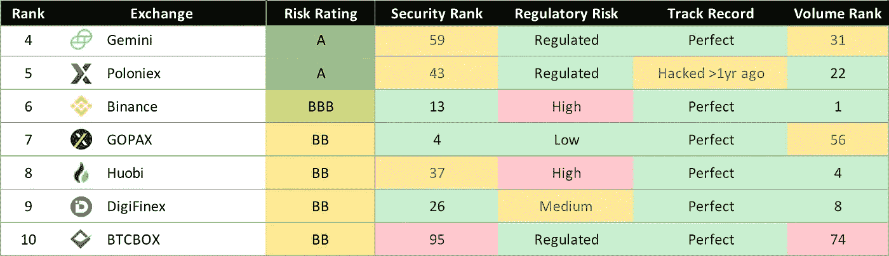
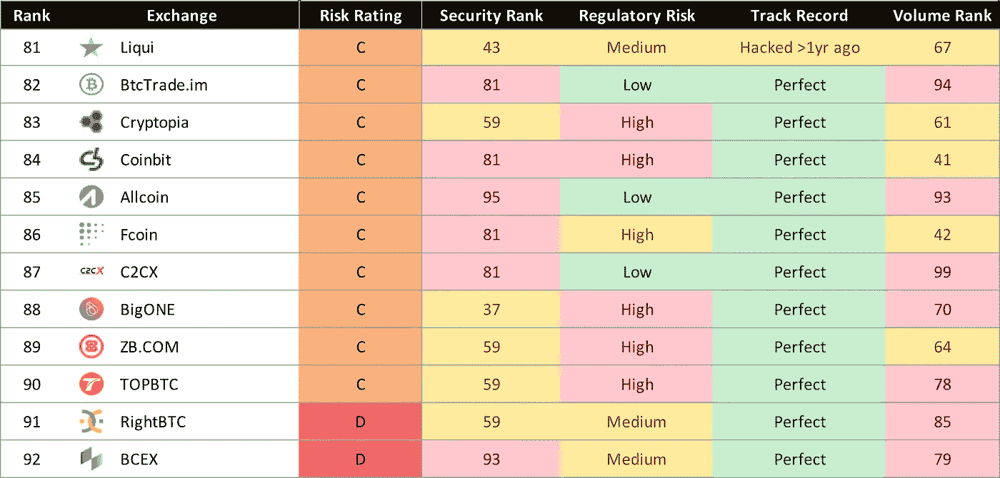

# CDx 实力排名—加密交易风险(2018 年 11 月)

> 原文：<https://medium.com/hackernoon/cdx-power-rankings-crypto-exchange-risk-november-2018-f3c762f65891>

## 币安未能进入前五名，Bitfinex 的排名令许多人惊讶，而 Kucoin 被认为是高风险的。

自 2011 年以来，[加密货币](https://hackernoon.com/tagged/cryptocurrency)交易所已经[损失了 126 亿美元](https://hackernoon.com/the-12-6-billion-black-hole-are-your-assets-protected-7ee34d9c810e)，因为[黑客](http://fortune.com/2018/01/31/coincheck-hack-how/)、[诈骗](https://hackernoon.com/canadian-crypto-exchange-steals-all-user-funds-6c98441e30d5)和[监管查封](https://www.ccn.com/1broker-shut-down-will-more-bitcoin-exchanges-be-targeted-by-us-govt/)。发生这种情况时，交易所客户通常会付出代价。

**没错，126 亿美元。**

在 [CDx](https://hackernoon.com/tagged/cdx) ，我们的使命是让加密对每个人都更安全。了解交易所的信用风险很难，因此我们建立了一个预测模型，提供信用评分和每个交易所因黑客、骗局等原因而违约的风险排名。

> 信用风险是指交易所无法退还你的钱的风险。

# 排名由四个因素决定

排名是基于四类因素的组合(该报告和 Andrew 的[方法论文章](https://hackernoon.com/pricing-crypto-exchange-credit-risk-f91b5996eaad)有更详细的描述):

1.  **网络安全**——*不安全的交易所更有可能遭到黑客攻击*
2.  **监管风险**——*不合规的交易所更有可能被关闭*
3.  **黑客攻击的记录** — *以前被黑客攻击的交易所更有可能再次被黑客攻击*
4.  **交易量** — *高交易量的交易更有可能在黑客攻击后回报客户*

# 好消息是:安全、受监管的交易所已经存在

币安和波兰交易所都进入了前 10 名，但在 100 家交易所中，只有 3 家获得了 AA 或更高的评级。

CDx Report Preview — Top 100 Cryptocurrency Exchange Credit Rankings

尽管受监管的交易所表现良好，但存储数字资产的风险最高的交易所也受到了监管。

# 坏消息:大众交易所没有通过基本的安全实践

包括 Liqui 和 Cryptopia 在内的一些流行的 altcoin 交易所排名垫底。

CDx Report Preview — Top 100 Cryptocurrency Exchange Credit Rankings

由于最近的一次黑客攻击和薄弱的安全措施，这个交易量排名第二的交易所被挤出了前 20 名。