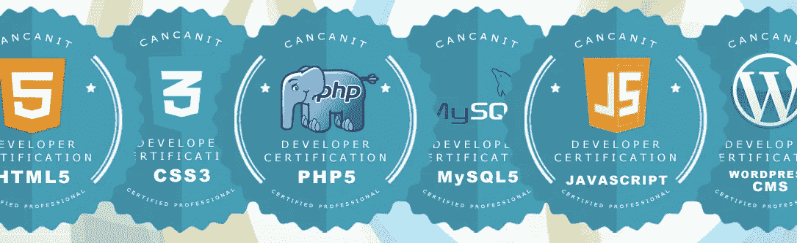
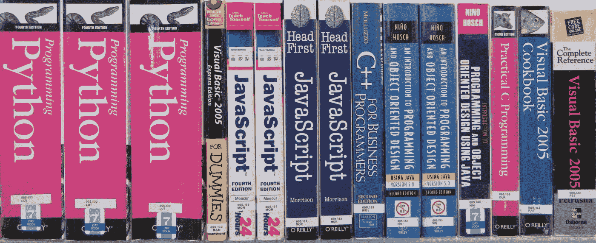
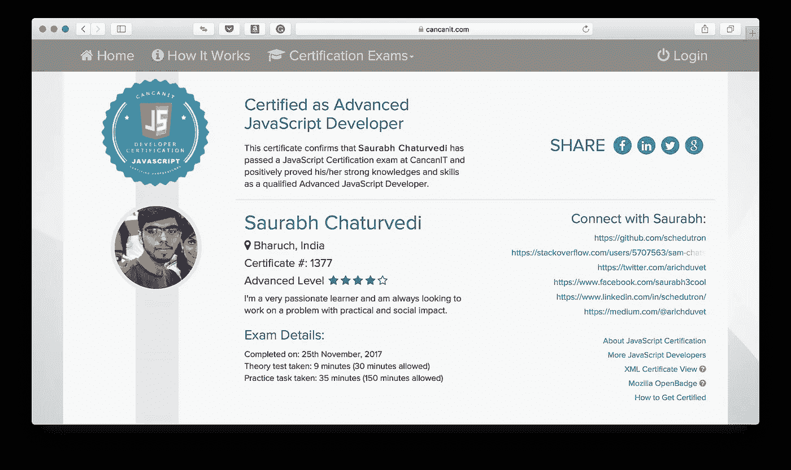
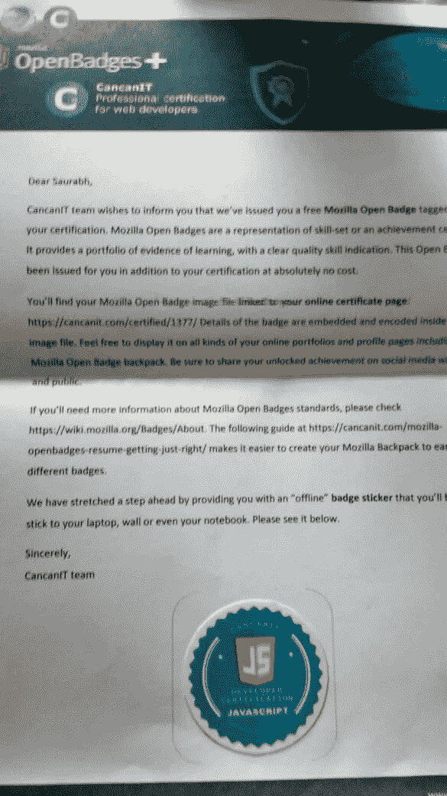
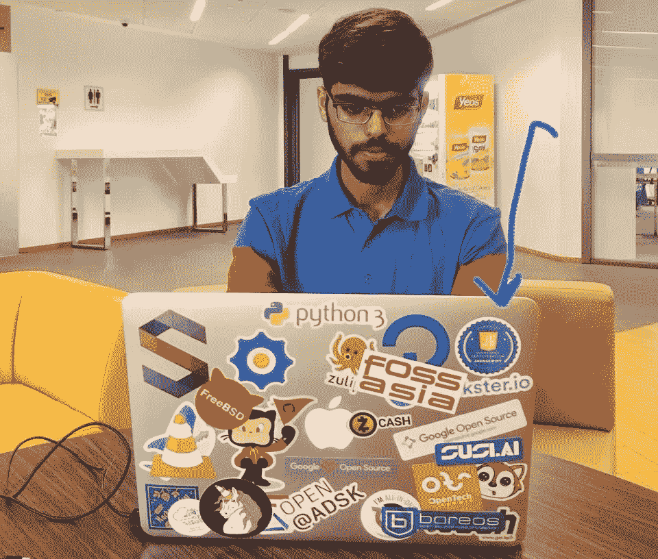

# 庆祝快乐的 JavaScript 认证

> 原文：<https://medium.com/hackernoon/celebrating-a-joyful-javascript-certification-4f2e4ca7667b>

在快速变化和竞争日益激烈的技术世界中，开发人员总是觉得有必要提高他们的技能和学习新技术。展示技能的方式有很多种，可以是一个附带项目、某人的认可等等，但是验证你技能的最突出的方式是*认证*。说到我自己，我主要是一名 Python 和 C++开发人员，我想拓宽我的技能组合，以包括超级流行的编程语言 JavaScript。尽管我很少参加 JavaScript 的在线课程，但我对自己的 JavaScript 技能总是缺乏信心，因为我从各种来源学习了这门语言，并觉得自己对 JavaScript 的理解存在一些差距。此外，就我的自由职业编程经验而言，我可以说 JavaScript 开发人员总是很忙，因为他们获得了最多的自由职业工作(当按照 web 开发的编程语言分类时)。

所有这些因素给了我一个坚实的理由来测试和证明我的 JavaScript 技能。虽然网上有许多公司提供认证，但大多数公司都是通过提供一门包含小测验、项目和其他测试的课程来实现的。一旦学习者完成了课程，她就获得了证书。Coursera、edX 和 Udacity 就是这类服务的一些例子。然而，由于我已经有了相当不错的 JavaScript 经验，我不想再通过另一门课程来获得证书(此外，我已经有了这样的证书)。我只是想测试和验证我的 JavaScript 技能。在搜索提供此类测试的平台时，我最近遇到了 [Cancanit](https://cancanit.com/) ，这是一家专业认证公司，提供许多 web 开发领域的认证，如 [SEO](https://cancanit.com/seo-certification/) 、 [jQuery](https://cancanit.com/jquery-certification/) 、 [MySQL](https://cancanit.com/mysql-certification/) 等。它还有一个高级 JavaScript 的轨道，对我来说简直太完美了！

因此，我很快加载了 JavaScript 认证考试页面，以了解关于费用和考试过程的详细信息。整体定价为 120 美元，在我阅读了考试流程后，我觉得还可以。我喜欢细节页面的一个很酷的地方是，他们建议我浏览一些流行的 JavaScript 书籍中的内容。[Marijn Haverbecke 的雄辩 JavaScript](https://cancanit.com/books/eloquent-javascript/)、 [JavaScript、David Flanagan 的权威指南](https://cancanit.com/books/javascript-the-definitive-guide/)、[大卫·赫尔曼的有效 JavaScript](https://cancanit.com/books/effective-javascript/)和 Eric Elliott 的[编程 JavaScript 应用](https://cancanit.com/books/programming-javascript-apps/)被提到作为推荐读物。此外，考试不及格不会受到处罚，而且 24 小时后可以重考——问题会被重新编排，其中一些会被新问题取代。因此，剩下的一天，我在大学图书馆阅读上述两本书的内容。我对回调感到不舒服，所以我花了大量的时间来修正这个概念。

I went to a library and read through the Javascript concepts I was uncomfortable with. [Image Source](https://libguides.dbs.ie/guides/it/books).

第二天晚上，我开始考试。根据考试页面，认证涵盖的主题从语言基础到函数和类，再到 DOM 操作和正则表达式。考试第一部分为理论考试，包含 20 道单项选择题，每道题的时间限制为 *1.5 分钟*。这些问题测试了我对 vanillaJS 语法的了解，其中大部分是中等难度的。然而，这 20 个问题中夹杂着一些难题，迫使我进行更深入的思考。这些都是测试对语言的深刻理解的问题。它们并不太难，只是要求我非常清楚 vanillaJS 语法的来龙去脉。我能够在大约 20 分钟内完成测试，并且得到了 20 分中的 18 分。这对我有好处——我通过了理论测试，因为门槛是 20 分中的 15 分。

考试的下一个也是最后一个部分是一项实践任务，它也提供了第二天回答的灵活性。然而，在通过第一次测试后，我感觉已经准备好了，所以我决定在第一次测试后马上回答。这是一个小的、真实的任务:我需要构建一个页面 JavaScript flooding & price calculator。HTML 元素已经构建好了——我要做的是开发一个算法，在给定几个输入参数的情况下计算地板的成本，然后开发 DOM 操作，从用户那里获取输入数据，并在相关的框中显示输出。这项任务的时限是 *150 分钟*。起初，我有点害怕——开发这种算法似乎令人生畏。但我很快意识到测试一点算法思维背后的目的——每个开发人员，不管她的技术水平如何，都应该是一个优秀的问题解决者。也许这是一个开发人员应该具备的最重要的技能，所以一个高级 Javascript 开发人员也应该具备这一点！因此，我将实际测试的这一方面视为一个严峻的挑战，并开始用我笔记本电脑上的计算器来构建价格计算算法。令我惊讶的是，我在大约 30 分钟内就准备好了一个算法！在实践考试页面上提供的样本输入上，它确实工作正常！这个任务中要做的下一件事是 DOM 操作以获得正确的输入和输出。因为我对 DOM 操作非常熟悉，所以我在大约 5 分钟内就完成了编写，页面上的计算器在不到 40 分钟内就准备好了！在最终检查之后，我提交了代码，它通过了所有的测试——我现在是一名官方认证的 JavaScript 开发人员了！

我一通过，就冲到一家咖啡馆，用一个三明治庆祝我的认证。回到我的笔记本电脑后，我发现了一个提示，要求在我的证书上显示我的在线个人资料。我很快就进入了他们，而[我的证书](https://cancanit.com/certified/1377/)终于呈现出它自己的生命:

My JavaScript Certificate!

我后来还发现，有一种选择是花 30 美元把纸质证书送到我家。我喜欢保留纸质证书，所以我去了。运输需要时间，但它确实在几个月后到达了我家——在一月份。包裹里有一封来自 Cancanit 首席执行官米歇尔·格林的感谢信，一张带有全息图的证书和一个令人敬畏的 Mozilla OpenBadge:

CancanIT’s letter with embedded Mozilla OpenBadge

我以前不知道 Mozilla OpenBadges，但经过一些研究后，我发现它们是展示和认可一个人成就的绝佳方式。我的数字证书还附有网络版。运到我家的那个看起来很酷，我把它贴在了我的笔记本电脑上(这是我笔记本电脑上最早的贴纸之一，尽管现在那里的房地产很稀缺😀):

Mozilla OpenBadge sticker for my JavaScript Certification!

总的来说，这是一次令人敬畏的独特的认证经历，我认为总共 150 美元对它来说是一笔公平的投资，因为这个认证在我迄今为止的自由编程之旅中为我提供了长期回报。

*免责声明*:坎坎尼特**没有**付钱让我写这篇评论。

读者们，请评论一下你的代码学习之旅，以及在你的道路上遇到的类似的时刻。我很想听听他们的意见，向他们学习。🙂