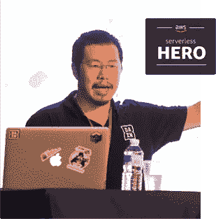

# AWS Lambda 的集中记录，修订版(2018)

> 原文：<https://medium.com/hackernoon/centralised-logging-for-aws-lambda-revised-2018-e88f22aabb0d>

首先，我要感谢你们所有人关注和阅读我的内容。到目前为止，我在 AWS Lamb da 的集中式日志记录上的帖子已经被浏览了超过 20000 次，所以这显然是一个你们很多人都遇到过的挑战。

在这篇文章中，我列出了一种使用 Lamb da 函数将所有 Lamb da 日志从云观察日志传送到日志聚合服务(如 [Logz.io](https://logz.io/) )的方法。

在[演示项目](https://github.com/theburningmonk/lambda-logging-demo)中，我还加入了以下功能:

*   向日志传送功能自动订阅新的日志组
*   将新日志组的保留策略自动更新为 X 天(默认为 ***永不过期*** ，这会产生长期成本影响)

这种方法在你刚开始的时候效果很好。然而，在大范围内，你会遇到一些严重的问题。

# 注意并发性

使用 Lamb 函数处理云观察日志时，您需要注意它所创建的当前执行的数量。因为云观察日志是 Lamb da 的异步事件源。

当你有 100 个函数同时运行时，它们会将日志推送到云监控日志中。这又会触发日志传送功能的 100 个当前执行。这可能会使您所在地区当前运行的功能数量翻倍。记住，所有功能都有一个软的**区域**限制在 [1000 个当前执行](https://docs.aws.amazon.com/lambda/latest/dg/concurrent-executions.html)中！

这意味着您的日志传送功能可能会导致整个应用程序出现 **cas cade 故障**。关键函数可能会被阻塞，因为太多的执行程序被用于将日志推出云观察日志——这不是一种好的方式；-)

您可以为日志传送功能设置保留电流，以限制其当前执行的最大数量。然而，当调用日志传送功能时，您有丢失日志的风险。

你也可以要求加薪，让你的薪水高到你不需要担心喉咙痛的程度。

# 大规模的更好的方法是使用 Kinesis

然而，我认为一个更好的方法是首先将云监控日志传输到 Kine sis 流。从那里，Lamb 函数可以处理日志，并将它们转发到日志聚合服务。

通过这种方法，您已经控制了日志传送功能的当前状态。随着日志事件数量的增加，您可以增加 Kine sis 流中的碎片数量。这也会增加日志传送功能的当前执行次数。

看看这个[回购](https://github.com/theburningmonk/lambda-logging-kinesis-demo)看看它是如何运作的。对于[上一篇文章](https://theburningmonk.com/2017/08/centralised-logging-for-aws-lambda/)的演示项目，它有一个几乎相同的设置:

*   `set-retention`功能自动将新日志组的保留策略更新为 7 天
*   `subscribe`功能自动 mat 会将新的日志组添加到 Kine sis 流中
*   一个`ship-logs-to-logzio`功能，处理来自上述 Kine sis 流的日志事件，并将它们发送到 [Logz.io](http://logz.io/)
*   一个`process_all`脚本，用于将所有现有日志组订阅到同一个 Kine sis 流

你也应该看看[这篇文章](https://theburningmonk.com/2017/04/auto-scaling-kinesis-streams-with-aws-lambda/)，看看你如何使用云手表和 Lamb da 自动缩放 Kine sis 流。

嗨，我叫**崔琰**。我是一个 [**AWS 无服务器英雄**](https://aws.amazon.com/developer/community/heroes/yan-cui/) 和 [**量产无服务器**](https://bit.ly/production-ready-serverless) 的作者。我已经在 AWS 中运行了近 10 年的大规模生产工作负载，我是一名架构师或首席工程师，涉足从银行、电子商务、体育流媒体到移动游戏等多个行业。我目前是一名专注于 AWS 和无服务器的独立顾问。

你可以通过[邮箱](mailto:theburningmonk.com)、 [Twitter](https://twitter.com/theburningmonk) 和 [LinkedIn](https://www.linkedin.com/in/theburningmonk/) 联系我。

查看我的新课程，[**AWS 步骤功能完整指南**](https://theburningmonk.thinkific.com/courses/complete-guide-to-aws-step-functions) 。

在本课程中，我们将介绍有效使用 AWS Step Functions 服务所需了解的一切。包括基本概念、HTTP 和事件触发器、活动、设计模式和最佳实践。

在此获取您的副本[。](https://theburningmonk.thinkific.com/courses/complete-guide-to-aws-step-functions)

来了解 AWS Lambda: CI/CD 的操作性**最佳实践**，本地测试&调试功能、日志记录、监控、分布式跟踪、金丝雀部署、配置管理、认证&授权、VPC、安全性、错误处理等等。

代码 **ytcui** 还可以获得**票面价格 6 折**。

点击获取您的副本[。](https://bit.ly/production-ready-serverless)