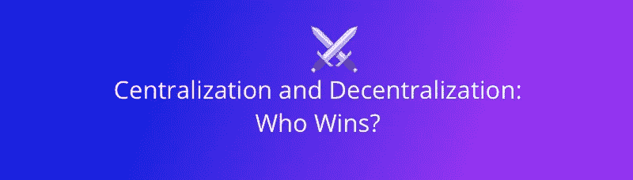
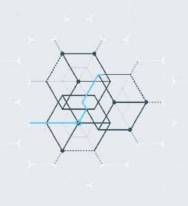
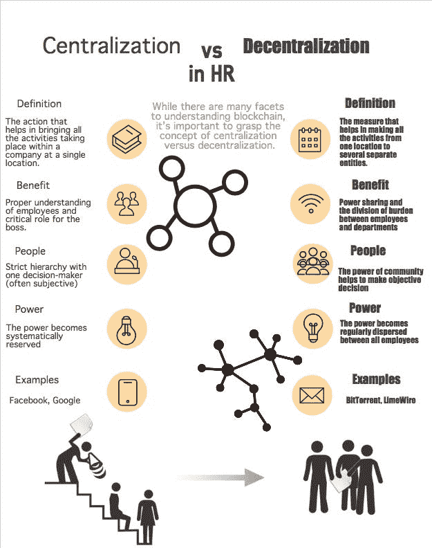

# 集权与分权:谁赢了？

> 原文：<https://medium.com/hackernoon/centralization-and-decentralization-blockchain-and-aworker-ccee548e9ec8>

传统的商业模式建立在[集中化](https://hackernoon.com/tagged/centralization)和一个决策中心的权力之上。集中化的企业旨在创造销售和用户数量的增长。随着数量的增加——利润率增加，业务围绕中心发展。人们仍然彼此分离，但不可分割地连接到中心以产生利润。

区块链分散的权力产生了一种新的业务，这种业务正在彻底改变许多行业。区块链有助于创造一种新的商业模式，这种模式建立在技术之上，而不是人或高层管理。

这项技术本身不获取利润，也不会基于情感或自我保护做出决定。这对于招聘来说是至关重要的，在招聘过程中，主观性扮演着重要的角色。通常的做法仍然是不选择最好的员工，而是选择那些知道如何在面试中用[的方式说话的人。更重要的是，](/@aworker/the-future-of-hr-how-a-blockchain-can-change-the-recruitment-process-3e1d833afc1b)[的去中心化](https://hackernoon.com/tagged/decentralization)在用户之间创造了一个强有力的连接，使得信息和价值的共享变得无缝和简单。这是当今人力资源行业的另一个重要问题，因为求职者在面试中不断在简历和作品集中撒谎，以给招聘人员留下深刻印象。

# 区块链变革人力资源行业

区块链将改变的领域之一肯定是招聘部门。权力下放提供了应对人力资源行业当前问题的所有机会，例如:

*   候选人和公司是脱节的，所以[互不信任](/@aworker/what-if-santa-wanted-a-new-job-7dfde49e9a28)；
*   检查候选人真实能力的唯一方法是通过以前工作单位的推荐；
*   这么多事情要做，时间却这么少——这意味着招聘人员从不够合格或不合适的候选人那里收到大量简历，这是对时间的极大浪费。

琳达·格拉顿在她的书《转变:工作的未来已经到来》中写道说:“未来将更少关于一般技能，更多关于深度掌握”。我们同意这句话。这就是为什么我们制作了一张信息图，向您展示集中式和分散式人力资源系统的主要区别。

# 未来是权力下放

人力资源市场的下一个突破极有可能正是通过去中心化实现的。无论你身在何处，职场人士都可以在这个平台上发展自己的事业。这是一份文件，列出了经过验证的专业和沟通技能，显示了员工的真实能力和成就。权力下放为创建新的职业生态系统提供了最佳机会。据 [TechInvest](https://techinvest.online/work-travel-blockchain-based-system-attached-cv/) 称，每个人只需点击几下鼠标，就能展示他/她有多合格，并建立良好的职业声誉。

根据 [Aworker 白皮书](https://aworker.io/docs/Aworker_Whitepaper.pdf)，公司会收到招聘申请，并与相关求职者沟通。人力资源经理将能够利用智能合同的机会创建一个空缺，并在区块链中检查候选人的核心信息:他/她已确认的技能、在工作岗位上的成就、已完成的项目等。随着权力的下放，区块链将提供更多关于申请人的可靠信息，这是现在公司所缺乏的。

我们希望创造一个人们因其工作技能和成就而获得回报的世界。公司会收到可靠的专家评级，以方便候选人的选择过程。”