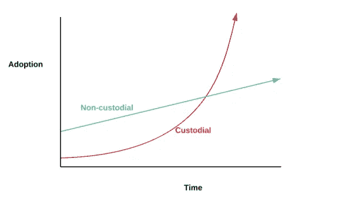
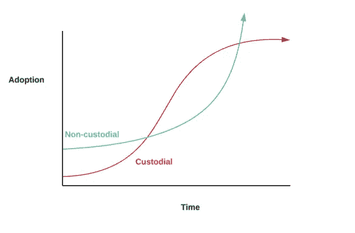
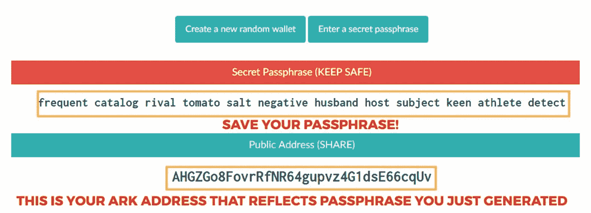

# 99%的加密货币产品仍然是集中的，这是一个问题

> 原文：<https://medium.com/hackernoon/centralization-still-rampant-in-crypto-and-its-all-under-the-hood-299a230e4056>

> "被赋予权力的人将不可避免地成为社会的压迫者和剥削者."米哈伊尔·巴枯宁

区块链技术和加密货币的终极承诺:**分权**。愿景是将透明度、权力和控制权交还给人民。毕竟，这诞生于 2008 年金融危机(仅 3 周)，在那场危机中，多年滥用权力的高潮达到了临界点。大银行告诉我们“把你的钱给我们，相信我们”。是的，我们都为此付出了代价。

发生了什么:本世纪最被高估的房地产市场是由国家收入贷款推动的。破产的银行。然后是 7000 亿美元的救助。人们犯了错误(阅读:犯了欺诈罪)，一切都崩溃了。我们学到了什么？当你给某人如此大的权力时，这是一种自然的力量，不可避免地驱使他们走向腐败。它就像物理定律一样可靠。

> "权力导致腐败，绝对的权力导致绝对的腐败."约翰·达尔伯格

我们应该生气的，我们确实生气了。“占领华尔街”运动本应发起一场革命，彻底推翻那些负有责任的大机构，或者至少把一些人送进监狱，并向更广泛的银行业传递一个信息。相反，警察[把抗议者打得屁滚尿流。过了几个月，事情就解决了，所有的喧嚣也消散了。我们需要更强大、更具破坏性的东西。](https://www.theatlantic.com/politics/archive/2012/07/14-specific-allegations-of-nypd-brutality-during-occupy-wall-street/260295/)

通过恰到好处的时机，密码学和数据库技术的进步:区块链诞生了。

人类历史上第一次，我们不必信任银行或机构来保管我们的钱。你可以拿着自己的钱，而不是欠一些不知名的组织(咳咳，高盛)或政府，他们不完全理解他们的货币和财政政策的含义(阅读:货币贬值& 21 万亿债务)。然而，在撰写本文时(2018 年 12 月),我们正往回走。加密货币领域 99%的交易和产品都是托管的。他们规模更大，资金更充足，尽管用心良苦(？)，我们又回到了 2008 年前的中央银行模式。事实上，有些人会说我们已经在那里了。

当你把你的钱交给一个集中的基金或交易所。你不再拥有自己的资产。你只是有权交易它，而在幕后，你的资金被用于何处几乎没有任何可见性。我们已经看到了很多把你的资产交给别人的问题。

1.  交易所正在清洗交易，以扩大交易量和提前交易(本质上是对用户不利的交易)
2.  错误处理用户资产，或者由于客户支持或交易瓶颈而不允许他们移动/使用资产
3.  大多数保管解决方案/产品不会给你带来利息。似乎没有人在谈论这个。
4.  宣称的自由贸易服务并不是真正免费的。他们要么收取费用，要么把你的钱投资到他们的利益上。真的是误导，已经成为行业标准。
5.  这已被广泛报道，但集中式解决方案已经经历了[大规模黑客攻击](https://www.bloomberg.com/news/articles/2018-06-20/cryptocurrency-markets-are-juicy-targets-for-hackers-timeline)和安全漏洞。(非托管钱包也有安全风险，但如果你是一名黑客，你会去攻击一家拥有 5 亿美元的公司还是 500 万个个人钱包？)

要点是:我们正在回到 2008 年危机前的问题上，只是这次的味道略有不同。

让我们快速定义托管与非托管解决方案

**保管:**交易所或实体持有你的加密货币/私钥。你只需保留交易的权利，在某些情况下还可以撤销密码。在任何意义上，你都没有“拥有”你的密码。

**非托管:**交易所或实体不持有您的加密货币私钥。你持有私钥，因此你“拥有”你的密码。您不依赖第三方，能够完全根据自己的判断移动/使用它。

我认为加密货币产品的现状是:

我认为我们应该去的地方:

当比特币诞生时，它始于密码朋克挖掘并持有他们自己的加密货币。是的，有保管解决方案，但加密货币运动的根源始于非保管方案。持有自己的私人钥匙曾经是(现在有时仍然是)一件痛苦的事情。你希望大众市场如何理解这一点:

WTF

随着时间的推移，监禁和非监禁解决方案都取得了进展，但监禁解决方案似乎远远超过了非监禁解决方案。虽然保管解决方案对于新手用户来说是一个很好的入口，但它不应该是一个无所不包的解决方案，特别是因为有了当前的技术堆栈，我们可以拥有一切。

我们哪里出错了？

最初的 cypherpunks 低估了设计和用户体验的力量。这是早期缺失的成分。他们确实是有远见的人，创造了革命性的技术，但没有意识到如果他们想实现他们的愿景，他们必须简单地让它更好、更容易使用。设计需要成为技术基础的一部分，而不是事后的想法。希望用户能够管理和理解私钥与公钥、种子词等。因此，保管解决方案来拯救我们，并承诺“把你的钱给我，只要相信我们”。听起来熟悉吗？

最根本的挑战是，作为一个行业，我们没有让设计师和 UI/UX 人尽快参与进来。如果我们既希望大规模采用，又希望忠于区块链的精神，我们必须创造出美观易用的产品**和**，让用户能够安全地持有自己的资产。

有一些区块链的创业公司正在用非保管钱包做一些非常酷的事情。 [Edge](https://edge.app/) 就是其中之一。他们想出了一种方法来创造一种体验，用户可以完全保管他们的资金，但他们创造了一种令人惊叹的体验，你不必到处摸索私人钥匙(除非你想这样做)。使用托管解决方案的最初权衡是，从 UI 的角度来看，它更容易使用。Edge 的解决方案是这样构建的，你仍然拥有和控制你的私钥，但一切看起来就像你在登录比特币基地或银行。所有复杂的加密都是在后台完成的，与保管解决方案不同，如果它们以任何方式被破坏，就没有什么可偷的了。

和所有伟大的新技术一样，它也伴随着一定程度的责任。即使您拥有自己的私钥，并且所有东西都被抽象为熟悉的东西(用户名、通行证、faceID ),您也必须小心。如果你忘记了密码，并且没有设置密码恢复，那你就不走运了。有了大银行，你可以进去找个人诉苦。有了非托管、分散的解决方案，就没有人可以大喊大叫了。但是就像每一项新技术一样，我们需要改变我们的行为，也就是对如何管理密码稍微负责一点。几十年来，银行卡特尔滥用权力，利用我们所有人，要把这个世界从它们手中解放出来，这是一个非常小的代价。

我希望在接下来的一年里看到更多的初创公司以最初的方式，即 BYOB，来开发推动生态系统发展的产品。做自己的银行。它的全部意义在于创造一个更加分散/开放的金融体系，而不是创造一个由比过去更加集中和强大的大型机构组成的新世界。我们正处于保管、安全性和可用性之间的权衡变得不存在的时刻。所以，让我们制造更多漂亮的、非托管的、用户友好的产品。

我很期待接下来会发生什么。我相信，我们将会看到一些围绕监护权的创造性执行，我们世界的金融、经济和社会福祉取决于此。

我是加密货币对冲基金 Ember Fund[的创始人之一。](https://emberfund.app.link/mediumcustody)