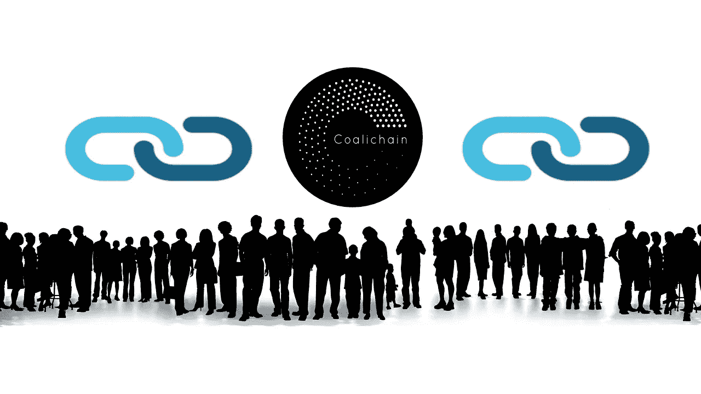

# 政治或公众影响力的集中与分散平台

> 原文：<https://medium.com/hackernoon/centralized-vs-decentralized-platform-for-political-or-public-influence-8281dbe70e3a>

**Centralized vs Decentralized Platform**

脸书曾被宣传为通过为所有人提供一个发表意见和组织抵抗的平台，将人民从独裁统治中解放出来的工具，但最近，它在新闻中的出现越来越多地与侵犯隐私、大规模传播假新闻联系在一起，或者被用作对民主选举施加不当的国内外影响的工具。

尽管脸书统计数据通常被用来衡量参与度和投票意向，也是影响政治的一个渠道，但它在这些方面的可靠性是值得怀疑的。透明度和隐私问题，加上脸书坚决以利润为基础的模式，并没有使它成为一个可靠的中立的意见载体。

脸书算法和对其用户的普遍忽视远不是当今大多数民主国家选民脱离的唯一因素。许多潜在选民，特别是年轻人，不相信他们能够再影响他们选出的领导人的决定，民主国家正日益遭受投票率下降的影响。

简而言之，我们需要的是一个中立、透明和安全的平台，重新打开领导人与其人民之间的沟通渠道，理想的是提供一种实时监控领导人行为的综合方式，甚至是一种让他们承担责任的方式，并对违反他们在通过选举获得人民的职位时与人民签订的契约的领导人进行内在制裁。

据《福布斯》报道，区块链也许能创造出这样的东西。[例如，Coalichain](https://www.coalichain.io/) 提供了每个人都在寻找的解决方案:一个分散的、透明的社交政治和民主网络平台，用户的账户在这里得到验证，民意测验和调查可以给我们一个真实的、没有污点的当前政治气候的画面。

当用户得到验证，他们的行动被限制在他们的参与率，我们可能会看到一种新的民主成长和繁荣。一个不是由现金和幕后交易推动的，而是由平台用户的积极参与和贡献推动的。筹款是透明的，所有利益相关方都可以看到，想要成为领袖的人是从几个捐赠者那里得到大笔资金，还是从众多捐赠者那里得到少量资金。

当一个安全、透明和廉洁的平台可用时，目前远离权力中心以安全维护其完整性的潜在真正领导人将有望考虑进入混战并恢复对领导层的信任。

真正的领导人将会出现，这些领导人以促进共同利益为动力。在选民真实可信的支持下，能够激励、鼓舞和真正领导的领导人。