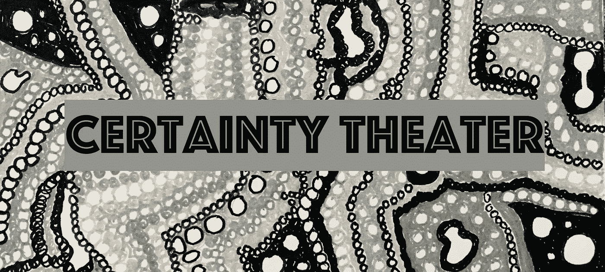
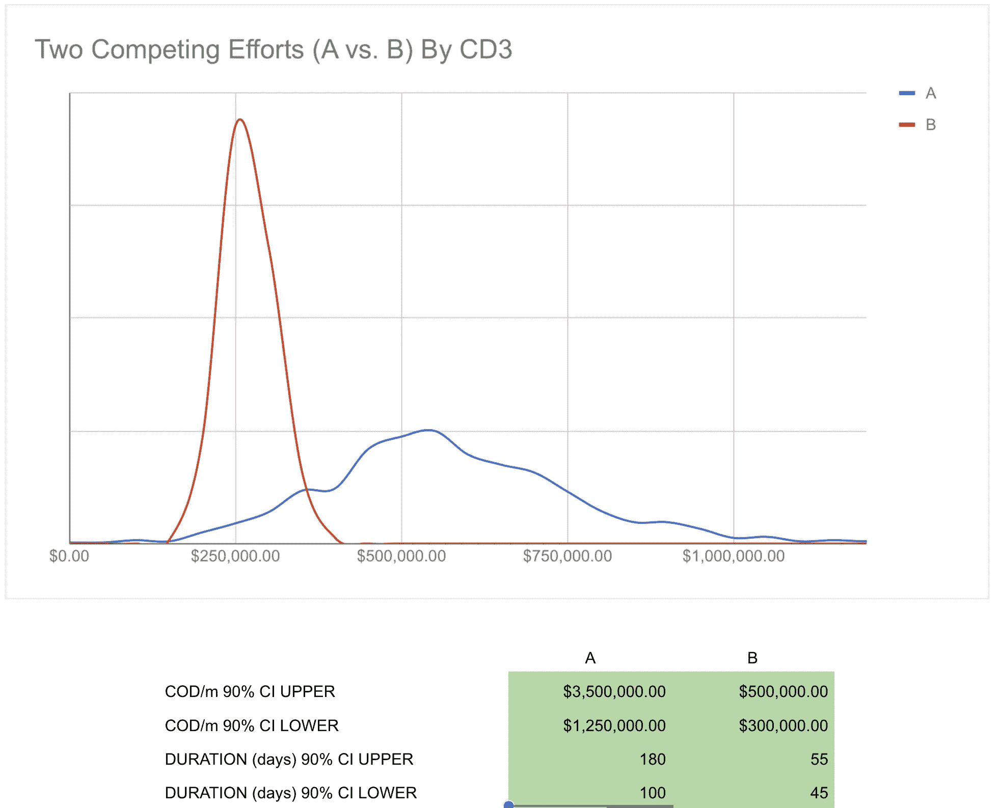

# 确定性剧场

> 原文：<https://medium.com/hackernoon/certainty-theater-43f18c278cf9>

我们经常奖励确定性剧场(一个与[成功剧场](https://link.medium.com/A6cWDWa7uS)并不遥远的亲戚)。

我记得当一个 CTO 问我一个更详细的，面向解决方案的路线图。我反抗了。他反复问。我最终屈服了，花了 20 分钟，主要根据直觉勾画出了十几个想法。“约翰确实抓住了这一点！他有超级清晰的视野。我们需要在 Q2 开始这样做！”哦…不是我最好的作品。我参加了确定性剧院。

我为什么反抗？因为我知道[的机会](/@johnpcutler/opportunity-vs-intervention-64611e6835f2)是有利可图的……如果一个由设计师、开发人员和客户组成的跨职能团队[一起开始](https://hackernoon.com/start-together-finish-together-5b47ca1209b3)(包括进一步探索问题)，公司将会交付更好的成果。如果我在我们一起开始之前就致力于大量的规范性工作，我们就会错过做出更好决策的各种机会。为什么我会屈服？嗯，他是高层领导，我也有一段时间划出“空间”做自己想做的事。

他没有恶意。推迟的想法看起来不太好。他对这种程度的不确定性感到不舒服，也没有体验过一起创业的好处。更糟糕的是，他的团队承受着“可预测地交付”的巨大压力，还不得不应对许多相互竞争的请求(这使得[必须玩俄罗斯方块](/@johnpcutler/stop-playing-tetris-with-teams-sprints-projects-and-individuals-b1e4ed6d8bc0)，这使得更严格的计划成为必要)。

你会注意到这种奖励确定性的模式遍布整个组织。“给我带来解决方案，而不是问题！”年度预算和膨胀的计划来“统计人数”。“坚实的路线图”。有说服力的推销。“杀死它”的创业公司(但不是)。交付“可预测的”。新高管被要求在 60 天内构思一个计划并“执行”。工作的“领先”。4 个工作日来规划整个下一季度。推销新的产品愿景以帮助筹资。“水晶般透明的任务”。

我将永远记得这个家族的一个朋友给我的职业建议(这个人在一个组织的肮脏政治中生存了 20 年):

> 约翰，完美地执行预定的计划比看起来含糊其辞要好。如果你做了，但没有成功，你会被认为是一个执行死刑的人，但只是运气不好。最好天真地果断。

这是真的吗？也许吧。也许这就是问题的根源。通常这是无意的…忽略基础利率，陷入确认偏差，以及许多其他的陷阱。考虑到一些高百分比的产品开发工作未能实质性地推动客户/业务成果。我们是否在每次开始时都提醒自己“我们有 20%的机会会带来巨大的变化！”

以两项相互竞争的工作为例，一项代表巨大的机会(范围为 1 到 3 倍)，可能需要 100 到 180 天，另一项是“确定”的 45 到 55 天，以及更确定的机会规模。

我们通常会选择努力 B，因为我们被这种确定性所吸引。a 是更好的选择。我们不是理性的行动者，我们的组织也不一定是为了全球结果/利益而优化的。

挑战在于，在某些情况下，确定性是 100%得到保证和预期的。找到一个精确的答案并计划事情是可能的。是的，您的新笔记本电脑在不到 24 小时内就准备好了并放在您的办公桌上。是的，这个事件发生在正确的地点/时间。是的，我们达到了季度销售目标。在这种情况下，一个不能确定并传递确定性的人不会做得很好。但是在很多情况下，情况并非如此——软件产品开发就是其中之一。在任何给定的时间，一家公司将在频谱的许多点上运营，这给如何沟通带来了很大的负担，因为没有一刀切的方法。

领导者/管理者经常犯掩盖不确定性的错误，因为他们担心人们会失去动力。他们所忽略的是，人们确实渴望某些事情的确定性(比如保住他们的工作，他们的工作正在产生影响，他们将获得学习/进步的机会，以及他们将获得合适的工具)，但这并不意味着他们渴望所有事情的确定性。以我为例。这个机会非常确定，是我们应该关注的正确的事情(鼓舞人心和有目的的)，但具体的干预措施却不得而知。

就不确定性与确定性进行交流是一件需要学习的事情。我发现人们会对已知和未知之间清晰的界限做出反应。他们欣赏可用的数据，而不是“捏造的东西”。他们希望看到你尝试过，并且你提出的风险/赌注有一些一致的理由。或许最重要的是，他们想知道你正在为不确定性承担一些负担，而不仅仅是强加给他们。这是一个连贯的解释。对于产品开发团队来说，这可能是精心制作一个有界限的“游戏”/实验，而不是让事情“无止境”。他们想要结构和严谨，而不是确定性(如果这有意义的话)。

我会把它扩展到推销一家初创公司。你可以表达出你对解决一个令人信服的问题的兴奋，同时表达出可能需要几次尝试才能取得进展。

这个帖子大概就是这样。你明白了。你如何培养关于不确定性的富有成效的讨论，这样 1)不会导致分析瘫痪，2)不会让你显得“软弱”或“毫无准备”？