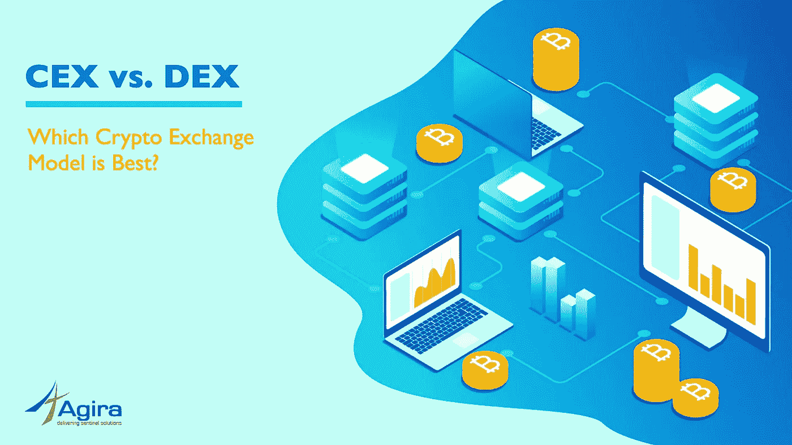
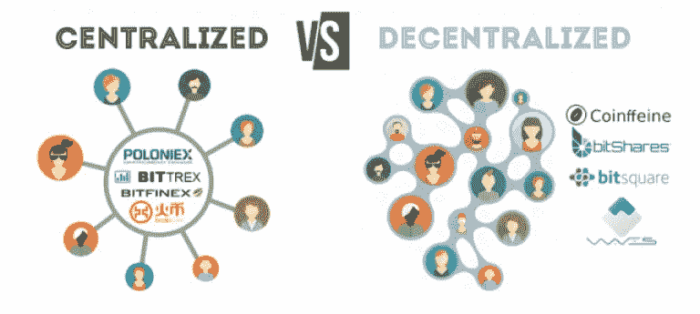

# CEX vs. DEX:哪种加密交换模型最好？

> 原文：<https://medium.com/hackernoon/cex-vs-dex-which-crypto-exchange-model-is-best-1dfcf80f4221>

关于[加密](https://hackernoon.com/tagged/crypto)前景的广泛讨论是关于不久前 DEX 与 CEX(分散加密交换与集中加密交换)的比较。我将用更简单的[商业](https://hackernoon.com/tagged/business)术语来概述定义和理解[加密](http://www.agiratech.com/will-cryptocurrency-vanish-soon/)交易类型的要点。

# CEX——集中式加密交换:

1.  将有第三方运营商
2.  法定货币交易将被允许
3.  做市商和接受者将成为平台的一部分
4.  条目将在数据库中的大部分时间，直到兑现或硬币拉发生
5.  交易量会更多
6.  更快的交易速度(无实时加密节点更新)
7.  流动性会更宽裕
8.  稳健的了解客户(KYC)和反洗钱(AML)实践
9.  存储在系统中的私钥&与加密交换应用程序中的用户凭证相关联
10.  系统容易被黑客攻击/破解

# DEX——分散加密交换:

1.  没有第三方运营商
2.  不允许法定货币交易
3.  大多数时候，市场参与者只是平台的一部分
4.  加密节点上交易事务的直接更新。没有数据库条目
5.  加密交易的交易量将会非常少
6.  低等级的交易速度(由于实时加密节点更新)
7.  流动性将是一个挑战(仅处理节点上的加密硬币)
8.  否，了解您的客户(KYC)和反洗钱(AML)实践
9.  应用程序中没有私钥
10.  不是黑客攻击/破解系统的首选

总的来说，我们可以从以下几个方面对德克斯和 CEX 进行比较:

[立即阅读> >加密货币会很快消失吗？](http://www.agiratech.com/will-cryptocurrency-vanish-soon/)

# 安全性:

DEX 工作得更好，因为私钥不是应用程序的一部分。在 CEX，用户可以检索他的用户名。在 DEX 中，如果使用松动的钥匙或硬件，他们将完全失去资产。

# 第三方运营商:

CEX 与第三方/权威机构合作，这违背了“中本聪”的首要目标。

# 交易量/速度:

CEX 要好得多。德克斯很慢。

# 监管需求:

KYC &反洗钱使监管变得容易(在任何需要的地方)，这是 CEX 的一部分。这又一次违背了“中本聪”的首要目标。

# 用户体验:

与 CEX 相比，CEX 的系统非常用户友好且易于使用。

迄今为止，99%的加密交换机是集中式加密交换机。较少的创新和技术瓶颈是 DEX 普及的障碍。除了“安全”方面的事实问题，CEX 今天更受欢迎。

我相信 DEX 会有更多的进步，让它飞得更高。请在评论区分享你对 CEX 和德克斯的看法。

*原载于 2018 年 8 月 8 日*[*www.agiratech.com*](http://www.agiratech.com/cex-vs-dex-which-crypto-exchange-model-is-best/)*。*

**感谢您抽出时间阅读本文！:)**

***一切“人”的长相都是为了“激励”&“欣赏”。如果你喜欢读这篇文章，请点击下面的“鼓掌”按钮||我会为你写更多的文章，这对阅读这篇文章的读者来说意义重大。***

*作者是 Agira Technologies (#agiratech，*[【www.agiratech.com】T21](http://www.agiratech.com/)*)首席执行官加纳帕蒂 M。*

**对我说“嘿”…**

[**Quora**](https://www.quora.com/profile/Ganapathi-Manthiram)**|**[**LinkedIn**](https://www.linkedin.com/in/ganapathim/)**|**[**脸书**](https://www.facebook.com/agiratechnologies/) **|** [**推特**](https://twitter.com/mganapathi)|[**网站**](http://www.agiratech.com)

***很想听听大家对这个话题的看法和体会……***

***联系我:*** *您或您的公司是否正在寻找一个有才华的、创新的&善于沟通的动手型专家开发/设计团队&概念化帮助* ***构建+扩展您的网络&手机 app*** *？本人(直接)发邮件至****ganapathi@agiratech.com****免费咨询！*

我很乐意帮助你。