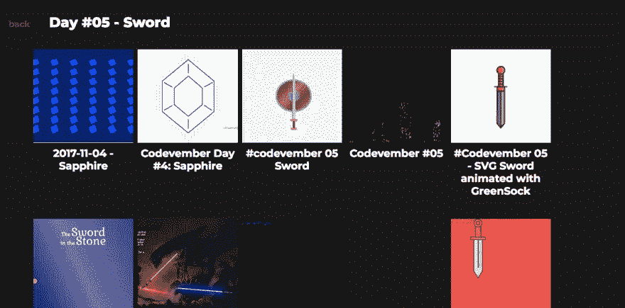
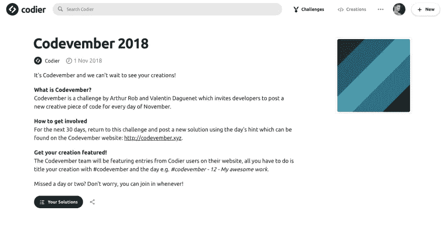

# 在这个# code 11 月挑战自己！

> 原文：<https://medium.com/hackernoon/challenge-yourself-this-codevember-508b6baf3741>

在过去的几年里，在开发人员的世界里，11 月已经被一个叫做 Codevember 的创造性编码挑战所接管。今年我自己也在尝试编写代码，希望读完这篇文章后，你也能挑战自己！

# 什么是 code 11 月？

code 11 月是亚瑟·罗布和 T2 邀请开发者在 11 月的每一天发布一段新的有创意的代码。

[code 11 月网站](http://codevember.xyz/)有一个提示列表，例如 *1。无穷大*， *2。时间*和 *3。胡萝卜*。根据提示，参与者想出一个受单词启发的创造性代码。例如，对于提示*音乐*，您可以用 JavaScript 创建一架可用的钢琴。

# 我为什么要做 code 11 月？

以下是一些你应该参与的理由:

*   给你一个尝试新技术的机会，你可能并不总是有机会
*   在享受乐趣的同时，帮助扩展您的 HTML、CSS 和 JavaScript 知识
*   30 天后，你将拥有一个值得骄傲的代码创作集

# 我怎么能做 code 11 月？

Codevember 团队的目标是使挑战尽可能容易，并允许您使用任何您喜欢的平台/工具提交您的创作。

如果你想让你的作品出现在 code 11 月网站上，你可以用几种方法。要在 Codier 上尝试[code 11 月，每天发布一个解决方案，标签为# code 11 月和该月的某一天，例如*# code 11 月— 12 日—我出色的工作*。CodePen 用户可以让他们的笔具有相同的标题格式。或者，您可以](https://codier.io/challenge/codevember-2018)[将您的作品](http://codevember.xyz/about)直接提交到 code 11 月网站。

如果你错过了一两天也不用担心，你可以随时加入！