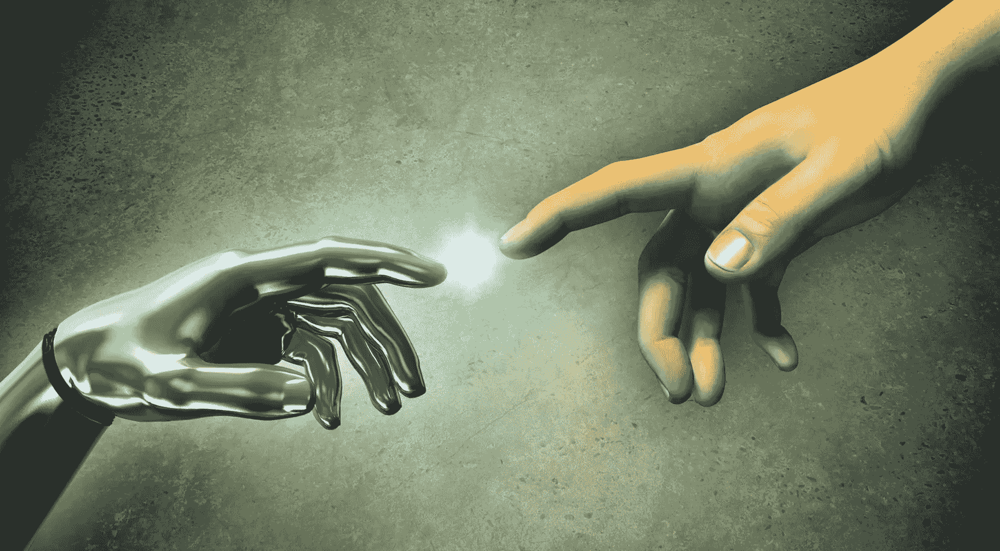

# 挑战者银行？伪装者。我们是唯一的竞争者！

> 原文：<https://medium.com/hackernoon/challenger-banks-pretenders-we-are-the-only-contenders-b6ce1d8f0bb2>

## 挑战者银行？

那不是我们。我们是新范式的竞争者，而不是半个世纪以来已经被打破的东西的重新发明。新的和现有的机构都在迭代地改善用户体验，但在用户消费的实际产品方面几乎没有创新。我们在这里颠覆苹果车，打破垄断，为消费者要求平等。

## 剥削？

不会了。我们寻求合作伙伴，为所有人的集体利益建立一个平台。如果我们成功了，你将得到你贡献的 10%的奖励.我们是新时代的新发明。这个世界想要无国界，金钱渴望自由，而互联网挣扎着不仅仅是难以想象的剥削工具。一场为新时代重塑货币技术的革命势在必行。

## 保守参与？

我们不想成为断梯上的下一级。我们看到了 challenger banks 正在做的事情，迭代地改进乏味过时的用户体验。货币是一种颠覆性的成熟技术。这是一种新的全球数字货币，在一个平台上形成了互联网下一波创新或破产的基础设施。为了实现这一目标，我们正在创造每个人都已经熟悉的产品和服务。这只是开始。最初的产品是数字化未来货币再造的跳板，为你提供了一个以前所未有的规模参与财富民主化的机会。

> 这是一种新的全球数字货币，否则就会破产

# 愿景是大胆的，言辞是轻率的，但言语是廉价的

需要的是行动。我们想象的未来不会从讨论中产生。要实现这种新的世界秩序，需要一种新的信仰体系和一种更广泛的共识，即集中服务的再分配有利于所有人。这是为了夺回我们自己的主权。

依赖是给追随者的。领导者通过创造他们想要居住的未来来燃烧自己的道路。屈从是放弃你的权利和责任，以利于接受他人强加的条件。

这不是询问，而是创造现有机构无力遵守的规则。柯达没有发明数码相机是有原因的，他们在胶片的成功上投入太多，以至于不能蚕食自己的利润。这是银行，但在更大程度上。他们被赋能到了一个不可能的程度，在没有资本的情况下承担了不可想象的风险，几乎让经济沉没，什么改变了？

# 在生活中，我们都有两种选择——行动或不行动

接受我们被给予的，或者一起起来要求改变——反抗。

我们正处于一个转折点。加密货币、令牌化和区块链出现在技术为变革创造了可能性的时代。目前，现有机构正试图破解技术，并创造一种方式，让他们能够从为所有人的集体利益而设计的创新中获利。我们可以袖手旁观，让它发生或在为时已晚之前驱逐他们。

## 跳上我们的船，抓住船桨

我们需要你和你认识的每一个人去实现未来的愿景，包括财富的再分配。这与个人无关，这是为了每个人的集体利益而一起工作的家庭的一部分。

# 数字时代的往来账户，为前所未有的消费者利益提供服务

想象一个世界，在那里你不是一件产品，而是一种资源和合作伙伴，因为你的关注而得到回报。

想象一下这样一个未来，你会自动从一个平台的集体知识中受益，这个平台代表你协商降低你的经常性开支，而你什么都不用做。

预见有一天，你的权力和影响力会成倍放大，使你能够对平台支持的事物施加影响，从而扩大你未来的财富。

## 那就是我们正在建造的

# [www.Nexves.com](http://www.Nexves.com)——今天加入我们

如果您注册并分享您的推荐链接，您将在下一年获得价值 10 英镑的代币奖励。10 个人注册，你口袋里就有 100 美元，作为对你帮助我们成长的感谢。