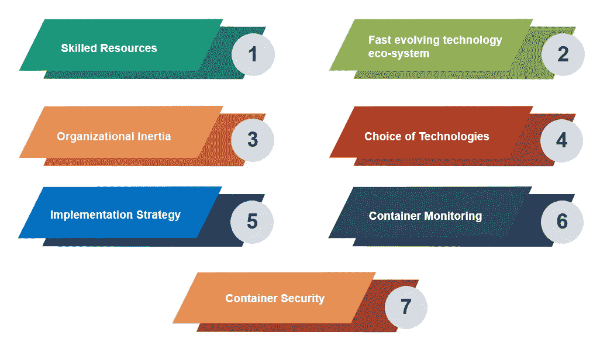

# 容器采用中的挑战

> 原文：<https://medium.com/hackernoon/challenges-in-container-adoption-72540b0be7ad>

这篇文章是[“容器技术的民主化”](/@junaid.wani/democratization-of-container-technologies-95cbbfaee08d)的延续，在这篇文章中，我讨论了 Docker 的迅速成名。

在本文中，我将关注组织在尝试实现基于容器的解决方案时所面临的棘手问题和挑战，在下一篇文章中，我将阐述在采用容器时应该遵循的最佳实践，同时考虑到最小摩擦和未来准备。这些见解是基于我在使用多个 [docker](https://hackernoon.com/tagged/docker) / kubernetes 实现时的经验和学习。我也是充满活力的 docker 社区的积极成员，该社区总是在需要的时候站出来提供帮助。

为了更好地理解这些挑战，我将它们分成 7 个部分。这些存储桶并不相互排斥，可以相互依赖或密切相关。

**技能资源:**

组织面临的主要挑战之一是吸引和留住合适人才的能力。随着[技术](https://hackernoon.com/tagged/technology)只有 5 年的历史&正以前所未有的速度被采用，需求超过供给数倍。虽然开发人员需要提升自己的技能来构建容器化的应用，但真正的挑战在于管理运营。操作基于集装箱的平台所需的技能与传统操作专业人员所拥有的技能非常不同。非常好的脚本&有效管理运营需要良好的编码技能，此外对应用程序架构、数据流和应用程序日志的良好理解也是必须的。所涉及的复杂性非常高，因为应用程序与依赖项和操作系统一起打包在一个轻量级容器中。此外，该容器运行在一个编排好的引擎上，该引擎旨在确保容器遵守为它们设置的预定义规则。

举个例子，我们计划了一整天的招聘活动，招聘具有 kubernetes / docker 实践技能和对周围生态系统经验的良好理解的工程师。尽管我们收到了许多写得很好的简历；但是到了最后，我们甚至找不到一个深入了解这项技术的技术专家。

**快速进化的技术生态系统:**

Docker 生态系统正在以极快的速度发展。作为一项潜力巨大的开源技术，第三方工具和服务大量涌现。帮助开发人员编写 docker 图像的工具；部署、配置和管理集装箱化工作流程的工具；在容器化应用生命周期的不同阶段实现自动化的工具；每周都有大量涌现。虽然这听起来像是新兴平台之旅中发生的一件大事，但这使得为不同类型的应用程序选择合适的技术/工具成为一项极其艰巨的任务。在为这些工具设计升级策略时，会增加复杂性。

正如我们在第一点中所讨论的，这也带来了获取和保留拥有多种即将到来的技术的熟练资源的挑战。

在我之前的一个任务中，我们为一家大型电信提供商封装了一个增值服务应用程序，我们需要将一些预定义的 IP 列入白名单，计费请求需要从这些 IP 发起，以便交易被视为合法。已经做出了继续使用云托管的托管容器平台的决定，但是我们意识到，大多数云平台在那个时间点都不能够提供该功能。我们必须与云提供商合作，想出一个创新的解决方案来让设置工作，这涉及到引入一个新的工具。

**组织惯性:**

高效地实现容器是对组织习惯的传统工作方式的重大转变；它涉及开发和运营中应用程序生命周期的所有方面。它需要快速的创新步伐，以及授权给开发人员&实质上重新训练运营团队。必须遵循 DevOps 原则&必须构建 CI & CD 中的自动化，以便在集装箱化环境中取得成功。

现有的工作方式，尤其是变更管理过程，对开发人员的访问限制&缺乏运营团队的产品知识；是采用过程中的巨大障碍。例如，包括每周 CAB 会议和来自不同利益相关者的多个批准步骤的变更管理过程不会支持集装箱化生态系统所需的速度。类似地，将开发人员的访问限制为只写和提交代码也会降低这种实现的效率和速度。开发人员需要负责确保他们创建的任何应用程序逻辑在生产中运行，并在需要时快速修复它。

在为一家大型酒店开发容器化应用程序时，开发人员很难访问容器化平台&运营工程师发现调试应用程序问题极其困难。

**技术选择:**

随着生态系统的快速演变和过多的选择，选择正确的技术变得极其困难。有太多的选择，不像过去的企业；没有绝对的领导者，创业公司可能比科技巨头有更好更相关的面向容器的工具。

举几个例子来说，基于云的托管容器解决方案、基于云的本地托管 kubernetes 解决方案、自我管理的 Kubernetes 解决方案、持久存储、编排、服务发现、联网、秘密管理、跟踪、监控以及一系列具有独特卖点的技术都有多种选择。最重要的是，更好的选择正在不断被创造出来。

组织发现很难为其使用案例和工作负载选择合适的工具，同时确保该工具也能满足其未来需求。组织也希望尽可能地继续使用他们现有的许可工具，但对现有的互操作性和容器生态系统工具的了解有限；这个决定变得更加困难。

我参与了一个在线视频流媒体公司的项目，该公司使用 spring boot 迁移到微服务，并希望将这些部署到云托管的 kubernetes 平台，我们的任务是创建服务发现引擎。在团队内部，我们对是否应该选择 Consul、etcd、registrator 和 confd 组合以及 zookeeper，或者 docker swarm、kubernetes、ECS 等内置服务发现有不同意见。选择正确的工具本身就成了一项艰巨的任务。

**实施策略:**

组织在采用容器时面临的另一个障碍是缺乏适当的实现策略。容器的采用已经在开发人员和操作工程师级别得到了最大的关注，但是对于一个成功的生产实现，需要有一个合适的策略。在大多数组织中，采用是临时的，没有一个连贯的计划，不同的团队选择他们自己的策略。没有定义短期和长期目标，在过渡阶段缺乏有效的检查和平衡。没有定义要跟踪的指标，没有对这些指标进行基准测试。

选择应用程序时，不要考虑移动到容器的优点/缺点，因此移动的结果与预期的不同。工作负载预测、自动扩展需求、自动修复、数据持久性、服务发现、断路、金丝雀部署等。不在考虑之列。

如果选择/设置不当，编排引擎也可能成为棘手问题，例如 Kubernetes 和 Docker Swarm 都在主从配置中工作&使用多主设置。领导人是使用共识算法选出的，这种算法需要很好地理解，以确保没有问题。

举例来说，RAFT 共识算法需要[ `(N/2)+1]` 个成员的多数或法定人数来就向群集提议的值达成一致。

**集装箱监控:**

集装箱监控是一个完全不同的领域，很少有组织能够很好地处理如何监控短暂的、超快的和轻量的集装箱。在实现这一目标的同时，必须确保我们不会对集装箱施加过大的负荷。精心安排的集装箱环境非常复杂，常规监控解决方案在这种情况下根本不起作用。

考虑一下这个用例，我们正在运行一个容器编制器，它有一个多主设置，其中主节点必须保持同步并持续相互通信。除此之外，这些主节点运行多个控制活动，用于维护容器的状态、进行健康检查、在出现故障时动态创建新容器。除此之外，orchestrator 还创建了一个覆盖网络，这是一个针对 Docker 守护程序主机的分布式网络。这个网络位于特定于主机的网络之上，允许连接到它的容器安全地通信。

所有这些只是冰山一角&所有这些因素都必须考虑在内，并且必须对这些方面进行监控。

**集装箱安全:**

容器安全性是容器化应用程序和开发编排策略和脚本时被忽视的另一个方面。容器的安全漏洞与操作系统级别的漏洞一样令人担忧，如果我们运行的是具有 root 访问权限的特权容器，这种担忧会更大。开发者和操作工程师没有给予足够的思考来检查平台的潜在漏洞。服务之间的交互往往没有得到正确的跟踪，这使得识别错误的交互、安全违规和潜在的延迟变得困难。大多数 docker 映像构建在顶级开源轻量级基础操作系统上，并且基础映像在容器之间共享，因为 docker 使用了写入时复制的概念。如果漏洞悄悄进入，这可能会暴露很大的表面区域。

在为一家大型金融客户实施容器编排解决方案时，我们发现 etcd 主数据存储将机密数据作为未加密的明文保存在磁盘上。如果这些失误出现在生产环境中，可能会导致重大问题。

虽然这些挑战初看起来令人望而生畏，但如果我们为过渡做好充分准备，并采用合理的策略，大多数陷阱都是可以避免的。在下一篇文章中，我将讨论在组织中引入和实现容器的最佳实践。