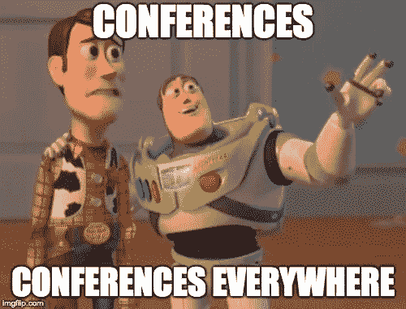
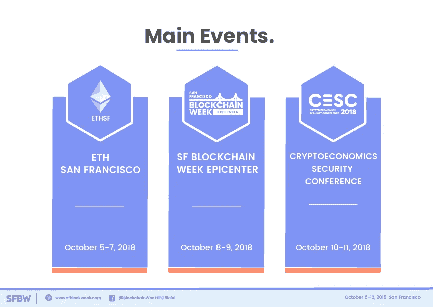
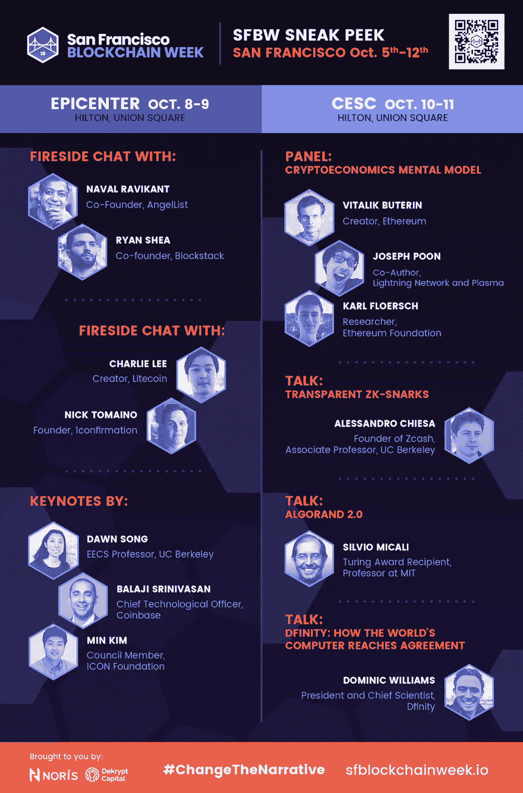

# 改变叙述

> 原文：<https://medium.com/hackernoon/change-the-narrative-f55a64f1f00>

## 旧金山区块链周

*由***[*乔纳森艾伦*](/@jonallen_96794) *和* [*凯文胡恩*](/@kemihu2011)**

****

**2018 年，区块链的大型[会议比白天还要多。过去两年来，加密价格的飙升引发了许多人的兴趣，因为他们发现了快速获利的机会。不幸的是，会议成了密码行业中权宜联网和“快速致富机会”的平台。这种可感知的财务利益允许会议仅仅为了“访问”网络机会而收取过高的费用，而几乎没有提供实际内容来教育普通消费者、投资者和开发者。](https://hackernoon.com/tagged/blockchain)**

**自今年年初以来，密码价格的稳步下降对许多人来说是毁灭性的。全面的价格贬值导致投机者纷纷退出该行业。令人欣慰的是，许多受短期利益驱使的个人(雇佣兵)已经逃离了这个领域，留下了更多真正热情的传教士。**

**我们该如何以及向何处去？**

**许多人进入了这个领域，投资了 vaporware，离开时感觉被骗了或被利用了。这一系列事件使得人们有必要齐心协力改变该行业的叙事。是时候将空间重新聚焦到真正重要的东西上了:教育、发展和区块链去中介化根深蒂固但效率低下的机构的潜力，同时赋予个人权力。当前的市场提供了一个黄金机会，让我们与一个具有长远眼光并出于正确原因参与其中的团队一起前进。我们在 Norís 和 Dekrypt Capital 一直听说区块链产业迫切需要更容易获得高质量的教育内容。这意味着对开发者和消费者的教育，以便前者获得必要的技能来构建未来的分散基础设施，而后者获得知识来采用已经构建的所述基础设施。区块链产业的现状与 90 年代的计算机产业没有什么不同，在 90 年代，将需要建造者和使用者共同推进这一领域的发展。**

****介绍旧金山区块链周****

****

**上面概述的挑战和机遇一直是旧金山区块链周(SFBW)组织背后的指导主题。这是*每个人*的事件；无论是真正的信徒还是个人，都只是对在这个为期一周的教育活动中学到更多感兴趣。**

****

**本周的开幕活动是 **ETHSanFrancisco** 黑客马拉松，来自各种背景的 1000 多名开发人员将在世界上最大的以太坊黑客马拉松上争夺奖品。在第二个活动中，**中心**，与会者可以进入多个舞台，这些舞台上充满了展示新观点、发展和教育内容的行业领袖**。**本次活动是 SFBW 两个主要活动中的第一个，专门围绕课堂式研讨会组织。Oasis labs、ICON、Kyber Network、Rchain、Zilliqa、Lightning Network、Cosmos 等项目将出席，唯一目的是向开发人员介绍他们的平台。带上您的编码工具，不要错过这个机会，参与一些您听说过但还没有机会参与的最有趣的项目！**

**SFBW 的最后一项活动是**加密经济安全会议** (CESC)，主要关注加密经济学领域的最新学术发展。潜在的演讲者提交了研究论文，由顶尖学者组成的项目委员会进行审查，以便在这一独家活动中获得演讲席位。任何有兴趣向 Emin Gun Sirer、Vitalik Buterin、Joseph Poon、希尔维奥·米卡利、Dominic Williams 等顶级学者和思想领袖学习的人都不会错过这次活动！**

**业内许多人都关注可伸缩性等技术问题，但可用性等问题也同样重要。本周的大部分内容侧重于采用，并将提供有意义的对话以及友好的辩论，主题从安全令牌和监管到 TCR(令牌管理的注册中心)的实用性。讨论将包括来自多个角度的观点，因为本周试图消除小组讨论中常见的无聊回音室。**

**过去会议上经常讨论的重复性和无意义的猜测性事件将会明显减少。虽然许多人聚集在以前的会议上只是为了讨论演示文稿，但在 SFBW 上，你会想粘在你的座位上。不再有可回收的绒毛。为了社区的利益，提供真实的、有形的内容的时候终于到了。教育和采用是推动该行业发展的主要障碍，我们将正面解决这些问题。SFBW 来这里是为了**#改变裁判**。一周只有两条规则:来学习，保持好奇！**

**PS:为了减少炒作和猜测，一些社会活动将被勉强提供。请继续关注官方指南，其中包括官方欢乐时光和派对后的列表。**

**SFBW 支持这个空间的未来建设者:如果你是开发者或学生，请在这里申请免费的 T2 门票。**

**特别感谢我们的冠名赞助商:ICON、CRED、Shyft 和 supporting 支持我们的事业并帮助实现这一目标！**

**[*比特币*](https://hackernoon.com/tagged/bitcoin) *大会:2018 年完整榜单。(未注明)。检索自*[*https://www.bitcoinmarketjournal.com/conferences/*](https://www.bitcoinmarketjournal.com/conferences/)**

****SFBW 重大事件****

1.  **10 月 5 日至 7 日(艺术宫)**
2.  **10 月 8 日至 9 日，震中(希尔顿联合广场)**
3.  **10 月 10 日至 11 日，CESC (希尔顿联合广场)**