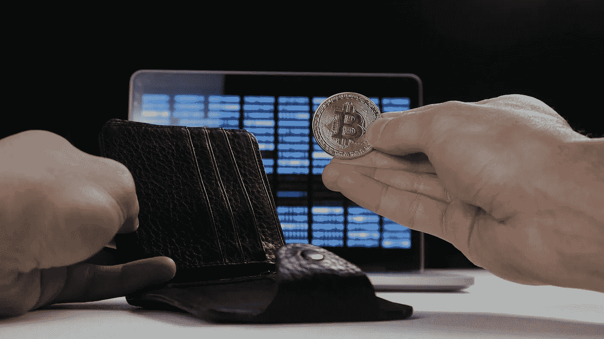

# 立即更改您的购买地点，并获得 10%的加密货币返现！

> 原文：<https://medium.com/hackernoon/change-where-you-buy-from-and-receive-10-cashback-in-cryptocurrency-today-451b9fe1f564>

# 您会改变购买产品的地点，以加密货币形式获得 10%的返现吗？

## 如果你愿意:突出这一点

## 如果你不愿意:突出这一点

这个作品是关于[我的创业公司](http://www.nexves.com)的一个产品特性。我们得到了过去 10 年英国最具颠覆性的 10 亿英镑企业的首席执行官/创始人的投资。该产品将在未来 3-5 个月内供您和任何人使用。

T 他的第二个问题是你为什么不会？每个人都在网上购买产品，你为什么不通过一个基于奖励的激励计划来这样做呢？这个计划可以让你从你购买的每样东西中积累一笔资产。

这就是我们正在创造的世界。几乎对这个问题的每一个回答都是压倒性的“是的！！没脑子！”，但有一点需要注意。**“它会来自我们信任且目前购买的地方吗？”**

那些对通过消费增加加密货币储蓄的想法感到兴奋的人，预计会对这个答案感到失望。

## 他们从来都不是

货物将来自与你目前购买的完全相同的地方，这仅仅是你所收到的额外奖励。你的习惯不必改变，但你的回报有可能成倍增长。

要参与进来，你不需要改变你从谁那里购买，你只需要改变这些采购的来源。您的选择不是非此即彼，您的加密货币奖励将成为您已经购买的产品的额外奖励。

## 到目前为止，几乎每个人都听说过加密货币

# 不是每个人都知道如何购买

即使你想参加，这也不是一件容易的事。像比特币基地这样的事情有助于让零售观众接触到购买，但这仍然是日常生活中人们不太可能感到舒服的事情。它要求你下载一个应用程序，投资一个你可能不完全了解的产品。很少有人意识到，你可以买到整枚硬币的零头，比如 0.00000001 比特币。

我们认为这消除了这些障碍。不需要投资，您的加密货币只是您已经获得的奖励。我们正在建立一种无摩擦的机制，向公众展示加密资产，同时消除你购买任何加密资产的需要。

## 最坏的情况

你以你本来会为一件商品支付的价格购买了一件商品，你会收到加密货币，你可以立即将其作为奖励出售。

# 最好的情况

你以你无论如何都会支付的价格进行购买，并保留你收到的加密货币，然后在你出售它之前它会升值。

## 这既关乎奖励，也关乎教育

我们认为全世界都应该亲身体验加密货币的好处，而最好的方式就是让你拥有它。这意味着为您提供一个加密安全的钱包，像手机银行一样简单易用。通过向您提供加密货币的所有权，我们相信您可以自己了解增加兴趣的机会。

通过拥有某样东西，你可以了解它的好处，并向你展示它是多么容易出售或交换。我们不是试图去理解那些被媒体弄得听起来很复杂的东西，而是想让你知道这有多简单。不管你信不信，价值都是有目共睹的。这是一个百年一遇的机会来参与一项将彻底改变世界的技术。

你已经在购买产品和服务了，为什么你不想要更多呢？这让你有机会在不改变现有习惯的情况下积累真正的财富。

你可以零风险积累投机资产，而收益是指数级的。你可以积累的财富没有限制，你可以收到的加密货币的数量也没有限制。

这是我们的承诺。

我们允许你免费参与，为金钱和互联网的未来提供了一个跳板。你所要做的就是以你一贯的方式行事，同时以稍微更明智的方式购物。

## 加密货币正在吞噬世界

# [这是你拥有它的最聪明、最简单的方式](http://www.nexves.com)