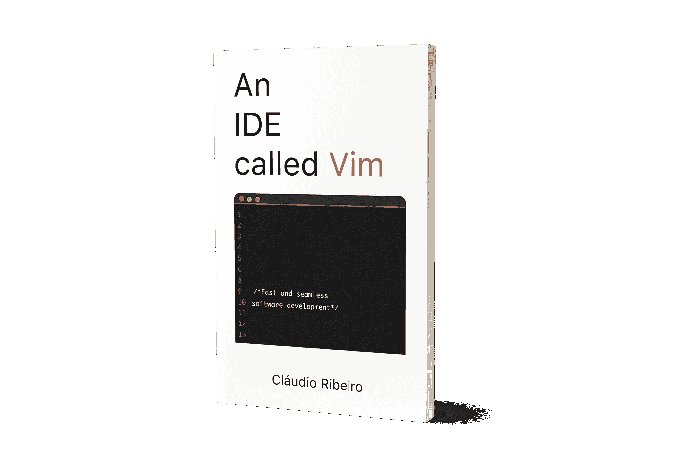

# 更换为 Neovim

> 原文：<https://medium.com/hackernoon/changing-to-neovim-28cda0ad35c2>

在过去的几年里，Vim 发生了变化。它已经成长并演变成一个更现代的软件。一些反应灵敏且功能丰富的东西。

如果你像我一样，已经使用 Vim 7.4 很多年了，那么更新更好的版本的出现会让你大吃一惊。

 [## 现代 Vim

### 当谈到 Vim 时，大多数人认为它是上个世纪过时的软件。

hackernoon.com](https://hackernoon.com/modern-day-vim-ab4d3aa0cf6b) 

在本文中，我们将讨论如何从 Vim 7.4 迁移到 Vim 的现代版本(Vim 8，Neovim)。

让我们把重点放在切换到 Neovim 上，因为切换到 Vim 8 应该几乎毫不费力。配置文件将在同一个地方，一旦安装，它应该与您以前的所有配置开箱即用。

有两种方法(使用 Linux)来安装 Vim 8:

1.  使用非官方的 PPA:

*   *sudo apt-add-repository PPA:jonathonf/vim*
*   *须藤 apt 更新*
*   *sudo 安装 vim*

2.从官网下载[最新版本](https://github.com/neovim/neovim/releases/tag/v0.3.1)，自行构建。

对于 Mac Os 用户来说， *brew 升级 vim* 应该足够了。

尽管 Neovim 是 vim 的一个分支，但它并不是完全相同的东西。我们可以说这是一个完全不同的软件，但这有点激进。但是因为不一样，所以安装方式也不一样。

同样，我们可以使用 PPA:

*   *sudo apt-add-repository PPA:neovim-PPA/stable*
*   *sudo apt 更新*
*   *sudo 安装 neovim*

或者使用包管理器: *sudo 来安装 neovim。*

对于 Mac OS 用户，当然: *brew 安装 neovim*

Neovim 不是 vim，正因为如此，使用 *$vim* 来启动它是行不通的。如果您碰巧安装了过时版本的 Vim 或 Vim 8，那么使用这个命令会更好。启动 Neovim 的正确命令是 *$nvim。*

有一些方法可以让 *$vim* 命令的行为类似于 *$nvim* 。它包括把它变成一个别名 *$nvim* 。互联网上有很多这样做的资源，但是在你的头脑中做出改变并不复杂。

有一件事肯定会让我们的生活变得更加艰难，那就是所有的 Vim 配置都驻留在 *~/上。vimrc* 。但是 Neovim 使用

*~/。config/nvim/init.vim*

默认情况下。因为我们都很懒，不想让配置文件在我们的文件系统中到处复制，所以可以选择创建一个 *~/。config/nvim/init.vim* 包含以下内容:

***设定 runtimepath^=/.vim runtimepath+=~/。*后的 vim/**

***let&packpath =&runtime path***

***来源~/。vimrc***

这段代码的作用是，每次你启动 nvim 时，它都会搜索你的。vimrc 文件和源代码。这样，您现有的所有配置仍将在 Neovim 上运行。

顺便说一下，

恭喜你，你刚换到 Neovim！

Vim 有问题吗？不知道该放什么进去。vimrc 文件？想用来编程？看看我的新书《一个叫做 Vim 的 IDE》。它介绍了 Vim 的所有基础知识，从安装到作为 IDE 使用。

