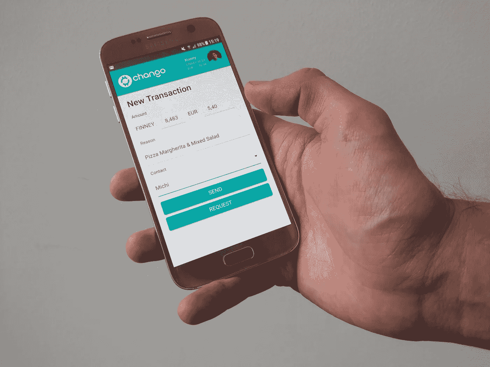

# 关于 chango

> 原文：<https://medium.com/hackernoon/chango-the-cryptocurrency-payment-app-of-the-future-6a7d7e39761c>

## 未来的加密货币支付应用

最好的解决方案来自于找出对简单需求的回应。比如？一群开发人员发现了通过加密货币请求支付的需求，这是开发人员和其他许多人每天都在做的事情:订购食物送到办公室！

每次他们点餐时，总会有人被账单卡住，不得不挨个儿去找每个人，索要他们应得的那份钱。该小组中的一些人已经是加密爱好者，他们想到，如果有一种方法可以快速、轻松地用加密货币支付每个人，那将是理想的。

*俗话说:*

> *“需要是发明之母。”*

到目前为止，市场上还没有允许朋友和家人以加密货币形式互相请求资金的应用程序。确实存在的是笨重且难以管理，没有支付跟踪，并且需要在每笔交易中添加笨重的公钥。

chango 正在改变这一切。

# 什么是 chango？

这是未来的加密货币支付应用。只需敲几下键盘，你就可以在世界任何地方向朋友和家人发送或请求资金，即时且完全安全。所有交易都在区块链分散处理，安全可靠。

外汇交易已经超越了机构投资的范畴。这是一个需要让个人在日常金融交易中变得简单和容易的过程。 [chango](http://chango.tech/) 是关键。

# 世卫组织是昌戈背后的人吗？

chango 是 elunic 的子公司，elunic 是一家技术创新公司，在过去的 15 年里完成了 1800 多个项目。在此期间， [elunic](http://elunic.de/) 雇佣了 50 多名员工，满足了 700 多名客户的需求，是数字领域不可忽视的力量。

正是他们的迭代软件设计过程使得高效和成功地交付项目变得不同。他们可以在几天内从需求收集阶段转移到开发/设计/测试阶段，在一周内交付集中的范围项目以进行选择部署和反馈。这是一个使用标准软件开发过程的组织需要几个月才能完成的过程。

chango 团队本身是由几个伟大的头脑组成的，包括自称的密码爱好者，他们已经在密码领域工作多年。他们累积了 150 年的技术经验，为这一发展领域带来了前所未有的知识和热情。

First pizza paid with #chango

# **chango 有何独特之处？**

目前，在大多数加密货币应用程序中，你必须输入一个很长的公钥才能向他人汇款。这对于朋友和家人之间快速、轻松地完成金融交易来说是一个巨大的麻烦。

此外，大多数应用程序无法向其他人请求资金，而不是真正的双向交易。

[chango](http://chango.tech/) 正在改变这一切。

*初始推出的* [*chango*](http://chango.tech/) *将包括:*

*   能够快速方便地从应用内联系人列表发送和请求资金。
*   只需一个姓名即可轻松管理联系人列表，并添加自定义联系人公钥。
*   交易时无需每次输入 34 位公钥:只需输入金额、收件人并点击发送！
*   通过 WhatsApp、Messenger 等与您的朋友共享您的 Chango-ID。

基于[请求网络](https://blog.request.network/request-network-project-update-march-2nd-2018-online-payments-ama-fa814c67ffba)和[以太坊](https://blog.request.network/request-network-project-update-march-2nd-2018-online-payments-ama-fa814c67ffba)， [chango](http://chango.tech/) 旨在让数字金融交易变得像发送电子邮件一样简单！

First chango prototype

# **chango 接下来要去哪里？**

当然，一个基于快速迭代设计过程的公司不会停滞不前太久！为了让 [chango](http://chango.tech/) 成为加密货币消费和分享的“首选”应用，开发者们已经有了一些伟大的计划:

*   指纹以及分散式认证。
*   将联系人列表导入应用程序并识别现有的 [chango](http://chango.tech/) 用户。
*   多种货币支持，允许使用不同的加密货币。
*   非接触式菲亚特支付，通过应用程序让购物变得更加广泛。
*   集体支付——让那些无处不在的送货订单对每个人来说都变得更加容易！

chango 的任务很简单:“建立一个 P2P 支付应用来推动加密技术的应用”。现在，看着他们完成！这是金融货币领域的一个勇敢的新世界，chango 将站在最前沿，提供一个用户友好、强大的应用程序，使发送和接收加密货币像 1-2-3 一样简单。

*   **主页:** [www.chango.tech](http://www.chango.tech)
*   **Twitter:** [https://twitter.com/Chango_App](https://twitter.com/Chango_App)
*   **Reddit:**[https://www.reddit.com/r/ChangoApp/](https://www.reddit.com/r/ChangoApp/)
*   **Facebook:**[https://www.facebook.com/changoapp/](https://www.facebook.com/changoapp/)
*   **Youtube:** [https://www.youtube.com/channel/UCrk2ijdEnsZgyBG7m8NZUzQ](https://www.youtube.com/channel/UCrk2ijdEnsZgyBG7m8NZUzQ)