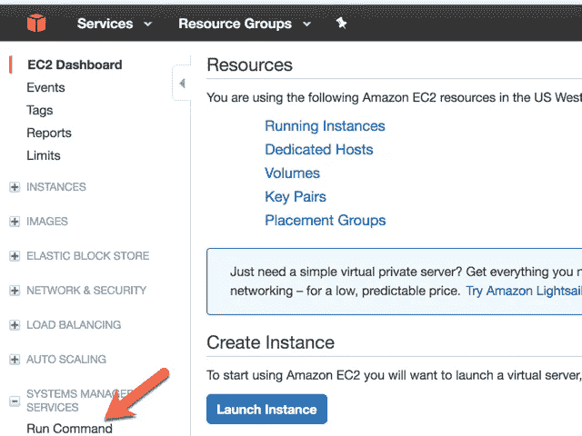
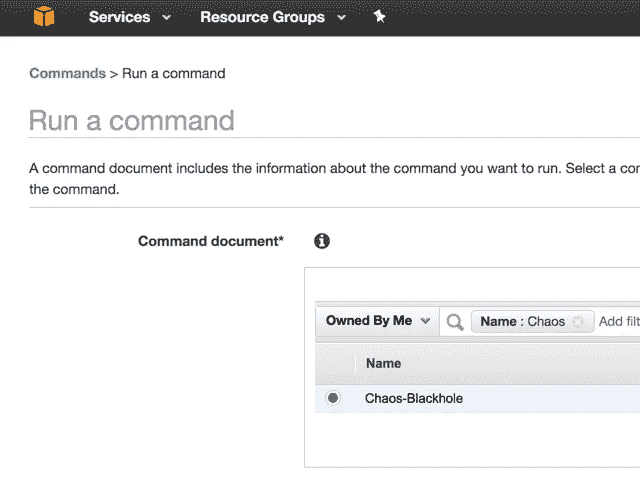
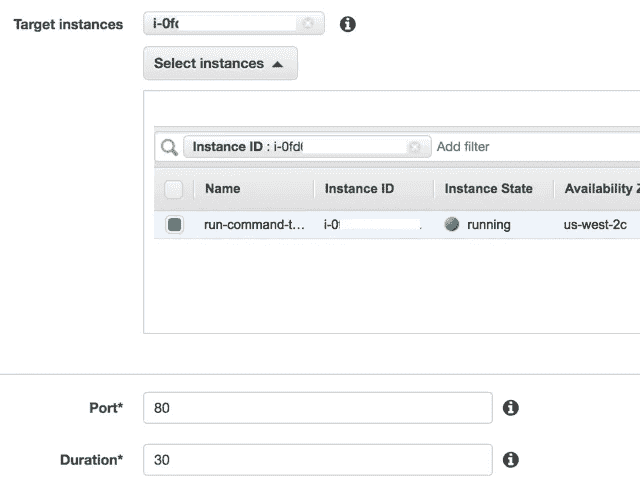
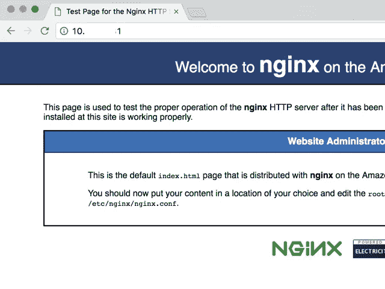
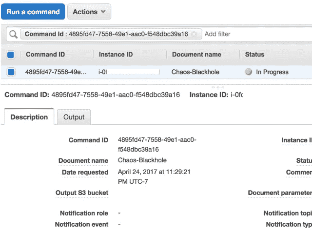

# 使用 Amazon EC2 系统管理器的混沌工程

> 原文：<https://medium.com/hackernoon/chaos-engineering-using-amazon-ec2-systems-manager-5278e0bc8482>

[Source: [https://www.pexels.com/photo/black-and-white-city-electric-train-electrical-wires-414931/](https://www.pexels.com/photo/black-and-white-city-electric-train-electrical-wires-414931/)]

# 背景

我一直在研究如何将混沌引入应用程序的工具(混沌 T2 工程工具)，这样我就可以测试应用程序是否有弹性。当我在探索不同的[工具](https://hackernoon.com/tagged/tools)时，我探索了为什么我不能利用 AWS 中已经可用的 Amazon EC2 Systems Manager 工具套件来为应用程序引入混乱的想法。

## 什么是亚马逊 EC2 系统管理器？

Amazon EC2 Systems Manager 是一组功能，可帮助您自动执行管理任务，例如收集系统清单、应用操作系统补丁、自动创建 Amazon 机器映像(ami)以及大规模配置操作系统和应用程序。Systems Manager 允许您远程安全地管理托管实例的配置。

更多信息请访问:[http://docs . AWS . Amazon . com/systems-manager/latest/user guide/what-is-systems-manager . html](http://docs.aws.amazon.com/systems-manager/latest/userguide/what-is-systems-manager.html)

带着这个想法，我开始寻找所有可以引入混乱的不同方法，并寻找可以使用 EC2 已经有的工具，而不是构建自己的工具。

这些工具是亚马逊系统管理器的一部分，我选择它们来执行混沌工程

1.  SSM 文件
2.  运行命令

## 什么是 SSM 文件？

Amazon EC2 系统管理器文档定义了系统管理器在托管实例上执行的操作。Systems Manager 包括十几个预先配置的文档，您可以通过在运行时指定参数来使用这些文档。文档使用 [JavaScript](https://hackernoon.com/tagged/javascript) 对象符号(JSON ),它们包括您指定的步骤和参数。步骤按顺序执行。

更多信息请访问::[http://docs . AWS . Amazon . com/systems-manager/latest/user guide/sysman-SSM-docs . html](http://docs.aws.amazon.com/systems-manager/latest/userguide/sysman-ssm-docs.html)

## 什么是运行命令？

Systems Manager Run 命令允许您远程安全地管理托管实例的配置。一个*托管实例*是混合环境中已经为 Systems Manager 配置的任何 Amazon EC2 实例或本地机器。运行命令使您能够自动执行常见的管理任务，并大规模执行临时配置更改。您可以从 EC2 控制台、AWS 命令行界面、Windows PowerShell 或 AWS SDKs 使用 Run 命令。

更多信息请访问:[https://aws.amazon.com/ec2/run-command/](https://aws.amazon.com/ec2/run-command/)

# 安装演练

让我们演练一下运行混沌工程实验所需的设置

## 设置系统管理器

要开始使用 Amazon EC2 系统管理器，请验证先决条件，配置 AWS 身份和访问管理(IAM)角色，并在托管实例上安装 SSM 代理。

本文讲述了如何配置 IAM 角色以及 SSM 代理的安装步骤:[http://docs . AWS . Amazon . com/systems-manager/latest/user guide/systems-manager-setting-up . html](http://docs.aws.amazon.com/systems-manager/latest/userguide/systems-manager-setting-up.html)

使用上面的步骤，在您想要执行混沌实验的 Amazon Linux EC2 实例上安装 SSM 代理。

## 创建 SSM 文档

我们将创建一个 SSM 文档来运行我们不同的混沌工程实验。让我们从创建一个文档开始，在指定的时间内在指定的端口上封锁一个实例。我将继续用不同的 SSM 文档模板来完成不同的混沌工程实验。

该页面讲述了如何创建 SSM 文档:[http://docs . AWS . Amazon . com/systems-manager/latest/user guide/create-SSM-doc . html](http://docs.aws.amazon.com/systems-manager/latest/userguide/create-ssm-doc.html)

对于实例上黑洞 a 端口的用例，您将使用以下信息创建文档:

**名称:**混沌-黑洞

**文档类型:**命令

**内容:**

Content used for Blackhole SSM Document

正如你在上面看到的，我使用`aws:runShellScript`动作在实例上执行命令来封锁实例上的一个端口。让我们演练一下我正在使用的命令。

`iptables -A INPUT -p tcp — destination-port {{ port }} -j DROP`

添加 iptables 规则以丢弃指定端口上的数据包

`sleep {{ duration }}`

等待指定的持续时间

`iptables -D INPUT -p tcp — destination-port {{ port }} -j DROP`

删除 iptable 规则以丢弃指定端口上的数据包

> Port 和 Duration 都是文档的参数，当执行 Run 命令时，这些参数将被填充值。

# 运行混沌工程实验

现在，系统管理器代理已经安装在 EC2 实例上，SSM 文档也已创建，是时候运行我们的混沌工程实验了，让我们看看如何运行混沌黑洞实验。在我们的实验中，我们将在安装了 SSM 代理的 EC2 实例上安装 nginx，并将在 nginx 在该实例上使用的黑洞端口 80 上运行我们的混沌实验。当实验运行时，我们应该无法通过端口 80 上的浏览器访问该实例上的 nginx。如果我们无法通过浏览器访问实例上的端口 80，那么这意味着实验成功了。

## 为我们的混沌工程实验准备 EC2 实例

1.  SSH 到安装了 SSM 代理的实例
2.  通过运行命令`yum install nginx -y`安装 nginx
3.  通过运行命令`service nginx restart`启动 nginx
4.  通过运行`curl [http://localhost](http://localhost)`验证 nginx 正在实例上运行，并查看是否得到响应

## 运行实验

现在 EC2 实例在端口 80 上运行 nginx，我们可以运行我们的混沌黑洞实验，看看我们的实验是否成功。对于本演练，我使用 AWS 管理控制台，但是我在文档中提到的所有步骤都可以使用 AWS CLI 或 AWS SDK 运行。

*   导航到 AWS 控制台，并从服务列表中选择 EC2 服务。在 EC2 仪表板中，从左侧菜单中选择**运行命令**

Run Command

*   在命令窗口中，点击`Run a command`按钮
*   在`Run a command`窗口中，过滤`Owned by me`的可用命令，选择`Chaos-Blackhole`文档

Selecting Chaos-Blackhole Document from the list

*   从目标实例中选择已配置 SSM 代理的实例
*   输入 80 作为黑洞的端口号
*   输入 30 秒作为黑洞的持续时间

*   填写完这些细节后，您可以点击底部的`Run`按钮开始我们的实验
*   在实验之前，我可以通过浏览器访问 nginx

*   在实验过程中，当我试图从浏览器点击 EC2 实例的 ip 时，它停止响应，轮子继续旋转

Nginx was not accessible during the execution of the run command

*   一旦 Run 命令执行完毕，我就可以通过浏览器毫无问题地访问 nginx 了
*   您还可以在命令列表窗口中查看运行命令的状态

Run Command Execution

*   通过利用 EC2 Systems Manager，我能够在一个实例上成功运行黑洞 a 端口的混沌工程实验。

请随时提供关于方法和改进方法的反馈。