# 第 1 章—一个全新的世界

> 原文：<https://medium.com/hackernoon/chapter-1-a-whole-new-world-6914b0dc5a72>

第 0 章探讨了当今许多企业存在的背景。信息技术和互联网的部署时代带来了规模空前的大型组织。

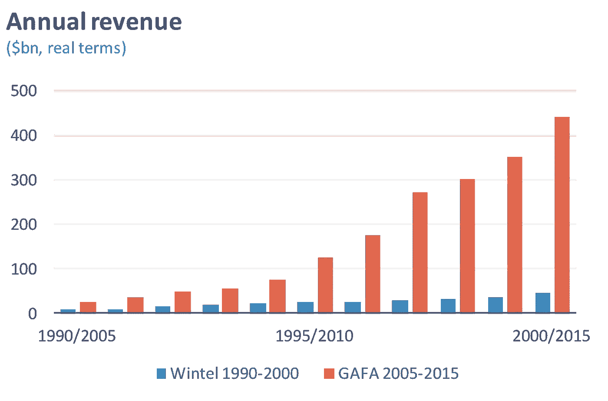

Source: (Bloomberg, A16Z)

这些组织继续寻找创新和增长的领域。例如，2011 年至 2016 年间，苹果收购了 70 家公司，脸书收购了 50 多家，谷歌收购了近 200 家。

然而，“无限制的增长需要加速创新周期以避免崩溃。增长在有限的时间里是无限的。在未来的某个时候，这个系统会崩溃”。

技术和金融已经并将继续对重塑 T2 商业产生最大的影响。

[技术](https://hackernoon.com/tagged/technology)导致了:

*   为每个人提供更便宜的工具——创办一家公司的成本已经从 2000 年的 500 万美元下降到今天的 5000 美元。⁴顺便提一下，由于对平台的依赖，扩大公司规模变得越来越昂贵。对许多人来说，谷歌、脸书和亚马逊控制着分销。
*   互联网-现在每个人都连接在一起，2017 年超过 35 亿人可以访问互联网。⁵
*   软件正在吞噬世界——无形资产的崛起和商业延展性的增加。

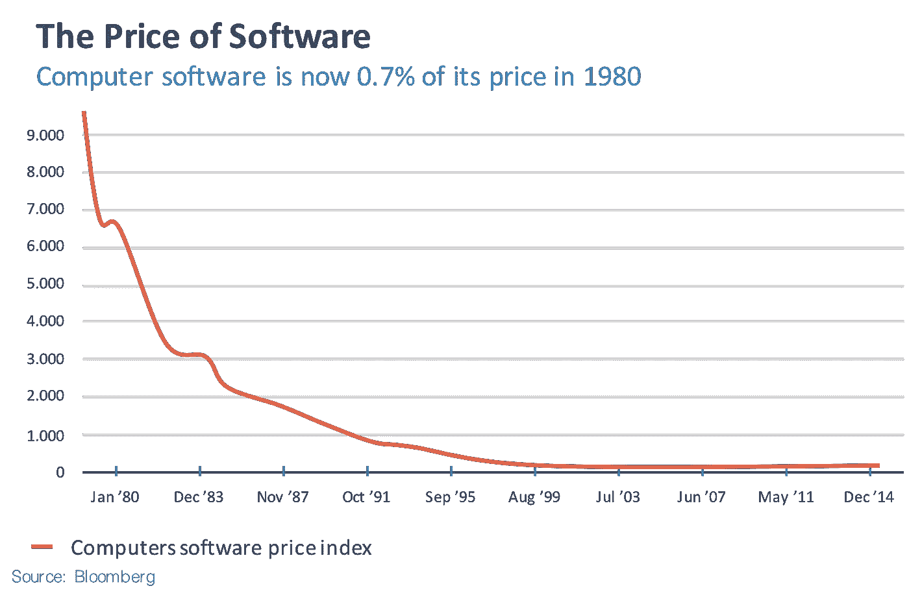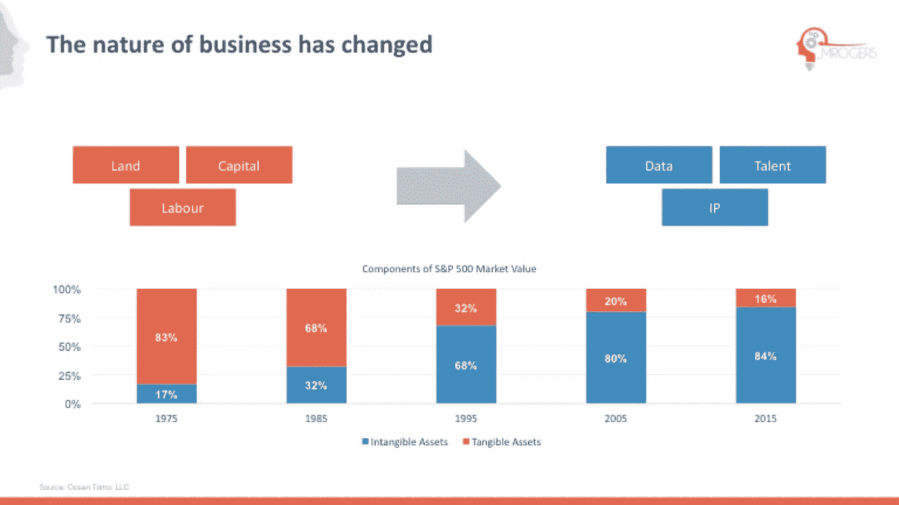

科技已经将商业和经济从供应驱动的世界转变为需求驱动的世界(消费化，需求比供应越来越重要，以及一个富足的世界)。

金融已成为资助新创新和在新企业中大规模部署资本的重要催化剂

(即股份公司或垃圾债券)。然而，有证据表明，金融现在不再服务于实体经济(“主街”)，而是服务于自身——这就是“金融化”。

根据 Rana Foroohar 的说法，“从金融机构流出的资金中，只有 15%真正进入了商业投资。其余部分通过买卖现有资产，如房地产、股票和债券，在一个封闭的金融循环中流动。⁶

1950 年至 2000 年间，金融在美国和英国经济中的份额增加了两倍。平均而言，在发达经济体中，私人部门债务从 1950 年占国民收入的 50%增加到 2006 年的 170%。⁷

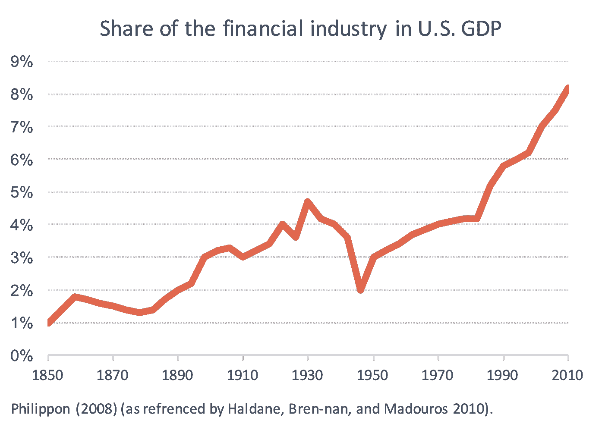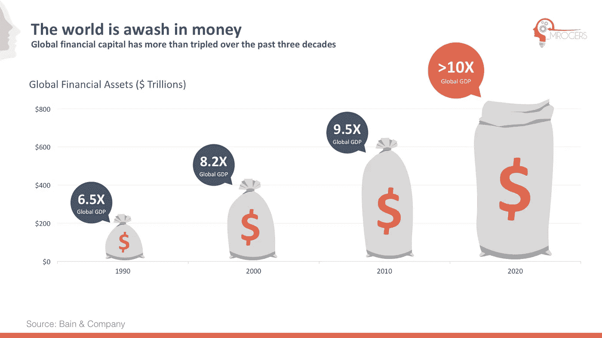

**这些转变改变了商业的本体、基本假设和本质。**

“新兴的启发式程序和方法逐渐被工程师和经理、投资者和银行家、销售和广告人员、企业家和消费者所接受。假以时日，一个共享的逻辑就建立了；投资决策和消费者选择都接受了一种新的“常识”。旧的观念不学了，新的观念变得‘正常’”。⁸

# **很复杂**

“我们是生活在概率宇宙中的决定论生物”，阿莫斯·特沃斯基。⁹

世界不是线性的，而是由大量复杂的适应性系统组成，所有这些系统都相互作用。但是，人天生的本能就是线性思维。从历史上看，这种影响较小，因为系统的作用范围小得多，运行速度也慢得多。

现在情况不再是这样了，“我们正在经历一种技术非线性。由于数字技术的非凡力量，人类的可能性领域正在迅速扩大”。

如前所述，技术改变了一切:

1.  互联网和智能手机:

*   2016 年，大约售出了 15 亿部智能手机。"人类历史上第一次，世界上几乎大多数的成年人现在都联系在一起了。"
*   人际网络以超线性的速度扩展。他们有正反馈循环，这加快了变革的步伐。
*   互联网改变了游戏规则，创造了一个全球网络。随着想法和信息可以以新的方式共享、传播和组合，变化的速度呈指数级增长。像 Product Hunt 这样的网站创建了一个早期采用者社区，加速了创新扩散和新产品采用的过程。
*   “人类通过组合和重组想法来创新，网络越大越密，创新就越多”，马特·里德利(Matt Ridley)。⁰

2.软件正在吞噬世界，无形资产的崛起:

*   软件是有可塑性的。随着它吞噬世界，一切都变得更有活力。世界确实是动态的，而不是静态的。举例来说，文本和书籍以前是固定的，但现在维基百科在不断更新。组织的命脉；数据、资金和人员不断流动。
*   一项评估发现，微软的实物资产仅占其市值的 1%。微软工程师的专业知识和他们使用的代码要重要得多。

3.需求驱动，而不是供应驱动的世界:

*   每个人现在都是一体的一部分。所有信息都是专门为一个人的新闻源、Spotify 播放列表、网飞推荐等定制的。规模化与个性化不再是一种权衡。
*   因此，许多品牌和服务已经成为一种商品，消费者可以互换，利润已经转移到那些拥有客户关系(需求)的人，而不是供应。
*   一个丰富的世界。

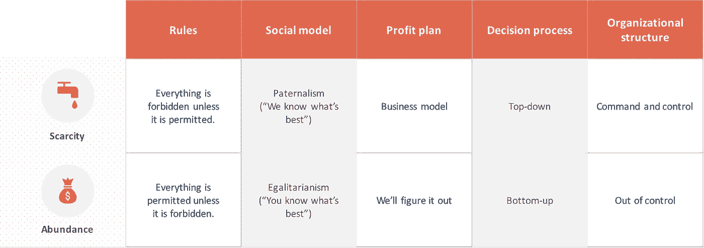

Source: Chris Anderson²³

**巨人网络的黎明**

正如第 0 章所探讨的，行业正日益成为赢家通吃，少数公司占据主导地位。问题是为什么？

要考虑的一些相互关联的特征包括:

1.  结构
2.  数字经济学
3.  超线性标度
4.  适应性高于效率

“在 20 世纪 50 年代的大规模生产模式中，处理增长和创新的角色和任务明确、效率极高的金字塔结构被视为官僚恐龙，旁边是动态的全球网络，以数字方式与多技能人员互联，以及当前信息技术革命的灵活生产模式的高度自治”。⁸

**结构**。尽管科技巨头导致了互联网的集中化，但在本质上，它们本质上是去中心化的。他们已经脱离了传统的“指挥和控制”结构。

G.皮萨诺这样说:“正如企业在产品市场上竞争一样，它们也在竞争创造技术、运营和组织能力，从而在这些产品市场上获得优势”。⁵

亚马逊的自主“两个披萨”团队不需要每一个决定都得到批准，但有能力和自由开发新的产品线，新的功能。亚马逊估计其销售额的 35%来自交叉销售活动。

企业不需要“跨筒仓”团队。相比之下，他们需要重新设计他们的组织，打破以前人为设置的界限，这通常是由复杂的遗留软件决定的。

这些科技巨头开发了动态能力和专有数据集，使他们能够建立超越传统行业的帝国。谷歌转向 Alphabet 是开发能够针对新问题的能力的最突出的例子。

G.皮萨诺进一步指出，“基于能力的观点要求从业者考虑:企业应该培养什么样的能力来获得竞争优势？因为大多数能力是累积的，并通过一系列协调的投资随时间发展，它们涉及对“路径”的承诺，而不是离散的项目。企业的一个关键战略问题是确定并致力于创造能力的途径，从而获得竞争优势”。⁵

“路径”的概念是战略和竞争优势的核心。此外，竞争优势依赖于相互依赖的选择和能力的复杂网络。在数字世界中，需要的权衡和能力是非常不同的。

“没有哪本食谱或专家系统能够可靠地炮制出制胜策略。顾名思义，战略就是创造独特的东西，做出一系列别人没有做过的选择。

权衡在战略上相当于岔路口。如果人们走一条路，他们不能同时走另一条路。同样，产品也会发生调整，满足客户的需求需要公司对产品做出选择。然后在交付产品的活动中会有妥协。另一个权衡是品牌和形象的一致性，因为妥协是使战略可持续的选择，因为它们不容易匹配或中和。因此，权衡使得战略更难模仿。

好的策略依赖于许多事物之间的联系，依赖于做出相互依赖的选择。在可能的情况下，每一项选择都应提高其他选择的价值”。⁶

这些公司的结构不仅改变了他们内部的运作方式，也改变了他们与其他组织的关系。

向云和模块化运营模式的转变正在重新定义企业的性质，催生了“API 经济”和“进化架构”。企业不是孤立存在的，而是在帮助客户实现目标的过程中变得越来越紧密。

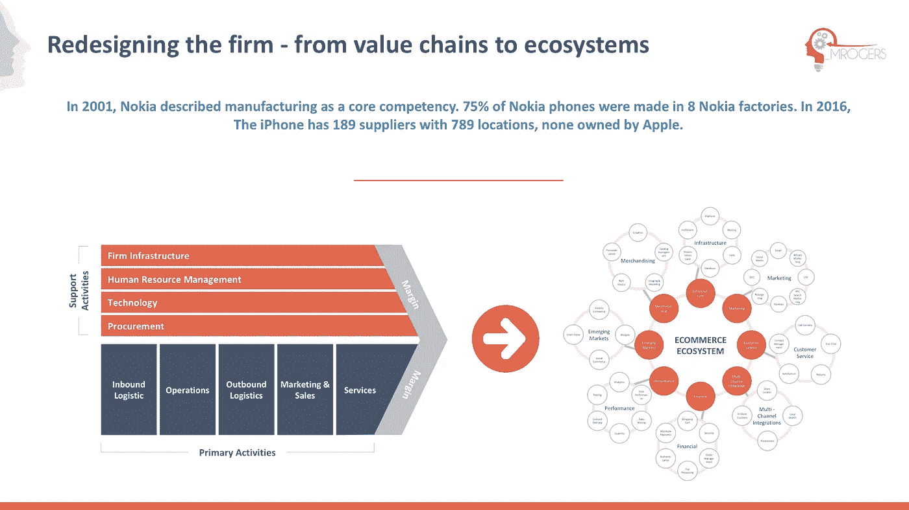

“在 21 世纪，供应链不再是商业价值的集中聚合者。现在，网络将企业和个人联系起来，使他们能够相互交换价值。线性商业模式专注于在内部创造价值，并向下游客户销售该价值。随着世界变得越来越紧密，一家公司拥有什么比它能够连接到的资源更重要。平台不拥有生产手段——相反，它们创造连接手段”。亚历克斯呻吟着

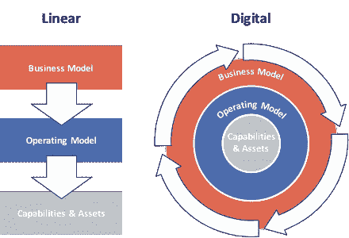

**数字经济学。**

数字经济和平台商业模式自然会产生赢家通吃的结果。

“平台有许多重要的属性。它们允许轻松参与，展示随着参与度的增加而增值的网络效应，并且通常捕获和生成大量数据，从而提高平台对所有人的价值。

我们现在正处于技术进步的关键时刻，软件模块化、大规模数据处理能力和网络连接性使得关键技术日益复杂，导致了新一代日益复杂的平台的出现。这些下一代平台为颠覆性变革做好了准备”。

“由于平台的兴起，几乎所有传统的企业管理实践……都处于剧变状态。我们正处于一个不平衡的时代，影响着每一个公司和商业领袖”。

信息商品是由比特而不是原子构成的，是免费和完美的。制作额外的副本基本上是免费的，副本和原件一样好。一旦有了网络，信息商品的经济力量就会增加，因为网络增加了第三个关键属性:即时性。此外，网络允许从一个地方到另一个地方几乎立即地分发信息商品的免费的、完美的拷贝。这种转变正在现实世界中发生，优步和 Airbnb 证明了平台公司可以转化为协调网络中的有形资产。

克里斯蒂安·卡塔利尼进一步评论说，“物理规模和独特的知识产权不再赋予无与伦比的优势；越来越多的经济领导者是充当“基石”的企业，主动组织、影响和协调广泛的社区、用户和组织网络”。⁴

**超线性缩放。**

数字固有的特性支持超线性缩放。此外，原子和物理产品的世界随着使用而贬值。然而，软件和数据驱动的产品随着个人的使用而增值。此外，平台公司已经创建了具有正反馈循环的商业模式来支持这些特征。

这在网飞和亚马逊著名的“良性循环”中显而易见:

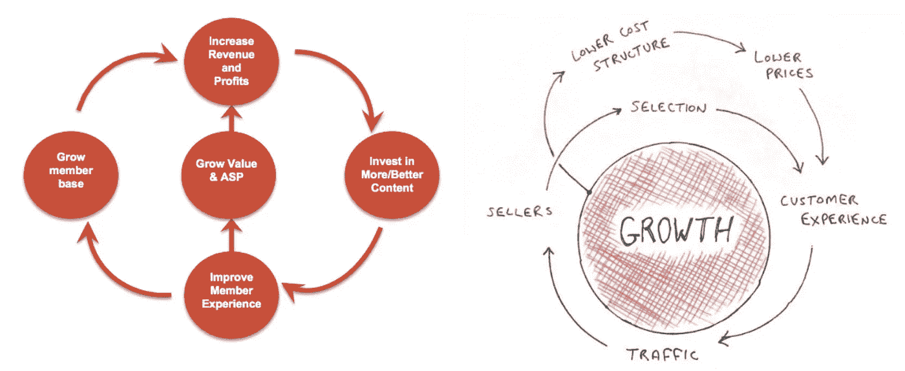

**适应性高于效率。**

传统上，企业的规模是次线性的。在公司的 S 曲线增长中最明显的是，企业规模迅速扩大(blitzscale ),然后随着成熟逐渐缩小。

在创业之初，当企业寻求在市场中立足时，它们被一系列创新理念所主导。然而，随着他们的成长，管理和官僚主义通常会取而代之。举例来说，杰弗里·韦斯特(Geoffrey West)认为，“规模经济和亚线性规模(sub-linear scaling)反映了有效管理一个大型复杂组织的挑战，主导着超线性规模中的创新和想法，最终导致停滞和死亡”。

在自上而下的管理规则下，变革、适应和发明变得越来越困难，尤其是在变革的步伐不断加快的时候。

这不仅仅是一个结构问题，而是一个人的问题。如今，大型组织中的许多活动都是伪装成严谨的“掩饰”。随着决策的风险越来越高，证明决策合理性的活动与创造价值的活动之间的比例发生了巨大的变化。

这就是为什么“你永远不会因为收购 IBM 而被解雇”，或者如弗里克·维穆伦所指出的；许多所谓的“最佳实践”仍然存在。精益和六适马等管理实践在短期内会带来更好的结果，提高效率、生产率和质量，但从长期来看，它们剥夺了公司学习的机会，或者质疑传统智慧的能力。

组织内部的语言也开始改变，关注效率而不是创造。随着企业专注于效率，它们变得更适合当今的世界，这使得它们不那么有弹性。

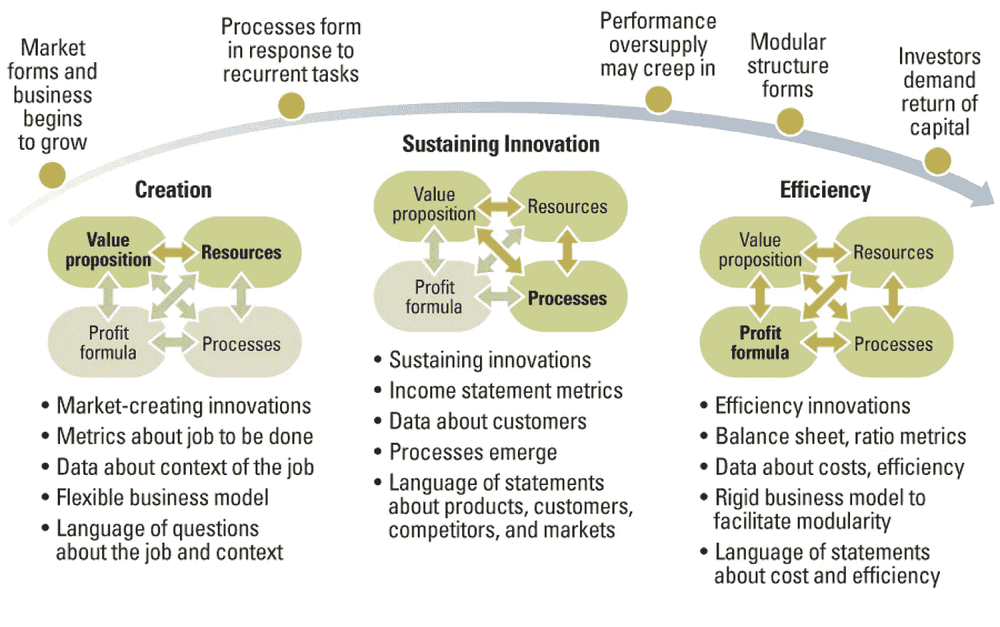

Source: MIT: The Truth about Business Model Innovation (Clayton M. Christensen, Thomas Bartman, and Derek van Bever)

随着公司的成熟，商业模式的四个要素变得更加相互关联和僵化，因此更难适应。

这是商业模式的自然生命周期。因此，在评估新的通用技术(如机器学习)时，重要的是要了解如何根据业务在其自然生命周期中所处的位置来最好地部署它们。

在现有业务中，经理们不仅应该评估技术如何被用作持续创新或提高效率的手段，还应该评估它是否创造了一个显著不同的客户价值主张和利润等式。如果是这样的话，组织将需要开发一个全新的业务，你不能倒退。

机器学习可能是一种持续的创新，并导致谷歌等公司的效率提高(从他们的翻译和地图产品中可以看出)。但是在一个结合了其他技术的新市场中部署，机器学习变得具有颠覆性(无人驾驶汽车)——way mo。

# 应对变化。有些事情永远不会改变。

这种不断加快的变化速度要求企业变得更加以目标为导向。克莱顿·克里斯滕森使用了一个叫做“要做的工作”⁸.的框架这是商业模式的“价值主张”要素。

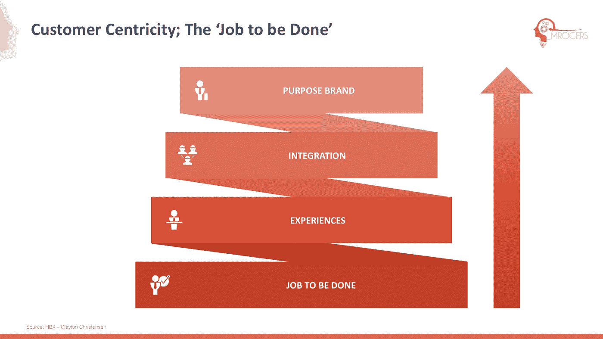

价值主张通常是一致的。当被问及什么不会改变时，杰夫·贝索斯说，“人们总是想要更多的选择、更低的价格和更快的交货”。

然后，人们可以了解数字技术如何改变、增强或创造新的价值主张。这毕竟是数字颠覆的定义；“竞争环境的变化，这是由于新市场进入者或现有竞争对手使用数字技术，破坏了您的产品/服务组合或走向市场方法的可行性”。⁷

克莱顿·克里斯滕森补充道:“企业家开始时充满了解决问题的热情，但随着他们规模的扩大，对话也发生了变化。他们不再使用被动数据来观察世界，而是使用主动数据来评估他们的产品和性能。然后，随着他们扩大规模并确立自己的地位，话题就转向了效率、成本等。公司失去了让他们伟大的东西；他们失去了与他们所创造的价值的联系。”⁸

价值创造来自于给消费者一些他们相对于现有替代品而言更看重的东西，这些替代品可能是相互竞争的公司，也可能是可能的替代品，在一个丰富的世界里，替代品越来越多。

西蒙·西内克的黄金圈:

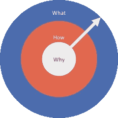

大型组织中的“如何”总是被定义为存在的过程、文化和不言而喻的真理。然而，人们经常试图通过部署相同的“如何”来改变“是什么”。改变这个常见的错误是困难的。所有企业都需要一个明确的“为什么”。

“什么”和“如何”是可塑的。“为什么”是一家公司的北极星，并且保持不变。

公司必须:⁸

*   了解客户想要完成的工作
*   了解客户如何选择业务
*   他们能做别人不能做的事
*   每个人如何知道什么产品最适合(开发一个有目的的品牌，作为“大脑的捷径”)

**改变上下文**

在系统思维中，理解我们所处的环境是很重要的。不管怎样，很明显，故事的背景和叙述开始发生变化。随着人们被抛在后面，我们开始看到反对中央集权和“体制”的力量。科技巨头会经历金融机构的监管和合规水平吗？BBVA 估计，15%的员工致力于合规和监管活动。

另一个明显的社会变化是影响力投资的兴起，投资者关心可持续性、多样性和环境。美国可持续和负责任投资论坛(US Forum for Sustainable and Responsible Investment)估计，美国专业管理的基金中，超过五分之一(合 8.7 万亿美元)是根据社会责任投资标准进行筛选的，高于 2012 年的九分之一。⁹:这完全改变了创造股东价值的观念。

企业是一种社会经济结构，我们已经远离了“股东价值”，即以牺牲其他一切为代价实现短期利润最大化。拉里·芬克最近宣称，“要想长期繁荣，每家公司不仅要交付财务业绩，还要展示如何为社会做出积极贡献”⁴.然而，这种转变仍处于初级阶段。

第二个明显的趋势是加密资产的增加。与机器学习非常相似，区块链是一种通用技术，类似于蒸汽机、电力、关系数据库和互联网。

这些社会和技术转变正在让位于一种新的范式，这种范式将与今天的平台公司共存(见第 2 章)。

**结论**

理解正在重塑我们生活的世界的变化很重要，但同样重要的是创建能够在不断变化的世界中茁壮成长和生存的组织。

“面对现实吧，宇宙是混乱的。它是非线性的、湍流的、混沌的。它是动态的。它把时间花在去往其他地方的短暂行为上，而不是数学上的完美平衡上。它自我组织和进化。它创造了多样性，而不是一致性。这是世界变得有趣的原因，这是世界变得美丽的原因，这是世界运转的原因”。多内拉·梅多斯⁰

支持我:

 [## 给麦克尔·罗杰斯买杯咖啡

### 大声思考。www . m Rogers . London @ _ m Rogers . London

www.buymeacoffee.com](https://www.buymeacoffee.com/mrogers) 

ETH:0 xddee 1262 bb 4 B1 b 8 F2 e 5c 75 D5 c27 a6 D1 a 235 aa 2e 3

BTC:3 kwbmrzowc 93 ipet p 59 qqn 3 hgry 4 cvx Mr