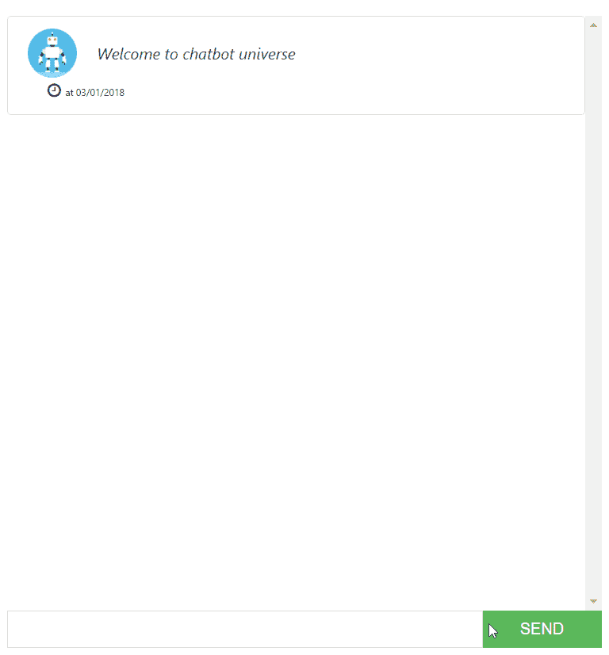
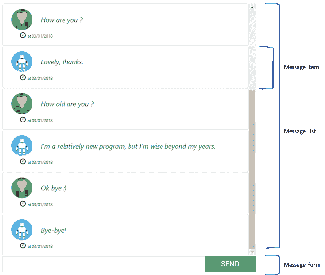
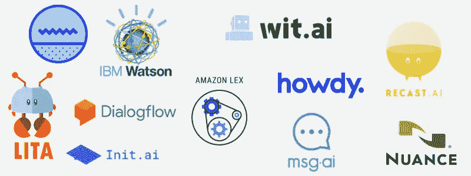
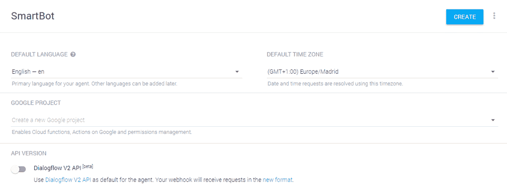
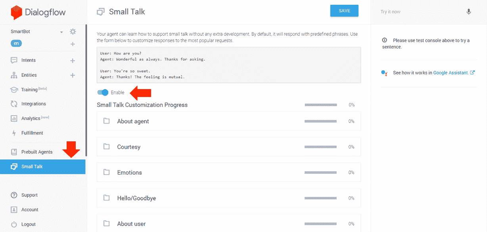
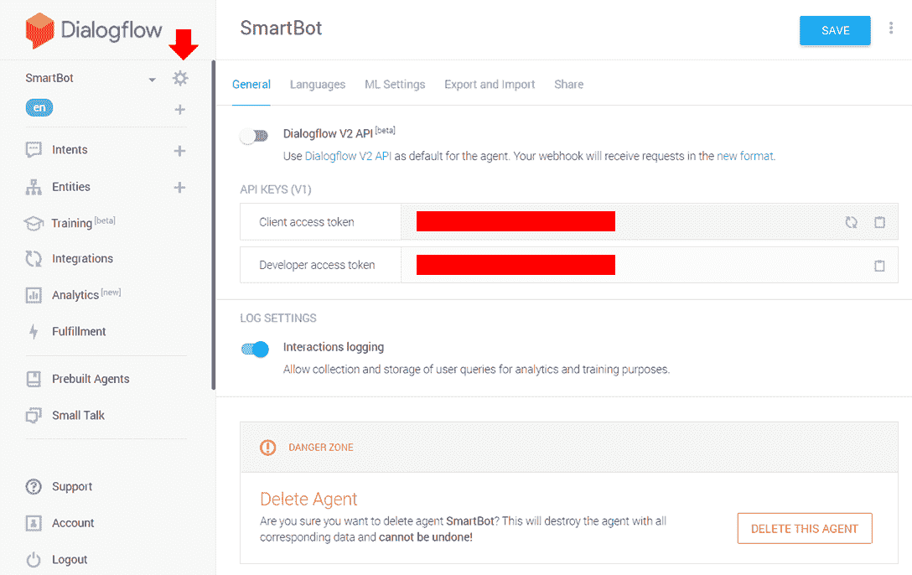
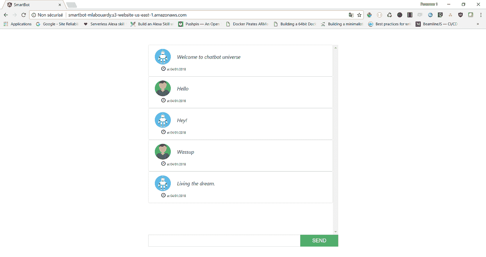

# 带 Angular 5 和 DialogFlow 的聊天机器人

> 原文：<https://medium.com/hackernoon/chatbot-with-angular-5-dialogflow-fdac97fef681>

我看到了许多关于如何为各种各样的协作平台构建聊天机器人的帖子，如 **Slack** 、 **Facebook Messenger** 、 **HipChat** …所以我决定使用 **Angular** 最新版本 **v5.0.0、**dialog flow 和 **AWS** 从零开始构建一个聊天机器人。

下面是我们的[聊天机器人](http://smartbot-mlabouardy.s3-website-us-east-1.amazonaws.com/)在这篇文章结束时的样子:

注意:这个项目是开源的，可以在我的 [Github](https://github.com/mlabouardy/dialogflow-angular5) 中找到。

首先，使用 [Angular CLI](https://github.com/angular/angular-cli) 创建一个全新的 Angular 项目:

> ng 新智能机器人— style=scss

**1 —聊天机器人架构**

我们将把聊天应用拆分成不同的组件，每个组件都能够使用属性指令与其他组件进行通信:

**2 —消息实体**

通过发出以下命令创建一个空类:

> ng 生成类模型/消息

消息实体有 3 个字段:

**3 —消息列表组件**

生成新组件:

> ng 生成组件组件/消息列表

现在我们可以通过迭代来显示消息:

该组件的代码应该如下所示:

注意使用的是 *@app/models* 而不是相对路径，它叫做**别名**。为了能够使用别名，我们必须将*路径*属性添加到我们的 *tsconfig.json* 文件中，如下所示:

注意:我还添加了 *@env* 别名，以便能够从应用程序中的任何地方访问环境变量。

**4 —消息项组件**

让我们构建一个组件，它只在我们的消息列表中显示一条消息:

> ng 生成组件组件/消息项

在*message-item.component.html*中，增加以下内容:

组件的代码应该如下所示:

**5 —消息表单组件**

让我们构建负责发送消息的表单:

> ng 生成组件组件/消息项

在 message-form.component.html 的*中，增加以下内容:*

*及其在*message-form . component . ts:*中对应的类型脚本代码*

*每次用户点击发送按钮时，都会调用 **sendMessage()** 方法。*

*就是这样！自己试试，你会发现它很有效。*

> *发球*

*此时，你不会得到任何回应，这就是 NLP 的用武之地。*

**

***6 — NLP 后端***

*我选择与[对话流。](https://dialogflow.com/)注册 **DialogFlow** 并创建一个新代理:*

**

*然后，启用**闲聊**功能进行简单的闲聊:*

**

*注意:如果你不喜欢这些问题的回答，你可以很容易地修改它们。为了更进一步，你可以创建你自己的**意图** & **实体**，如我在[之前的教程](http://www.blog.labouardy.com/bot-in-messenger-with-dialogflow-golang/)中所述。*

*复制 **DialogFlow 客户端访问令牌**。它将用于进行查询。*

**

*将令牌传递到您的*环境/environment.ts* 文件中:*

***7 — DialogFlow 服务***

*生成 **DialogFlow 服务**，该服务将调用 **DialogFlow API** 来检索相应的响应；*

> *ng 生成服务服务/对话流*

*它使用 **DialogFlow API** 来处理文本形式的自然语言。每个 API 请求都在 **HTTP 头**中包含**授权**字段。*

*将 **MessageFormComponent** 中的 *sendMessage()* 方法更新如下:*

*最后，在*app.component.html 中，*复制并粘贴以下代码，以包含*消息列表*和*消息格式*指令:*

***8 —部署到 AWS***

*生成生产级工件:*

> *ng build — env=prod*

*构建工件将存储在 *dist/* 目录中*

*接下来，用 **AWS CLI** 创建一个 **S3 铲斗**:*

> *AWS S3 MB S3://smart bot-mlabouardy*

*将构建工件上传到存储桶:*

> *AWS S3 CP dist/S3://smart bot-mlabouardy-recursive-grants read = uri = http://ACS . Amazon AWS . com/groups/global/all users*

*最后，为您的存储桶打开网站托管:*

> *aws s3 网站 S3://smart bot-mlabouardy-index-document index.html*

*如果您将浏览器指向 [**S3 桶 URL**](http://smartbot-mlabouardy.s3-website-us-east-1.amazonaws.com/) ，您应该会看到聊天框:*

**