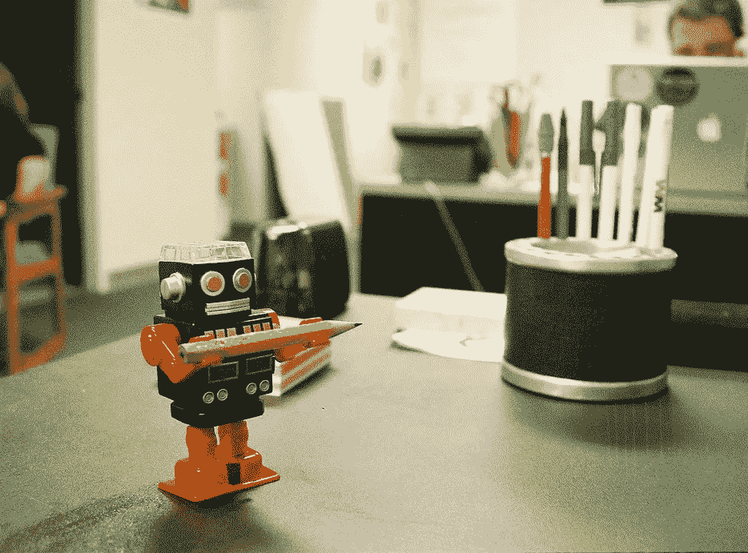

# 聊天机器人没有死，它们只是变得更有生产力

> 原文：<https://medium.com/hackernoon/chatbots-arent-dead-they-are-just-becoming-productive-7b2affedcac6>

为什么聊天机器人会成为客户服务的蒸汽机

2017 年对于聊天机器人来说是有趣的一年。许多组织对它们进行了试验，但它们的全部潜力几乎没有发挥出来。

原因？许多聊天机器人只是很酷的实验。他们对顾客说一些很酷的事情，让组织得到一些媒体的关注，甚至给顾客一些难忘的时刻。但从根本上说，它们是玩具，客户在几次互动后就抛弃了它们，它们也没有提供足够的客户价值。

连线杂志最近甚至以为标题[:](https://www.wired.com/story/facebooks-virtual-assistant-m-is-dead-so-are-chatbots/)

> “脸书的虚拟助手 M 死了。聊天机器人也是如此”

我们不认为聊天机器人已经死亡。炒作可能已经结束，但这为聊天机器人真正为组织及其客户服务开辟了空间。我们相信聊天机器人将会继续使用，尽管会更加隐蔽，它们将帮助组织实现从支持职责到销售的客户互动自动化。

因此，自动化将成为聊天机器人的核心价值主张。

聊天机器人可以接管现在由销售和客户支持员工完成的重复性任务，并允许人类专注于更高效的任务，如解决复杂的客户问题或完成销售。这将节省成本，提高客户满意度，并刺激生产力和利润。

所有这些都是由三大趋势驱动的:

*   特定而非一般人工智能的进展。
*   机器人和人类一起工作是最好的团队。
*   人工智能聊天机器人将显著提高客户互动生产率。

在这篇定位文章中，我们将深入探讨这三种趋势，并展示它们将如何塑造聊天机器人的未来。

**特异 AI，不一般**

推动聊天机器人应用的一个主要趋势是人工智能。人工智能允许聊天机器人更好地对客户做出反应，并通过从每次对话中学习来不断提高聊天机器人的性能。

然而，近年来大多数人工智能进展都是在垂直、特定的人工智能领域:让人工智能专注于一个狭窄的问题，比如玩棋盘游戏或在 Spotify 上推荐歌曲。

通用人工智能是一种更通用的智能形式，可以解决一系列(意想不到的)问题。这是我们目前没有的，而且与许多关于人工智能的炒作相反，很可能在几年甚至几十年内都不会发生。

或者像风险投资基金的人工智能专家 Frank Chen 和所说的:

> “你在人工智能领域读到的所有成功都是在‘狭义人工智能’领域，结果非常惊人。(然而)我们还没有一个统一的通用人工智能方法——我们只是不知道如何实现。”

本质上，我们拥有非常聪明的人工智能，能够解决非常具体的问题，比如在棋盘游戏围棋中[击败](https://www.wired.com/2016/01/in-a-huge-breakthrough-googles-ai-beats-a-top-player-at-the-game-of-go/)人类，但它无法复制三岁儿童的一般智力。

对于聊天机器人来说，这意味着在未来几年甚至几十年内，我们不会与机器人进行智能的、一般性的对话，但我们可以利用它们在一个定义良好的框架内自动完成特定的任务。

一个实际的用例是[将](https://faqbot.co/)一个聊天机器人连接到一个 FAQ 页面。人工智能聊天机器人可以将用户提出的问题与一系列常见问题联系起来，并在可能的情况下将两者匹配起来。通过记录它何时正确回答了问题，聊天机器人可以从以前的记录中逐步学习，并在这个特定的任务中变得越来越好。

**半人马**

因为人工智能目前只能自动完成特定的任务，这意味着大多数工作仍然需要由人和机器的结合来完成。麦肯锡的一项研究[发现](https://www.mckinsey.com/global-themes/digital-disruption/whats-now-and-next-in-analytics-ai-and-automation)“这意味着许多工人将与快速进化的机器一起工作”。

国际象棋大师加里·卡斯帕罗夫向我们展示了这种组合的伟大形象。20 年前的 1997 年，他被 IBM 的深蓝 AI 打败。最优秀的人类玩家再也无法与电脑竞争了。

这就产生了所谓的半人马象棋，或者如一篇文章[所描述的](https://www.bloomreach.com/en/resources/blogs/2014/12/centaur-chess-brings-best-humans-machines.html):

> 半人马国际象棋选手不是半马半人，而是通过将人类的直觉、创造力和同情心与计算机的蛮力能力相结合来玩游戏的人，计算机具有记忆和计算数量惊人的国际象棋走法、反走法和结果的能力

客户互动将需要自己的人马:机器人以其特定的智能自动处理特定的问题，结合人类来完成机器人无法完成的复杂任务，或者人类因其情商而更擅长的领域。

销售就是一个很好的例子。在现场工作的员工在销售漏斗开始时往往会不知所措。聊天机器人通过自然语言处理识别语言模式，可以过滤潜在的线索。在销售漏斗的后期，员工可以利用他们的情商来完成销售。

同时，聊天机器人可以帮助人类工作者。Gartner Research [指出](https://www.gartner.com/smarterwithgartner/chatbots-will-appeal-to-modern-workers/)的一个案例是，员工可以简单地命令聊天机器人打开文件，而不是在公司服务器上查找文件。从而大大简化了这项任务。

**艾>蒸汽机**

这听起来可能不够雄心勃勃，但即使是特定的人工智能也将是革命性的，麦肯锡的同一份[研究](https://www.mckinsey.com/global-themes/digital-disruption/whats-now-and-next-in-analytics-ai-and-automation)估计，基于人工智能的自动化将在未来几年内每年将全球生产率增长提高 0.8-1.4%。相比之下，蒸汽机每年只提高了 0.3%。

人工智能将通过自动化现在由人类执行的特定子任务来完成这项工作，而这些子任务可以由计算机更好地完成。

这已经在客户服务领域产生了很大的影响。现在，在服务台的人们仍然经常在一天中的大部分时间里回答一般性的问题，这些问题也可以由机器人来解决。例如，保险公司 omel horrator[雇佣了一个聊天机器人，能够回答 56%的问题。以前这些都是由工作人员处理的。](https://blog.piesync.com/ai-customer-service-2018/)

迫切需要实现这些任务的自动化:强大的客户服务是提高盈利能力的关键。例如，69%的美国消费者经常在拥有强大客户服务的公司进行更多的购物，在按需经济时代，客户服务的压力迅速上升。

换句话说:客户互动需要一个 21 世纪的蒸汽机，而人工智能驱动的聊天机器人可能就是那个引擎。

—

这篇博文最初发表在 Faqbot 的博客上。 [Faqbot](https://goo.gl/twtuSi) 几分钟内将 FAQ 页面变成聊天机器人。它们还通过向客户实时提供自动响应，帮助企业转移呼入客户支持请求。

他们目前正在进行为期 14 天的免费试用。所以你可以给他们的客户支持自动化的“21 世纪蒸汽机”一个旋转。