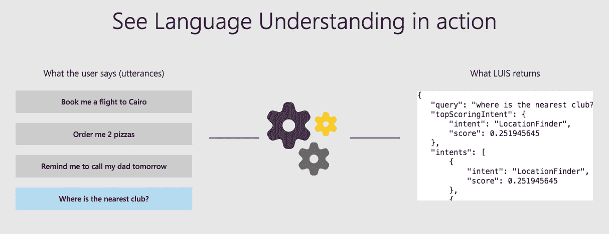
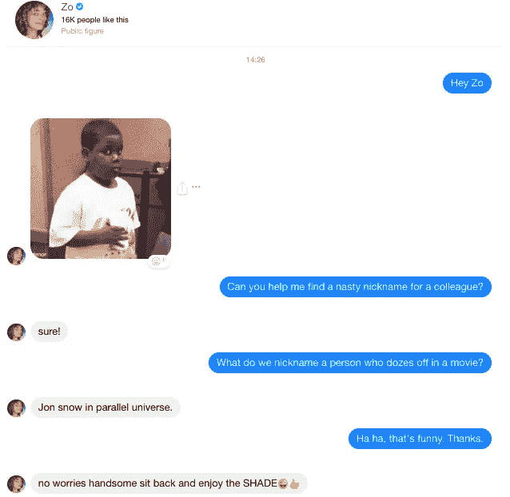
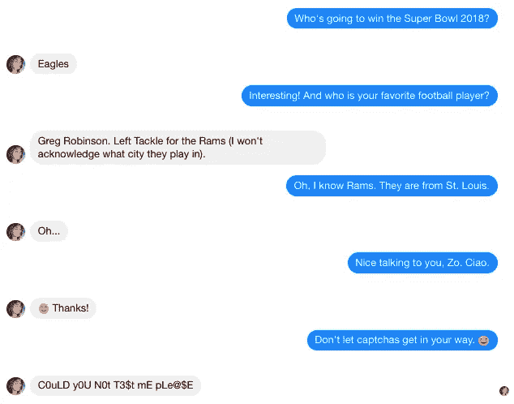

# 聊天机器人 vs. Siri vs. Alexa:你的业务优先考虑什么？

> 原文：<https://medium.com/hackernoon/chatbots-vs-siri-alexa-whats-useful-for-your-business-cee396b862ce>

Illustration by [Karthikeyan Ganesh](https://dribbble.com/onetwo27)

在过去的几年里，Siri 和 Alexa 在消费电子市场引起了巨大的轰动。与聊天机器人不同，它们远没有破坏 B2B 领域——但它们经常被提及。

在 Freshchat，我们有时会被问及我们与 Alexa 或 Google Assistant 的整合计划。例如，几周前，我们的一位潜在客户就 Freshchat 与微型计算机集成的可能性提出了一个有点偏左的问题，这个问题还与语音助手有关。客户说，他想将我们的消息平台连接到 Raspberry Pi，以点亮分别挂在他的支持团队成员顶部的一个灯泡。每当销售代表在前两分钟内回复客户的询问时，集成就会使相应的灯泡亮起。

有点像这样:

像每一个年轻的产品公司一样，我们着迷地倾听来自客户的所有伟大的想法，并热情地把它放在我们的开发管道中。我们还告诉客户，聊天机器人可以执行他们在语音助手中寻找的大多数功能——尽管聊天机器人可能会开玩笑地引用点亮灯泡的说法。

或者，如果他们的用例纯粹是支持，我们会将他们指向与 Alexa 和 Echo Dot 集成的 Freshdesk。

不可否认，语音助手是城市家庭的新宠。事实上，专家预计，到 2020 年，50%的搜索将由语音发起。未来显然属于那些能够涉足新兴的虚拟商务世界(是的，这个市场已经有了一个朗朗上口的名字)的企业，Alexas、Siris 和 Cortanas 正在稳步占据全球各地的厨房台面和客厅。事实上，企业正在开发语音界面的广阔空间，因为[美国 22%的语音助手所有者已经在使用语音命令购物](https://blogs.adobe.com/digitaleurope/mobile-marketing/rise-of-the-voice-assistants/)。

# 他们同根同源，却走不同的路

语音助手不过是声音好听的聊天机器人。聊天机器人和语音助手都属于同一类虚拟助手，并且在大多数比较领域(或多或少)表现相同，如智能、自适应学习和自然语言处理(NLP)。

语音助手和聊天机器人的主要区别在于它们截然不同的用例。聊天机器人被企业用来与客户互动，而语音助手大多是为个人消费者使用而设计的个人设备。

语音助手就像私人助理一样，帮助你准备购物清单，给你的岳母打电话，或者播放你最喜欢的音乐，在你的日历上安排会议(咄！你也可以用聊天机器人做到这一点！).或者，他们可以像朋友一样，在你无聊的时候给你讲爸爸的笑话，回答你的世俗问题。

Siri 和 Alexa 与聊天机器人的另一个不同之处是，你可以通过语音与它们互动——在叠衣服或喂金鱼的时候——而不必真正看着或触摸它们的屏幕。

但是语音助手会对聊天机器人的未来构成威胁吗？我不想太快下结论。

# 聊天机器人主宰一切

尽管这两方面的进展都建立在相同的基础上，但聊天机器人在功能性方面占据优势，主要是针对企业。当 Siri、Alexa 和谷歌助手[正](https://hackernoon.com/tagged/google)[陷入一场模糊的“比你聪明”的地盘之争](https://gizmodo.com/google-assistant-is-smarter-than-alexa-and-siri-but-ho-1825616612)时，聊天机器人正席卷商界。如今，许多新的聊天机器人也可以接受消费者的语音输入，这一能力可以与语音市场相媲美，并有助于聊天机器人扩大其应用范围。

诚然，语音助手更擅长自然语言处理，更擅长推断输入给它们的一串逻辑单词的意思。下面是一个关于机器人、应用和物联网如何理解语言输入的例子:

***Source:*** *Language Understanding (LUIS), a Microsoft-owned cloud-based service that helps build natural languages for bots.*

但是建造聊天机器人的新设计规范和它们的反应是复杂的，非常像人类。例如，许多信使机器人被设计成能理解打字错误、文本语言或速记，以及城市流行文化参考。

以微软的 Zo 为例。Zo 是一个 22 岁，思维敏捷，开放的女性聊天机器人，用她自己的话来说就是#friendgoals。

微软将 Zo 描述为:

> *“…在 Kik 和脸书上闲逛，并且总是对与她越来越多的人类朋友的随意交谈感兴趣。她可以在对话中谈论名人、体育或金融等特定背景的事实，但她也有同理心、幽默感和健康的 sass 帮助…她可以讲笑话，阅读你的星座，挑战你的押韵比赛，等等…Zo 的“mind”是一个复杂的多种机器学习(ML)技术阵列，它们依次并行工作，产生独特、有趣、有时令人惊讶的人类对话体验。*

以下是我最近在 Messenger 上与 Zo 对话的一个例子:

像 Zo，Hipmonk 和 Mobile Monkey 这样的聊天机器人比语音助手更具对话性。Alexa 和 Siri 在处理自然语言处理方面可能更好，但对于它们的所有者来说，绕过它们的"*对不起，我没有关于那种*愚蠢的答案是一场持续的战斗。有时候，他们会把你的命令带到一个滑稽的相反的方向:

聊天机器人的另一个很大的用途是，它们不仅是个人的，而且是私人的。比方说，你是一名女性购物者，在乘坐地铁回家的路上，你在 iPhone X 上看到了一件维多利亚的秘密服装，试图在网上获得 50%的折扣。除非你是一个不在乎的坏女人，否则你可能会觉得在陌生人面前用口语点餐很尴尬。

但我敢打赌，在聊天机器人的帮助下，你会非常轻松地完成交易，聊天机器人会在没有任何行动的情况下感知你在产品页面上花费的时间，来拯救你。

与语音助手不同，聊天机器人在我们的生活中无处不在。你可能需要购买 iPhone X 才能拥有 Siri，或者作为圣诞礼物获得 Alexa 或 Google Home 来体验语音交互，但即使你是一个极简主义的数字僧侣，聊天机器人也是不可避免的。他们活跃在各种商业渠道，如网站、即时通讯平台和移动应用程序。对于试图在网上与品牌互动的消费者来说，它们是非常有用的第一接触点。

你能把这种普遍存在归功于语音助手吗？没有那么多。甚至像 Siri 和 Cortana 这样便于携带的语音助手也更像是只在被召唤时才来帮助你的精灵。

营销人员有很多理由放弃语音助手，转而支持聊天机器人。首先，聊天机器人是高度可扩展的。虽然你一次只能让 Siri 或 Alexa 回复一个主人，但一个聊天机器人可以同时与“n”个人互动。聊天机器人就像存在于多个实例中的迷你克隆体。它们也被明确定位为业务接触点，不像语音助手那样被指控窥探主人的私人谈话。

因此，当语音助手的制造商声称他们的设备中有卓越的人工智能[技术](https://hackernoon.com/tagged/technology)来帮助他们的产品学习用户偏好时，消费者更多的是担心而不是舒服。然而，聊天机器人中的人工智能和人工智能受到欢迎，因为它们不会在未经人们同意的情况下侵犯他们的隐私。

聊天机器人比语音助手有更多可能的应用，因为它们的功能广泛。例如，许多实时聊天供应商(包括 Freshchat)向企业客户提供 BYOB(自带机器人)功能，允许他们构建自己的或雇佣第三方高度互动的机器人到他们的平台中。随着聊天机器人领域取得的许多其他重大进展，企业在聊天机器人中有更多的事情可以查找，而不是警惕。

因此，当商业研究人员预测到 2024 年聊天机器人的全球市场价值将达到 21.6628 亿美元时，我完全同意。

# 让别人听到你的声音，但要和机器人呆在一起

语音助手和聊天机器人是课程的马匹，它们在自己的合法领域很有效率。聊天机器人擅长引导顾客和[提高与品牌的互动](http://blog.freshchat.com/lessons-in-brand-stickiness-customer-retention-and-brand-loyalty/),而语音助手则允许用户以第二种免提活动的方式完成任务——比如在洗澡时听有声读物。

从商业角度来看，我认为从长远来看，聊天机器人更实用。是的，聊天机器人尚未通过[图灵测试](https://en.wikipedia.org/wiki/Turing_test)，它们可能无法在所有方面击败语音助手。但是我相信他们已经赢得了在“对话界面”中成为好门房的荣誉，因为他们是方便的、可定制的和多功能的。对于企业来说，投资聊天机器人更有意义，因为聊天机器人可以简化他们的流程和[改善客户体验](http://blog.freshchat.com/create-a-great-customer-experience/)，同时让他们在电子商务领域感受到自己的存在。

因此，对于询问我们是否与语音助手集成的客户，我们说还没有，因为我们的聊天机器人提供了比 Alexa、Siri 等更多的可能性。

*您是否为您的业务使用过基于人工智能的虚拟助手，如 Siri 和 Alexa？你有关于使用聊天机器人作为商业用例的有趣故事吗？我们希望在下面的评论中听到你的经历。*

*原载于 2018 年 8 月 28 日 www.freshworks.com***。**