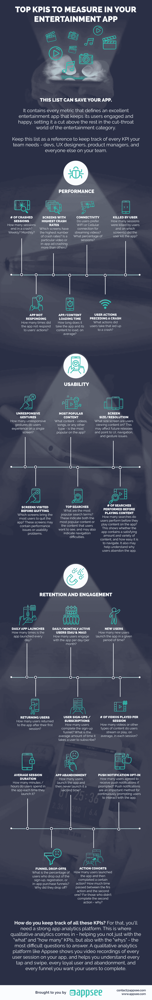

# 备忘单:娱乐应用中需要衡量的主要关键绩效指标

> 原文：<https://medium.com/hackernoon/cheat-sheet-top-kpis-to-measure-in-your-entertainment-app-5e921112937e>

[娱乐产业变得越来越移动](https://dzone.com/articles/how-the-entertainment-industry-utilizes-mobile-app)，使得内容在一天中的每一分钟都可以通过任何设备获得。娱乐应用是[2018 年](https://www.appannie.com/en/insights/market-data/q1-2018-apps-record-downloads-spend/)增长最快的应用类别之一，仅次于游戏。随着流媒体点播视频和音乐成为许多用户的首选，智能手机现在成为了新的电视。娱乐应用包括供用户分享他们的播放列表、评论和体验、进行民意调查和测验的平台，通常还会摆弄那些让他们咧嘴笑的内容。甚至书籍也开始移动化——最受欢迎的娱乐应用之一是儿童经典作品《我饥饿的毛毛虫》的[增强现实版](https://techcrunch.com/2018/03/28/arkit-only-apps-top-13-million-installs-nearly-half-are-games/)。

娱乐应用需要自己的一套关键绩效指标。一个没有达到甚至超过这些 KPI 的 app，很快就会迷失在娱乐品类的海量丛林中。今天的用户是一群善变的人，从一个应用程序跳到另一个，并且只坚持最好的。一个娱乐应用的成败在于用户是否愿意继续使用它，让它成为他们日常生活的一部分，并在竞争中选择它。一个强大的应用分析平台将帮助你衡量几乎所有的 KPI，但你如何知道你应该集中精力在哪些方面呢？

为了帮助你回答这个问题，我们列出了娱乐应用最重要的关键绩效指标。通过关注这些 KPI，您可以专注于重要的事情，组织您的应用分析工具，并持续监控您的应用的 UX、性能和保留率。所有这些 KPI 都联系在一起，可以指出任何可能困扰你的应用程序的问题或可用性问题。

如果你正试图创造下一个热门的娱乐应用，这些是你不能忽视的关键绩效指标。

