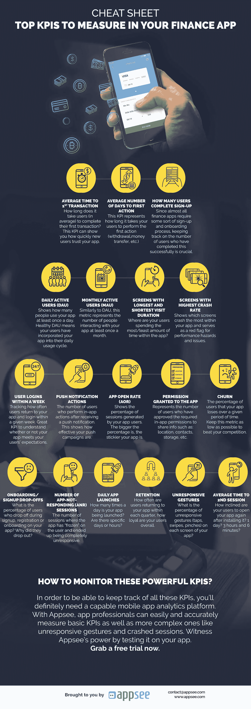

# 备忘单:在您的财务应用中需要衡量的主要关键绩效指标

> 原文：<https://medium.com/hackernoon/cheat-sheet-top-kpis-to-measure-in-your-finance-app-40a5fbc5de5f>

让我先问你一个简单的问题:你最后一次亲自去银行是什么时候？我想*大多数*人会回答“有一段时间了”、“我不记得了”或其他介于两者之间的问题。为什么？因为支付应用程序和移动银行应用程序现在(2018 年)如此普遍，并且被用户广泛接受，所以步行到当地银行感觉很古老。

[根据移动生态系统论坛最近的移动货币报告](http://mobileecosystemforum.com/mobile-money-report/)，移动银行和移动支付已经成为主流。该报告称，61%的人使用手机进行银行活动，48%的人使用专用的银行应用程序。超过 44%的受访者表示，他们现在使用专门的银行应用程序来查看余额(2014 年为 28%)。再加上银行正以如此疯狂的速度关闭分行，你就会明白这是一场多么大的革命。

这还没有提到移动支付应用和服务，如 [Apple Pay、](https://www.apple.com/apple-pay/) [Google Pay](https://pay.google.com/about/) 、 [Samsung Pay](https://www.samsung.com/us/samsung-pay/) 、 [PayPal](https://www.paypal.com/us/home) 、 [Venmo](https://venmo.com/) 等等，它们真正改变了我们使用手机支付基本任何东西的游戏。

随着越来越多的人采用移动银行和支付应用程序，应用程序所有者和应用程序专业人员必须确保他们的应用程序脱颖而出。但是怎么做呢？[金融应用](https://www.appsee.com/customers/finance?utm_source=medium&utm_medium=link&utm_campaign=cheat_sheet_finance_kpis&utm_content=finance_apps_customers_link&cpnid= 701b0000000Wd7c)尤其需要为用户提供一流的 UX、可靠的性能&，并把用户隐私放在第一位。

我们列出了财务应用专业人士应该关注的主要关键绩效指标。通过定期监控这些关键绩效指标，应用程序所有者可以确保他们的入职(这对银行和支付应用程序至关重要)完美无缺，他们的表现流畅可靠，并且用户的隐私和安全是重中之重。

