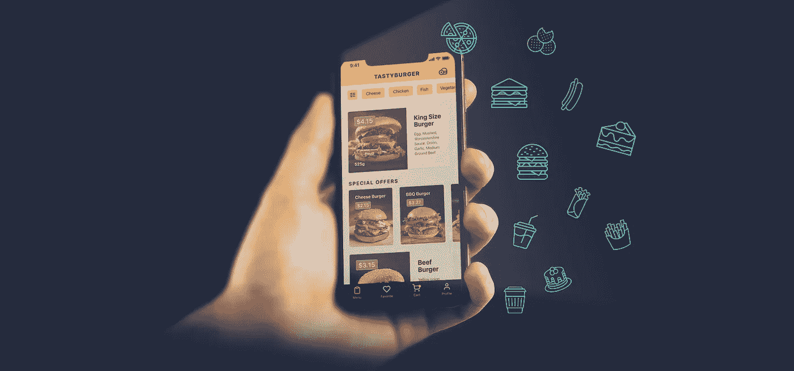
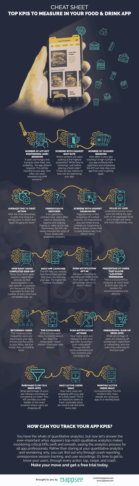

# 备忘单:在您的食品和饮料应用中需要衡量的主要关键绩效指标

> 原文：<https://medium.com/hackernoon/cheat-sheet-top-kpis-to-measure-in-your-food-and-drink-app-c6786e3c2eb1>

世界是我们的牡蛎——毫不夸张地说，只需点击一个应用程序按钮，我们就可以获得晚餐所需的牡蛎。我们打电话到披萨店订餐的日子已经一去不复返了，取而代之的是一个人们喜欢通过移动设备订餐的世界。

由于移动应用的增加，食品和饮料应用行业经历了一次复兴。从[美味](https://itunes.apple.com/us/app/tasty/id1217456898?mt=8)的食谱创意到[的就餐体验](https://play.google.com/store/apps/details?id=com.vizeat.android)，你所有的食物需求都可以通过快速点击和下载获得。

随着越来越多的人每天下载和使用应用程序[来探索和订购食物](https://dinarys.com/blog/Food_Delivery_Apps)，食品和饮料行业也是如此。

此外，用户正在寻求便利，他们的搜索通常受位置驱动，尤其是智能手机用户，超过 10 次搜索中有 8 次导致购买。

那么这意味着什么呢？竞争很激烈，需求很高，食品和饮料应用需要以最高的用户体验为目标。

也就是说，监控你的食品和饮料应用程序中的基本 KPI 是至关重要的，以确保你保持在顶端。因此，我们编制了一份方便的备忘单，供所有应用专业人士参考。有了这个列表，你将能够快速发现问题并加以纠正，同时还能监控关键绩效指标，为你优化应用以及整体用户体验提供不可或缺的见解。

