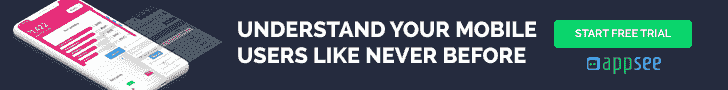

# 备忘单:在您的健康和健身应用中需要衡量的主要关键绩效指标

> 原文：<https://medium.com/hackernoon/cheat-sheet-top-kpis-to-measure-in-your-health-fitness-app-9439eafb9694>

谷歌，苹果，三星，耐克，安德玛，彪马，Asics，Fitbit。这些只是全面投入健康&健身 app 类别的巨大品牌中的*一些*。为什么？数字不会说谎。根据一项新的研究，健康健身应用在过去几年中变得非常受欢迎，在过去三年中使用量增长了超过 330%**。**

[根据 Flurry 的研究](http://flurrymobile.tumblr.com/post/165079311062/health-fitness-app-users-are-going-the-distance)，用户对他们最喜欢的健身应用程序的忠诚度很高，超过 96%的用户只对一个健身/健康应用程序保持忠诚。

此外，该应用类别中超过 33%的用户每周使用他们最喜欢的健康和健身应用 2-5 次。

如今，越来越多的人放下健身房订阅，转向手机寻求健身和健康指导。所以有需求，但是供给呢？嗯，像谷歌、苹果和耐克这样的公司都在开发自己的应用程序，想要在这个拥挤的市场中脱颖而出似乎是一个非常困难的任务。这就是为什么作为一名健康&健身应用发布者/专业人士，确定你想要跟踪的 KPI 比以往任何时候都更重要。

以下是我们为健康和健身应用程序专业人士创建的顶级关键绩效指标列表。

通过定期监控这些强大的关键绩效指标(使用正确的工具)，应用所有者可以完美地优化他们的应用内启动，确保[流畅和直观的 UX](https://blog.appsee.com/ux-in-health-and-fitness-apps/?utm_source=medium&utm_medium=link&utm_campaign=health_apps_cheat_sheet&utm_content=ux_in_health_apps_blog&cpnid=701b0000000Wd7c) ，并为用户提供稳定和快速的性能。这将让用户高兴，并带来更多。

