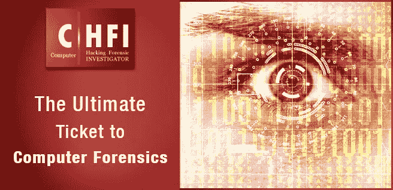
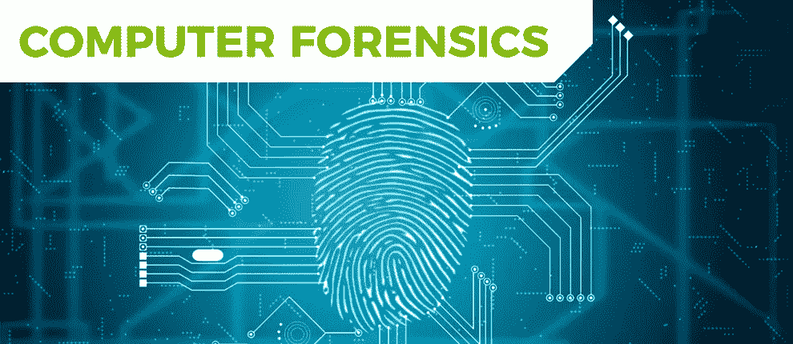
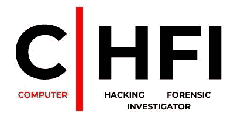
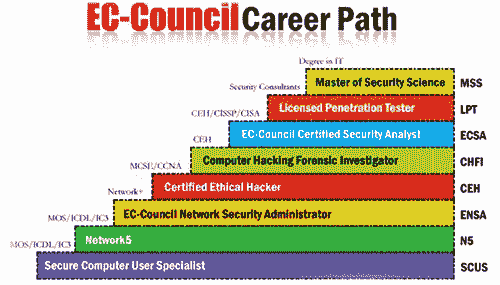

# CHFI——计算机取证的终极门票

> 原文：<https://medium.com/hackernoon/chfi-the-ultimate-ticket-to-computer-forensics-35e1973997ad>

取证，意味着公开讨论或辩论，可能是最不为人所知的网络安全领域。学习和理解取证很有趣，同时也需要大量的学习，这对于让一名网络安全专业人员精通该领域是必不可少的。

随着数字技术被世界各地的犯罪分子广泛使用，企业正面临高度复杂的网络攻击，因此，对高技能网络安全专业人员的需求成倍增长。

攻击者或肇事者通常对他们所做的事情非常精通，并且会清除他们可能留下的几乎所有证据。这使得破解犯罪的整个过程更加困难，并提出了对高度学习和熟练的网络安全专业人员的要求。一个人必须具备的素质包括学习、分析信息和情况、掌握事实和得出结论的能力。

# **电脑取证**

计算机取证是对欺诈和骚扰等数字犯罪行为至关重要的证据集合。遵循一种系统的方法来解读相关数据和解决案件。

> 计算机黑客方面的法医调查职业要求极高，需要大量的努力和经验才能精通该领域。

# **欧共体理事会和 CHFI**

为了迎合所有的技术细节，市场上有许多公认的认证，最受欢迎的供应商中立认证是来自欧盟委员会的计算机黑客法医调查员(CHFI)。该认证是最广泛认可的行业标准和最受尊重的认证之一。

EC-Council 专门研究信息安全，并已获得 CHFI 认证。该课程基于适当的调查而设计，由经验丰富的主题专家和数字取证从业人员开发。

CHFI 认证旨在传授必要的技能，以识别攻击者的印记，并收集在法庭上出示的证据。该认证使专业人员能够在世界任何地方追踪、调查和逮捕网络罪犯。该课程包含一系列法医调查场景，并提供实践经验，以精通各种法医调查技术和工具。

本课程的目标受众包括执法人员、系统管理员、安全官员、国防和军事人员、法律专业人员、银行家、安全专业人员以及对网络基础设施完整性感兴趣的个人。

CHFI 认证专家获得各种技能的专业知识，其中一些如下所述:

执行事件响应、取证、证据收集和数字取证。

对计算机硬盘驱动器或任何其他电子数据存储介质进行彻底检查，并在需要时恢复数据

负责审计跟踪和证据完整性

从 Windows、Mac 和 Linux 中收集信息，并能够恢复已删除的文件

了解响应活动

使用法医技术方法

确定内部调查所需的数据、图像和活动

执行反取证检测

确定发病的源头

确保调查在保密的情况下进行

要学习 CHFI 课程，你需要具备网络安全、计算机取证和事件响应的基本知识。除此之外，之前对 [CEH](https://www.koenig-solutions.com/ceh-v10-certified-ethical-hacker-training-certification-course.aspx) 的一些了解将被证明是一个额外的优势。

# **职业机会**

在过去的几年里， [CHFI 认证项目](https://www.koenig-solutions.com/computer-hacking-forensic-investigator-v-9-chfi-v-9-training.aspx)在财富 500 强企业中获得了极大的认可。该认证无疑会给你带来各种各样的工作机会。即使有人在安全部门工作，获得 CHFI 认证将进一步提高你的薪水，并大大增加你的晋升机会。

> 根据*薪级表*，平均而言，该认证能让专业人士获得 96，000 美元的年薪。