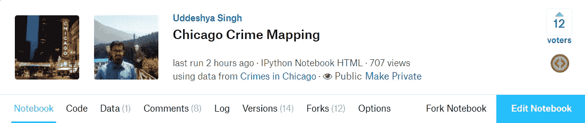
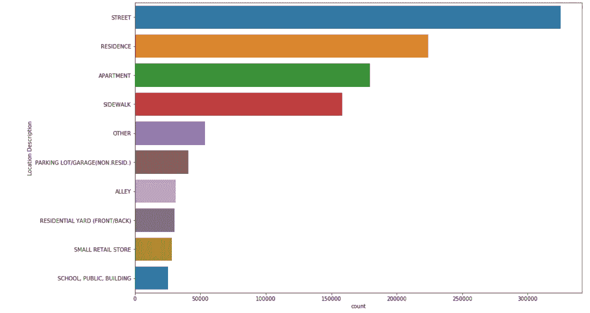
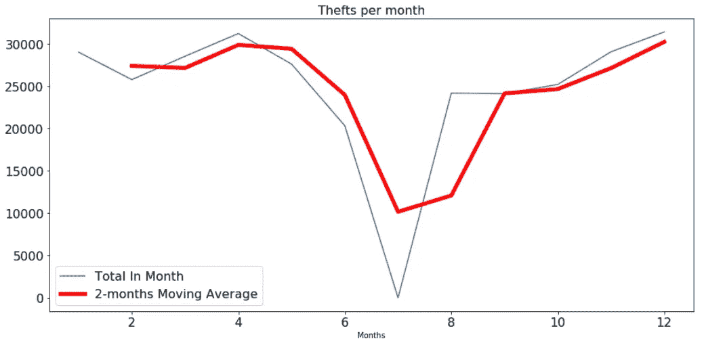

# 芝加哥犯罪地图:数据科学和 Python 的魔力

> 原文：<https://medium.com/hackernoon/chicago-crime-mapping-magic-of-data-science-and-python-f2ecad74a597>


> “当一个人被剥夺了过自己所信仰的生活的权利时，他别无选择，只能成为一名逃犯。”
> ― **曼德拉**

预测、预报和损失分数。听起来太主流了吧？
在对机器[学习](https://hackernoon.com/tagged/learning)及其算法越来越感兴趣的时代，我们极大地忽视了作为[数据](https://hackernoon.com/tagged/data)科学家的重要职责，其中之一就是**数据探索。**

我们这些现代数据科学家是如此天真，以至于我们忘记了可视化的美丽和它所代表的品质。今天，请允许我向大家展示一个对 Kaggle 数据集的探索性数据分析:[芝加哥的犯罪](https://www.kaggle.com/currie32/crimes-in-chicago)。


The Crimes in Chicago Dataset

我将使用我的内核中的代码和可视化，你可以在这里找到:[芝加哥犯罪地图](https://www.kaggle.com/uds5501/chicago-crime-mapping?scriptVersionId=5579459)



Chicago Crime Mapping — At the time of editing

因此，在开始分析之前，让我向你们简要介绍一下数据集，根据介绍，它说:

> 该数据集反映了从 2001 年到现在，减去最近 7 天，芝加哥市发生的已报告犯罪事件(谋杀除外，其中每个受害者都有数据)。数据来自芝加哥警察局的 CLEAR(公民执法分析和报告)系统。为了保护犯罪受害者的隐私，地址只在街区一级显示，具体地点不标明。如果您对该数据集有任何疑问，您可以致电 312.745.6071 或 RDAnalysis@chicagopolice.org 联系芝加哥警察局的研发部门。

本质上，该数据集包含**犯罪的类型、位置、犯罪的子类别、邻近区域的类型**和**是否可能逮捕**。

# 检查数据是否包含空值

第一步可能是检查数据集是否包含任何空值，我使用热图来确定这一点。


Viridis Heatmap

查看我们的热图，我们可以有把握地得出结论，没有多少值被遗漏了，所以直接删除它吧。

我很好奇，想知道这 5 年里报道的犯罪数量，我能看到的是:

```
STREET                            325084
RESIDENCE                         223854
APARTMENT                         179444
SIDEWALK                          158478
OTHER                              53474
PARKING LOT/GARAGE(NON.RESID.)     40907
ALLEY                              31239
RESIDENTIAL YARD (FRONT/BACK)      30209
SMALL RETAIL STORE                 28209
SCHOOL, PUBLIC, BUILDING           25474
Name: Location Description, dtype: int64
```

相当高，持续了 5 年。

# 位置描述及其语义

人们可能会想，犯罪最常发生在哪里。是肮脏的街道，臭名昭著的居民还是无人看守的停车场？我们可以使用下面的代码片段自己检查一下:

```
plt.figure(figsize = (15, 10))sns.countplot(y= 'Location Description', data = df, order = df['Location Description'].value_counts().iloc[:10].index)
```



Location Semantics

显然，街道是最不安全的，住宅和公寓紧随其后。

# 绘制犯罪数量图

让我们仔细看看犯罪发生的独特地点，并使用**叶**来绘制它们。您可以使用这个片段来重新创建我的地图。

```
chicago_map_crime = folium.Map(location=[41.895140898, -87.624255632],
                        zoom_start=13,
                        tiles="CartoDB dark_matter")

for i in range(500):
    lat = CR_index['LocationCoord'].iloc[i][0]
    long = CR_index['LocationCoord'].iloc[i][1]
    radius = CR_index['ValueCount'].iloc[i] / 45

    if CR_index['ValueCount'].iloc[i] > 1000:
        color = "#FF4500"
    else:
        color = "#008080"

    popup_text = """Latitude : {}<br>
                Longitude : {}<br>
                Criminal Incidents : {}<br>"""
    popup_text = popup_text.format(lat,
                               long,
                               CR_index['ValueCount'].iloc[i]
                               )
    folium.CircleMarker(location = [lat, long], popup= popup_text,radius = radius, color = color, fill = True).add_to(chicago_map_crime)
```


Map of crimes

在这里，橙色圆圈表示在该特定位置发生的犯罪超过 1000 起，而其他则不言自明。点击这些地图会显示坐标和在特定地点发生的犯罪数量(纬度、经度)


An example of details

# 对盗窃案的进一步调查

我对盗窃和扰乱公共治安特别感兴趣，但让我们稍后再来看看后者。现在，让我们把注意力集中在这 5 年里发生在芝加哥周围的盗窃类型上。


Type of thefts in Chicago from 2012- 2017

好吧，500 美元的盗窃案现在占主导地位。没有吗？

如果这还不够，让我们来看看这些盗窃是如何在一个月内发生的。看看这张图表，让我来解释一下犯罪现场统计数字的突然下降。



Thefts Per Month

> 好吧，在八月，没有超人或蝙蝠侠来到这个城市保护正义。这只是一个算法上的损失，它导致了 8 月份的一个`NAN`值，我必须用 0 来代替它(因为我很懒)

如果你不相信我，这是代码:

```
theft_in_months = pd.DataFrame({"thefts" : df_theft['Month'].value_counts(), "month" : df_theft["Month"].value_counts().index}, index = range(12))theft_in_months.fillna(0, inplace=True)
theft_in_months = theft_in_months.sort_values(['month'], ascending=[1])theft_in_months.head()
```

# 年度犯罪统计:一次使用几乎所有的数据。

您可以尝试重新采样数据集的日期，您会发现这个数据集实际上包含 1854 天，准确地说。想知道单日作案多少起的映射？那么请看一下这张图表。


Thefts on a daily basis

## 你可能已经注意到了，每年的犯罪统计数字都有一个总体趋势。

这里，值得注意的趋势是在年初曲线上升，并在中点达到峰值。六月到七月的某个地方。在那之后，随着年初的到来，犯罪率也同样急剧下降。

# 破坏公共和平

我保证这是本文的最后一个研究领域。

无论如何，如果人们可以关注公共和平侵犯的类型及其数量分布，人们可以很容易地指出**鲁莽行为**是这一领域的领导者，而(谢天谢地)不是炸弹和纵火威胁。


Types of Public Peace Violations

既然说到这里，让我们来看看芝加哥周围的和平破坏事件。在这张地图中，橙色圆圈代表该地区的和平破坏在这 5 年中已经超过了 **30** 的数量，因此是一个需要小心处理的敏感点。


Peace Disruption Locations

# 结论

正如您可能已经判断的，这不是一个编码教程，而是一个潜在的项目启动。你可以在你的笔记本上使用这个 EDA，记住 **Apache 2.0** 许可，并根据这些想法制作你的预测模型。

## 我的一些想法:

1.  一个基于季节的预测模型，预测在特定的一天会发生多少起犯罪。
2.  一种预测模型，它判断一个地区或邻近地区(如林肯伍德)的敏感性并预测下一次犯罪何时发生。

或者任何你想到的其他想法。

直到下一次，和平了。

*乌代什亚·辛格*