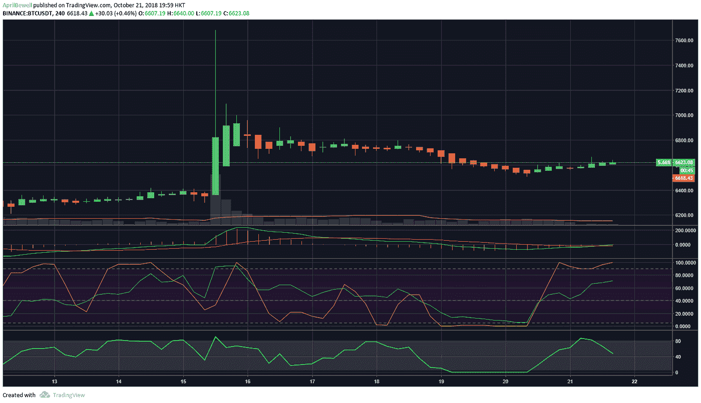
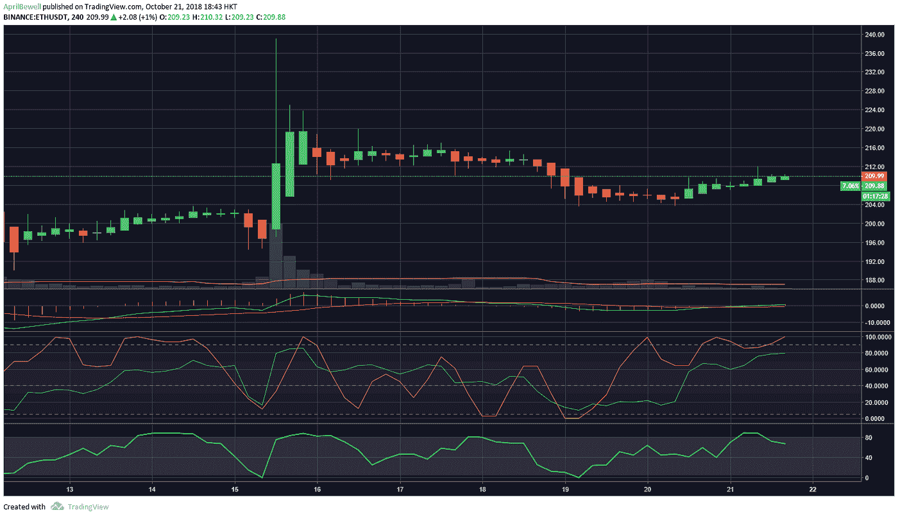

# 在加密市场上，随着 BTC 交易量创下新低，比特币的主导地位开始下降

> 原文：<https://medium.com/hackernoon/chill-sunday-on-the-crypto-markets-bitcoin-dominance-starts-to-drop-with-btc-volume-reaching-a-98885d610b04>

**加密市场回顾:2018 年 10 月 21 日**

对于加密市场来说，这是一个寒冷的周日，没有大的变动，只有一点波动。周末看到了绿色，尽管比一些人希望的要小。在一系列失望和不加选择的下跌之后，替代硬币正在回升。不足以恢复，但足以漂浮。

随着资金箱增加 20 亿美元，市值已经回升，现在为 211.5 美元，当天增长 1%。24 小时交易量略有下降，为 94 亿美元，与周末交易量一样。比特币的主导地位仍在以非常小的增量缓慢下降，目前为 53.5%，这对试图重新站起来的替代比特币来说是一个好消息。

比特币当天仅上涨了 0.73%。在亚洲交易时段，该指数略高，但涨幅不大。目前，在币安，它位于 6623 美元，自周二以来一直横盘整理。看起来短期内不会向任何一个方向发展，在它向上突破 6900 美元的阻力或向下跌破 6300 美元的支撑之前，我们可能会在横盘中停留一段时间。正如一些分析师指出的那样，31 亿美元的比特币交易量创下年度新低。

以太坊表现较好，当日涨幅 1.04%。就价格而言，它仍远低于恢复价格。目前，在币安，它在 209 美元勉强抓牢 215 美元的初步阻力，更不用说对抗 220 美元的沉重防守。目前的支撑位是 205 美元，买家可能会在这里出现，但实际上，它可能只是跟随它的老大哥比特币。

与前一天一样，替代硬币仍然显示出一些积极的价格行动，尽管涨幅非常小。比特币现金以 2.17%的涨幅领涨，交易价格为 452.28 美元。略高于上周日的 450 美元，但也不多。我们有 Monero，昨天是负面的，向前移动 1.56%，EOS，移动 1.50%，交易在 5.48 美元。其余的当日涨幅在 0-1%之间。

前 25 名在亚洲交易时段表现良好，但本周日上午有所回落。Dogecoin 开始叫了，过去两天一直是绿色的。该股当日收益率为 2.30%，交易价格为 0.00459 美元。OmiseGo 为 2.25%，Zcash 为 1.63%。其余股票当日涨幅在 0%至 1.5%之间，变化很小。

像往常一样，当替代硬币开始感到足够自信时，一些硬币会开始跳动。Ravencoin 以 28.69%的泵回到了董事会，Nexo 和 Bytom 都在 13%。其余的有中等增长，但其余的前 100 名替代硬币大多是绿色的。因为昨天的泵是今天的转储，Cybermiles，Basic Attention Token (BAT)和 Digitex Futures 在隧道的另一端特别值得一提。

所以，这就是我们这个周日的市场回顾，如果你今天交易，冷静，交易安全。否则，明智地度过剩余的周末。祝你有愉快的一天！

*原为发表于 2018 年 10 月 21 日**号。*

[*CoinDNA*](https://dna.coinve.st/news) *是一个教育网站，帮助用户进行研究(他们投资旅程的第一步)，提供帮助引导投资决策的见解，包括个人代币的市场数据、每日市场报告和定制的常见问题分析。*