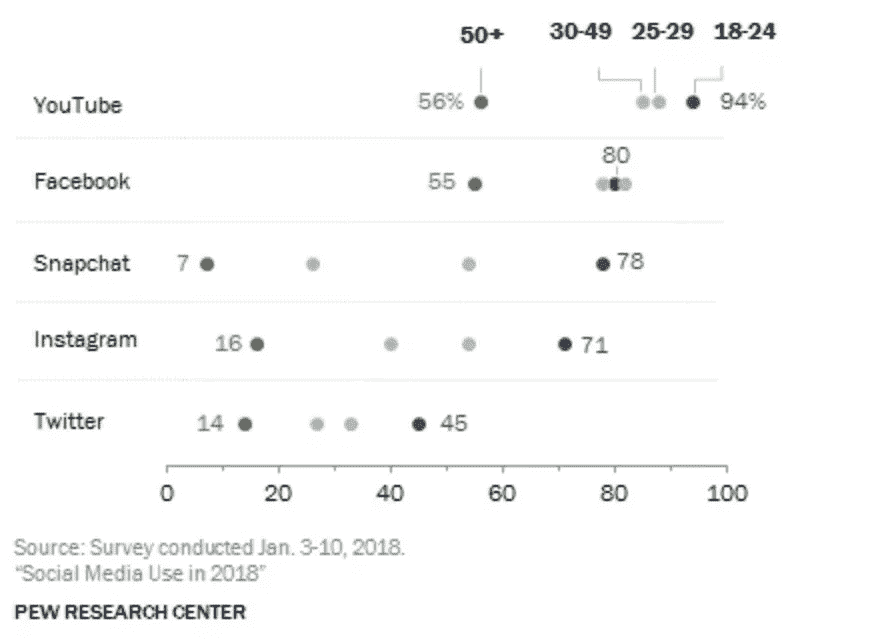
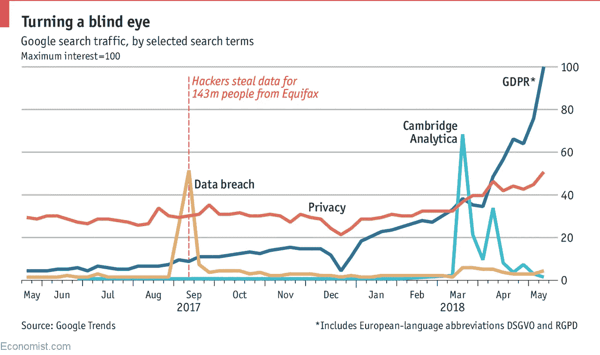
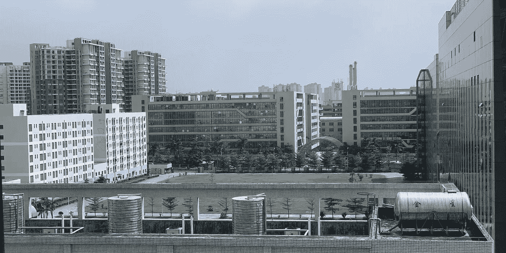
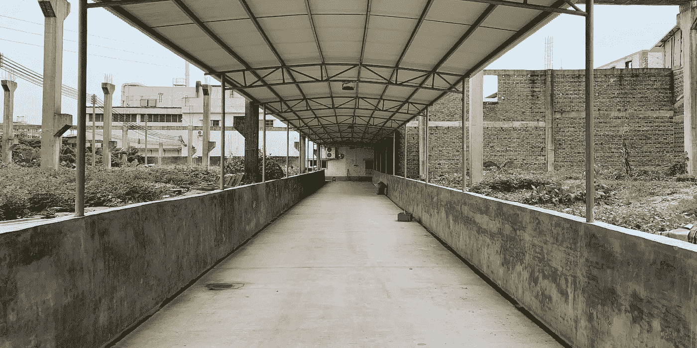
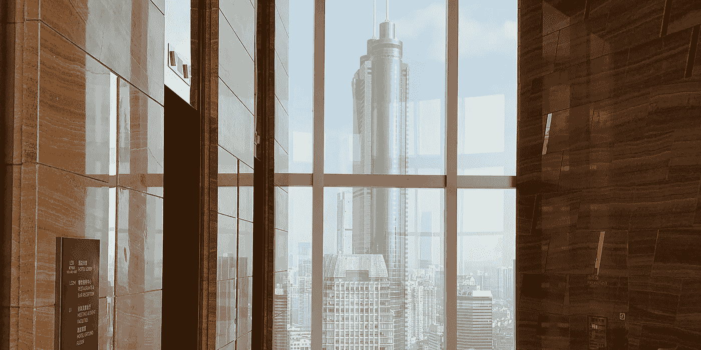

# 中国来了，西方应该很害怕

> 原文：<https://medium.com/hackernoon/china-is-coming-and-the-west-should-be-very-afraid-8c44994116f1>

## 全球技术大战

## 为了让中国超越西方，它必须提高数十亿人的生活水平，同时保持工业飞速发展。

我目前的看法是:他们会成功。

TLDR:当西欧和美国在社会分歧中挣扎时，中国正在利用激励措施、社交媒体、人工智能和世界上最复杂的监控网络，让 14 亿公民关注未来。

# 谁会是美国的情感支持动物？

自唐纳德·特朗普(Donald Trump)当选以来，美国人发现自己每天都处于知识和道德危机之中。主流社会正义运动的数量激增，每个运动都有数百个层面。

道德呼声的成倍增长要归功于我们自己的发明:社交媒体。对信息快速传播的依赖创造了一种环境，在这种环境中，最受关注的人会胜出。由于这种动态，吸引注意力的机会和动机是无限的。一个人所要做的就是非常善于在恰当的时间传递精辟的、即时的内容，以创造一种病毒式的感觉。

Percent of Americans who say they use social media by age group and platform. — [2018 Pew Research Center](http://www.pewinternet.org/2018/03/01/social-media-use-in-2018/)

美国人现在似乎最擅长同时制造和报道我们自己的焦虑。我们在这方面做得如此之好，以至于在国内思想份额中，我们生产的任何东西都比不上互相激怒。

如果说有什么好消息的话，那就是我们越来越擅长用社交网络来激发情感反应，以推进道德责任。

坏消息呢？围绕政治立场、性别平等、种族平等和选举舞弊的似乎无法解决的两极分化分散了我们对创新的注意力，而创新是我们历史上的头号出口产品。

# 西欧试图进步和平等，结果喜忧参半

类似地，欧盟也实施了一般数据保护条例(GDPR)。这套严格的隐私法旨在同时保护公民免受侵入性的数据收集，并为硅谷提供一个机会。信息？**未经欧盟公民同意，利用他们的个人信息赚钱是不合法的。**

从本质上来说，GDPR 显然是反创新的，它与社会想要什么或需要什么没有什么关系。数据存储导致入侵行为的论点与互联网本身的创建背道而驰。

在欧盟和美国，隐私和政治干预等问题已经成为绝望的土地争夺者，专横的政府目标恰好与社会对预期破灭的愤怒相一致(英国退出欧盟和川普就是两个例子)。

Interest in privacy and regulation of social media over time. — [The Economist](https://www.economist.com/graphic-detail/2018/05/21/as-gdpr-nears-google-searches-for-privacy-are-at-a-12-year-high)

像 GDPR 这样的法规对西方任何人都没有好处，事实上可能会导致不久的将来缺乏透明度。在 GDPR 生效前几天，谷歌宣布了严格的出版商指导方针。自那以后，出版商在已经受限的环境中感受到了货币化减少的痛苦。

没有适当的收入来源，任何营利性公司都无法生存。随着更少的有意义或可持续的收入，记者们已经沦为可怜的搜索引擎优化作家和推特看守者，希望捕捉或创造社会对点击的愤怒。

毕竟，当我们可以简单地打开 Twitter，满足我们被激怒的需求时，未来谁会付钱给聪明的记者去报道重要的新闻呢？

# 当西方与理智主义斗争时，中国在前进

这是一种让我长话短说的方式:中国正在崛起——很快。根据我的经验，西方往往对中国持落后的看法。也就是说，我们认为中国还是 10-20 年前的样子，只不过是媒体炒作的结果。拥挤、开放的下水道街道，令人窒息的污染，以及在不安全的工厂里劳动的儿童，这些令人心酸的画面浮现在脑海中。

A typical manufacturing facility in the outskirts of Shenzhen, China. Credit: [lonelybrand](https://lonelybrand.com)

我的一位美国同事最近问我，中国人是否给我留下了“绝望、饥饿和聪明”的印象我告诉他不要绝望，他开始有了正确的想法。

中国几年前的问题正在快速解决。由于有一个统一信息的中央政府，每个人都赞同这个计划。随着这些问题的解决，中国人与西方互动的愿望减弱了。

**以下是中国在过去几年宣称的几项“第一世界”成就:**

*   自 2015 年以来，中国在太阳能、风能和水力发电等清洁能源系统上的投资超过了美国和欧盟的总和。— [经济学家](https://www.economist.com/special-report/2018/03/15/china-is-rapidly-developing-its-clean-energy-technology)
*   中国现在销售的电动汽车比世界其他国家的总和还要多，其中大部分是由本国公民购买的。— [福布斯](https://www.forbes.com/sites/niallmccarthy/2018/06/01/electric-car-sales-are-surging-in-china-infographic/#195e6e69d1f7)
*   中国现在向美国出口煮熟的鸡肉和鸭肉，质量标准与国内农场相同。— [《华盛顿邮报》](https://www.washingtonpost.com/news/wonk/wp/2017/07/07/the-dark-side-of-trumps-much-hyped-china-trade-deal-it-could-literally-make-you-sick/?noredirect=on&utm_term=.c8a5d8282a37)
*   73% of Chinese citizens feel they are free to share their opinions on social media with no repercussions, compared to 43% of Americans. — [PodSquad](https://getpodsquad.com)

The majority of these achievements are due to a central government bent on making China *the* top global power in the next thirty years. And that central government is led, mostly, by one man.

Xi Jinping is a polarizing figure. As General Secretary of the Communist Party of China, President of the People’s Republic of China, and Chairman of the Central Military Commission he enjoys unchecked rule. It’s easy for the West to imagine him an evil dictator in the process of creating a new, self-serving dynasty a la Kim Il-sung.

An organic garden in unused factory space in Shenzhen, China. Credit: [lonelybrand](https://lonelybrand.com)

But with 1.4 billion people to feed, his job is particularly precarious. Now elected official for life, he must produce an overall increase in citizens’ quality of life to maintain order and economic momentum. To say it another way, Xi Jinping is spinning a *lot* of plates, and if even one falls, his reign will be short lived.

**To keep those plates spinning, he needs to control a very large geography and nearly a fifth of the world’s population.**

Hardware *and* software is increasingly concepted, engineered, and made in China. The city of Shenzhen and the surrounding area is often called China’s Silicon Valley, and it’s even starting to look the part.

Xi Jinping is putting this tech breadbasket to work. Beginning in the next year, a country-wide network of surveillance dubbed the Social Credit System will be activated. The goal? Hack the minds of 1.4 billion people to police themselves and each other around the goals of the Party.

**Think of the Social Credit System as a giant Stanford Prison Experiment run by AI.**

At it’s core, the Social Scoring system is an algorithm. In the United States we might imagine that nagging Experian or TransUnion score. Each Chinese citizen will receive a score based on many factors.

But unlike the systems we know in the West, the Social Scoring System will compute hundreds, if not thousands, of data points. Everything from where citizens travel to the food they consume and the friends they keep will contribute to their score.

This always-on central government monitoring ties into the financial and transactional records of every company in China. It’s tentacles reach into every state approved social network, email, and mobile device microphone. It also utilizes the most sophisticated CCTV camera system in the world, complete with facial recognition and object identification.

Each citizen can view his or her score in real time, and watch as daily actions impact the result. Paying bills and taxes will be important, but so will getting to work on time and avoiding excess vice.

Downtown Shenzhen, China. Credit: [lonelybrand](https://lonelybrand.com)

如果社交评分系统起作用，结果可想而知。整个人口都在向同一个方向移动，在他们这样做的同时创造了财富的上升趋势。虽然许多中国人对新的社会评分系统保持警惕，但大多数人都在展望未来。

高分可能意味着开放的全球旅行，获得消费信贷，以及以前只有党的官员才能享受的权限。

低分可能意味着社会孤立、政府限制和职业毁灭。理论上，如果你降落在一个黑暗的地方，那是因为你把自己放在那里。在实践中，我们都知道算法远非完美。

# 宏观经济进步需要牺牲——无论是个人的、社会的还是心理的

牺牲越大，进步的步伐越快。在西方卷入的日益扩大的社会分歧中，似乎没有人愿意坐到谈判桌前。

但是，即使我们能够预测西方将被淘汰的未来，我们能够改变我们当前的道路吗？也许这一次，我们这个极端个人主义和创新的社会束缚了自己。也许社交媒体最好被用作一种控制手段，或者根本不用。在西方，似乎没有人在掌舵。