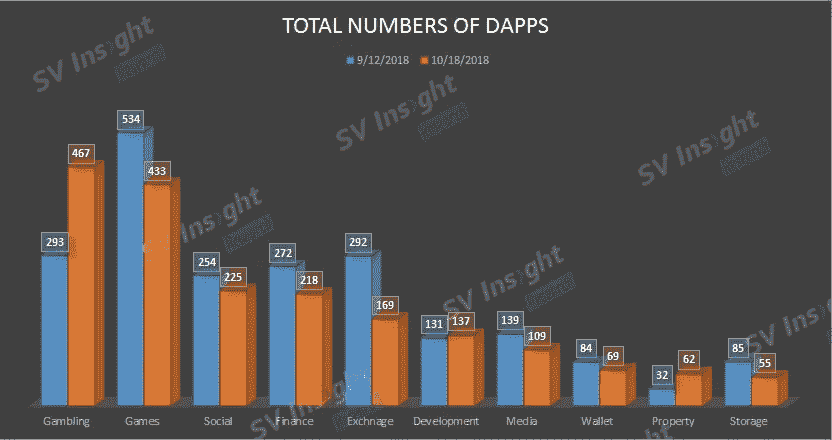
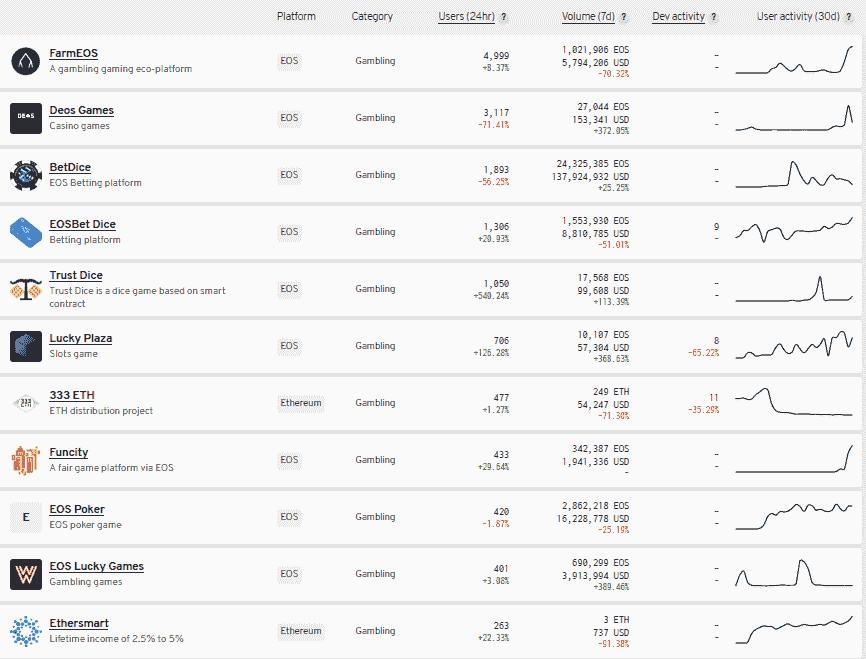

# 尽管政策严格，但中国正主导着博彩业

> 原文：<https://medium.com/hackernoon/china-is-dominating-gambling-dapps-despite-its-strict-policy-ad81b6d0149f>

自从区块链工业发展以来，Dapp 已经成为一个热门话题。

[**SV Insight Research**](http://www.us.svinsight.com)**分析了 2018 年 9 月 12 日至 2018 年 10 月 18 日“Dapps 状态”的数据，发现赌博 Dapps 占了 Dapps 的大部分。**团队根据日常活动评选出十大赌博 Dapps，发现中国的开发团队占据四席。此外，对于玩家的国家类别，中国也拥有最多的玩家。

Total numbers of Dapps

根据“Dapps 状态”的数据，在 2018 年 10 月 18 日结束时，**赌博是所有类别中 Dapps 最多的**。在 2018 年 9 月 12 日之前，赌博 Dapp 的总人数为 293 人，但在 2018 年 10 月 18 日增加到 467 人。

**第二名是游戏，计 433 Dapps** 。对于前五类 Dapp，赌博 Dapp 是这两个月中唯一增长的，其他都在下降。

Top 10 Dapps September 2018 to October 2018 (Credit to State of the Dapps)

# 赌博案

**在排名前 10 的博彩 Dapp R & D 队中，中国占据 4 席**，分别是 BetDice(香港)、EOSBet、Lucky Plaza 和 Funcity。如果你进入应用程序页面，你会看到这 10 款 Dapp 都有中英文格式，这意味着开发者意识到中国玩家可能是赌博游戏的目标客户。

没有具体的法律禁止美国公民在网上赌博。另一方面，中国公民不允许参加网上赌场或参与网上赌博。但网上仍有一些扑克和骰子游戏，主要玩家是中国人和俄罗斯人。

**让我们以最流行的赌博之一 Dapp 为例。**

FarmEOS 自 2018 年 10 月 16 日上线以来一炮而红。10 月 17 日，其 24 小时成交额超过 1 亿人民币，甚至一度加剧了 EOS 上 CPU 资源抵押价格的暴涨。它的成功可归因于 3 个因素:

一、因素一:参与游戏相当于挖矿。FarmEOS 还设计了它的项目标志--FARM。农场只能通过参与抽奖游戏获得。玩家参与游戏后，将获得相当于投注额 1.5%的农场。这可以简单理解为“参与游戏相当于挖矿”。有了 FARM，可以领取 FarmEOS Dapp 的奖金。

二。因素 2:在 FarmEOS 中，FARM 通过 Bancor 发布。因为在 Bancor 模式下，代币交易可以实现几乎无限的流动性和深度。

三。因素三:在这个项目中，农场代币的数量和分红的权重是独立的。代币多不代表分红多。账户的红利权重越高，获得的红利越多。红利权重与代币数量不成比例，但与用户的持仓价格相关。

综上所述，基于 2018 年 9 月 12 日至 2018 年 10 月 18 日“对赌 Dapp”的数据，对赌 Dapp 越来越受到消费者的青睐。

虽然中国在政策上非常严格，但是在赌博 Dapps 的设计团队和玩家群体中，中国还是占有非常大的比例。 [SV Insight Research](http://www.us.svinsight.com) 将继续关注区块链行业的数据和动态，并将最新发现更新至我们的博客。