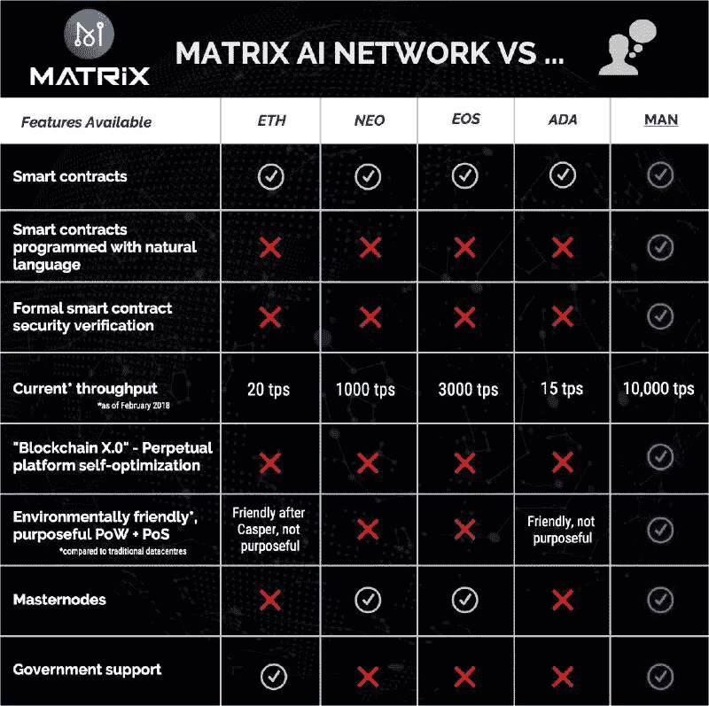
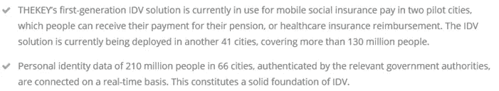

# 区块链上的中国，第三部分:硬币的冲突

> 原文：<https://medium.com/hackernoon/china-on-the-blockchain-43fd0e0cc2e6>

本系列的第 1 部分和[第 2 部分](/@WilliamGibs0n/china-on-the-blockchain-95336b5acbf9)主要关注 VeChain Thor 的合作伙伴关系和 EOY 价格预测。第三部分将考察 2018 年中国[加密货币](https://hackernoon.com/tagged/cryptocurrency)市场中一些不太为人所知但有很大上升空间的另类硬币。

寻找源自中国的小型区块链项目的信息可能很困难。然而，这可能对准备深入研究的投资者有利，并提供[机会来识别具有大量增长潜力的鲜为人知的项目](/theblock1/an-undervalued-blockchain-market-in-china-is-good-news-for-you-d0c010170622)。

我认为，加密货币项目未来成功的最佳指标是其合作伙伴/投资者的质量，以及通过实施区块链解决的问题所创造的价值规模。如果一家价值十亿美元的公司或政府在一个项目上投入了大量的时间和金钱，比我所希望的还要多，那么风险回报比就会大大提高。

出于这个原因，我认为这里包括的所有项目都有强大的合作伙伴和/或投资者，以及较低的市值，为中国[潜在的万亿美元区块链市场](https://hackernoon.com/china-on-the-blockchain-95336b5acbf9)的份额留出了空间。此外，大规模价值创造有一个清晰的用例。

[https://www.matrix.io/](https://www.matrix.io/)

Matrix 人工智能网络(MAN)是来自中国的一个很有前途且可能被低估的项目。 [MAN 的价格约为 0.70-0.80 美元，最多供应 250，000，000 枚硬币](https://coinmarketcap.com/currencies/matrix-ai-network/#charts)，使其市值约为 1.75-2 亿美元(如果你包括所有可能在未来流通的硬币) ***编辑:*** 最近的活动已将 MAN 推向 0.90-1.20 美元的范围。

[Does Bitcoin Genius](https://www.reddit.com/r/CryptoCurrency/comments/7m06e1/who_is_this_guy_i_see_him_on_every_ad_now_thanks/) like Matrix AI Network?

Matrix 将人工智能与区块链相结合，允许编程能力水平较低的用户创建智能合同，这些合同使用人工智能进行测试，以确保它们不包含错误或漏洞。它还使用一种挖掘形式来解决适用于现实世界的数学问题——而不是仅仅证明一些计算机能力已被用来解决它们的问题。

还有各种各样的其他好处，如更快的事务时间、可伸缩性、不易受到恶意攻击以及灵活性(通过使用自适应优化)。为了更深入地了解，我建议深入研究他们全面的[商业白皮书](https://www.matrix.io/html/MATRIXBusinessWhitePaper.pdf)和[技术白皮书](https://www.matrix.io/html/MATRIXTechnicalWhitePaper.pdf)。

[https://twitter.com/matrixchain](https://twitter.com/matrixchain)

## 矩阵伙伴关系和投资者

*   最令人兴奋的伙伴关系是他们与[中国政府“一带一路”倡议](https://en.wikipedia.org/wiki/One_Belt_One_Road_Initiative)的联系:

> MATRIX 的商业生态/伙伴关系主管是国有企业一带一路研发中心的执行项目专家。MATRIX 是该中心的独家区块链合作伙伴和独家人工智能合作伙伴，所有通过该中心与区块链有关的一带一路合同和项目都归 MATRIX 所有。

[https://en.wikipedia.org/wiki/One_Belt_One_Road_Initiative](https://en.wikipedia.org/wiki/One_Belt_One_Road_Initiative)

虽然在 MAN Reddit 页面和许多新闻文章中提到了 MAN 和 OBOR 计划之间的联系，但除了这篇中文文章外，我找不到任何具体的内容，这篇中文文章显然显示了 MATRIX 团队与政府官员的会议。不过，我认为这种说法不太可能被中国政府否认，如果它不是真实的。

*   中国人工智能协会，一个国家控制的组织。
*   Torque Capital Partners(见下文)。
*   超级账本。

[https://www.slideshare.net/SMatthewEnglish/introduction-to-hyperledger](https://www.slideshare.net/SMatthewEnglish/introduction-to-hyperledger)

*   北京肿瘤医院，另一个政府机构。
*   Cybernaut，一家管理资产超过 2000 亿 CNY 的投资集团。

[一月份的这篇关于 ICO 的文章](https://hackernoon.com/matrix-although-youve-never-heard-of-it-is-the-next-10000-ico-here-s-why-920492238596)深入探讨了该项目的优点。请注意 ICO 已经发生了。我还发现[这份汇编的研究](https://files.acrobat.com/a/preview/b33dd32e-968a-4f57-a7e4-b1c2bfba9e70)作为该项目的相对详细的概述很有用。

黑客帝国(MAN)目前在 iDEX 上只有[可用。与其他一些大型交易所相比，这个交易所在使用和设置上要稍微困难一些。然而，我认为这是一个好处，因为它可能会吓跑许多潜在买家，这意味着当它最终在币安等更大的交易所发行时，上涨空间应该会更大。](https://idex.market/eth/man)

***这不是投资建议*** 。在做任何投资之前，先做好自己的研究。我已经购买订单到位时，男子下降到 0.90 美元，但没有以任何方式与该项目有关。

[http://www.cpchain.io/](http://www.cpchain.io/)

> CPChain ( [CPC](https://coinmarketcap.com/currencies/cpchain/#markets) )是面向下一代物联网(IoT)的新型分布式基础设施。CPChain 旨在结合分布式存储、加密计算和区块链技术，为物联网系统构建基础数据平台，提供从数据采集、存储、共享到应用的全流程解决方案。

[http://www.cpchain.io/index.html#project](http://www.cpchain.io/index.html#project)

## 美丽的月亮为什么是硬币？

CPChain 目前的价格约为 0.23 美元，[流通供应量为 2.3 亿枚硬币，总供应量为 10 亿枚硬币](https://bibox.zendesk.com/hc/en-us/articles/360000764994-CPChain-CPC-)。这使得目前的市值约为 5200 万美元(如果你只包括流通硬币)至 2.3 亿美元(如果你包括所有未来流通硬币)。

[http://www.cpchain.io/CPChain_Whitepaper_English.pdf](http://www.cpchain.io/CPChain_Whitepaper_English.pdf)

虽然许多项目都在寻求通过使用物联网来获取价值，但 CPC 已经建立了合作伙伴关系，这让我相信他们很可能会成功地在这个市场中占有一席之地。

*   CPChain 的投资者有 [Qtum 基金会、Vechain 基金会、元宇宙基金会、Chainfund 和 HPB](http://www.cpchain.io/investors.html)。

[http://sl.vc/posts/4760](http://sl.vc/posts/4760)

> QTUM 是一家中国区块链公司，专注于改善智能合同和服务的执行，弥合区块链和商业世界之间的差距。

QTUM 本身拥有一大批令人印象深刻的投资者，QTUM coin 的总市值排名第 20 位，接近 20 亿美元。我也相信 QTUM 可能是一个值得关注的伟大项目，尽管我没有在这里详细介绍它，因为我想专注于较小的 cap 项目。

Angel Backers of QTUM [https://qtum.org/en/learn-more-about-qtum](https://qtum.org/en/learn-more-about-qtum)

*   [Torque Capital Partners](https://www.torque.vc/) 是一家专门从事未来区块链项目合作的风险投资公司。你可以在这里找到[Torque 合作伙伴的详细信息，以及 CPChain 团队的详细信息。](/@Torquecapital/cpchain-cyber-physical-chain-a6c3a6a3dc01)
*   作为你自己研究的一部分，你可能想深入下面与伙伴关系相关的链接，或者深入 HackerNoon 的[这篇文章。](https://hackernoon.com/vechain-and-qtum-partner-with-cpchain-to-revolutionise-iot-in-china-519462c6aab)

CPChain 目前在 [iDEX](https://idex.market/eth/cpc) 和 [Bibox](https://www.bibox.com/login/register?id=11235652&lang=en) 上可用。

***提醒一下，这不是投资建议*** 。在做任何投资之前，先做好自己的研究。我拥有一些 CPChain，但与这个项目没有任何关系。上面的 Bibox 链接是一个推荐链接。

[https://www.thekey.vip/](https://www.thekey.vip/)

《钥匙》( TKY)是另一个不为人知的伟大项目。目前的市场价格在 0.027-0.04 美元之间，未来最多供应 100 亿枚硬币，因此市值在 2.7-3.5 亿美元之间(如果只计算流通中的硬币，市值会低得多)。

密钥将与最终用户(公民)、政府、社会保险提供商(也是政府)、银行和医疗保险提供商合作，使用区块链和生物识别数据来跟踪来自不同来源的个人数据，并确认他们的身份。

> 关键是使用国家大数据和区块链的身份验证工具的分散生态系统。该项目组现在正在与区块链开发一个身份验证(IDV)工具…通过使用个人身份信息(PII)，这是由政府当局独家授权。

下面的视频(中文)给出了大概的思路(只有 1 分钟长)。

[https://www.thekey.vip/](https://www.thekey.vip/)

Cryptocoin 的这篇文章精彩地概述了 TKY 将如何通过在中国嘉兴的试点项目来简化医院流程。如果你曾经在中国的医院接受过治疗，你将会清楚地意识到仅仅是这个应用程序就能带来显著的效率提升。

## 伟大的抱负需要伟大的伙伴

*   关键的[最近宣布与](/@thekeyvip/thekey-reached-cooperation-on-research-of-security-supervision-mechanism-of-social-security-data-3e58b366171)[中国联通](https://en.wikipedia.org/wiki/China_Unicom)合作，中国联通是一家大型国有电信运营商，市值 391 亿美元。

[https://medium.com/@thekeyvip/thekey-reached-cooperation-on-research-of-security-supervision-mechanism-of-social-security-data-3e58b366171](/@thekeyvip/thekey-reached-cooperation-on-research-of-security-supervision-mechanism-of-social-security-data-3e58b366171) Price in article quoted in HKD

在中国，激活 sim 卡需要出示身份证/护照，因此手机本质上已经成为身份追踪设备。

在 2 月 14 日的声明之后，TKY 从大约 0.027 美元跃升至 0.04 美元的峰值，然后蜿蜒回落至大约 0.026-0.028 美元。就像什么都没发生一样！

[https://coinmarketcap.com/currencies/thekey/](https://coinmarketcap.com/currencies/thekey/)

*   TKY 还宣布了与中国社会保险协会(CSIA)和[清华紫光](https://en.wikipedia.org/wiki/Tsinghua_Holdings)的合作，其间签署了合作协议，合作项目名称为 ***社保数据社会化安全监管机制研究*** 。清华紫光党委书记(最高职位)是前中国国家主席胡锦涛的儿子。
*   [中国人寿再保险公司](https://en.wikipedia.org/wiki/China_Re) (ChinaRe)，一家 750 亿美元的保险公司:

[http://asia.cointime.com/blockchain/10421.html](http://asia.cointime.com/blockchain/10421.html)

*   [专注于区块链技术的风险投资公司 rex Ford Ventures](/@rexfordventures)，[也在几天前宣布了他们的投资](/@rexfordventures/the-key-tky-a-chinese-blockchain-company-with-outstanding-potential-ee5b5c952ba5)。[根据他们的网站](http://rexfordventures.com/portfolio)显示，其他投资包括 Omisego、Chain Link、CPChain、Matrix AI Network。
*   的 CEO 是 Catherine Li，她被中华全国妇女联合会**评选为 2017 年**中国**最杰出女企业家，也是 [**年度十大影响力中国女性**](/@thekeyvip/catherine-li-was-selected-as-one-of-the-top-ten-influential-chinese-women-of-the-year-902897af4ca1) 之一。**

****

**[https://www.thekey.vip/](https://www.thekey.vip/)**

**[这篇文章](https://steemit.com/cryptocurrency/@pandorasbox/thekey-tky-news-revealed-largest-chinese-chipmaker-and-largest-chinese-telecom-company-partnered)还对 TKY 项目和合作伙伴关系进行了很好的分析。TKY 的[维基也给出了相关细节的简要概述。为了更深入地了解，你可能会考虑](http://list.wiki/TheKey_(TKY))[下载白皮书](https://www.thekey.vip/disclaimers)和[阅读常见问题](https://www.thekey.vip/faq#n11)。**

**钥匙(TKY)是目前仅在 KuCoin 上可用的[。再说一次，当一枚硬币还没有在币安这样的主要交易所上市时，这不一定是件坏事。大多数含有任何物质的项目最终都会迁移到币安，到那时你就可以期待一个健康的价格上涨。](https://www.kucoin.com/#/)**

*****这不是投资建议*** 。在做任何投资之前，先做好自己的研究。我持有一些 TKY，但不属于这个项目的任何方式。**

**如果你渴望对区块链技术和加密货币的未来进行更深入的猜测，请在 Medium ( [Bare Shylls](https://medium.com/u/1e7aa51bf607?source=post_page-----43fd0e0cc2e6--------------------------------) )和 Twitter([https://twitter.com/BareShylls](https://twitter.com/BareShylls))上关注我。**

**第四部分研究了为什么三一网络信贷(TNC)对近地天体生态系统的发展至关重要，并讨论了 2018 年 EOY 及以后的价格和市场份额预测。**

**我总是在发现和研究我投资的项目的新信息，我通过 Twitter 更新这些信息——例如最近对 TKY 首席执行官的采访和新交易所发布的关于 MAN token 的传言。**

**如果你喜欢这篇文章，然后按住下面的鼓掌按钮，直到它达到 50，并在社交媒体上分享这篇文章。**

****

**还有其他问题吗？发现错误？不同意我写的东西？写在评论里，我会回复你的。**