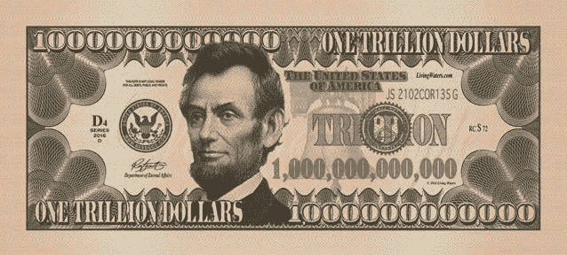

# 区块链上的中国，第二部分:万亿美元的信任

> 原文：<https://medium.com/hackernoon/china-on-the-blockchain-95336b5acbf9>

[本系列的第一部分](/@WilliamGibs0n/china-on-the-blockchain-how-the-vechain-thor-blockchain-is-set-to-revolutionize-governance-2c640b7c512c)探讨了 VeChain 如何建立了几乎所有[区块链](https://hackernoon.com/tagged/blockchain)项目中最令人印象深刻的合作伙伴关系，并准备在 2018 年年中大举进入中国市场。

第二部分将调查 Vechain 如何在中国经济中创造价值和降低成本，以及这将如何影响 2019 年初及以后 VET 的市值。

[https://coinmarketcap.com/all/views/all/](https://coinmarketcap.com/all/views/all/)

## 信任有多大价值？

目前所有货币的[市值](https://coinmarketcap.com/)(截至 2018 年 2 月 14 日)为 4000 亿美元，在我看来，到今年年底有可能突破 2-3 万亿美元。这一水平的市值意味着价值创造，或相同金额的未来贴现价值创造。这就引出了一个问题，所有这些价值从何而来？

市值 6 亿美元的山寨加密货币真的能创造那么多价值吗？价值主张在哪里？

[http://dogecoin.com/](http://dogecoin.com/)

区块链技术创造价值的主要来源是作为一种以可忽略不计的边际成本在不同方之间建立信任的机制，经济学家将区块链吹捧为信任机器。VeChain 将成为最终的信任机器，为地球上许多最大的组织提供 ***区块链即服务*** 。

[https://www.economist.com/news/leaders/21677198-technology-behind-bitcoin-could-transform-how-economy-works-trust-machine](https://www.economist.com/news/leaders/21677198-technology-behind-bitcoin-could-transform-how-economy-works-trust-machine)

我们在第 1 部分中简要讨论了[VeChain 可能如何获取价值或与其各种合作伙伴建立信任。在 2015 年发布的](/@WilliamGibs0n/china-on-the-blockchain-how-the-vechain-thor-blockchain-is-set-to-revolutionize-governance-2c640b7c512c) [VeChain 发展计划(非白皮书)](https://cdn.vechain.com/vechain_ico_ideas_of_development_en.pdf)中给出了几个例子。

其中包括 VeChain 的主要合作伙伴之一普华永道(PwC)2016 年的一份报告，该报告估计食品欺诈是一个估计价值 400 亿美元的全球问题，其他消息来源表明[中国高达 30%的酒是假的](https://cpianalysis.org/2017/01/16/fake-wine-in-china/)。由于 2008 年的[婴儿奶粉丑闻，蒙牛公司失去了数十亿美元的信任。](https://www.forbes.com/sites/yanzhonghuang/2014/07/16/the-2008-milk-scandal-revisited/#b142ca74105b)

[https://www2.deloitte.com/content/dam/insights/us/articles/3712_Tech-Trends2017-Blockchain/figures/Tech-Trends-2017_Blockchain_Fig1.png](https://www2.deloitte.com/content/dam/insights/us/articles/3712_Tech-Trends2017-Blockchain/figures/Tech-Trends-2017_Blockchain_Fig1.png)

政府是降低信任成本的主要受益者之一，据估计，逃税每年造成数万亿元人民币的损失。发展计划估计，海关官员的商品检验等过程可以提高效率高达 80%。这个例子可能适用于政府官僚机构的许多其他领域。

要求公证文件的个人(如医生、工程师、毕业生及其雇主)可以通过公共区块链访问这些信息。不再需要公证人。

其他例子包括汽车行业，其中所有者不拥有用户数据，导致保险公司和其他服务提供商与信息收集和验证相关的成本。

从本质上讲，任何从事建立信任(如公证人)或充当集中信任来源(如银行)业务的企业都需要快速适应，否则就会被采用区块链的用户或竞争对手的生产率提高所压垮。类似地，任何不创造价值并拥有主导该领域市场份额的合作伙伴关系的[加密货币](https://hackernoon.com/tagged/cryptocurrency)/区块链网络都可能会走向零。

## 计算 2019 年中国 VeChain 的市值

【 ***警告*** :以下思路可能包含实质性的逻辑谬误】

The amount of thought that went into this price prediction

据观察，中国经济参与者之间的信任度从根本上来说是很低的。我认为有理由认为，创造廉价且不变的信任可能会从经济中已经创造的价值中额外提取 1.5%的价值。

鉴于中国 2019 年的国内生产总值(GDP)约为 13.5 万亿美元，这意味着那一年通过提高信任度创造的价值(或利润)将约为 2000 亿美元。如果我们随后将区块链视为一项业务或产业，并且[使用 5](https://businesstown.com/articles/fast-and-simple-business-valuation/) 的利润乘数，那么这将使区块链技术产业的当前价值约为 1 万亿美元。

看看 VeChain 和它建立的伙伴关系，你希望这个项目能获得多大份额？

虽然中国还有一些其他竞争者和区块链竞争者(这将在第三部分讨论)，但我认为 2019 年 30%的市场份额是合理的，如果不是保守的话。这将使 VeChain Thor 区块链提取的价值达到约 3000 亿美元。

如果我们假设公司可能准备为这些收益支付 50%的价格，那么使用 VeChain Thor 区块链的价值估计可达 1500 亿美元，这一价值由流通硬币的总市值来表示。这意味着每只兽医的价格为 300 美元(假设当前价格为 4 美元，市值为 20 亿美元)，是当前价格的 75 倍。

这一估价来自几个(可能不现实的)假设:

*   VET 的市值等于使用 VeChain Thor Power 区块链创造的价值。

实际上，市值可能主要基于关键合作伙伴在建立节点(Thrudheim Authority 节点、Mjolnir 节点、Thunder 节点和 Strength 节点)的初始投资中对 VET 的需求、用户和服务提供商通过使用区块链创造的价值以及投机。其中投机将在早期阶段发挥相当大的作用。对于这样一种新技术，没有既定的框架来计算现实的市值。

也可能是这样的情况，如果基于区块链的货币成为中国转移价值的主要手段(相对于人民币)，那么这个市值将会高出许多倍。

*   区块链技术将使中国的经济效率每年提高 1.5%。

我认为这是一个极端的低估。没有人能确切知道，但我认为 5-15%会更公平。

*   利润乘数为 5，根据单年提取的价值计算区块链的总价值。
*   职业教育和培训占 30%的市场份额。
*   公司准备为实施区块链节省的每一美元支付的价格。

这还没有考虑到公司实施技术和改造现有系统所需的大量投资。

很明显，到 2018 年底，VET 预计为 300 美元，这有很多局限性。然而，我认为所使用的近似值在确定公平市场价格方面有一定的有效性。

如果你认为这是或不是一个公平的市场价格，请在下面评论，为什么。

你可能会好奇，如果 VeChain 只在中国大饼的区块链行业占据 30%的份额，那么还有哪些项目会吞噬剩下的 70%呢？第 3 部分将讨论其他准备在 2018 年爆发的项目。

我不是你的财务顾问。这不是财务建议。我持有一些 VEN/VET，但与 VeChain 没有任何关系。自己做研究。

如果你渴望对区块链技术和加密货币的未来进行更深入的猜测，那么请在 Medium ( [Bare Shylls](https://medium.com/u/1e7aa51bf607?source=post_page-----95336b5acbf9--------------------------------) )和 Twitter(【https://twitter.com/BareShylls】)上关注我。

如果你喜欢这篇文章，然后按住下面的鼓掌按钮，直到它达到 50，并在社交媒体上分享这篇文章。

