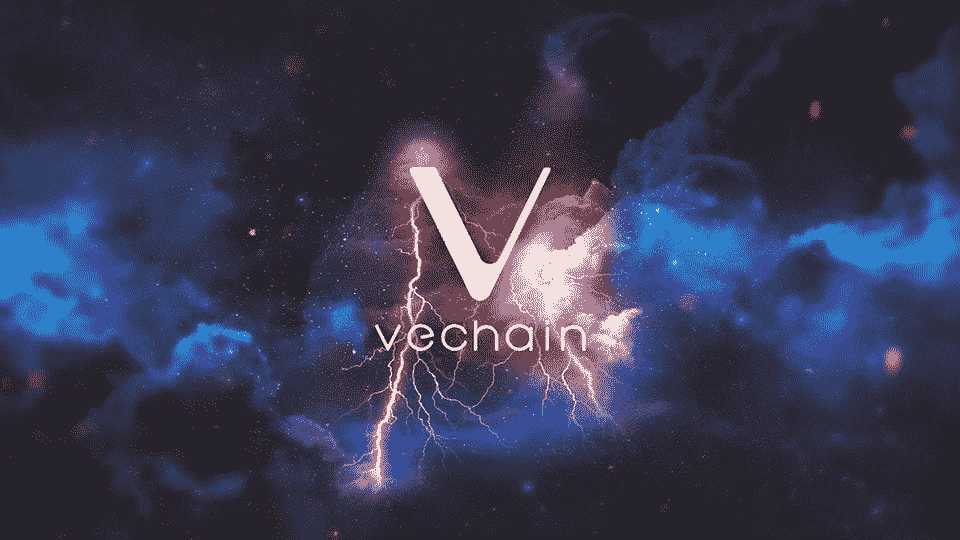
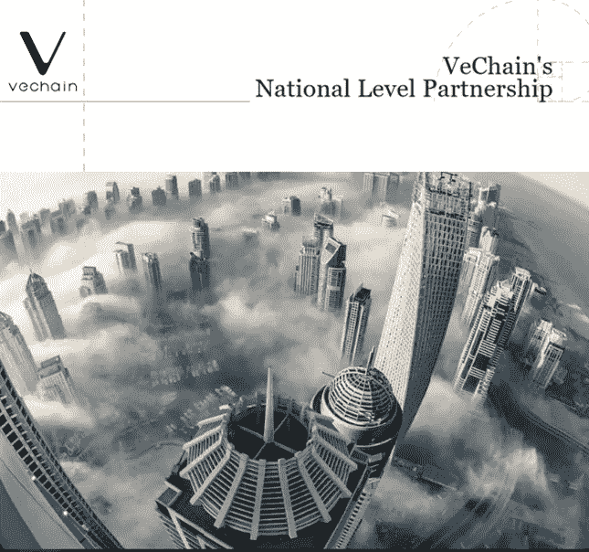
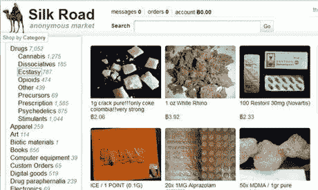
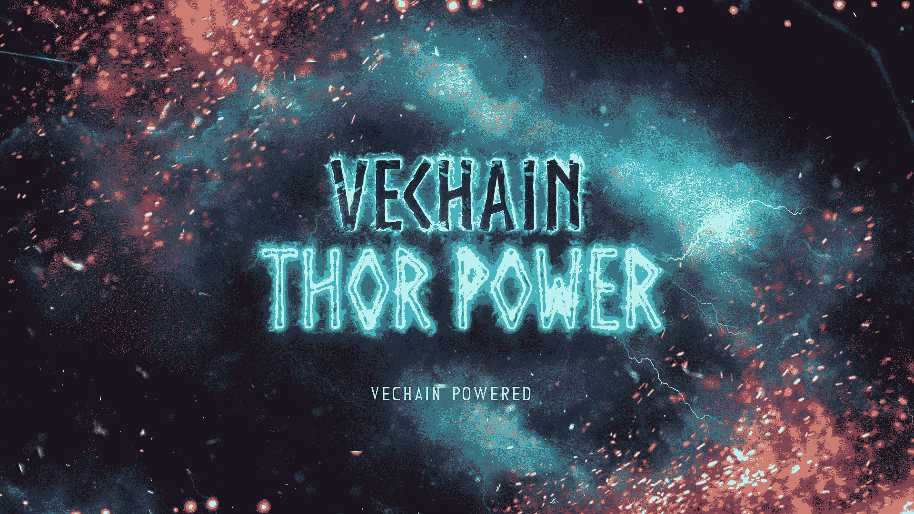
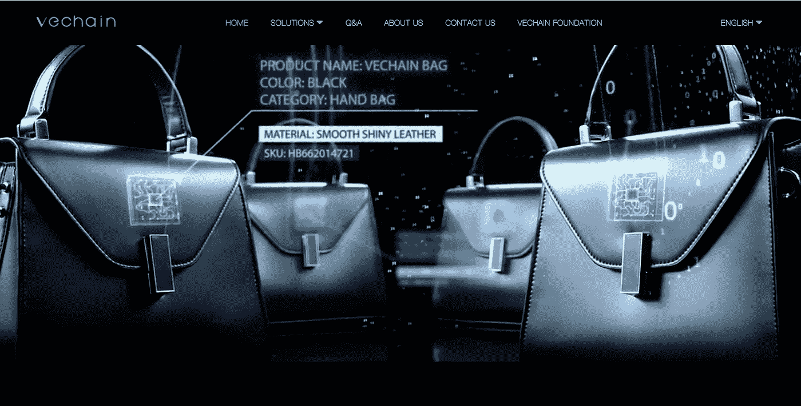
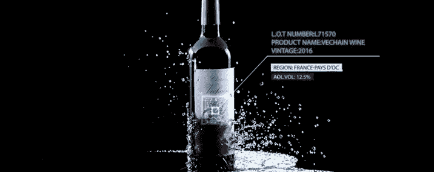
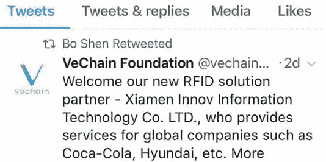
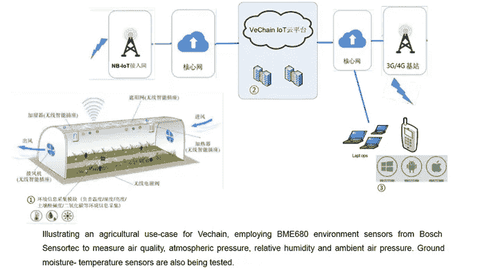
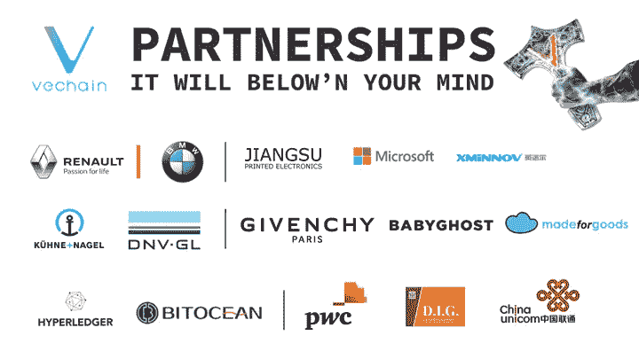
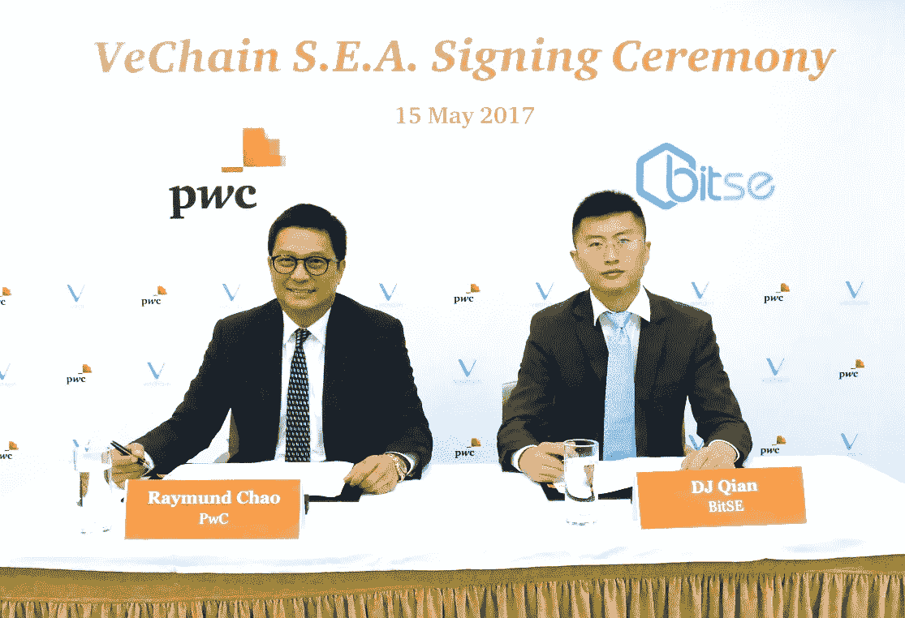

# 区块链上的中国，第一部分:区块链已经在这里了——只是分布不是很均匀。

> 原文：<https://medium.com/hackernoon/china-on-the-blockchain-how-the-vechain-thor-blockchain-is-set-to-revolutionize-governance-2c640b7c512c>

## VeChain Thor 区块链将如何彻底改变中国的治理、金融、物流和农业

虽然美国参议院([除了参议员马克·沃纳](https://www.bitsonline.com/senator-warner-20-trillion/))对[区块链](https://hackernoon.com/tagged/blockchain)的基本原理表现出惊人的缺乏了解，但随着[在中国西部贵州省贵安](/@vechainofficial/vechains-national-level-partnership-b3bc792cb1f1)新建区块链智能城市，中国将成为第一个大规模采用该技术的国家。

[https://medium.com/@vechainofficial/vechains-national-level-partnership-b3bc792cb1f1](/@vechainofficial/vechains-national-level-partnership-b3bc792cb1f1)

有一篮子面包屑和信号表明 [VeChain (VEN)](https://coinmarketcap.com/currencies/vechain/) 和 Thor 区块链将成为未来城市运行的基础设施，从贵安智能城市开始。

对于不经意的观察者来说，中国似乎并不支持加密货币，【2017 年 9 月 ICO 被禁止并且[加密货币交易所在此后不久](https://www.forbes.com/sites/kenrapoza/2017/11/02/cryptocurrency-exchanges-officially-dead-in-china/)被关闭。这并不奇怪，因为主流媒体经常吹捧密码是毒贩、刺客和洗钱者的专属领地。

然而，根据区块链网络的架构，它可以以这样一种方式建立，即在整合政府监管的同时获得区块链技术的好处。

在 VeChain 的例子中，实现将是真正革命性的:

> 从本质上来说，VeChain 基金会并不相信完全无政府的分权，也不相信极权统治。正是出于这个原因，董事会成员设想了介于两者之间的东西。我们的治理结构是一种通过集中渠道的新型分权体系。

以上摘录摘自 [VeChain 关于将 VeChain 神化重新命名为 VeChain Thor](/@vechainofficial/vechain-apotheosis-the-beginning-d9f0fdbdc910) 的公告，其翻译为“*将某事颂扬到一个神圣的水平”*。

[https://medium.com/@vechainofficial/vechain-apotheosis-part-ii-thor-power-forged-974111a93278](/@vechainofficial/vechain-apotheosis-part-ii-thor-power-forged-974111a93278)

## **难以想象的复杂性**

一旦升级到 VeChain Thor block chain(VET ), VeChain 将以类似于以太坊的方式运行，充当网络/区块链，在此基础上可以构建其他应用程序。与以太坊不同，以太坊让开发者和公司去考虑区块链的用途并开发他们自己的令牌，VeChain 有一长串的大合作伙伴与它合作开发应用程序。虽然 VEN 目前是一个 [ERC20 令牌，运行在以太网](http://support.exodus.io/article/108-what-is-an-erc20-token)上，并且在 2 月底转换为 VET 时将继续这样做，但一旦 [mainnet 在 6 月](https://kryptocal.com/event/6249/vechain-(ven)-mainnet-launch)发布，它不太可能继续留在以太网上——原因我将在[第 2 部分](/@WilliamGibs0n/china-on-the-blockchain-95336b5acbf9)中讨论。

核心信息是，合法和近期的商业应用，而不是对潜在未来用途的猜测和炒作，是执行区块链技术的最肥沃土壤。

从对 VeChain 计划如何运营的粗略研究中，似乎他们只是利用区块链来提高物流的透明度。光是这一点就会成为一个强有力的使用案例，假货行业估计每年价值近 50000 亿美元，还有像婴儿配方奶粉丑闻这样的事件，其中有 6 名婴儿死亡，30 万名婴儿患病，这凸显了加强供应链控制的必要性。

[https://www.vechain.com/](https://www.vechain.com/)

除了物流应用，VeChain 还与中华人民共和国国务院建立了多项合作关系。如果你很难思考，这意味着中国中央政府。

Posted by *Yicai Global, part of China’s state ran Yicai Media Group*

当中国禁止 ICO 和 [Crypto](https://hackernoon.com/tagged/crypto) 交易，然后不久又要求一小部分本土团队成为政府合作伙伴，这发出了什么信号？考虑到脸书、Youtube、谷歌、Twitter、亚马逊和优步在中国的命运，这一点也不奇怪。

贵州西部的贵安新区被赋予经济特区的地位，旨在将其打造成中国西部的国家数据中心， ***，专注于大数据、区块链、云计算和智能解决方案*** 。

如果官方媒体在 Twitter 上明确的政府支持(见上图)还不够充分的话，VeChain 在 2017 年 12 月发布了以下新闻声明:

> ***VeChain 被授权为贵安政府的区块链技术合作伙伴，以规划、设计和实施该等流程*** 。

下面是上面提到的过程的概述:

## ***国家治理***

> 提供一个基于区块链的信息系统来收集和分析行政数据并减少繁文缛节。
> 
> 为资料提供私隐保护，并储存与商业登记有关的文件。
> 
> 允许远程企业注册和强大的审计。

通过集中管理减少时间浪费的潜在价值是巨大的。除此之外，还能即时计算公共项目的每一分钱和所欠税款(如果所有支付都是通过网络进行的)，好处显而易见。鉴于[现金支付在中国变得越来越过时](https://www.nytimes.com/2017/07/16/business/china-cash-smartphone-payments.html)，微信支付和支付宝等移动支付应用无处不在，实施税务审计区块链[将为政府节省数十亿美元的收入损失](https://www.linkedin.com/pulse/tax-evasion-china-trillion-yuan-heist-andy-clayton/)。

## ***首家区块链驱动的精品酒/酒交易所***

Vechain 通过与 DIG(上海外高桥直接进口商品销售中心有限公司)的联系已经有了一个工作产品，DIG 也是一个政府所有的实体，使用他们的 NFC 芯片(一种附着在源上的智能芯片，可以跟踪产品是否真实、位置、温度、所有权等数据)。)来实现从源的完全和不可变的可追溯性。

PwC video explaining VeChain used in DIG wine counterfeiting

[DIG 目前占中国进口葡萄酒的 30%,这意味着预计将有 12 亿瓶 70cl 葡萄酒使用这些连接到 VeChain Thor 网络的芯片进行认证](https://bittox.com/2017/12/01/vechain-future-chinese-blockchain-solutions/)。

[https://www.vechain.com/](https://www.vechain.com/)

VeChain 不仅打算利用这种合作关系和技术来推动有史以来第一个区块链酒类交易所，他们还计划利用 VeChain 来推动世界各地的未来交易所，在那里实物资产将与数字资产相结合。

## ***智能区块链农业***

VeChain 与辽宁省农业科学院(也是一个政府实体)一起开发了一个智能农业云平台。

[https://medium.com/@vechainofficial/vechain-insights-vol-8-c2988c8adcb](/@vechainofficial/vechain-insights-vol-8-c2988c8adcb)

在 VeChain 媒体页面上对这个项目的[概述比我在这里所能给出的要详细得多。](/@vechainofficial/vechain-insights-vol-8-c2988c8adcb)

我建议您花点时间阅读一下 8 页的新闻稿，其中概述了 VeChain 将在贵安做些什么。

如果你不确定中国政府对实施区块链技术有多认真，以下摘录似乎很有说服力:

> ***当技术和实施流程得到充分测试后，预计该流程将在整个中国地区推广。***

## ***物流***

在物流方面，VEChain 与质量保证和风险管理公司 [DNV GL](https://www.dnvgl.com/) 以及世界最大的货运公司[Kuehne&Nagel](https://www.trustnodes.com/2016/09/06/worlds-largest-freight-company-use-blockchain-tech-asset-management)合作。《美国运输杂志》最近的一篇文章详细介绍了区块链技术在物流中的应用如何帮助企业提高产品从工厂到消费者的透明度和可追溯性。 [来自传感器的数据可以记录到自动区块链](/@vechainofficial/vechain-insights-vol-7-35d2d0547286)中，保证关于产地来源、温度水平(对于冷冻食品)以及产品是正品还是假货的准确和即时信息。

## VeChain Thor 为事物找到了自己的用途

我可以再用 2000 个字来详述过多的伙伴关系。更不用说他们的开发团队，这几乎与合作伙伴的数量和实力一样令人印象深刻——该团队的概述可以在这里找到。然而，由于本文的目的是毫无疑问地展示 VeChain 未来运营和用例的规模，因此与相关细节的链接就足够了。

[https://medium.com/@vechainofficial/vechain-bitocean-7f12402e13b0](/@vechainofficial/vechain-bitocean-7f12402e13b0)

[https://medium.com/@vechainofficial/vechain-breaks-into-the-financial-services-industry-by-partnering-with-fanghuwang-2a3a42ebe6b](/@vechainofficial/vechain-breaks-into-the-financial-services-industry-by-partnering-with-fanghuwang-2a3a42ebe6b)

是的，很多都是 Twitter 公告。没错，从 Twitter 复制粘贴就是懒。但是，我想先完成本系列的第 1 部分，然后继续第 2 部分，讨论 VeChain Thor/mainnet 的实施以及 2018 年及以后可能的市值。

[https://medium.com/@vechainofficial/vechain-blockchain-solutions-to-enter-chinas-tobacco-industry-in-force-c92b3729878f](/@vechainofficial/vechain-blockchain-solutions-to-enter-chinas-tobacco-industry-in-force-c92b3729878f)

[https://medium.com/@vechainofficial/https-medium-com-vechainofficial-itaotaoke-8844d73a7699](/@vechainofficial/https-medium-com-vechainofficial-itaotaoke-8844d73a7699)

普华永道会计师事务所:

[https://www.pwccn.com/en/press-room/press-releases/pr-150517.html](https://www.pwccn.com/en/press-room/press-releases/pr-150517.html)

布雷耶资本[，脸书早期 12.5%的投资者](https://techcrunch.com/2017/11/08/famed-vc-jim-breyer-on-finding-the-next-mark-zuckerberg-and-much-more/):

[https://medium.com/@jimbreyer/announcing-our-vechain-advisory-role-5e37b7722978](/@jimbreyer/announcing-our-vechain-advisory-role-5e37b7722978)

虽然上面的用例相对容易可视化，但 VeChain Thor 区块链实际上如何运行却更加难以捉摸。随着[将 VeChain 更名为 VeChain Thor Blockchain 将于 2 月 26 日](/@vechainofficial/vechain-apotheosis-the-beginning-d9f0fdbdc910)举行，[将于 6 月推出 VeChain 的公共链，第二部分将探讨使用 VeChain Thor Blockchain 所创造的价值如何转化为 2018 年 VET 的市值](/@WilliamGibs0n/china-on-the-blockchain-95336b5acbf9)。

Sunny Lu — CEO of VeChain

我不是你的财务顾问。这不是财务建议。我拥有一些 VEN/VET，但与 VeChain 没有任何关系。

如果你喜欢阅读这篇文章，并希望阅读更多关于行业中区块链用例的深度内容，那么 ***击碎掌声*** 和 ***点击关注***(Twitter:[https://twitter.com/BareShylls](https://twitter.com/BareShylls))。

[在此阅读第 2 部分](/@WilliamGibs0n/china-on-the-blockchain-95336b5acbf9)。