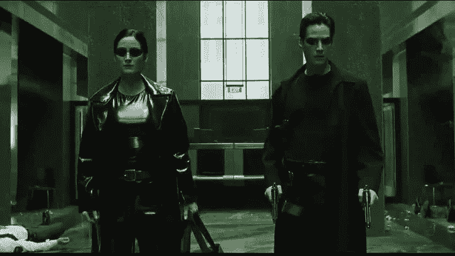
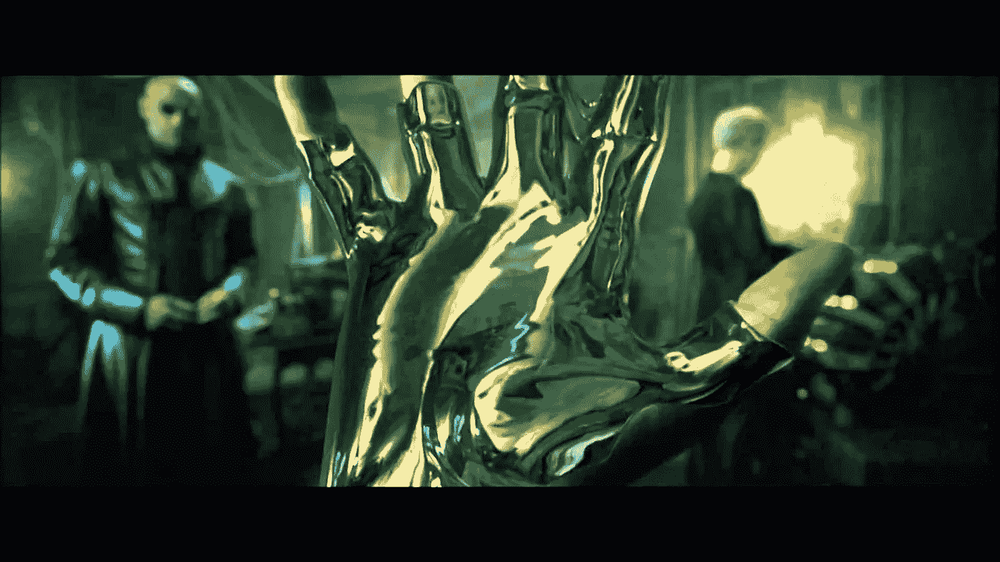
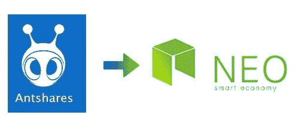
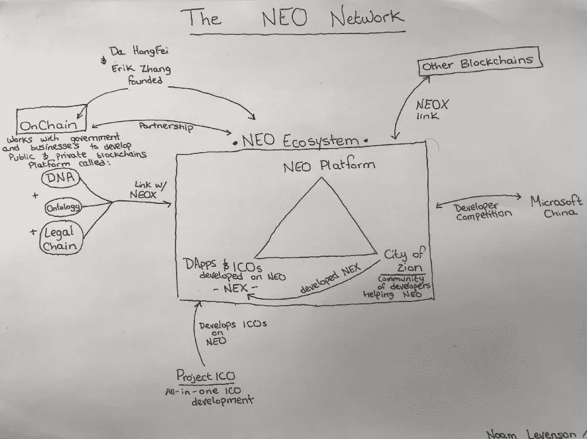
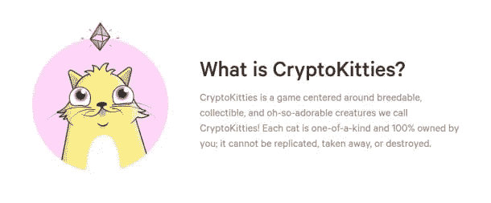
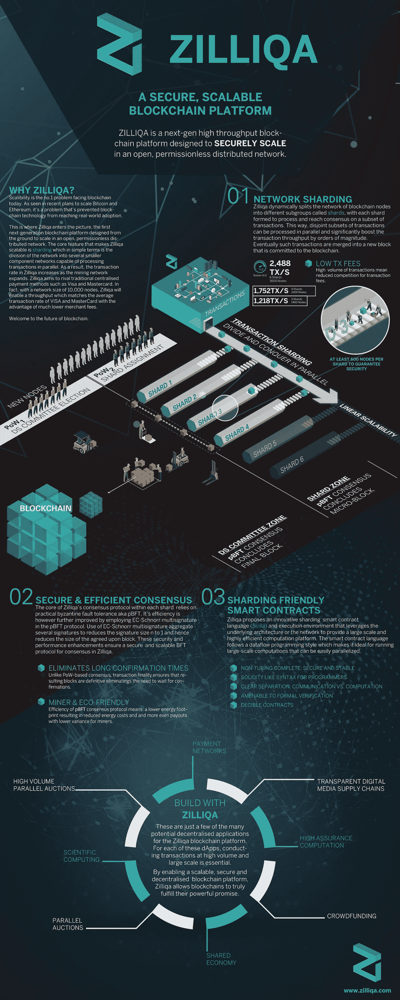
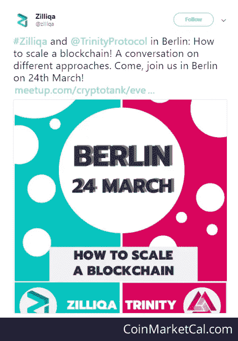
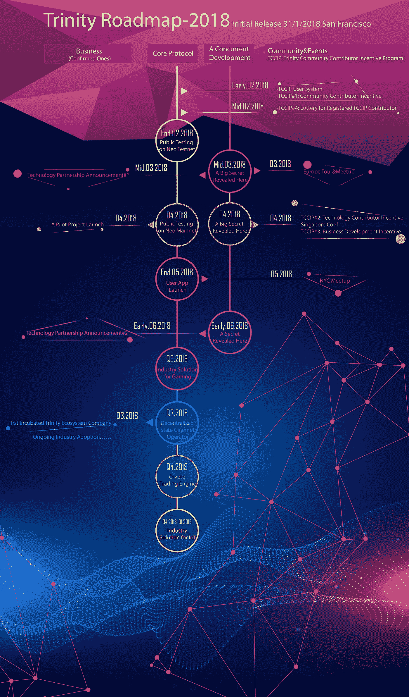
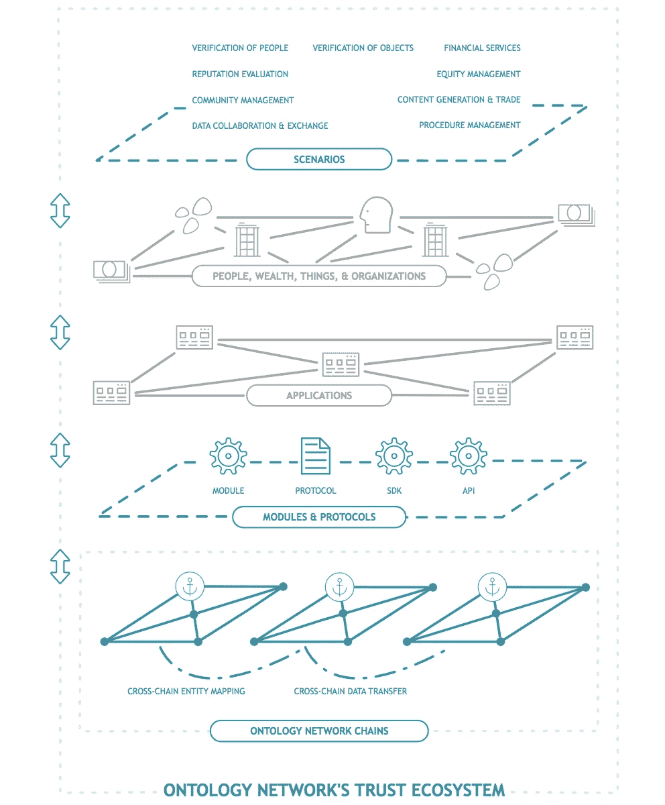

# 区块链上的中国:醒醒吧，尼奥

> 原文：<https://medium.com/hackernoon/china-on-the-blockchain-wake-up-neo-80d6893602fa>

## 第四部分:为什么三一网络信贷(TNC)对 NEO 在中国的成功至关重要

[https://www.youtube.com/watch?v=NEuZgK669zY](https://www.youtube.com/watch?v=NEuZgK669zY)

[本系列的第 1 部分](/@WilliamGibs0n/china-on-the-blockchain-how-the-vechain-thor-blockchain-is-set-to-revolutionize-governance-2c640b7c512c)和[第 2 部分](/@WilliamGibs0n/china-on-the-blockchain-95336b5acbf9)聚焦于 VeChain 区块链项目及其即将到来的神化。[第三部分](https://hackernoon.com/china-on-the-blockchain-43fd0e0cc2e6)研究了一些不太知名的中国区块链项目，这些项目有强烈的迹象表明将在未来 18 个月内爆发。本文将探讨为什么[三位一体网络信贷(TNC)](https://coinmarketcap.com/currencies/trinity-network-credit/) 对于支持 NEO 项目是不可或缺的，因此被严重低估。如果你想要更多这样的文章，点击上面的**关注**按钮。

如果你花了很多时间研究中国的加密货币项目，你可能会注意到中国喜欢加密和区块链技术。虽然政府实施了禁止 ICO 和加密货币交易所的焦土政策，但这实际上是一种监管手段；孵化强大的项目和团队，同时限制猖獗的投机和诈骗。冒险深入兔子洞一点，你会看到真相:

> 地方政府，尤其是沿海地区，已经建立了区块链实验和研究机构。目前，深圳、杭州、广州、贵阳、赣州等地政府都在积极设立区块链开发区，并给予特殊的扶持政策。这些人口都超过 500 万的城市，大力推动区块链创新，将创造市场高地，开拓中国未来。

## 输入 NEO

NEO 项目于 2014 年启动，名为 Antshares，已经取得了巨大的增长。NEO 从 2016 年 9 月的 0.15 美元飙升至今天的 70 美元左右，2018 年 1 月高达 160 美元，在 CMC 上排名第 8，估计市值略低于 50 亿美元。

NEO 区块链和生态系统将提供一种整合数字/物理资产、数字身份(更具体地说，通过[密钥](https://www.thekey.vip/)，我在这里写了关于)和智能合约的方法。然而，与其解释 NEO 的价值主张(在别处已有大量论述),本文将重点讨论 NEO 为什么需要 Trinity 以及两个开发团队之间令人难以置信的紧密联系。如果你不了解近地天体的最新情况，想深入了解这个项目，我建议在继续之前先浏览一下这篇关于主题的[优秀文章:](https://hackernoon.com/neo-versus-ethereum-why-neo-might-be-2018s-strongest-cryptocurrency-79956138bea3)

> 如果以太坊是歌利亚，尼奥就是大卫。如果以太坊是布拉德·皮特，尼奥就是布拉德·皮特的表弟扎克·皮特——更年轻，穿着更好，也更有才华——但现在他只能为布拉德和他的朋友们提供鸡尾酒，而他只是兼职。

[https://hackernoon.com/neo-versus-ethereum-why-neo-might-be-2018s-strongest-cryptocurrency-79956138bea3](https://hackernoon.com/neo-versus-ethereum-why-neo-might-be-2018s-strongest-cryptocurrency-79956138bea3)

## 尼奥需要三位一体

新智能经济生态系统将支撑下一阶段的经济发展。NEO 区块链上将记录很大比例的交易；金融交易、身份验证、游戏、数字和物理资产的转移、保险索赔等。然而，NEO 在网络上每秒最多只能运行 10，000 次交易，远远低于他们的区块链在预期规模上使用的要求(因此你会经常听到关于[比特币](https://hackernoon.com/tagged/bitcoin)、以太坊和其他项目的‘扩展问题/解决方案’)。

[https://www.cryptokitties.co/](https://www.cryptokitties.co/)

以游戏为例，一小部分用户可以轻松达到这种交易水平，导致整个网络变慢(如以太坊上的 Cryptokitties 所演示的)。这个问题在 Trinity 团队在 Medium 上发布的文章中有更详细的探讨。简而言之，Trinity 将成为 NEO 的扩展解决方案之一，就像 Raiden 为以太坊和比特币的闪电网络所做的那样。跨国公司还将能够为近地天体资产实现低得多的交易费用和隐私。

One of the entries for the Zilliqa infographic competition ([http://ibb.co/gdRYx7](http://ibb.co/gdRYx7))

与 Zilliqa(一种使用[分片](http://bfy.tw/DvCA)来实现更高 TPS 的链上扩展解决方案)相比，Trinity 将充当链外扩展解决方案。不是所有的交易都发生在 NEO 区块链上，使用昂贵的 GAS/NEO 并用许多交易堵塞网络，而是大量的这些交易可以发生在 TNC 区块链上，然后可以批量推送到 NEO 区块链。这实质上意味着，例如，如果近地天体的 TPS 为 10，000，而 TNC 的 TPS 为 10，000，则近地天体网络的有效 TPS 为 100，000，000。

*注意:我不是如何实施该解决方案的深层技术方面的专家，但这是我从观看与他们的首席执行官的访谈中对问题/解决方案的理解。更深入的解释，* [*看看他们的白皮书*](https://trinity.tech/file/WhitePaperDraft.pdf) *。*

除了扩展方面， [Trinity 最近宣布](https://neonewstoday.com/development/trinity-developing-non-fungible-tokens-nft-standard/)他们将在通过不可替代令牌(NFT)标准转移不可替代资产的过程中发挥重要作用。

> “可替代的”意思是可互换的，在经济学中用于汽油、电力、商品、货币或化学制品。一个电子、一粒米或一美元可以替代另一个，不管它们来自哪里。举例来说，这导致在试图禁止 X 国向 Y 国出口石油时遇到困难，因为 X 国只能向 J 国出售石油，而 J 国可以自由地向 Y 国出售石油。
> 
> [不可替代的商品通常是独特的(人、艺术品、土地、事件等)，在时间、地点、来源或可获得性方面受到限制，并且通常(但不总是)不是生活的必需品。](https://www.quora.com/What-does-the-term-non-fungible-mean)

这将允许实物资产/物品在 TNC 区块链上记录和交易。

虽然 TNC 不是唯一的扩展解决方案，但他们是唯一直接与 NEO dev 团队合作的离线扩展解决方案。如果你看过 YouTube 上对 TNC 创始人大卫李的采访，你会很快意识到他们的关系有多密切。最好将 ZIL 和跨国公司视为解决规模问题的互补解决方案，而不是相互竞争的团队。

3 月 24 日，北卡罗来纳大学和 ZIL 大学在柏林举办了一场联合活动，期间他们讨论了不同的扩展方法。在这次活动中，Trinity 公司确认，他们不仅要扩展近地天体网络，还要扩展以太坊和 Zilliqa 区块链。直到最近，Raiden 团队一直是寻找以太坊扩展解决方案的主要项目(尽管还有[流动性网络](https://www.coindesk.com/raiden-isnt-ethereums-hope-off-chain-payments-anymore/))。

[https://t.co/el4W0MGpBG](https://t.co/el4W0MGpBG)

直到 Trinity 宣布他们已经开发了一个将 NEP5 Trinity 信用转换为 ERC20 代币的系统。虽然还不清楚，但似乎三一也在发展一种攀登以太的方法。

Zilliqa 受到了很多关注，这反映在它在 CMC 中排名第 44 位，市值高达 3.5 亿美元。另一方面，Trinity 在 1 月底以 1 亿至 1.2 亿美元的市值开盘后，一直在 CMC 上排名第 213 位，市值仅为 3600 万美元。

## 如果三一真的这么重要，为什么我从来没听说过这个项目？

该团队在营销方面一直非常克制，很少有详细的报道。我认为这是该项目相对来说在市值估值方面一直处于雷达下的主要原因之一。

[https://trinity.tech/roadmap.html](https://trinity.tech/roadmap.html)

在与 David Li (Trinity 创始人和前 AntShares/NEO 海外经理)的访谈中可以清楚地看到，他不相信通过发布没有实质内容的合作声明和在有确凿证据之前进行进度声明来炒作该项目。在各种采访中，他多次表示，当与项目相关的产品/服务准备就绪时，将会宣布，而不是在完成之前暗示以炒作 TNC。我发现这种方法令人钦佩，并判断如果加密领域的更多团队采用这种思维方式，这将是有益的。

显示三一集团项目实力(就未来估值而言)的主要信号来源是对大卫李(David Li)和各种 YouTube 加密评论员的采访。这是我认为这个项目没有引起太多兴趣的另一个原因。大多数(如果不是全部的话)采访都超过一个小时，我相信潜在投资者(目前主要由业余投机者组成，他们想通过抛硬币快速获利)根本懒得花那么多时间在研究上。

AAA rated ICO investment opportunity

我不想撒谎，看整整一个半小时严肃的采访不如看《权力的游戏》或《超人前传》有趣。不要误会我，我已经开始变得很喜欢 Suppo 的视频，但投资研究他们不是。如果你通过投资于加密货币等高度投机的资产，而不是指数挂钩的追踪器，将大笔资金投入其中，那么你需要做好准备，做好适当研究项目的跑腿工作——就像不使用银行意味着你需要负责保护自己的袋子一样。

话虽如此，尽管 BlockchainBrad 和 Boxmining 的采访有点枯燥，但我确实很喜欢 AMA 与 THEGOBONE(那是“GOBONE”，不是“Go Bone”)——我也不知道这个人是谁，只是因为 Trinity 上周在推特上发布了采访。

一个很好的例子来说明为什么你应该准备好坚持不懈，并在整个面试过程中保持注意力集中，这是我在上述面试进行到 35 分钟时发现的——在那之前，没有任何新的信息。我将这部分采访的几分钟内容转录如下:

**The Gob One:** *三一缩放其他区块链的时间线是怎样的？在接下来的 12 个月里，这个计划有什么进展吗？*

**李国宝:** *为什么大家都有这个疑问？听起来好像我已经宣布了一些事情，但我没有…好的，下周我们在柏林的聚会上有一个宣布，这将为你们的想法铺平道路。好的，所以你知道在你能够测量其他区块链之前。第一件事是经济学到达那里，对吗？因为目前 TNC 是 NEO 区块链上运行的 NEP-5 令牌。所以你要做的第一件事就是把它串起来，是吗？所以我已经说够了。你们应该等到那个时候。*

神圣的上帝，你在这里做什么呀？

大卫李:你们应该等到下周。但问题是。

我们将失去 100 名前往交易所购买代币的观众。

**李国宝:** *大家都问我这个问题。如果你懂技术，你自然可以推断。所以，举个例子，我拒绝说任何关于 Zilliqa 的事情的原因是因为他们甚至还没有主网，对于其他事情也是如此，比如我们(？)和其他区块链。正在运行的唯一可行的替代区块链是相当明显的…当我们宣布它时，它就完成了。在那之前我真的不能说什么。*

**Gob One:***其实我挺喜欢的。有那么多为了合伙而合伙的人。这只是字面上炒作类型的废话，所以我其实很欣赏你不宣布，直到它准备好了。*

**大卫李:** *没错，如果我是这些其他项目中的一个，我会在一年前宣布这个……A 与 B 合作，C 成为我的客户，所以每个人都说他们是彼此的合作伙伴，这有什么意义呢？*

我在这里推断的是，大卫将在柏林 meetup(今天)宣布与另一个大型区块链项目的某种重要合作关系。我在这里大胆地提出，这个合作伙伴是[Ontology(ONT)](https://coinmarketcap.com/currencies/ontology/#markets)(市值 3.5 亿美元)，TNC 将与他们合作，以更好地扩展他们的基础设施。

**编辑:** *就在柏林 meetup 之前，我写下并发表了这篇文章。事实证明，大公告是 TNC 将寻求扩展其他区块链(Zilliqa 和以太坊开始)，而不仅仅是 NEO 网络。这个* [*的第一步是允许 NEP5 $TNCs 转换为 ERC20 $TNCs*](/@TrinityProtocol/new-pose-for-cross-chain-transaction-tnc-cross-chain-converter-6f74eadc8b0b) *。更多细节将很快公布。我宁愿写这个编辑来替换上面的文字，让它看起来像我事先猜对了一样！*

[https://coincentral.com/ontology-ont-beginners-guide/](https://coincentral.com/ontology-ont-beginners-guide/)

虽然我可以继续详细介绍推断这个项目未来价值的各种信息和片段，但我认为这篇文章已经够长了。此外，DYOR 在这个项目上，如果你正在考虑投资你辛苦赚来的菲亚特(或倾销你持有的其他袋子)。

我整理了我找到的关于跨国公司项目的对大卫李的各种其他采访。我建议你在做任何投资决定之前，先看看这些。

## 采访 Boxmining:

## BlockchainBrad 采访 1 Brad:

## BlockchainBrad 采访 2 Brad:

## 采访 Cryptosomniac:

三一网络信贷($TNC)主要在 Kucoin 和 Bibox 上提供。它目前的交易价格约为 0.11 美元，市值为 3600 万美元。从价值定位来看，这绝对是一笔大买卖。如果 NEO 取得成功，我相信它会成功，那么 TNC 将成为智能经济网络不可或缺的一部分。如果未来 12 个月内市值超过 50 亿美元，我不会感到意外。请记住，这是基于这样的假设，即今年加密货币的总市值将增加到 2 万亿美元左右。

***这不是投资建议*** 。在做任何投资之前，先做好自己的研究。我持有一些 TNC，但与这个项目没有任何关系。

如果你渴望对区块链技术和加密货币的未来进行更深入的猜测，请关注我的媒体()和推特(William Gibson)。

我总是发现和研究我投资的项目的新信息，并通过 Twitter 更新。

如果你喜欢这篇文章，然后按住下面的鼓掌按钮，直到它达到 50，并在社交媒体上分享这篇文章。

还有其他问题吗？发现错误？不同意我写的东西？写在评论里，我会回复你的。