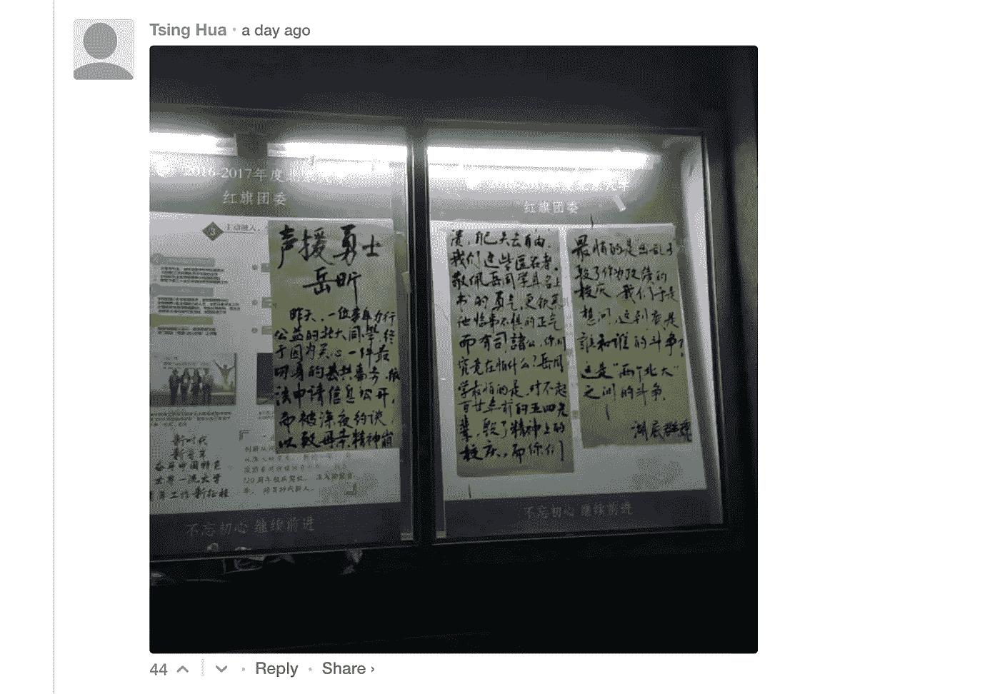
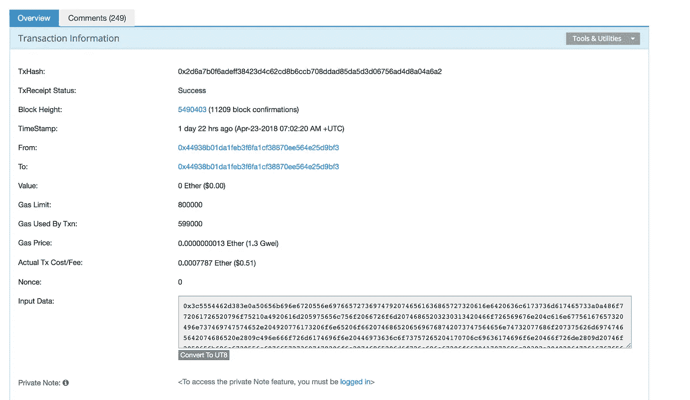
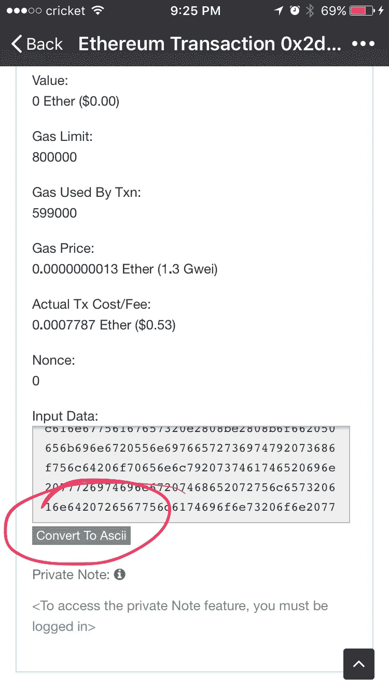
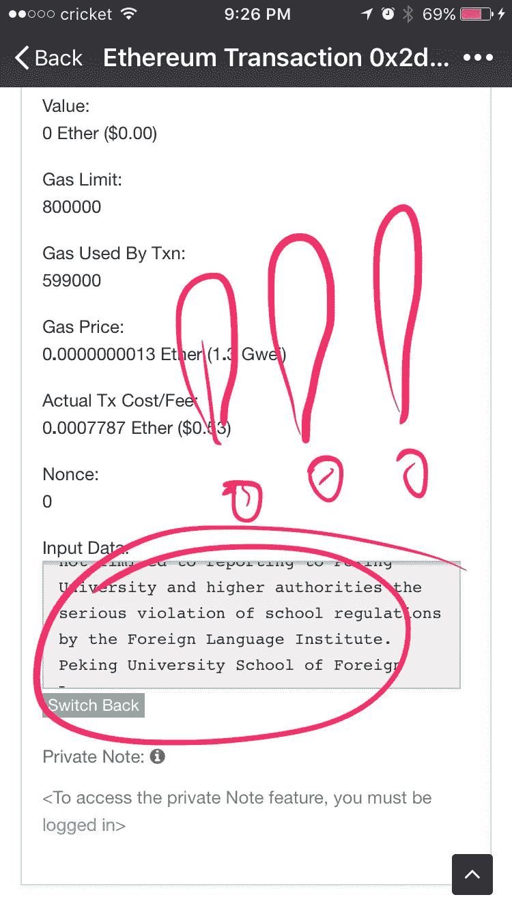
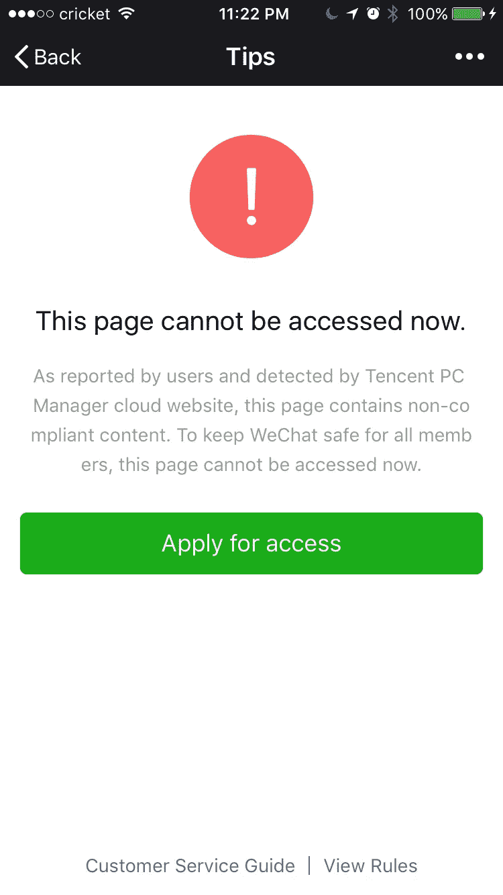
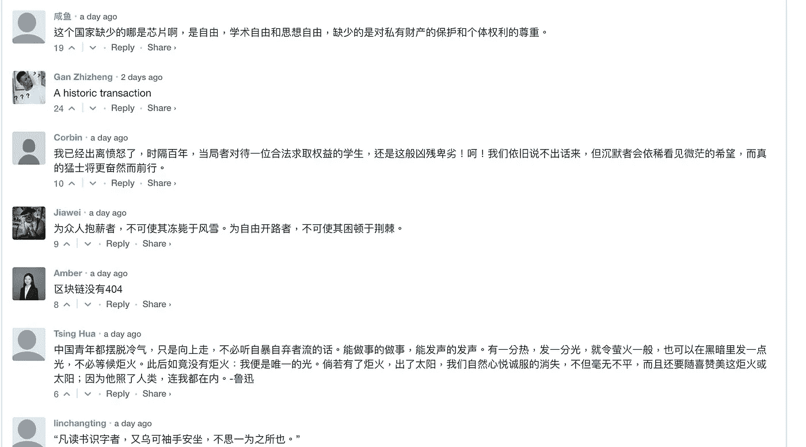

# 中国学生和区块链一起为言论自由呐喊——如何轻松打开指南阅读这篇秘密笔记

> 原文：<https://medium.com/hackernoon/chinese-student-yell-for-freedom-of-speech-with-blockchain-easy-how-to-open-guide-to-read-this-cf64899b0280>

你知道 404 在中国意味着什么吗？lol 它的意思是被大审查过滤的网站。而如果“他们”，(允许我用“他们”，因为我不想被审查 lol)，不想让某些声音被听到，就会被 404ed 或者被鞭打出局。但是区块链的技术可能会改变这一点。

看看这个。！！

 [## 以太坊交易 0x 2d 6a 7 b 0 f 6 adeff 38423d 4c 62 CD 8 b 6 CCB 708 ddad 85 da 5d 3d 06756 ad 4d 8 a 04 a6 a 2

### 0x2d 6a 7 b 0 f 6 adeff 38423d 4c 62 CD 8 b 6 CCB 708 ddad 85 da 5d 3d 06756 ad 4 D8 a 04 a6 a 2 以太坊(ETH)详细交易信息

etherscan.io](https://etherscan.io/tx/0x2d6a7b0f6adeff38423d4c62cd8b6ccb708ddad85da5d3d06756ad4d8a04a6a2) 

DAT epic transaction!

所以昨天我的许多朋友分享了这个，我不知道它是什么，我的意思是说，老实说，我不是那么专业…所以如果你像我一样，这里有一个简单的方法:

if you open through web, click the convert to UT8

converted!! this magical to me…. as I am really not that technical..

这个 etherscan 看起来是一个很好的应用程序，可以用来阅读区块链联邦理工学院的秘密笔记。

北京大学的一名学生写下了他/她的故事和一份 ETH 交易。所以现在他/她的故事是公开的，笔记不能更改。

基本上这位学生岳欣提交了“信息公开申请表”，并与学校和大党委发生了矛盾。我在想…只是要求公开…当然“他们”给了岳欣压力，让她保持沉默，但是因为区块链，这一切都没有成功……

现在 249 条评论，都是支持作者的。他们中的许多人说区块链没有 404。但是…在中国没有什么是不可能的。昨天很多人在微信上分享。但是如果你现在尝试通过微信打开这个链接，已经是这样了:

Duh…. I mean it is kinda expected

但是如果你读了，所有的评论都非常支持这个学生…例如“区块链没有 404”

well, seems like people kinda support this…

总结…我学会了…学好你的技术！否则当面对不公正时，你的声音甚至不能被听到。