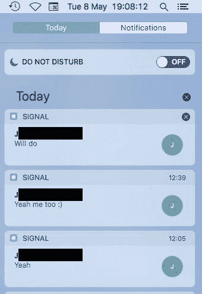
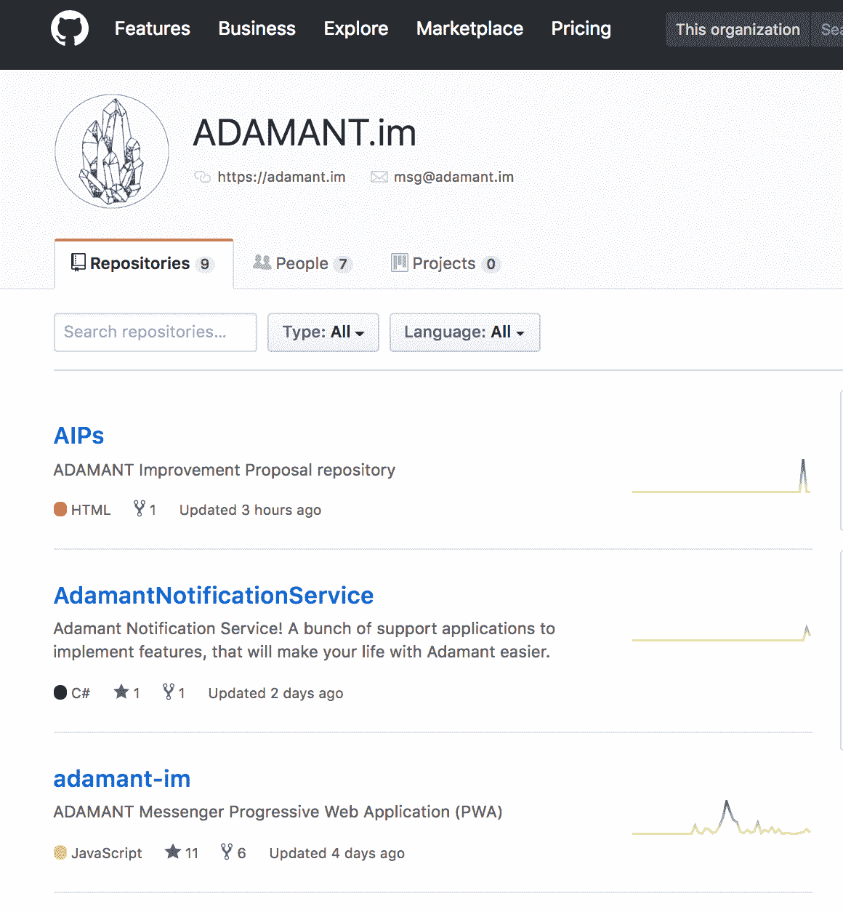

# 选择真正安全的信使:3 个实用技巧

> 原文：<https://medium.com/hackernoon/choosing-a-really-secure-messenger-3-practical-tips-46b604eaa7e>

Image credit: [Unsplash](https://unsplash.com/photos/-s8vX-XpGK4)

如今，几乎有几十种消息应用程序。其中一些声称完全安全并受到保护，使用先进的加密算法并公开保护其用户的隐私，这有时会导致此类服务在某些国家被[屏蔽](https://motherboard.vice.com/en_us/article/qvx7dm/telegram-russia-protest)(正如俄罗斯 Telegram 发生的情况)。

然而，在现实生活中，这样的事情与真正的安全几乎没有共同之处。受保护的信使仍然可能被网络罪犯(有时是国家支持的)的[黑客](https://www.ft.com/content/74d5ce00-12dd-11e6-839f-2922947098f0)攻击，而其他的则被[不太在乎隐私的企业所拥有。](https://www.nytimes.com/2018/03/19/technology/facebook-cambridge-analytica-explained.html)

面对所有这些问题，选择一个真正安全的信使并不是一件容易的事情。今天我们将讨论这样的应用程序应该是什么样子。

# **分权**

现代信使通常要么是集中式的，要么是基于 P2P 的。在这两种情况下，用户的数据都可能被泄露和窃取。当您有一个集中的消息服务时，恶意行为者只需要侵入核心系统就可以获得完全的访问权限。在 P2P 应用中，消息只存储在参与通信的设备上。这意味着，如果你需要从某个人那里窃取数据，只需妥协或窃取设备就足够了。

即使那些声称是最安全的使用消失信息技术的信使有时也会泄露你的数据。最新[案例](https://motherboard.vice.com/en_us/article/kzke7z/signal-disappearing-messages-are-stored-indefinitely-on-mac-hard-drives):用 Mac 存储的信息通知客户，这些信息在操作系统的通知栏上被设置为自毁(比如说，任何人都可以访问你的笔记本电脑)。

*Disappearing messages don’t disappear in Signal, Image credit:* [*Alec Muffett*](https://twitter.com/AlecMuffett/status/993917102791766016)

使用区块链技术可以避免这些问题。有像[armand](https://adamant.im/)这样的信使将所有加密的消息存储在分布式区块链中。因此，设备上不会存储任何信息，也不会有中央服务器被黑客攻击来检索数据。端到端的加密消息永远不会被第三方读取。

# **开源**

几乎所有现代通讯 app 的源代码都是封闭的。此类服务大多由私人公司或大公司运营，它们不想保持透明，也不想帮助独立的安全研究人员进行审计。

这意味着，波段工程解决方案总有可能导致安全缺陷——就像 Signal 的 Mac 应用程序一样。

非常罕见的是，某个信使背后的团队决定公开其代码供公众审查，就像 Wikr 应用开发者去年所做的那样。

然而，当整个开发过程从一开始就是透明的时候总是更好，因为一步一步地跟踪错误更容易。

*ADAMANT messenger GitHub repositories*

# **关注隐私**

几乎所有的信使都需要直接访问用户的联系人列表、电子邮件地址或电话号码。如果收集了一些数据，总有泄露的可能性。甚至“安全”的信使也这样做，这意味着隐私在这里只是一个公关和营销术语。

你的信息可以传输到远程服务器，你无法控制如何使用这些信息。这个问题的源头在于货币化模式。如今大多数信使都是免费的。但这是不可能的——这个世界上没有免费的东西。如果应用程序本身是免费的，这只是意味着开发者必须将你的数据或你直接货币化，服务的用户基础越大，它从风投或 ICO 那里吸引的资金就越多。

因此，您的数据可以被许多其他公司访问，进而可能被黑客攻击。即使你在使用所谓的“最安全”的应用程序，政府也总能识别出你的身份。或者，更简单的是，当局可以屏蔽需要太多努力才能破解的服务，迫使用户转向安全性较低的替代服务。这已经发生在伊朗和俄罗斯的 Telegram 上。

为了避免这样的风险，你的信使不应该是自由的。例如，阿芒特的用户为他们的每条信息支付一小笔加密货币费用。这种模式允许他们避免收集任何个人信息，包括地址簿或电话号码。不与应用程序共享您的数据是最安全的消息传递方式。

# **最后的想法**

区块链技术可以解决现代信使的三个主要安全问题。在新的范式中，开发者不再专注于公关和营销，试图吸引更多用户，收集他们的数据，并将其货币化。相反，他们将专注于构建不需要共享任何个人信息的分散解决方案