# 选择私立区块链理工大学:Hyperledger 作曲家

> 原文：<https://medium.com/hackernoon/choosing-private-blockchain-tech-hyperledger-composer-6ed61ea0dbc1>

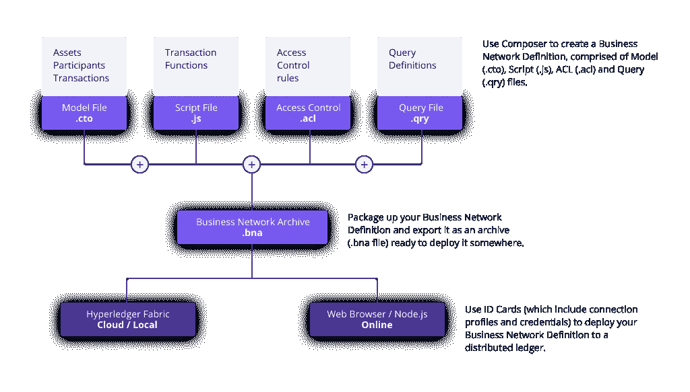

Hyperledger Composer architecture

欢迎来到“选择私立区块链理工大学”系列的第二部分。在每篇文章中，我们都实现了一个简单的用例来概述现有技术的作用以及它如何在商业中发挥作用。

最初，这篇文章是关于 Hyperledger Fabric 的，但是在了解了 Hyperledger Composer 之后，很明显先写一下它是有益的。这将使我们能够从更高的层面了解可以在 Hyperledger Fabric 区块链之上构建什么类型的业务应用程序，并更容易理解 Fabric 本身的用途。

# **业务用例**

让我们从[第一部分](https://hackernoon.com/choosing-private-blockchain-tech-quorum-d33221d40b54)中定义的金融行业的人为简单用例开始。以下是该场景中的各方:

*   **非托管资产经理(对冲基金):**做出投资决策(交易)。非托管意味着他们实际上不持有客户的钱。相反，在交易完成后，他们会向托管人发送指令，让托管人适当地转移资金。
*   保管人:通常是一个大型的、值得信赖的金融机构，代表对冲基金保管客户的资金并执行转账。托管人需要了解每笔交易，以便向交易对手支付款项。
*   **客户**:投资对冲基金。每个客户需要查看自己账户中的交易，而不是其他客户的账户。

让我们看看如何使用 Hyperledger Composer 来定义此场景中的所有参与者，并使他们能够共享适当的信息。

# **什么是 Hyperledger Composer？**

Hyperledger Composer 是一个高级工具集和框架，用于在 Hyperledger Fabric 区块链上快速构建和运行应用程序。如果 Fabric 是网络层，则 Composer 是应用层。它允许我们为可以在[结构通道](http://hyperledger-fabric.readthedocs.io/en/release/channels.html)内部署和执行的应用程序定义数据模型、业务逻辑和访问控制列表。这种应用程序的用户不必运行本地节点，如果需要，可以通过 RPC 或 HTTP REST 与远程节点进行交互。

Composer 附带了一个漂亮的 [web playground](https://composer-playground.mybluemix.net/) ，它允许用户在浏览器中构建应用程序原型，而无需设置本地网络。我们将使用操场来实现和测试我们的用例。在以后的文章中，我们将导出生成的“业务网络定义”并部署到真实的 Hyperledger Fabric 区块链。

# **解决方案**

解决方案的完整代码可以在[这里](https://github.com/andrei-anisimov/hyperledger-composer-example)找到。下面我们将看到如何使用 [Composer Playground](https://composer-playground.mybluemix.net) 一步一步地配置每个部分。

## **1。创建网络**

选择“部署新的企业网络”并填写所需信息。在我的情况下，网络的名称是'对冲基金网络'和管理卡的名称是管理@对冲基金网络。选择“empty-business-network”模板并点击部署。这将创建一个空的业务网络和一个完全控制它的管理员身份。创建业务网络后，我们可以通过点击“立即连接”来连接它。

## **2。配置对象模型**

Composer 有自己的对象建模语言，非常简单易用。可以定义 4 种类型的资源:

*   **资产**。在应用程序中被跟踪的东西。在我们的案例中，我们跟踪大量交易的证券。
*   **参与者。**与网络互动的实体。每个人都有自己的权限。
*   **发送事务**以更新资产或参与者，并执行自定义逻辑。
*   **事件**可以从事务逻辑中发出，并由参与者订阅。

现在，让我们创建一个名为“org.acme.mynetwork.cto”的模型文件，并添加以下代码。该文件定义了 3 种参与者类型(交易者、客户、托管人)、批次资产、交易交易和新交易事件。

```
/**
 * My commodity trading network
 */
namespace org.acme.mynetworkasset Lot identified by lotId {
    o String lotId
    o String securityName
    o Double quantity
    o Double price
    --> Client owner
}participant Client identified by clientId {
    o String clientId
    o String description
}participant Custodian identified by custodianId {
    o String custodianId
    o String description
}participant Trader identified by traderId {
    o String traderId
    o String name
}transaction Trade {
    --> Trader trader
    --> Client client
    --> Lot lot
}event NewTradeEvent {
    --> Lot lot
}
```

## **3。配置交易逻辑**

接下来，我们将实现一个定制逻辑，每次发送交易事务时都会执行该逻辑。使用下面的代码创建一个名为 script.js 的新脚本文件。Composer 知道根据注释中的@param 注释为每个贸易事务执行这段代码。这段代码做了两件事:更改 Lot 的所有者，并在成功时发出一个 NewTrade 事件。

```
/**
* Track the trade
* [@param](http://twitter.com/param) {org.acme.mynetwork.Trade} trade — the trade to be processed
* [@transaction](http://twitter.com/transaction)
*/
function tradeCommodity(trade) {
  var factory = getFactory();
  trade.lot.owner = trade.client;
  var result = getAssetRegistry(‘org.acme.mynetwork.Lot’)
  .then(function (assetRegistry) {
    return assetRegistry.update(trade.lot);
  });
  if (result) {
    var newTradeEvent = factory.newEvent(‘org.acme.mynetwork’, ‘NewTradeEvent’);
    newTradeEvent.lot = trade.lot;
    emit(newTradeEvent);
  }
  return result;
}
```

## **4。访问控制列表**

最后，我们需要定义一个访问控制列表，控制每个参与者类型可以做什么和看到什么。在这里，我们指定交易员可以执行交易，客户可以查看自己的交易，托管人可以查看所有交易。

```
/* Admin */rule NetworkAdminUser {
    description: "Grant business network administrators full access to user resources"
    participant: "org.hyperledger.composer.system.NetworkAdmin"
    operation: ALL
    resource: "**"
    action: ALLOW
}rule NetworkAdminSystem {
    description: "Grant business network administrators full access to system resources"
    participant: "org.hyperledger.composer.system.NetworkAdmin"
    operation: ALL
    resource: "org.hyperledger.composer.system.**"
    action: ALLOW
}/* Common */rule CommonReadTransactionRegistry {
    description: "Allow all participants to read transaction registry"
    participant: "org.hyperledger.composer.system.Participant"
    operation: READ
    resource: "org.hyperledger.composer.system.TransactionRegistry"
    action: ALLOW
}rule CommonReadParticipantRegistry {
    description: "Allow all participants to read participant registry"
    participant: "org.hyperledger.composer.system.Participant"
    operation: READ
    resource: "org.hyperledger.composer.system.ParticipantRegistry"
    action: ALLOW
}rule CommonReadAssetRegistry {
    description: "Allow all participants to read asset registry"
    participant: "org.hyperledger.composer.system.Participant"
    operation: READ
    resource: "org.hyperledger.composer.system.AssetRegistry"
    action: ALLOW
}rule CommonReadNetwork {
    description: "Allow all participants to read network"
    participant: "org.hyperledger.composer.system.Participant"
    operation: READ
    resource: "org.hyperledger.composer.system.Network"
    action: ALLOW
}/* Trader */rule TraderManageClient {
    description: "Allow traders to read all clients"
    participant: "org.acme.mynetwork.Trader"
    operation: ALL
    resource: "org.acme.mynetwork.Client"
    action: ALLOW
}rule TraderManageOwnTrades {
    description: "Allow traders to manage their trades"
    participant(t): "org.acme.mynetwork.Trader"
    operation: ALL
    resource(tt): "org.acme.mynetwork.Trade"
    condition: (tt.trader.getIdentifier() == t.getIdentifier())
    action: ALLOW
}rule TraderManageLots {
    description: "Allow traders to read and create lots"
    participant: "org.acme.mynetwork.Trader"
    operation: READ, CREATE
    resource: "org.acme.mynetwork.Lot"
    action: ALLOW
}rule TraderUpdateLots {
    description: "Allow traders to update lots via Trade transaction"
    participant: "org.acme.mynetwork.Trader"
    operation: UPDATE
    resource: "org.acme.mynetwork.Lot"
    transaction: "org.acme.mynetwork.Trade"
    action: ALLOW
}rule TraderReadOwnTrader {
    description: "Allow traders to read their own info"
    participant(t): "org.acme.mynetwork.Trader"
    operation: READ
    resource(tt): "org.acme.mynetwork.Trader"
    condition: (tt.getIdentifier() == t.getIdentifier())
    action: ALLOW  
}rule TraderAddAsset {
    description: "Allow traders to add assets to registry"
    participant: "org.acme.mynetwork.Trader"
    operation: CREATE
    resource: "org.hyperledger.composer.system.AddAsset"
    action: ALLOW  
}rule TraderCreateHistorianRecord {
    description: "Allow traders to create historian record"
    participant: "org.acme.mynetwork.Trader"
    operation: CREATE
    resource: "org.hyperledger.composer.system.HistorianRecord"
    action: ALLOW  
}rule TraderReadOwnHistorianRecord {
    description: "Allow traders to read their own historian record"
    participant(t): "org.acme.mynetwork.Trader"
    operation: READ
    resource(hr): "org.hyperledger.composer.system.HistorianRecord"
    condition: (hr.transactionType == "org.acme.mynetwork.Trade" && hr.participantInvoking.getIdentifier() == t.getIdentifier())
    action: ALLOW
}/* Client */rule ClientReadOwnTrades {
    description: "Allow clients to view their trades"
    participant(c): "org.acme.mynetwork.Client"
    operation: READ
    resource(t): "org.acme.mynetwork.Trade"
    condition: (t.client.getIdentifier() == c.getIdentifier())
    action: ALLOW
}rule ClientReadOwnEvents {
    description: "Allow clients to subscribe to NewTrade events"
    participant(c): "org.acme.mynetwork.Client"
    operation: READ
    resource(e): "org.acme.mynetwork.NewTradeEvent"
    condition: (e.lot.owner.getIdentifier() == c.getIdentifier())
    action: ALLOW
}rule ClientReadOwnLots {
    description: "Allow clients to view lots they own"
    participant(c): "org.acme.mynetwork.Client"
    operation: READ
    resource(s): "org.acme.mynetwork.Lot"
    condition: (s.owner.getIdentifier() == c.getIdentifier())
    action: ALLOW  
}rule ClientReadOwnClient {
    description: "Allow clients to view their info"
    participant(c): "org.acme.mynetwork.Client"
    operation: READ
    resource(cc): "org.acme.mynetwork.Client"
    condition: (cc.getIdentifier() == c.getIdentifier())
    action: ALLOW  
}rule ClientReadTraders {
    description: "Allow clients to view traders"
    participant: "org.acme.mynetwork.Client"
    operation: READ
    resource: "org.acme.mynetwork.Trader"
    action: ALLOW
}rule ClientReadHistorianRecord {
    description: "Allow clients to view their historian records"
    participant(c): "org.acme.mynetwork.Client"
    operation: READ
    resource(hr): "org.hyperledger.composer.system.HistorianRecord"
    condition: (hr.transactionType == "org.acme.mynetwork.Trade" && hr.transactionInvoked.client.getIdentifier() == c.getIdentifier())
    action: ALLOW
}/* Custodian */rule CustodianReadAllTrades {
    description: "Allow custodian to view all trades"
    participant: "org.acme.mynetwork.Custodian"
    operation: READ
    resource: "org.acme.mynetwork.Trade"
    action: ALLOW
}rule CustodianReadAllLots {
    description: "Allow custodian to view all lots"
    participant: "org.acme.mynetwork.Custodian"
    operation: READ
    resource: "org.acme.mynetwork.Lot"
    action: ALLOW
}rule CustodianReadAllClients {
    description: "Allow custodian to view all clients"
    participant: "org.acme.mynetwork.Custodian"
    operation: READ
    resource: "org.acme.mynetwork.Client"
    action: ALLOW
}rule CustodianReadAllEvents {
    description: "Allow custodian to subscribe to NewTrade events"
    participant: "org.acme.mynetwork.Custodian"
    operation: READ
    resource: "org.acme.mynetwork.NewTradeEvent"
    action: ALLOW
}rule CustodianReadAllTraders {
    description: "Allow custodian to view all traders"
    participant: "org.acme.mynetwork.Custodian"
    operation: READ
    resource: "org.acme.mynetwork.Trader"
    action: ALLOW
}rule CustodianReadOwnCustodian {
    description: "Allow custodian to view their info"
    participant(c): "org.acme.mynetwork.Custodian"
    operation: READ
    resource(cc): "org.acme.mynetwork.Custodian"
    condition: (cc.getIdentifier() == c.getIdentifier())
    action: ALLOW  
}rule CustodianReadHistorianRecord {
    description: "Allow custodian to view all trade historian records"
    participant(t): "org.acme.mynetwork.Custodian"
    operation: READ
    resource(hr): "org.hyperledger.composer.system.HistorianRecord"
    condition: (hr.transactionType == "org.acme.mynetwork.Trade")
    action: ALLOW
}
```

所有步骤完成后，我们可以通过点击左侧的 **Update** 来部署应用程序。

# **如何在操场上考试**

现在我们已经有了应用程序的完整定义，我们可以使用 Composer Playground 测试模块来测试它(单击顶部的**测试**)。

## **1。创建参与者**

首先，让一些参与者为我们的应用程序播种。我们可以创建两个客户:一个托管人和一个交易者。

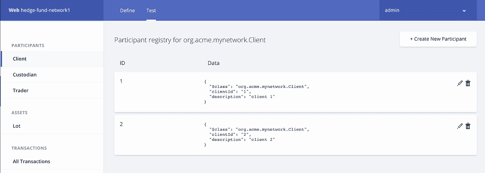

## **2。为每个参与者创建身份**

为了能够与商业网络交互，参与者需要相关联的身份。可以在 ID 注册表中创建身份(打开右上角的用户下拉菜单)。我们将为每个参与者创建一个身份，方法是指定其名称并指向在上一步中创建的参与者实例。至少，我们需要 4 个身份:2 个客户、1 个交易者和 1 个托管者。

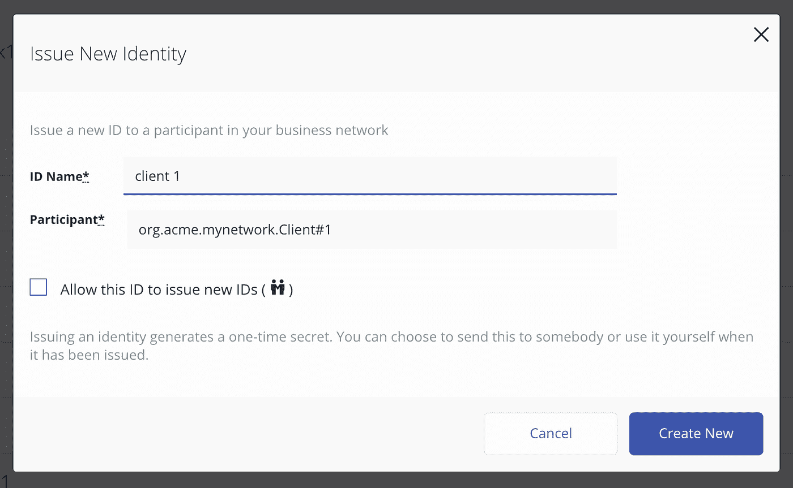

## **3。以交易员身份登录**

我们现在可以使用新创建的身份登录，方法是单击列表中每个身份旁边的“立即使用”。首先，我们作为交易者登录，创建一个不属于任何客户的新批次(客户 ID 为空)。

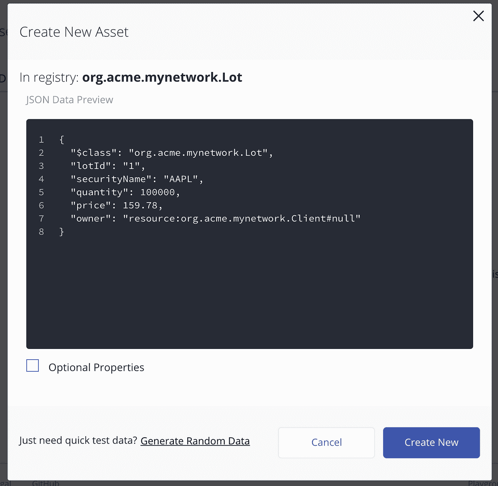

然后，我们通过一个交易将该批次的所有权分配给客户 1。

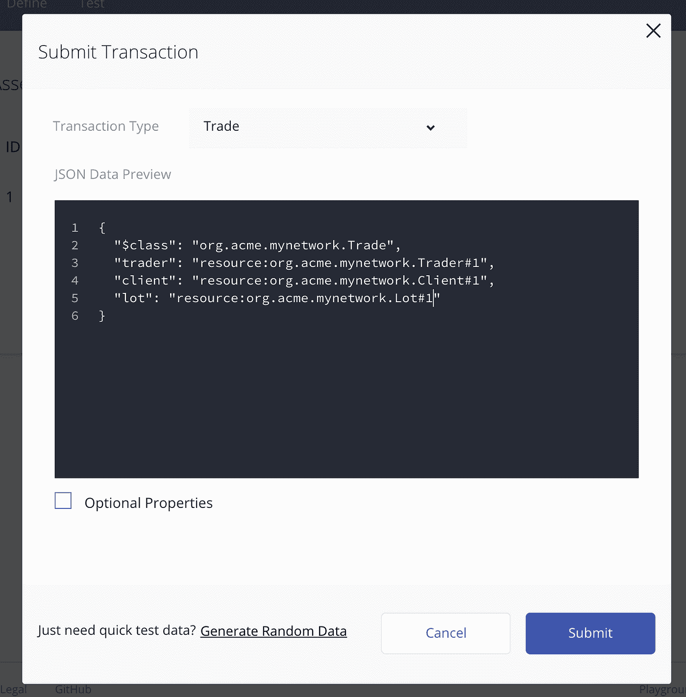

现在，让我们再创建一个批次，并通过另一个交易将其分配给客户 2。

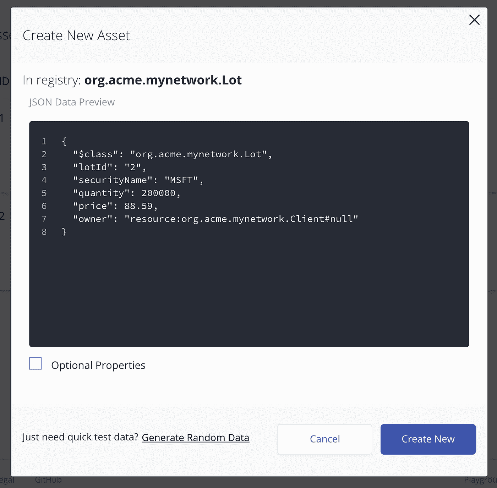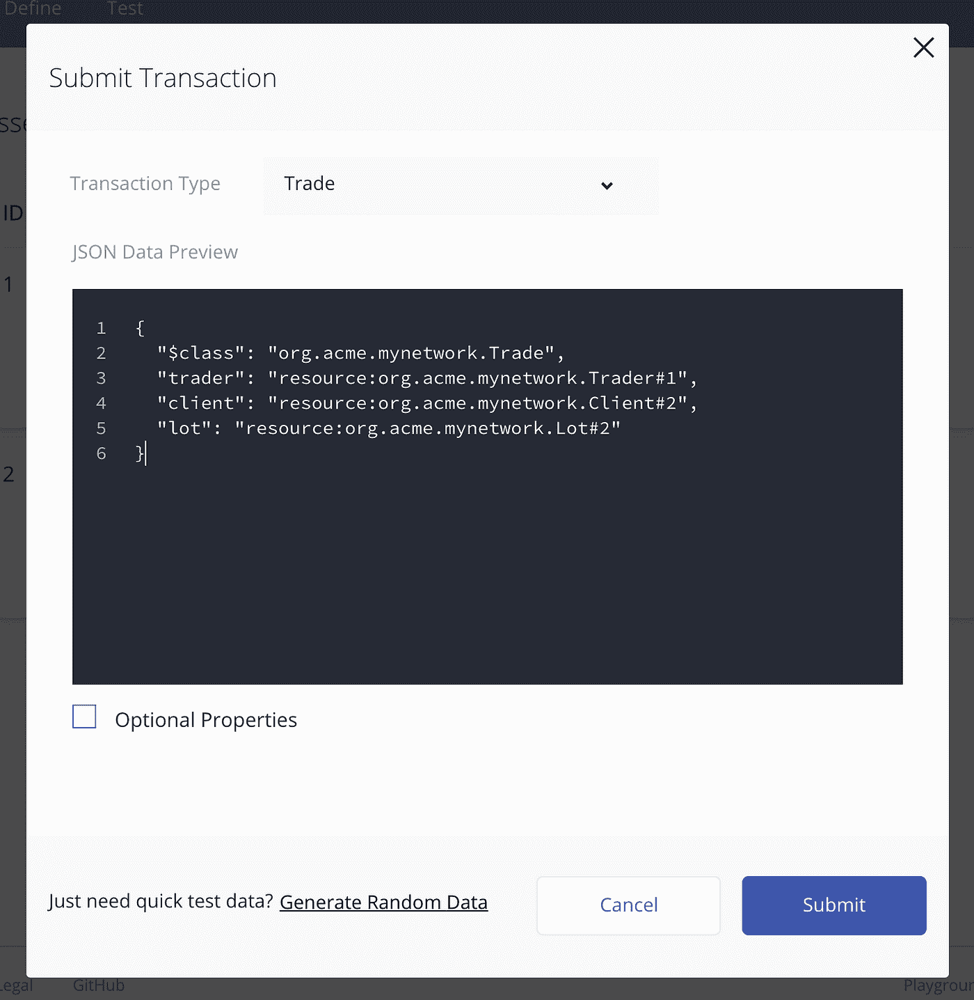

## **4。作为客户端登录**

然后，我们将作为客户端 1 和客户端 2 登录，以检查我们是否可以看到我们的批次。

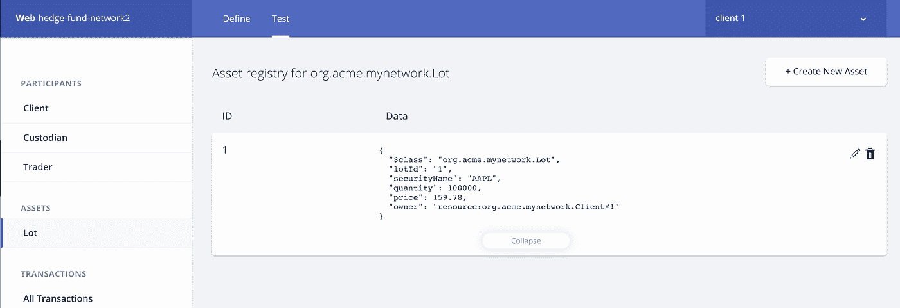

Client 1 lots

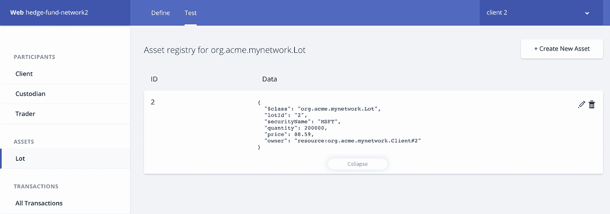

Client 2 lots

正如你所看到的，每个客户只看到他们拥有的手，他们不知道其他客户的交易。

## **5。作为保管人登录**

让我们以托管人的身份登录，检查我们是否可以查看所有交易。事实上，这两种交易都是可见的，如下图所示。

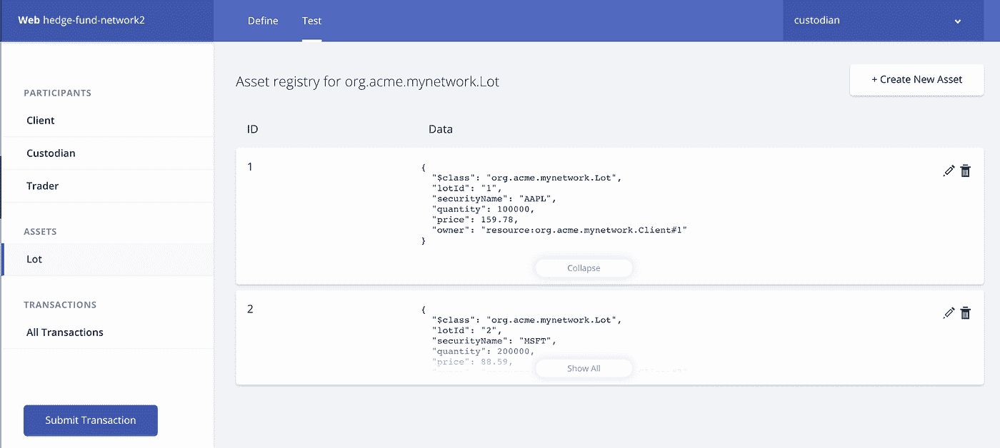

托管人还可以查看所有交易的历史记录:

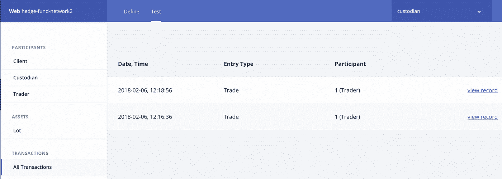

# **关于权力下放的说明**

请记住，当事务被广播到 Hyperledger Fabric 网络时，每个已配置的对等体都独立执行自定义事务处理逻辑，以确保区块链更新的正确性。这是一个主要的体系结构差异，在许多情况下，这是相对于传统的集中式客户端-服务器方法的一个优势。在传统方法中，单个组织将负责管理数据并向其他参与者公开数据，迫使其他人信任数据，并使其成为潜在的单点故障。

在区块链方法中，每个对等方负责管理和协调他们自己的数据副本。这使得整个网络更具弹性和分散性。然而，配置起来并不完全简单。由于数据现在托管在许多地方，这造成了潜在的更大威胁面，因此还需要考虑其他隐私问题。

# **结论**

希望这能让您更好地理解什么是 Hyperledger Composer，以及它如何有助于在多个参与者之间共享信息和跟踪资产及其他概念。请随意导出。bna 文件，并按照此处的教程[将应用程序部署到本地 Hyperledger 结构网络。我们很想听听你对 Hyperledger Composer 的看法。请在下面留下任何问题或评论。](https://hyperledger.github.io/composer/tutorials/developer-tutorial)