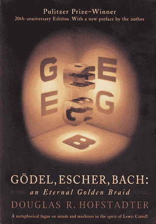
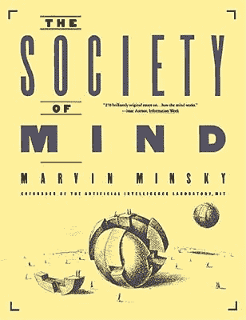
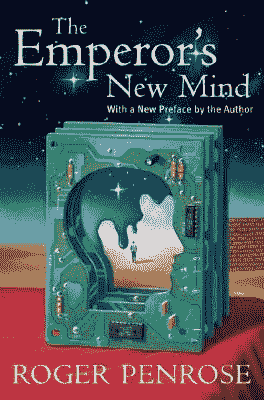
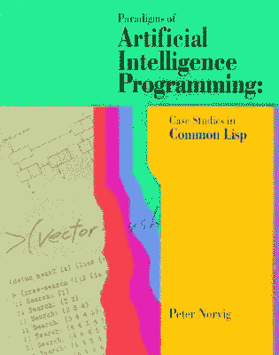
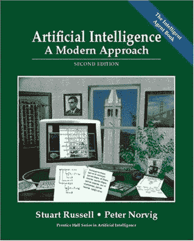
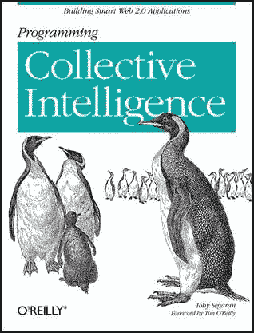

# 人工智能书籍阅读时间表

> 原文：<https://medium.com/hackernoon/chronological-list-of-ai-books-to-read-1fa53576f55a>

Image Credits: Google

大约五亿年前，地球上没有任何生物的痕迹。不久之后，随机的**化学物质**的融合一个接一个地诞生了生物。这完全是一个奇迹，即使你说一切都有科学依据。无论是在碰撞之后，还是因为驱动它们执行某些功能的特征，这里的问题是它们的核心属性本身的“**起源”。**

我曾经在 LinkedIn 上提出过一个与这个想法紧密相关的问题。

> 在这里 查看整个线程 [**。**](https://www.linkedin.com/feed/update/urn:li:activity:6358546028878233600)

嗯，我的一个问题是“**为什么我们要做我们所做的事情？**

这显然是受托尼·罗宾斯的 TED 演讲的启发。下面是 [**链接**](https://www.ted.com/talks/tony_robbins_asks_why_we_do_what_we_do) 让你快速了解一下托尼所说的“**无形力量**”以及我们每一项活动背后的通常动机。

同样，我收到的一些回复也进行了大量的分析。在这条线索的结尾，我对**分子水平的角色扮演**有生命的&无生命的体内化学物质的随机存在以及最后对**驱动我们的环境力量**有了一个大致的了解。

所以，为什么我要在这里仔细研究和探讨进化史和环境驱动力的混合存在，因为我们迄今为止所发明的一切都是已经在自然界存在了几百万年的一切的人工表现。

Image Credits: Google

> 包括**抛射体的运动**最终取决于唯一一个称为重力的力，这是从炮发射**导弹时的主要因素。**

想起**发明潜艇**就是受水下生物的机制启发。**喷气式飞机**、**飞机**以及类似的飞机可以通过研究空中生物的解剖行为和功能来构思。

总的来说，这是一个不同的研究分支，**我们今天得到的是**，一些思想领袖、灵感思想家、创造者、创新者、科学家和哲学家如何看待**人工智能**及其在未来的突出存在。从理论上、实验上和有意识地解释其起源于从 **1900 年**早期到**现在**的自然资源。

下面列出了一堆，嗯， **6 本人工智能书籍**解释了人工智能起源的事件和必要性，以及这个世界在有和没有它的情况下将会如何。

> 书籍**:哥德尔、埃舍尔、巴赫:一条永恒的金色辫子**
> 
> 作者**:道格拉斯·霍夫施塔特**
> 
> 出版年份 **: 1979 年**

霍夫施塔特预言，未来的任何计算机系统都将能够模仿人类的智能。准确地说，如果一个完整的有机体的生命是由成千上万的细胞的正式化学物质支持的，而意识的产生是因为神经元的激活，那么这就为人工构建的系统提供了更大的机会来执行和我们一样的任务。

> 书:**心灵的社会**
> 
> 作者:**马文·明斯基**
> 
> 出版年份: **1986 年**

明斯基出色地将大脑描绘成一个由本身无意识的微小组件组成的“社会”。根据他的理论，明斯基大胆地将心智社会描绘成一个智力拼图，它的各个部分是一路组装起来的。每一章——在一个独立的页面上——都对应着拼图中的一块。

> 书:**皇帝的新思想:关于计算机、思想和物理定律**
> 
> 作者:**罗杰·彭罗斯**
> 
> 出版年份 **: 1989**

在这本引人入胜的书中，著名物理学家罗杰·彭罗斯和斯蒂芬·霍金一起获得了著名的沃尔夫奖，他告诉我们，人类思维的某些方面是机器永远无法模仿/复制的。彭罗斯观察到物理和数学可以向我们解释什么是大脑如何完成内部的事情，它们不能，以及我们需要什么来理解意识的物理过程。

> 书籍**:人工智能编程范例:Common Lisp 案例研究**
> 
> 作者**:彼得·诺威格**
> 
> 出版年份 **: 1991**

虽然我只是一个人工智能思考者，而不是一个人工智能创造者，但我认为这本 946 页的书可以向你介绍先进的通用 Lisp 技术，以帮助你建立一个相当坚固的人工智能系统。突出地描述了帮助打破和建立完美的实用程序的方法，以及检查关键的人工智能概念。

> 书籍:**人工智能:一种现代方法**
> 
> 作者:**彼得·诺维格·斯图亚特。J.Russell**
> 
> 同年发表: **1994**

“这本畅销书期待已久的修订版为人工智能的理论和实践提供了最全面、最新的介绍。这本书的每个部分都有非技术性的学习材料。互联网作为智能系统的一个示例应用程序，在包括逻辑代理、规划和自然语言在内的几个地方增加了功能。材料覆盖范围的扩大包括:默认推理和真理维护系统，包括多智能体/分布式人工智能和博弈论”。

> 书:**编程集体智慧**
> 
> 作者: **Toby Segaran**
> 
> 发表年份: **2007**

## 蒂姆·沃尔特斯对托比关于人工智能系统及其能力的说法有什么看法？

“托比的书很好地将机器学习算法的复杂主题分解成实用、易于理解的例子，这些例子可以直接应用于当今网络社交互动的分析。如果我两年前有了这本书，它将会在一些没有结果的道路上节省宝贵的时间。”

## 发送其他书籍链接到人工智能的一般研究和概念，以便我可以定期扩展这个列表。

## 干杯，伙计。